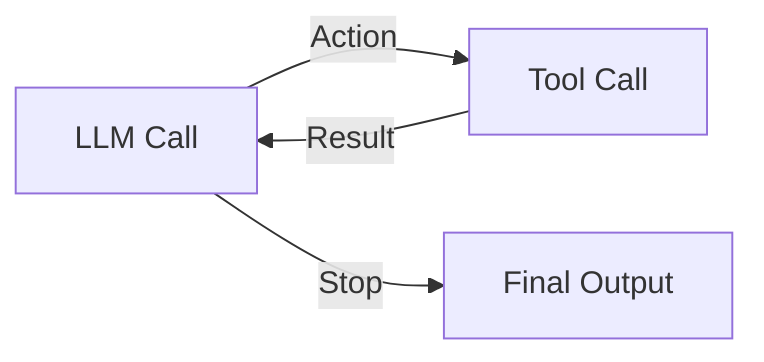

## The Agent Gold Rush and the Hammer Problem

Right now, tech feels like a gold rush. Everyone is running to build an AI agent, chasing the dream of a magical autonomous entity that takes a prompt, figures out the world, and hits the jackpot.

When a new technology emerges, human nature kicks in: when all you have is a hammer, everything looks like a nail. Because LLMs can call tools, developers suddenly view every software problem as a reason to deploy an autonomous agent loop.


We need to pause and define what this mystical creature called an "agent" actually is, versus what people are actually building.

This article is directly inspired by and references the video essay on Agents vs Workflows:

<iframe src="https://www.youtube.com/embed/AtYtuVTZCQU" width="100%" height="450" style="border:none;border-radius:12px;" loading="lazy" title="Agents vs Workflows Video Essay" allow="accelerometer; autoplay; clipboard-write; encrypted-media; gyroscope; picture-in-picture" allowfullscreen></iframe>

Look at [Anthropic's guide on Building Effective Agents](https://www.anthropic.com/engineering/building-effective-agents) alongside the video essay above. Anthropic outlines six core architecture patterns: Prompt Chaining, Routing, Parallelization, Orchestrator Workers, and Evaluator Optimizer loops.

Here is the dirty secret of the industry: almost all of those patterns are **workflows**, not autonomous agents.

---

## What Is an LLM System? The Dynamic REST Endpoint

To understand agents and workflows, we first need to demystify what an LLM system actually is at an architectural level.

In traditional software development, when a client wants an action performed, they send an HTTP request to a specific REST endpoint.

```
POST /api/v1/orders/cancel
Headers: Authorization: Bearer <token>
Body: { "orderId": "ord_99812", "reason": "changed_mind" }
```

In this traditional world:
1. The URL path identifies the exact code route to execute.
2. The developer hardcodes the database queries, state checks, and third-party API calls.
3. The server computes the response deterministically and returns the payload.

An LLM-powered system is fundamentally an evolution of this same pattern. Instead of requiring the user or client software to map their intent to a specific REST endpoint, an LLM system receives unstructured natural language intent:

```
POST /api/v1/agent/chat
Body: { "message": "Cancel my order from last Tuesday if it hasn't shipped yet." }
```

Under the hood, the system performs four familiar steps:
1. **Intent Resolution**: Identifies what the user wants to achieve (cancel order).
2. **Context and Data Fetching**: Retrieves state from internal databases or external APIs (lookup user orders, check shipping status).
3. **Execution Plan / Tool Invocation**: Decides which mutations or operations to perform in the world (call refund API).
4. **Response Generation**: Formats and returns the result to the caller.


The difference between traditional software and AI software is not the underlying execution of code; it is **who writes the routing logic**. In traditional REST APIs, the software engineer hardcodes every branch. In an LLM system, the LLM evaluates intent and state to choose the branch.

---

## Why Pure Autonomous Agents Fail in Production Out of the Box

In classical engineering, when a system encounters production issues, we diagnose the failure mode and apply proven architectural patterns:
* Database query too slow for a large customer? **Shard the database or add index caching.**
* External API failing under burst traffic? **Implement rate limiters, circuit breakers, and exponential backoff retries.**

When developers try to ship pure autonomous agents, where an LLM is given a goal and left to decide *every single micro-action* step by step in an unconstrained loop, they hit a wall of failure modes that traditional prompts cannot solve.



### 1. Cost and Latency Escalation
When an LLM decides every minor sub-step dynamically, an operation that could take one API call suddenly takes seven. Each iteration forces a full model invocation, sending the entire conversation history back and forth over the network. Latency balloons from 500ms to 45 seconds, and token costs scale quadratically.

### 2. Context Bloat and Failure to Steer
To ask an LLM "what is your next move?" at step 6, you must feed it the history of steps 1 through 5, including all raw JSON tool payloads. As context grows, the model's attention degrades. It gets stuck in repetition loops, forgets earlier constraints, or invents non-existent parameters.

### 3. The "New Employee Every Request" Problem
Giving an LLM total freedom on every request is like hiring a brand-new employee (no matter how high their IQ) and asking them to figure out your company's complex business processes from scratch for every single customer ticket. They will invent their own methodology every time. One run will be brilliant, the next will fail silently, and the third will hallucinate customer data.

---

## Workflows: The 90% Solution for Real Products

This brings us to the core distinction between an **Agent** and a **Workflow**.

* **Agent**: An architecture where the LLM dynamically controls the execution loop. The model evaluates state, picks tools, and decides when the task is complete.
* **Workflow**: An architecture where the execution path is hardcoded into software, and LLMs are invoked at specific, structured steps to perform localized transformations or decisions.


### The Illusion of `SKILL.md` and Prompt Memory
Many developers try to fix agent inconsistency by loading instruction files (often called `SKILL.md`, system prompts, or context files) into the agent's memory.

While context files provide guidance, an LLM is fundamentally a **statistical model**. Injecting text instructions into a prompt does not turn a non-deterministic model into a deterministic state machine. Telling an agent "always verify user tier before calling tool X" in markdown works 85% of the time. In production software, 85% is a failure.

### Real-World Example: Building an AI Email Drafter
Consider a feature that drafts context-aware email replies for a customer support team.

If you build this as a **Pure Agent**, you give the LLM tools to read emails, search customer DBs, and draft replies, then let it decide how to proceed.

The agent will face unguided decisions on every run:
* Should it read only the current email thread, or the last 50 emails from this sender?
* Should it query the CRM database for lifetime customer value?
* Which writing style guide should it apply?
* How should it rank priority signals in the inbox?

When an LLM is asked to make dynamic decisions at every turn, each decision carries a non-zero error rate. Even if we assume an optimistic 99% accuracy per micro-choice (accuracy = 0.99), the compounding probability of success across N decisions degrades exponentially:

**System Success Rate = 0.99<sup>N</sup>**

If an agent makes 20 micro-decisions in a single execution loop, the overall system success rate drops to:

**0.99<sup>20</sup> ≈ 81.8%**

That represents an 18.2% failure rate. Increase the loop to 50 micro-decisions, and system accuracy plummets to **0.99<sup>50</sup> ≈ 60.5%**, failing nearly 40% of the time.

Leaving these choices to the LLM dynamically creates an exponential compounding of errors.

If you build this as a **Workflow**, you conduct real-world product testing, determine the exact rules that yield optimal results, and freeze those rules in code:
1. **Code Step**: Read the current thread (last 3 messages) and fetch customer CRM tier from Postgres.
2. **LLM Call 1**: Extract key intent and missing information from the thread.
3. **Code Step**: If intent requires account status, execute a deterministic DB lookup.
4. **LLM Call 2**: Inject the specific writing prompt and customer metadata to draft the final response.


### The Amazon Reliability Standard
When building software customers pay for, you cannot sell a product that is "50% great, 30% mediocre, and 2% mind-blowing." You are not running an art gallery; you are building production software. Customers expect **Amazon-grade reliability** (99.9% uptime and consistency).

Workflows deliver consistency because human engineers preserve domain knowledge in deterministic code, using LLMs only for what they excel at: natural language understanding and generation.

---

## Conclusion: Stop Building Agents, Start Building Products

The next time you sit down to build an AI feature, resist the urge to start with an open-ended agent framework.

Ask yourself:
1. **Do I know the steps required to solve this problem 80% of the time?** If yes, write those steps in code. That is a workflow.
2. **Where does randomness add value vs where does it cause failure?** Use LLMs for comprehension, synthesis, and creative translation. Use code for routing, permissions, state management, and API calls.
3. **Would I hire a person to reinvent this process on every single ticket?** If not, do not ask your LLM to do it either.

True engineering elegance is not making your system as complex and autonomous as possible. It is building the simplest, most deterministic system that reliably solves the user's problem. 90% of the time, that system is a workflow.
