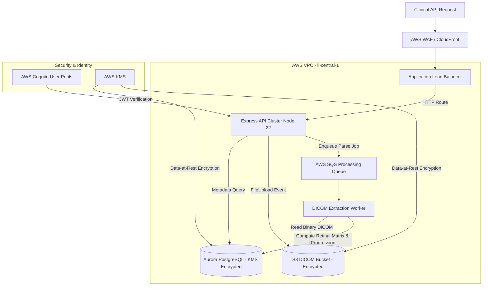
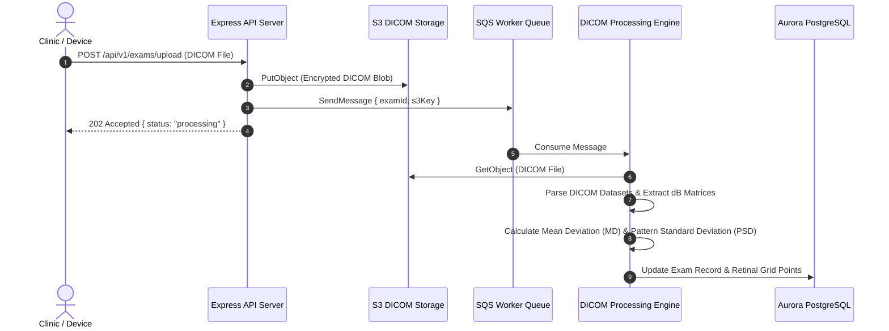
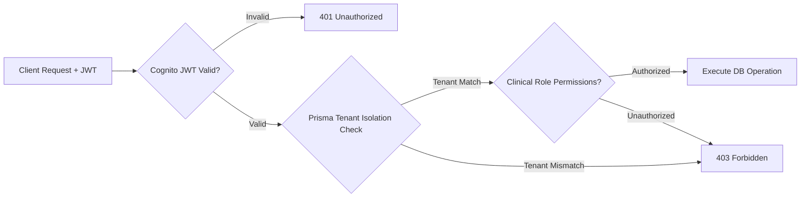

# Visual Field Analyzer — Backend Architecture Design Doc

## Overview

The **Visual Field Analyzer (AL VF Analyzer)** is a multi-tenant clinical cloud platform engineered for Sheba Medical Center and the Goldschleger Eye Institute. It processes, analyzes, and tracks progression for Humphrey Visual Field ophthalmology diagnostic exams under strict Israeli data residency requirements.

---

## High-Level Cloud Architecture (AWS `il-central-1`)

---

## Asynchronous DICOM Processing Pipeline

---

## Security & Multi-Tenant Authorization Model

---

## Key Design Decisions

**Strict AWS Israel (`il-central-1`) Placement.** To comply with medical data residency regulations for Israeli hospital infrastructure, all compute (ECS), storage (S3), and database (Aurora) resources are strictly provisioned in `il-central-1` using modular Terraform code.

**Asynchronous DICOM Parsing via SQS.** Decoding binary DICOM visual field scans and calculating progression matrices is computationally intensive. Uploads return `202 Accepted` immediately, delegating parsing to worker tasks via SQS to prevent HTTP connection timeouts.

**Prisma Multi-Tenant Isolation.** Database queries enforce mandatory `tenantId` filtering across all tables to guarantee complete clinical data isolation between medical institutions.
