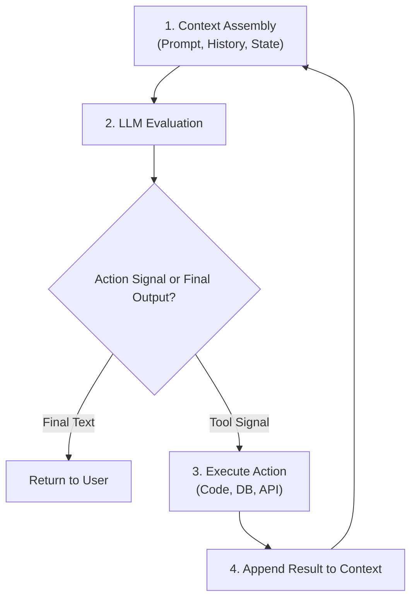

<figure class="article-screenshot-figure">
  
  <figcaption>Architecture of an AI Agent Context Layer, funneling fragmented raw data sources into clean, structured context for the core execution loop.</figcaption>
</figure>

## What Is an AI Agent at Its Core?

Strip away the hype, the framework terminology, and the marketing presentations. What is an AI agent at its fundamental architectural level?

At the end of the day, an AI agent is simply an execution loop calling a Large Language Model (LLM) with a given context window.

During each iteration of this loop:
* The LLM receives the system prompt, conversation history, and current environment state.
* The LLM evaluates the context and outputs either final text or a structured signal indicating that it wants to interact with the outside world.
* The system executes the requested action, whether running code, querying a database, invoking an API, or fetching data.
* The system appends the result back into the context window and invokes the model again.

That is it.

Every concept in the modern agent ecosystem: whether Model Context Protocol (MCP), custom skills, event hooks, or specialized tool definitions: is fundamentally just a structured wrapper around this core pattern. These mechanisms exist solely to package inputs, format tool definitions, and standardise how model calls interact with external boundaries.

---

## So Why Not Just Give the Agent All the Data in the World?

The natural instinct after understanding this loop is straightforward: if an agent is only as good as its context, why not feed it everything? Give it access to every API, every database, every document, and let it figure things out.

This is exactly how the first wave of autonomous agents was built. You treat the LLM as a digital worker with human-like reasoning. You provide a massive suite of tools (Gmail, Contacts, Calendar, CRM, file systems) and let the model handle the planning dynamically. On every cycle, the LLM inspects whatever context it has and decides its next move.

In practice, this approach consistently breaks in production. As explored in depth in [Agents vs Workflows](/en/tech/agents-vs-workflows), letting an LLM decide every micro-step leads to severe reliability issues.

<figure class="article-screenshot-figure">
  
  <figcaption>Visual comparison: An unconstrained raw LLM stuck in data clutter vs. an LLM powered by a structured Context Layer extracting clear business value.</figcaption>
</figure>

### Why Unconstrained Planning Fails

At their core, LLM neural networks are trained to minimize a specific loss function: predicting the next token in a sequence. The model does not naturally optimize for executing long-horizon tasks, maintaining business invariants, or guaranteeing global plan correctness. It predicts tokens based on probabilistic patterns learned during training.

For a deep mathematical dive into how language models process sequences and compute probabilities, Andrej Karpathy provides an exceptional breakdown of core neural network concepts and training dynamics:

<iframe src="https://www.youtube.com/embed/PaCmpygFfXo" width="100%" height="450" style="border:none;border-radius:12px;" loading="lazy" title="Andrej Karpathy - Intro to Large Language Models" allow="accelerometer; autoplay; clipboard-write; encrypted-media; gyroscope; picture-in-picture" allowfullscreen></iframe>

Because next token prediction does not equal long-horizon reasoning, the industry has tried numerous algorithmic patches to fix agent planning:
* **Inference-Time Search Algorithms**: Wrapping LLMs in Monte Carlo Tree Search (MCTS) variants such as [Tree of Thoughts (ToT)](https://arxiv.org/abs/2305.10601) or [Language Agent Tree Search (LATS)](https://arxiv.org/abs/2310.04406).
* **Process Reward Models (PRMs)**: Training secondary scoring models to evaluate and grade intermediate reasoning steps, introduced in OpenAI's [Let's Verify Step by Step](https://arxiv.org/abs/2305.20050).
* **Symbolic Solver Integration**: Offloading structural planning to external logic engines, such as [LLM+P](https://arxiv.org/abs/2304.11477) or [LLM-Modulo Frameworks](https://arxiv.org/abs/2402.01817).

In production applications, these fixes run directly into severe real-world constraints: extreme latency penalties, quadratic token cost explosions, and the persistent issue of models hallucinating when evaluating their own steps.

Dumping everything into the context window does not make the agent smarter. It makes it slower, more expensive, and less reliable.

---

## Back to Basics: What Actually Makes a Good Agent?

If giving an agent unlimited data and freedom does not work, what does?

Think about CPU and memory. At the lowest hardware level, passing data into pipes and switching bits is identical whether you build a simple notes app or a multi-billion dollar search engine that becomes the starting point for every question in the universe. The magic is not the hardware pipe; it is knowing which bits to feed into it at each step.

It is the exact same story with AI agents. At the model level, every agent framework passes tokens through the exact same matrix multiplication pipelines. The differentiator is never the execution loop or the framework syntax: it is **the data itself**.

Now consider a concrete example. Imagine giving a simple instruction: *"Send an email to Janet saying thank you for her birthday gift."*

Whether a human or an AI handles this task, executing it well requires resolving a series of specific questions:
* Who is Janet?
* What is her email address?
* What gift did she actually give?
* What tone should the message use?

<figure class="article-screenshot-figure">
  
  <figcaption>Transitioning from raw primitive tools to high-leverage context architecture: like upgrading from a hand shovel to a D9 bulldozer.</figcaption>
</figure>

Give a human worker primitive tools and vague information, and their output will be slow and error-prone. Give that same worker clear context and high-leverage tooling: transitioning from a handheld shovel to a D9 bulldozer: and their output increases exponentially. The same is true for an LLM. The quality of the output is directly proportional to the quality of the context it receives.

---

## The Properties of a Context Layer

So what does this look like in practice? Let us return to the Janet email scenario and examine three architectural approaches:

<figure class="article-screenshot-figure">
  
  <figcaption>Navigating scattered unindexed emails versus curated entity resolution in production.</figcaption>
</figure>

1. **Raw Unstructured Data Dump**: The agent is given access to a raw database export or unindexed log file. Traversing unformatted text consumes thousands of tokens, degrades attention, and results in missed details or generic responses.
2. **Standard API Tool Access**: The agent receives tools for Gmail and Google Contacts. The model must construct search queries, parse contact entries, search through email threads, extract the gift reference, and synthesize the result. While functional, this requires multiple LLM iterations, increases token consumption, and introduces potential failure points at each step.
3. **The Context Layer Solution**: An intermediate system automatically resolves the entities involved before invoking the generation step. It fetches Janet's contact entry, pulls recent birthday-related email exchanges, extracts the exact gift details, and injects a unified, curated context block directly into the prompt. Furthermore, the Context Layer already knows how the requester prefers to respond based on hundreds or thousands of past interactions. Because this behavioral knowledge is captured and pre-indexed, the system does not need to recalculate or rediscover the user's communication patterns from scratch on every request.

### Core Properties of a Context Layer

With a dedicated Context Layer, the model receives complete situational awareness in a single call, turning a complex multi-step search into an accurate, instant generation.

A Context Layer is the specialized architecture responsible for gathering, filtering, stitching, and structuring environmental data into optimal LLM context blocks. Its core properties are:
* **Entity Resolution**: Automatically identifying and fetching the relevant entities (contacts, threads, records) before the model ever sees the prompt.
* **Behavioral Pre-Indexing**: Capturing learned patterns from past interactions (communication style, preferences, recurring relationships) so the system never starts from scratch.
* **Context Curation**: Selecting only the precise, relevant data points and structuring them into a concise payload that fits cleanly within the model's attention window.
* **Single-Call Readiness**: Assembling all necessary context upfront so the LLM can produce the final output in one generation step, eliminating multi-step search loops.

---

## Summary: Why Do We Need a Context Layer?

At the end of the day, a Context Layer is the gatekeeper for data at every single interaction point.

Without it, your agent is forced to either drown in thousands of raw, unindexed tokens or spend multiple slow, expensive iterations navigating primitive API calls just to gather basic situational awareness.

A Context Layer sits directly between your environment data and your model execution loop, automatically resolving entities, curating relevant facts, pre-indexing historical behavioral preferences, and injecting a unified payload upfront. It turns multi-step search loops into single-call generations.

Now that we understand what a Context Layer is and why every production agent system needs one, we face the truly hard question: **How do we identify what is effective and actually build it?**

Continue reading [Part 2: Defining and Measuring an Effective Context Layer (Evals, Evals, Evals)](/en/tech/building-an-effective-context-layer-part-2) to learn how to evaluate, benchmark, and test your context architecture.
