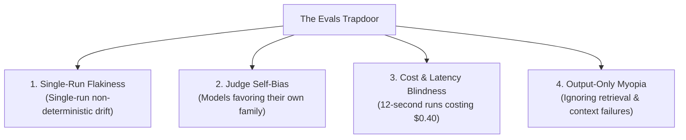

*This is Part 2 of our technical series on Context Layers for AI Agents. If you have not read it yet, start with [Part 1: What Is a Context Layer and Why You Need One](/en/tech/building-an-effective-context-layer-part-1).*

---

<figure class="article-screenshot-figure">
  
  <figcaption>The 4-tier evaluation framework: Unit tests, integration assertions, simulation sandbox, and human feedback loops.</figcaption>
</figure>

## What Does "Effective" Actually Mean?

In Part 1 of this series, we established that every AI agent is fundamentally an execution loop passing data into LLM matrix multiplication pipelines. The differentiator between a broken prototype and a production platform is not the framework syntax: it is the quality and structure of the data you provide.

This brings us to the core challenge of Part 2. To build an *effective* Context Layer, we must start with the single most important question in AI engineering: **How do we identify what is actually effective?**

Let us return to our anchor example: asking an AI assistant to send a thank-you email to Janet for her birthday gift. Before writing a single line of context assembly code, you must evaluate what success and failure look like in your specific domain:
* What happens if the agent sends the email to the wrong Janet?
* What happens if it expresses gratitude for a coffee mug when she actually gave a blender?
* What happens if it uses the wrong tone?

Different products have radically different priorities:
* **The Directory Strict System**: For an enterprise HR app, identifying the correct Janet (Janet H. from management versus Janet Y. the intern) is the absolute highest priority. A wrong recipient is a catastrophic security leak.
* **The Human In The Loop System**: For an executive assistant tool, picking the wrong internal ID during draft generation is tolerable, as long as the system flags the selection before sending so the user can correct it ("I meant Janet H., not Janet Y.").
* **The Tone First System**: For a personality-driven app, the highest priority might be ensuring the message sounds passive-aggressive enough. The thank-you note needs to hit that precise Seinfeldian note ("Thanks for the gift, I will try to find a corner in the closet for it eventually.") so Janet understands the gift was okay, but nothing special.

Before building any context features, you must **Evaluate**: What are the critical functions your system must excel at, which functions can be merely acceptable, and where can you afford trade-offs?

---

## The "Evals, Evals, Evals" Philosophy

If Steve Ballmer were giving a keynote on AI agent engineering today, he would not be shouting "Developers, developers, developers!". He would be sweating through his shirt shouting one word: **Evals! Evals! Evals!**

<iframe src="https://www.youtube.com/embed/Vhh_GeBPOhs" width="100%" height="450" style="border:none;border-radius:12px;" loading="lazy" title="Steve Ballmer Developers" allow="accelerometer; autoplay; clipboard-write; encrypted-media; gyroscope; picture-in-picture" allowfullscreen></iframe>

Building a Context Layer without an evaluation suite is like navigating a ship without a compass. You will spend weeks building complex graph RAG pipelines or vector retrieval hacks without knowing whether you actually improved your system or introduced silent regressions. Evaluation is an entire domain, but when building context layers for agents, testing breaks down into four practical tiers.

---

## The 4 Tiers of Agent and Context Evaluation

<figure class="article-screenshot-figure">
  
  <figcaption>The 4-tier testing pyramid for AI agents: Unit Tests, Integration Tests, Simulation Sandbox, and Human Feedback.</figcaption>
</figure>

### Tier 1: Deterministic and Programmatic Checks (Functional and Execution)

Tier 1 tests focus strictly on execution mechanics. Did the system execute the requested action without throwing errors or violating format constraints?

Key checks include:
* **Payload and Syntax Validity**: Did the model produce valid JSON matching the required schema?
* **Tool Invocation**: Did the system actually call the target tool with the correct parameters?
* **Safety and Constraint Guards**: Did the system avoid leaking PII or executing out-of-bounds actions?

**The Janet Scenario**: Did the agent call the `SearchDirectory` tool, retrieve a contact record, invoke `SendEmail` with a valid payload, and complete without crashing? This check verifies that the system ran the right tools in order, but it does not tell you whether it picked the *right* Janet.

```python
from pydantic import BaseModel, EmailStr

class EmailPayload(BaseModel):
    recipient_email: EmailStr
    subject: str
    body: str

# Tool Execution Sequence
def assert_tool_sequence(agent_trace: list[dict], required_tools: list[str]):
    called_tools = [s.get("tool") for s in agent_trace if "tool" in s]
    for tool in required_tools:
        assert tool in called_tools, f"Missing required tool call: '{tool}'"

# Output Schema Validation
def assert_output_schema(agent_output: dict) -> EmailPayload:
    return EmailPayload(**agent_output)

# PII Leak Prevention
def assert_no_pii_leak(body_text: str, blocked_fields: list[str]):
    body_lower = body_text.lower()
    for field in blocked_fields:
        assert field not in body_lower, f"PII Leak: '{field}' detected in body"
```

---

### Tier 2: Context and Groundedness Checks (Data Fidelity)

Tier 2 tests evaluate data accuracy and hallucination prevention using principles from the RAG Triad:
* **Retrieved Relevance**: Did the context layer pull data that actually contains the information needed to act?
* **Groundedness / Faithfulness**: Is every factual claim in the response strictly derived from the retrieved context?
* **Answer Relevance**: Does the generated output directly address the user's intent without adding irrelevant noise?

**The Janet Scenario**: The context layer retrieved a purchase receipt showing "KitchenPro Blender, $89.99". Did the draft email reference that specific blender, or did the model hallucinate a coffee mug that never appeared in the retrieved documents?

```python
from pydantic import BaseModel

class StructuredDraft(BaseModel):
    body: str
    referenced_item: str

# Retrieved Relevance
def assert_retrieval_relevance(retrieved_docs: list[dict]):
    assert len(retrieved_docs) > 0, "Retrieval miss: no documents fetched"

# Groundedness via Structured Output
def assert_groundedness(referenced_item: str, retrieved_docs: list[dict]):
    doc_text = " ".join(d.get("content", "") for d in retrieved_docs).lower()
    assert referenced_item.lower() in doc_text, \
        f"Ungrounded claim: '{referenced_item}' not supported by retrieved docs"

# Answer Relevance
def assert_answer_relevance(draft_body: str):
    body_lower = draft_body.lower()
    assert any(token in body_lower for token in ["thank", "appreciation", "grateful"]), \
        "Off-topic: draft does not fulfill gratitude intent"
```

---

### Tier 3: Trajectory and Logic Checks (Execution History)

Tier 3 tests inspect *how* the agent arrived at its decision by analyzing trace logs and intermediate reasoning steps:
* **Entity Selection Accuracy**: Did the system map the ambiguous name "Janet" to the correct real-world person?
* **Step Efficiency**: Did the agent resolve the task in a reasonable number of steps, or did it loop with redundant API calls?
* **Reasoning Coherence**: Does each intermediate action logically follow from the previous state?

**The Janet Scenario**: The user's contact directory has two Janets. Did the agent examine recent email thread history to pick Janet H. (your manager who actually sent the birthday gift), or did it default to Janet Y. (the intern) because her name appeared first alphabetically?

```python
# Step Efficiency and Duplicate Loop Detection
def assert_step_efficiency(tool_calls: list[dict], max_allowed: int = 5):
    assert len(tool_calls) <= max_allowed, \
        f"Inefficient: executed {len(tool_calls)} steps (max {max_allowed})"
    seen_calls = set()
    for call in tool_calls:
        signature = (call.get("tool"), str(call.get("args")))
        assert signature not in seen_calls, \
            f"Redundant loop: duplicate call to {signature[0]}"
        seen_calls.add(signature)

# Entity Selection Accuracy
def assert_entity_selection(tool_calls: list[dict], expected_recipient_id: str):
    send_step = next((s for s in tool_calls if s.get("tool") == "SendEmail"), None)
    assert send_step is not None, "Missing action: SendEmail tool never called"
    selected_id = send_step.get("args", {}).get("recipient_id")
    assert selected_id == expected_recipient_id, \
        f"Entity error: selected '{selected_id}', expected '{expected_recipient_id}'"

# Reasoning Coherence and Tool Order
def assert_reasoning_coherence(tool_calls: list[dict]):
    tool_names = [s.get("tool") for s in tool_calls]
    assert "SearchDirectory" in tool_names, "Incoherent: directory search missing"
    assert tool_names.index("SearchDirectory") < tool_names.index("SendEmail"), \
        "Incoherent: email sent before searching directory"
```

---

### Tier 4: Qualitative and Nuance Checks (Tone and Persona)

Tier 4 tests evaluate subjective quality, tone alignment, and nuanced rule compliance:
* **Tone and Persona Alignment**: Does the writing style match the target persona?
* **Constraint Satisfaction**: Did the output respect implicit instructions (such as "keep it under three sentences" or "don't sound overly eager")?
* **Completeness and Task Success**: End-to-end confirmation that the core goal was fulfilled properly from the user's perspective.

**The Janet Scenario**: The user's persona profile says they communicate with dry, passive-aggressive humor. Did the email hit that exact register, or did the model default to a generic, overly enthusiastic "Thank you SO much!!!" that contradicts the user's actual voice?

```python
import json
from openai import OpenAI

client = OpenAI()

# Structural Constraint (Sentence Count)
def assert_sentence_constraint(draft_text: str, max_sentences: int = 3):
    sentences = [s for s in draft_text.split(".") if s.strip()]
    assert len(sentences) <= max_sentences, \
        f"Verbosity error: {len(sentences)} sentences (max {max_sentences})"

# Qualitative Tone and Persona Alignment
def assert_persona_tone(draft_text: str, target_persona: str) -> dict:
    sys_prompt = (
        f"The user's communication style is: {target_persona}.\n"
        "Rate how well this draft matches that style.\n"
        "Score 1-5: 1=completely wrong tone, 5=perfect match.\n"
        'Return JSON: {"score": int, "reasoning": str}'
    )
    response = client.chat.completions.create(
        model="gpt-4o",
        response_format={"type": "json_object"},
        messages=[
            {"role": "system", "content": sys_prompt},
            {"role": "user", "content": draft_text}
        ]
    )
    result = json.loads(response.choices[0].message.content)
    assert result["score"] >= 4, f"Tone mismatch ({result['score']}/5): {result['reasoning']}"
    return result
```

### The Evaluation Summary Matrix

<figure class="article-screenshot-figure">
  
  <figcaption>Context Layer evaluation metrics dashboard tracking precision, recall, p90 latency, and token cost savings.</figcaption>
</figure>

Putting all four tiers together for our Janet email scenario gives a complete evaluation matrix:

| Tier | What It Checks | The Janet Question |
|------|---------------|--------------------|
| **Tier 1** (Execution) | Tool Sequence, Schema, PII | Did the agent call `SearchDirectory` then `SendEmail` with a valid schema and no PII leaks? |
| **Tier 2** (Context) | Retrieved Relevance, Groundedness | Did the draft reference the actual blender from the retrieved receipt, with no hallucinated items? |
| **Tier 3** (Trajectory) | Entity Selection, Step Count, Order | Did the trace confirm Janet H. was selected, in under 5 steps, with search before send? |
| **Tier 4** (Qualitative) | Tone, Persona, Constraints | Did the tone match the user's passive-aggressive persona in under 3 sentences? |

---

## Pitfalls & Advanced Strategies: What Else Can We Do?

The 4-tier evaluation framework gets you past the "vibe coding" phase. However, these checks are just foundational techniques among many approaches available online. Some teams even rely entirely on A/B testing live user responses. Relying solely on negative user feedback in production is the laziest and worst approach to evaluation, but it is something teams do when they lack automated testing.

As your Context Layer scales in production, you will inevitably hit four common evaluation traps:



### 1. The Single-Run Flakiness Trap
Because LLMs are non-deterministic, running a single test pass in your CI/CD pipeline gives a false sense of security. An agent might pass your Tier 3 trajectory check 1 out of 5 times by pure luck. You must run evaluations across multiple iterations to measure pass rates statistically.

### 2. LLM-as-a-Judge Self-Bias
When using models like `gpt-4o` to judge outputs in Tier 4, evaluators exhibit systematic bias: favoring longer responses, praising outputs from their own model family, or hallucinating score rationale.

### 3. Ignoring Cost, Latency, and Token Efficiency
Correctness is only half the equation. If your Context Layer fetches 50,000 tokens of raw thread history, takes 12 seconds, and costs $0.40 per run just to send a basic thank-you email to Janet, your architecture is broken in production.

### 4. Evaluating Only the Output, Ignoring the Context
Testing only the final email masks why a failure occurred. Was it a retrieval failure (Context Layer pulled the wrong Janet), a context compression failure (data was dropped), or an instruction-following failure (LLM ignored the retrieved data)?

---

## Where to Start: Benchmark Simulation Driven Development

<figure class="article-screenshot-figure">
  
  <figcaption>Benchmark simulation driven development: establishing baselines before building custom tools.</figcaption>
</figure>

Now that you know how to test your system, how do you determine what to build first? Just like any production software engineering effort, you must start with **Simulation Driven Development**:
1. **Curate Baseline Production Data**: Gather a realistic dataset of production interactions or realistic user prompts.
2. **Run Baseline Evaluations**: Execute your current system against this test benchmark and record baseline scores across all four evaluation tiers.
3. **Prioritize Bottlenecks**: Identify which tier exhibits the lowest score or the highest risk for your specific product goals.

Before writing code for a new context feature, you should be able to state:

> *"If I build this specific entity resolution tool, our overall trajectory accuracy score will increase by 30%."*

If you cannot make that statement backed by evaluation data, you are wasting your engineering time building unvalidated infrastructure.

---

## Offline Evals vs Online Production Monitoring

Evaluating offline during development and CI/CD is essential, but offline testing alone is not enough. You must also evaluate continuously online in production.

Offline evals validate your baseline assumptions before shipping code. Online evals monitor real-world user prompts, track latency spikes, detect retrieval drift, and capture implicit user feedback in real time.

For deep dives into production evaluation frameworks and online observability, explore these guides:
* [Datadog LLM Evaluation Framework & Best Practices](https://www.datadoghq.com/blog/llm-evaluation-framework-best-practices/)
* [Langfuse Evals & Production Monitoring Guide](https://langfuse.com/blog/2025-11-12-evals)

---

## What Comes Next?

Once you have established your evaluation suite and identified your primary bottlenecks, you are ready to build context abstractions that directly move the needle.

In [Part 3: The 4-Layer Context Layer Architecture Blueprint](/en/tech/building-an-effective-context-layer-part-3), we dive into the core infrastructure architecture and explore how to design a multi-layered data foundation for AI Agents.
