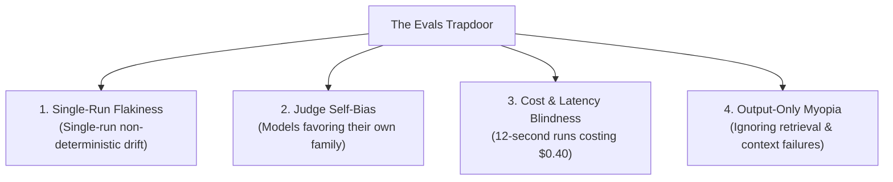

*This is Part 2 of our technical series on Context Layers for AI Agents. If you have not read it yet, start with [Part 1: What Is a Context Layer and Why You Need One](/en/tech/building-an-effective-context-layer-part-1).*

---

<figure class="article-screenshot-figure">
  
  <figcaption>The 4-tier evaluation framework: Unit tests, integration assertions, simulation sandbox, and human feedback loops.</figcaption>
</figure>

## What Does "Effective" Actually Mean?

In Part 1 of this series, we established that every AI agent is fundamentally an execution loop passing data into LLM matrix multiplication pipelines. The differentiator between a broken prototype and a production platform is not the framework syntax: it is the quality and structure of the data you provide.

This brings us to the core challenge of Part 2. To build an *effective* Context Layer, we must start with the single most important question in AI engineering: **How do we identify what is actually effective?**

Let us return to our anchor example: asking an AI assistant to send a thank-you email to Janet for her birthday gift. Before writing a single line of context assembly code, you must evaluate what success and failure look like in your specific domain:
* What happens if the agent sends the email to the wrong Janet?
* What happens if it expresses gratitude for a coffee mug when she actually gave a blender?
* What happens if it uses the wrong tone?

Different products have radically different priorities:
* **The Directory Strict System**: For an enterprise HR app, identifying the correct Janet (Janet H. from management versus Janet Y. the intern) is the absolute highest priority. A wrong recipient is a catastrophic security leak.
* **The Human In The Loop System**: For a tool where humans review drafts before sending, recipient selection errors are tolerable. The core focus is **data fidelity**: retrieving the exact blender from the receipt without hallucinating a coffee mug.
* **The Tone First System**: For a personality-driven app, the highest priority might be ensuring the message sounds passive-aggressive enough. The thank-you note needs to hit that precise Seinfeldian note ("Thanks for the gift, I will try to find a corner in the closet for it eventually.") so Janet understands the gift was okay, but nothing special.

Before building any context features, you must **Evaluate**: What are the critical functions your system must excel at, which functions can be merely acceptable, and where can you afford trade-offs?

---

## The "Evals, Evals, Evals" Philosophy

If Steve Ballmer were giving a keynote on AI agent engineering today, he would not be shouting "Developers, developers, developers!". He would be sweating through his shirt shouting one word: **Evals! Evals! Evals!**

<iframe src="https://www.youtube.com/embed/Vhh_GeBPOhs" width="100%" height="450" style="border:none;border-radius:12px;" loading="lazy" title="Steve Ballmer Developers" allow="accelerometer; autoplay; clipboard-write; encrypted-media; gyroscope; picture-in-picture" allowfullscreen></iframe>

Building a Context Layer without an evaluation suite is like navigating a ship without a compass. You will spend weeks building complex graph RAG pipelines or vector retrieval hacks without knowing whether you actually improved your system or introduced silent regressions. Evaluation is an entire domain, but when building context layers for agents, testing breaks down into four practical tiers.

---

## The 4 Tiers of Agent and Context Evaluation

We are not going to spend time here reviewing textbook definitions of precision, recall, or basic information retrieval metrics that you can find in any standard textbook. Instead, this section guides you through the practical engineering reality: **what** specific concrete behaviors, context payload structures, and trace mechanics you actually need to check to verify that your Context Layer works in production.

When constructing your testing pipeline, the primary strategy is to test every level while prioritizing low-cost, fast, deterministic checks first. Rely as heavily as possible on programmatic assertions (Tier 1 and Tier 2) for format, tool calls, and retrieval grounding. Reserve expensive LLM-as-a-judge evaluators strictly for subjective quality and nuance, running them against a well-calibrated golden dataset.

<figure class="article-screenshot-figure">
  
  <figcaption>The 4-tier testing pyramid for AI agents: Deterministic checks, context & trajectory logic, qualitative LLM judges, and human ground truth.</figcaption>
</figure>

### Tier 1: Deterministic and Programmatic Checks (Functional and Execution)

Tier 1 tests focus strictly on execution mechanics. Did the system execute the requested action without throwing errors or violating format constraints?

Key checks include:
* **Payload and Syntax Validity**: Did the model produce valid JSON matching the required schema?
* **Tool Invocation**: Did the system actually call the target tool with the correct parameters?
* **Safety and Constraint Guards**: Did the system avoid leaking PII or executing out-of-bounds actions?

**The Janet Scenario**: Did the agent call the `SearchDirectory` tool, retrieve a contact record, invoke `SendEmail` with a valid payload, and complete without crashing? This check verifies that the system ran the right tools in order, but it does not tell you whether it picked the *right* Janet.

```python
from pydantic import BaseModel, EmailStr

class EmailPayload(BaseModel):
    recipient_email: EmailStr
    subject: str
    body: str

# Tool Execution Sequence
def assert_tool_sequence(agent_trace: list[dict], required_tools: list[str]):
    called_tools = [s.get("tool") for s in agent_trace if "tool" in s]
    for tool in required_tools:
        assert tool in called_tools, f"Missing required tool call: '{tool}'"

# Output Schema Validation
def assert_output_schema(agent_output: dict) -> EmailPayload:
    return EmailPayload(**agent_output)

# PII Leak Prevention
def assert_no_pii_leak(body_text: str, blocked_fields: list[str]):
    body_lower = body_text.lower()
    for field in blocked_fields:
        assert field not in body_lower, f"PII Leak: '{field}' detected in body"
```

---

### Tier 2: Context, Groundedness, and Trajectory Checks (Data Fidelity and Execution History)

Tier 2 tests evaluate data accuracy, hallucination prevention, entity resolution, and intermediate execution logic by combining RAG Triad principles with trace trajectory analysis:
* **Retrieved Relevance & Groundedness**: Did the Context Layer fetch data containing the necessary facts, and is every output claim strictly supported by retrieved context?
* **Entity Selection & Step Efficiency**: Did the system resolve ambiguous entities accurately (e.g., mapping "Janet" to Janet H.) in a minimal, non-redundant sequence of steps?
* **Reasoning Coherence & Session Persistence**: Does each action logically follow previous state, and does context hold across multi-turn session interactions?

**The Janet Scenario**: The context layer retrieved a purchase receipt showing "KitchenPro Blender, $89.99". Did the draft email reference that specific blender without hallucinating a coffee mug, pick Janet H. (your manager) over Janet Y. (the intern), and execute directory search before sending?

```python
# Context Groundedness & Trajectory Assertions
def assert_context_fidelity(draft_item: str, retrieved_text: str, tool_calls: list[dict], expected_recipient_id: str):
    # Data Groundedness: Item must strictly exist in retrieved context
    assert draft_item.lower() in retrieved_text.lower(), f"Ungrounded item claim: '{draft_item}'"

    # Trajectory & Entity Resolution: Search directory before sending email to correct recipient
    tools = [c.get("tool") for c in tool_calls]
    assert "SearchDirectory" in tools and tools.index("SearchDirectory") < tools.index("SendEmail"), "Incoherent tool sequence"
    assert tool_calls[-1].get("args", {}).get("recipient_id") == expected_recipient_id, "Incorrect entity selected"
```

---

### Tier 3: Qualitative and Nuance Checks (LLM as a Judge)

Tier 3 tests evaluate subjective quality, tone alignment, and subtle persona compliance that cannot be verified with deterministic code assertions:
* **Tone and Persona Alignment**: Does the writing style hit the user's specific voice (such as dry humor)?
* **Authorship Authenticity**: Does the draft sound authentically like something I actually wrote, matching my real writing samples rather than generic AI prose?
* **Subtle Nuance Evaluation**: Does the output respect implicit stylistic boundaries (avoiding overly enthusiastic phrasing or corporate speak)?

**The Janet Scenario**: The user's persona profile says they communicate with dry humor. Did the email hit that exact register and sound like something the user wrote, or did the model default to a generic, overly enthusiastic "Thank you SO much!!!" that contradicts the user's actual voice?

```python
import json
from openai import OpenAI

client = OpenAI()

# Qualitative Tone and Persona Alignment (LLM-as-a-Judge)
def assert_persona_tone(draft_text: str, target_persona: str) -> dict:
    sys_prompt = (
        f"The user's communication style is: {target_persona}.\n"
        "Rate how well this draft matches that style.\n"
        "Score 1-5: 1=completely wrong tone, 5=perfect match.\n"
        'Return JSON: {"score": int, "reasoning": str}'
    )
    response = client.chat.completions.create(
        model="gpt-4o",
        response_format={"type": "json_object"},
        messages=[
            {"role": "system", "content": sys_prompt},
            {"role": "user", "content": draft_text}
        ]
    )
    result = json.loads(response.choices[0].message.content)
    assert result["score"] >= 4, f"Tone mismatch ({result['score']}/5): {result['reasoning']}"
    return result
```

---

### Tier 4: Human Evaluation and Golden Set Curation (Ground Truth & Trace Inspection)

The core concept before beginning to evaluate any system is to deeply understand your data. This principle sounds basic, yet many engineering teams fail at this exact phase. Teams often rush into building complex evaluation frameworks or prompt pipelines without looking at real inputs and outputs.

Inspecting your data is not merely a passive reading exercise. Engineers must manually review 50 to 100 real or synthetic execution traces: examining raw context retrieval payloads, model traces, and generated outputs. You use these examples to construct a foundational Golden Dataset that specifically captures where and how your system fails (such as entity selection errors, ungrounded claims, or broken tool payloads).

Human evaluation remains the ultimate gold standard for ground truth. At the end of the day, you must construct a curated golden dataset labeled by human experts. Without human-labeled ground truth answers, you can never truly know if your automated judges or programmatic checks are measuring actual quality or just echoing internal model biases.

Human evaluation is essential in four specific scenarios:
* **Ground Truth Creation**: Manually labeling 50 to 100 high-stakes traces to establish baseline correctness.
* **Safety and High-Stakes Audit**: Verifying critical security, PII, and financial decision boundaries.
* **Nuance and Creativity**: Assessing subjective voice, subtle humor, and brand alignment where models struggle.
* **Evaluator Disagreement**: Resolving split votes between automated evaluators or edge case failures.

Engineers and domain experts must look at real execution traces, read intermediate outputs, and continuously update the golden dataset as new failure modes emerge in production.

```python
# Human Ground Truth Evaluation Assertion
def assert_human_ground_truth_accuracy(
    model_predictions: list[dict],
    human_golden_dataset: list[dict],
    min_accuracy: float = 0.90
):
    """
    Validates model outputs directly against human-labeled ground truth in the golden dataset.
    """
    correct = 0
    total = len(human_golden_dataset)
    assert total > 0, "Golden dataset cannot be empty"

    human_lookup = {item["sample_id"]: item["expected_label"] for item in human_golden_dataset}

    for pred in model_predictions:
        sample_id = pred["sample_id"]
        if sample_id in human_lookup:
            if pred["actual_label"] == human_lookup[sample_id]:
                correct += 1

    accuracy = correct / total
    assert accuracy >= min_accuracy, \
        f"Ground truth verification failed: accuracy is {accuracy:.1%} (target {min_accuracy:.1%}). Human review required."
```

### The Evaluation Summary Matrix

<figure class="article-screenshot-figure">
  
  <figcaption>Context Layer evaluation metrics dashboard tracking precision, recall, p90 latency, and token cost savings.</figcaption>
</figure>

Putting all four tiers together for our Janet email scenario gives a complete evaluation matrix:

| Tier | What It Checks | The Janet Question |
|------|---------------|--------------------|
| **Tier 1** (Execution) | Tool Sequence, Schema, PII | Did the agent call `SearchDirectory` then `SendEmail` with a valid schema and no PII leaks? |
| **Tier 2** (Context & Trajectory) | Groundedness, Entity Selection, Step Count, Multi-Turn Goal | Did the Context Layer fetch the blender receipt, select Janet H., and complete search before send? |
| **Tier 3** (Qualitative) | Tone, Persona, Constraints | Did the tone match the user's passive-aggressive persona, verified against a calibrated judge? |
| **Tier 4** (Human Ground Truth) | Human Trace Inspection, Golden Dataset Labels | Did human experts manually inspect traces and annotate ground truth to calibrate automated evals? |

---

## Pitfalls & Advanced Strategies: What Else Can We Do?

The 4-tier evaluation framework gets you past the "vibe coding" phase. However, these checks are just foundational techniques among many approaches available online. Some teams even rely entirely on A/B testing live user responses. Relying solely on negative user feedback in production is the laziest and worst approach to evaluation, but it is something teams do when they lack automated testing.

As your Context Layer scales in production, you will inevitably hit four common evaluation traps:



### 1. The Single-Run Flakiness Trap
Because LLMs are non-deterministic, running a single test pass in your CI/CD pipeline gives a false sense of security. An agent might pass your Tier 3 trajectory check 1 out of 5 times by pure luck. You must run evaluations across multiple iterations to measure pass rates statistically.

### 2. LLM-as-a-Judge Self-Bias
When using models like `gpt-4o` to judge outputs in Tier 4, evaluators exhibit systematic bias: favoring longer responses, praising outputs from their own model family, or hallucinating score rationale.

### 3. Ignoring Cost, Latency, and Token Efficiency
Correctness is only half the equation. If your Context Layer fetches 50,000 tokens of raw thread history, takes 12 seconds, and costs $0.40 per run just to send a basic thank-you email to Janet, your architecture is broken in production.

### 4. Evaluating Only the Output, Ignoring the Context
Testing only the final email masks why a failure occurred. Was it a retrieval failure (Context Layer pulled the wrong Janet), a context compression failure (data was dropped), or an instruction-following failure (LLM ignored the retrieved data)?

---

## Where to Start: Benchmark Simulation & Eval-Driven Development

<figure class="article-screenshot-figure">
  
  <figcaption>Benchmark simulation driven development: establishing baselines before building custom tools.</figcaption>
</figure>

Now that you know how to test your system, how do you determine what to build first? Just like any production software engineering effort, you must start with **Simulation & Eval-Driven Development (EDD)**.

This habit forms the foundation of **Eval-Driven Development (EDD)**, the GenAI analogue of Test-Driven Development (TDD). In traditional software engineering, TDD forces you to write a failing test before writing implementation code. In AI agent engineering, EDD requires you to discover, encode, and test for failure modes in your golden dataset before building context abstractions or RAG pipelines. As highlighted in [Airbnb's engineering guide to Eval-Driven Development](https://medium.com/airbnb-engineering/eval-driven-development-lessons-from-evaluating-genai-at-scale-e817e5ae5788), EDD forces stakeholders to externalize what success looks like, ensuring you build context features that address verified failure modes rather than imagined ones.

To put EDD into practice:
1. **Curate Baseline Production Data**: Gather a realistic dataset of production interactions or realistic user prompts (your golden dataset).
2. **Run Baseline Evaluations**: Execute your current system against this test benchmark and record baseline scores across all four evaluation tiers.
3. **Prioritize Bottlenecks**: Identify which tier exhibits the lowest score or the highest risk for your specific product goals.

Before writing code for a new context feature, you should be able to state:

> If I build this specific entity resolution tool, our overall trajectory accuracy score will increase by 30%.

If you cannot make that statement backed by evaluation data, you are wasting your engineering time building unvalidated infrastructure.

---

## Offline Evals vs Online Production Monitoring

Evaluating offline during development and CI/CD is essential, but offline testing alone is not enough. You must also evaluate continuously online in production.

Offline evals validate your baseline assumptions before shipping code. Online evals monitor real-world user prompts, track latency spikes, detect retrieval drift, and capture implicit user feedback in real time.

For deep dives into production evaluation frameworks and online observability, explore these guides:
* [Datadog LLM Evaluation Framework & Best Practices](https://www.datadoghq.com/blog/llm-evaluation-framework-best-practices/)
* [Langfuse Evals & Production Monitoring Guide](https://langfuse.com/blog/2025-11-12-evals)

---

## What Comes Next?

Once you have established your evaluation suite and identified your primary bottlenecks, you are ready to build context abstractions that directly move the needle.

In [Part 3: The 4-Layer Context Layer Architecture Blueprint](/en/tech/building-an-effective-context-layer-part-3), we dive into the core infrastructure architecture and explore how to design a multi-layered data foundation for AI Agents.
