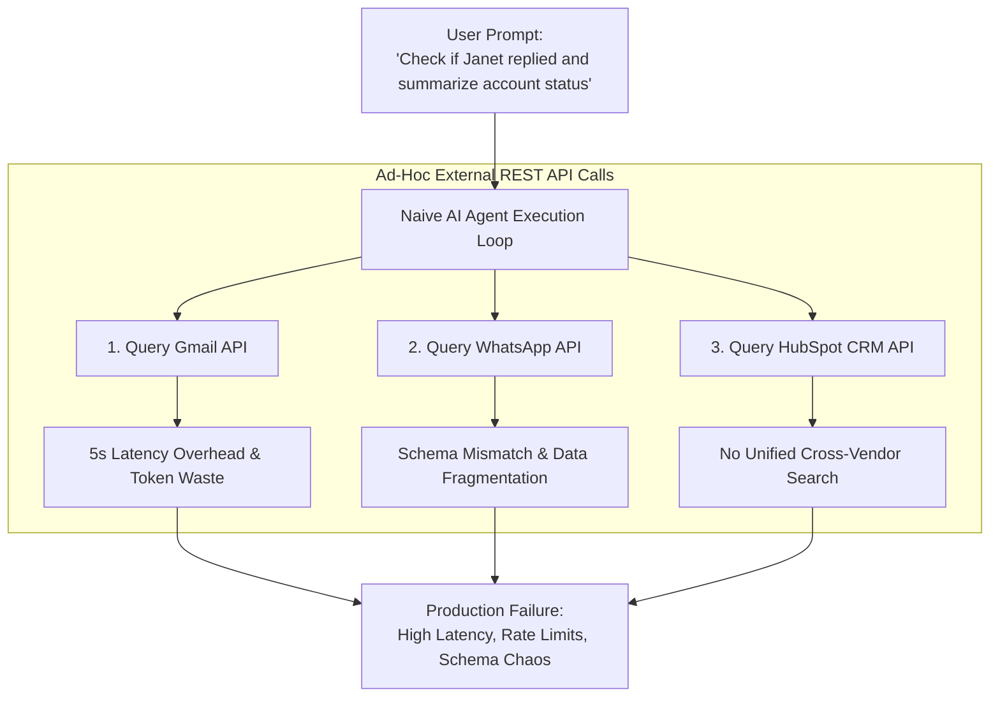
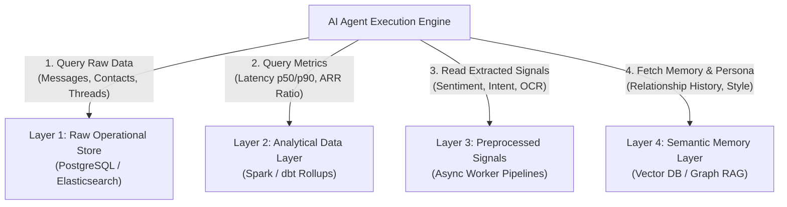
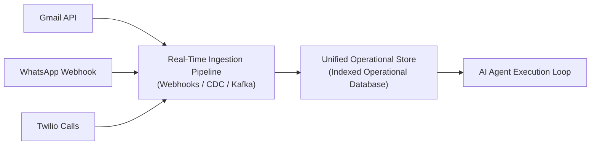
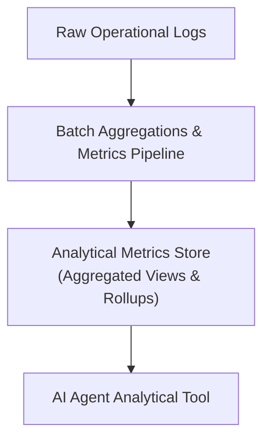
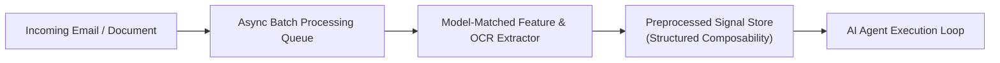
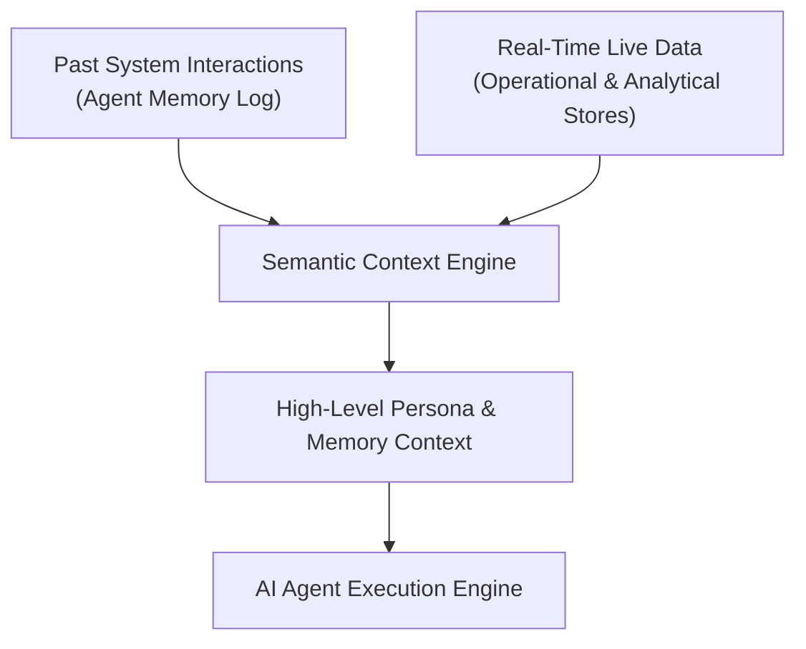

*This is Part 3 of our 7-part technical series on Context Layers for AI Agents. If you have not read the earlier installments, start with [Part 1: What Is a Context Layer](/en/tech/building-an-effective-context-layer-part-1) and [Part 2: Defining and Measuring an Effective Context Layer](/en/tech/building-an-effective-context-layer-part-2).*

---

<figure class="article-screenshot-figure">
  
  <figcaption>Overview of the 4 functional layers: Raw Operational Data, Analytical Metrics, Preprocessed Signals, and Semantic Memory.</figcaption>
</figure>

## The Premise & The Story: Building an AI CRM for Janet

In Part 1 and Part 2 of this series, we defined the core architecture of an AI Agent and built an evaluation framework to measure context effectiveness. We demonstrated that agent quality is not determined by prompt tricks or agent framework choice, but by the precision and structure of the environment data provided to the LLM.

Now we face the core architectural question: **How do we structure our Context Layer so an AI Agent can answer complex operational, analytical, and strategic questions?**

To understand this structure, let us look at Janet. Janet runs a fast-growing business and needs an AI-assisted CRM agent to help automate sales pipelines, triage incoming leads, track deal progress, and manage customer communications.

In Janet's CRM system, data arrives constantly across heterogeneous vendors:
* Raw emails arriving via Gmail and Outlook.
* Call transcripts originating from Twilio and Zoom.
* Messaging threads from WhatsApp and Slack.
* Deal stages stored in HubSpot or PostgreSQL.
* Meeting schedules on Google Calendar.

---

## The Problems with Ad-Hoc API Integration

A naive approach to building this agent relies on ad-hoc API integrations. When a user prompts: *"Check if Janet replied to our proposal and summarize our account status,"* the agent attempts to query Gmail APIs, WhatsApp APIs, and CRM endpoints directly during the execution loop.

### 5 Major Production Failure Modes

This naive plug-and-play approach breaks down in production due to five major problems:

1. **Multi-Vendor Rate Limits and Latency**: Making sequential HTTP calls to three external vendor APIs inside an LLM loop introduces 5 to 10 seconds of network overhead per step.
2. **Inconsistent Schemas**: A message object from WhatsApp looks nothing like a thread from Gmail or a ticket from Zendesk. The LLM spends valuable context tokens navigating schema differences.
3. **Cross-Vendor Search Inability**: An external API cannot perform a unified text search across emails, WhatsApp messages, and call notes in a single query.
4. **Analytical Blindness**: An external REST API can return raw messages, but it cannot tell you if a customer's 48-hour silence exceeds their historical p50 response latency, or if an account's ARR justifies spending five hours on custom requests.
5. **Entity Ambiguity and Data Structure Ignorance**: When an agent attempts to query raw APIs directly, it lacks semantic context on identifier definitions. For example, does `userId` refer to the internal system `account_user_id` in PostgreSQL, or the external `google_sub_id` / `whatsapp_sender_id`? Which API endpoint is authoritative for billing metadata versus contact details? Without a Context Layer enforcing unified domain models (a core principle covered in our *Agents vs Workflows* guide), the LLM hallucinates parameter mappings and selects inappropriate API endpoints.

## Show Me the Money

<figure class="article-screenshot-figure">
  
  <figcaption>The ultimate goal of a Context Layer: demonstrating concrete quantitative ROI and production reliability over theoretical claims.</figcaption>
</figure>

So we understand this problem is very hard and a lot of people are trying to solve it with many approaches. I will guide you now through the framework for how we are going to build our effective context layer.

We are now going to walk through a real-life example of a 4-layer architecture, demonstrating practically how to build an effective Context Layer step by step.

---

## The 4-Layer Context Architecture

To serve AI agents efficiently, context data must be structured into four distinct functional layers:

---

## 1. Raw Data Layer

The first layer provides the ability to fetch raw data as is without calling external APIs during conversation execution.

Layer 1 allows the AI Agent to answer specific raw operational questions across vendors:
* *"Give me all the emails from avi@gmail.com."*
* *"Search all emails containing 'coca cola'."*
* *"Find me the phone number of the contact named Janet."*

You can go directly to Gmail to get all emails, but what do you do if you are working with multiple vendors? How do you search on top of emails, WhatsApp chats, and call transcripts in a single query?

At the end of the day, we are working here with **structured data**. We want to give the AI the ability to **query** this structured data in the most effective way possible. For this to work, we need to have an index for every question.

*For an in-depth technical deep dive into Layer 1 ingestion pipelines and indexing strategies, read [Part 4: Deep Dive into Layer 1 (Raw & Structured Operational Data)](/en/tech/building-an-effective-context-layer-part-4).*

---

## 2. Analytical Data Layer

The second layer addresses questions that are purely analytical to understand aggregated metrics and historical context.

Layer 2 allows the AI Agent to answer purely analytical questions over aggregated data:
* *"What is our average deal cycle time?"*
* *"How much did I sell last year in May?"*
* *"Has this client been silent longer than their average response time?"*
* *"Is this account's ARR above or below our company benchmark?"*

I might want to ask questions that are purely analytical to understand aggregated data. Let's assume I want to understand how many deals I have a day. If I have a single deal a day, every deal might have more impact than a business with 100 deals a day.

Deal time can also have an effect on the action I am doing. To understand if a client went silent, I need to know what the average time is that this specific user takes to answer.

I might also want to understand how much effort I should put into this client. If this account is worth $10,000 ARR while my company p50 benchmark is $100,000 ARR, and the client is asking for too much from me, I might want to mark them as not worthy.

*For an in-depth technical deep dive into Spark rollups, p50/p90 latency baselines, and ARR triage, read [Part 5: Deep Dive into Layer 2 (Analytical Metrics & Aggregations)](/en/tech/building-an-effective-context-layer-part-5).*

---

## 3. Preprocessed Data Layer

The third layer is about asking yourself a simple question: **what kind of data can I process in advance, before the agent loop even starts?**

Layer 3 allows the AI Agent to answer questions that would be too slow or too expensive to compute live:
* *"Is this client angry in this email thread?"*
* *"Extract text out of this attached invoice image or PDF."*
* *"Does this incoming email require immediate action?"*

I can extract signals from an email thread and tell you if this client is angry, or if they want to take action. I can transform image data and pull text out of an invoice. All the things you think you can do in advance, and you are confident you will need, should be preprocessed before the agent loop runs.

Preprocessing signals in advance unlocks critical engineering and economic benefits: leveraging asynchronous batch jobs and prompt caching to reduce token costs by 50% to 90% (using provider options like AWS Bedrock Batch Inference), matching lightweight specialized models to specific extraction tasks instead of invoking expensive mega-LLMs, saving extracted feature outputs as composable building blocks (such as aggregating pre-calculated `deal_health` scores into `account_health` deterministically without LLMs), and enabling offline testing and Evals before client delivery. The primary architectural trade-off is speculative pre-computation, spending background compute on features before knowing if a live user session will query them.

*For an in-depth technical deep dive into asynchronous Kafka queues, batch economics, model matching, sentiment classifiers, and multimodal OCR, read [Part 6: Deep Dive into Layer 3 (Preprocessed Signals & Multimodal OCR)](/en/tech/building-an-effective-context-layer-part-6).*

## 4. Semantic High-Level Layer (The Brain)

The fourth layer is the semantic high-level layer (the brain) designed to answer the deepest, hardest questions that cross all your data, all your past interactions, and all your deep organizational knowledge in a concise, retrievable way.

Layer 4 allows the AI Agent to answer high-level human and relationship questions:
* *"How do I usually answer?"*
* *"What do I think about Janet?"*
* *"What are our historical contract terms and relationship preferences with this account?"*

### The Golden Goal of Context Architecture

Layer 4 is the ultimate holy grail of the Context Layer. Rather than operating in isolation, it consumes and uses all the underlying layers (Layer 1 operational data, Layer 2 analytical metrics, and Layer 3 preprocessed signals) as raw material to construct a living representation of memory, intent, and persona.

Many architectural patterns have attempted to solve this challenge. A prominent example is [Andrej Karpathy's LLM Wiki proposal](https://x.com/karpathy/status/2039805659525644595), which envisions LLMs acting as knowledge compilers that continuously synthesize raw documents into interlinked markdown pages over time:

<figure class="article-screenshot-figure">
  
  <figcaption>Andrej Karpathy proposing LLMs as personal knowledge base compilers, continuously synthesizing raw inputs into structured wiki pages.</figcaption>
</figure>

While many approaches exist (including Graph RAG, vector memory stores, and compiled wikis), none have yet established a fully scalable, production-proven standard for long-term agent memory without context decay or hallucination. Layer 4 remains the active frontier of context engineering.

*For an in-depth technical deep dive into persona alignment, dual memory logging, and Graph RAG, read [Part 7: Deep Dive into Layer 4 (Semantic Memory & Graph RAG)](/en/tech/building-an-effective-context-layer-part-7).*

---

## Architectural Comparison Across All 4 Layers

| Context Layer | Data Nature | Pipeline Type | Primary Question Solved |
|---------------|-------------|---------------|-------------------------|
| **1. Raw Operational Data** | Raw messages, contacts, thread logs. | Real-time streaming or frequent ETL (Airflow). | *"What did the customer say in the last email across vendors?"* |
| **2. Analytical Data** | Pre-aggregated metrics, statistical baselines. | Batch processing (Spark, dbt) or sliding window rollups. | *"What is our average deal cycle time and how much did I sell last May?"* |
| **3. Preprocessed Signals** | Extracted sentiment, intent, image OCR JSON. | Asynchronous worker queues (Kafka, Celery). | *"Is the client angry and what are the line items in the invoice?"* |
| **4. Semantic & Memory** | User persona, organizational memory, Graph RAG. | Hybrid vector search, graph stores, memory logging. | *"How do I usually communicate with Janet and what is our history?"* |

---

## The Complete 7-Part Series Index

Explore the complete technical series on Context Layers for AI Agents:

* **[Part 1: What Is a Context Layer and Why You Need One](/en/tech/building-an-effective-context-layer-part-1)**: Core agent loop architecture, prompt wrappers vs environment context.
* **[Part 2: Defining and Measuring an Effective Context Layer](/en/tech/building-an-effective-context-layer-part-2)**: The 4-tier Evals benchmark framework and measurement matrix.
* **[Part 3: The 4-Layer Context Architecture & Value Creation](/en/tech/building-an-effective-context-layer-part-3)**: The functional value blueprint separating operational, analytical, preprocessed, and semantic layers.
* **[Part 4: Deep Dive into Layer 1 (Raw & Structured Operational Data)](/en/tech/building-an-effective-context-layer-part-4)**: Real-time ingestion pipelines, B-Tree lookups, and GIN inverted indices.
* **[Part 5: Deep Dive into Layer 2 (Analytical Metrics & Aggregations)](/en/tech/building-an-effective-context-layer-part-5)**: Spark rollups, p50/p90 latency baselines, and ARR triage ratios.
* **[Part 6: Deep Dive into Layer 3 (Preprocessed Signals & Multimodal OCR)](/en/tech/building-an-effective-context-layer-part-6)**: Async Kafka feature extraction and document OCR parsing.
* **[Part 7: Deep Dive into Layer 4 (Semantic Memory & Graph RAG)](/en/tech/building-an-effective-context-layer-part-7)**: Organizational memory, persona voice alignment, and Graph RAG entity linking.
