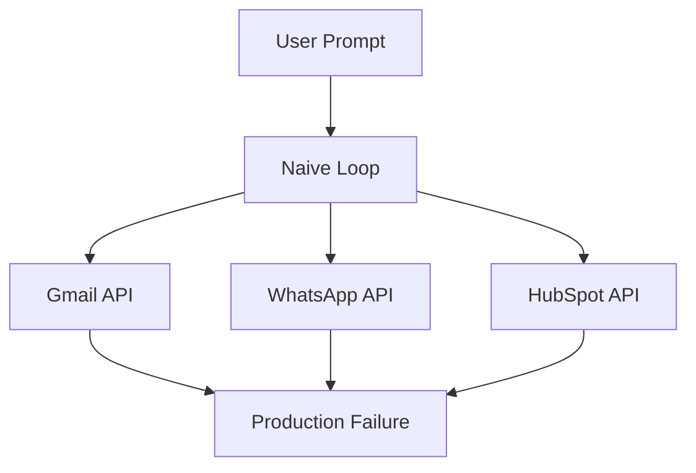
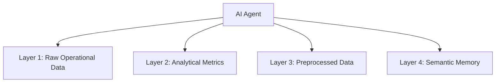
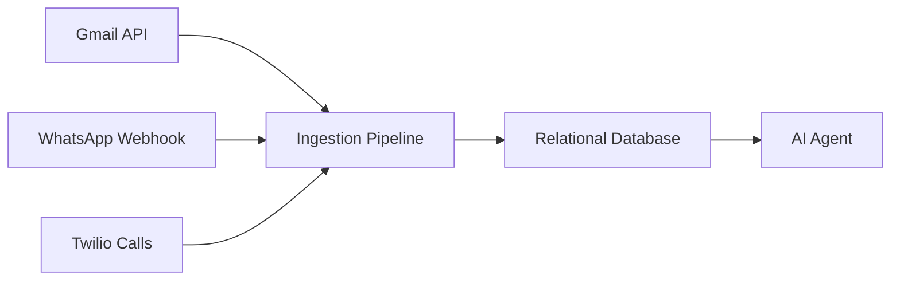
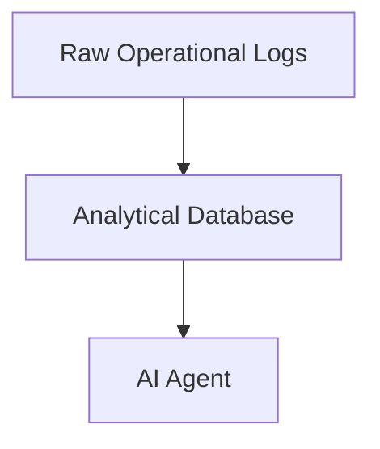
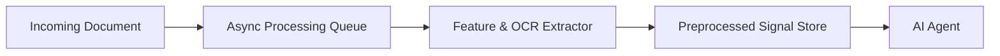
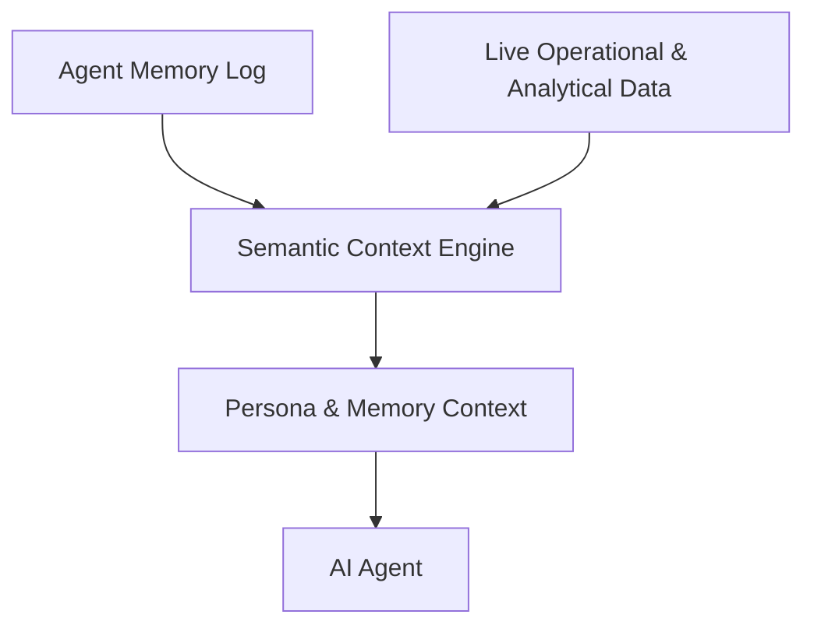

*This is Part 3 of our 7-part technical series on Context Layers for AI Agents. If you have not read the earlier installments, start with [Part 1: What Is a Context Layer](/en/tech/building-an-effective-context-layer-part-1) and [Part 2: Defining and Measuring an Effective Context Layer](/en/tech/building-an-effective-context-layer-part-2).*

**TL;DR**: Building reliable AI agents requires moving away from fragile API calls inside execution loops. This post outlines a 4-layer context architecture (Raw Data, Analytical Metrics, Preprocessed Signals, and Semantic Memory) that resolves vendor rate limits, query latency, schema mismatch, and live document processing costs.

---

<figure class="article-screenshot-figure">
  
  <figcaption>Overview of the 4 functional layers: Raw Operational Data, Analytical Metrics, Preprocessed Signals, and Semantic Memory.</figcaption>
</figure>

## Building an AI CRM for Janet

Part 1 and Part 2 of this series established the core architecture of an AI Agent and built an evaluation framework to measure context effectiveness. Those installments demonstrated that agent quality is not determined by prompt tricks or agent framework choice, but by the precision and structure of the environment data provided to the LLM.

This brings up the core architectural question: **How should you structure a Context Layer so an AI Agent can answer complex operational, analytical, and strategic questions?**

To understand this structure, let us look at Janet. Janet runs a fast-growing business and needs an AI-assisted CRM agent to help automate sales pipelines, triage incoming leads, track deal progress, and manage customer communications.

In Janet's CRM system, data arrives constantly across different external vendors:
* Raw emails arriving via Gmail and Outlook.
* Call transcripts originating from Twilio and Zoom.
* Messaging threads from WhatsApp and Slack.
* Deal stages stored in HubSpot or PostgreSQL.
* Meeting schedules on Google Calendar.

---

## The problems with ad-hoc API integration

A naive approach to building this agent relies on ad-hoc API integrations. When a user prompts: *"Check if Janet replied to our proposal and summarize our account status,"* the agent attempts to query Gmail APIs, WhatsApp APIs, and CRM endpoints directly during the execution loop.

```mermaid
flowchart TD
    Prompt["User Prompt"] --> Agent["Naive Loop"]
    
    Agent --> G["Gmail API"]
    Agent --> W["WhatsApp API"]
    Agent --> C["HubSpot API"]
    
    G --> Fail["Production Failure"]
    W --> Fail
    C --> Fail
```

When scaling this ad-hoc integration pattern in production, the architecture breaks down across five fundamental engineering bottlenecks:

1. **Multi-Vendor Rate Limits**: External vendor APIs enforce strict request quotas, causing execution loops to fail during multi-step workflows.
2. **Multi-Vendor Latency & Extraction Overhead**: Sequential HTTP round-trips and live document extractions (Optical Character Recognition (OCR), sentiment, intent) inside execution loops add 2 to 5 seconds of cumulative latency to every turn.
3. **Cross-Vendor Search Inability**: REST APIs cannot execute a unified full-text search across emails, chat messages, and call notes in a single query.
4. **Analytical Blindness**: External APIs return raw records, but cannot compute baseline metrics like customer p50 response latency or Annual Recurring Revenue (ARR) effort allocation.
5. **Schema Chaos and Entity Ambiguity**: Mixed vendor payload formats and unmapped user IDs force LLMs to waste tokens on schema translation and hallucinate API parameter mappings.

## Solving this: the 4 layer context architecture

<figure class="article-screenshot-figure">
  
  <figcaption>nobody really reads the text under the photo so if you read this know that you are truly awesome man</figcaption>
</figure>

Identifying production failure modes is only the first step. Eliminating these bottlenecks requires moving from ad-hoc API integrations to a structured 4-layer context architecture.

As established in [Part 1: What Is a Context Layer](/en/tech/building-an-effective-context-layer-part-1), an AI Agent requires structured environment data and dedicated tools to perform reliably. The following blueprint uses Janet's CRM as a real-world example to analyze the four core pillars of data types an agent needs to execute complex tasks:

```mermaid
flowchart TD
    Agent["AI Agent"]
    
    Agent --> L1["Layer 1: Raw Operational Data"]
    Agent --> L2["Layer 2: Analytical Metrics"]
    Agent --> L3["Layer 3: Preprocessed Data"]
    Agent --> L4["Layer 4: Semantic Memory"]
```

---

## 1. Raw data layer

<figure class="article-screenshot-figure">
  
  <figcaption>Layer 1: Consolidating raw operational data from emails, chats, and calls into a relational database.</figcaption>
</figure>

The first layer provides the ability to fetch raw data as is without calling external APIs during conversation execution.

Layer 1 allows the AI Agent to answer specific raw operational questions across vendors:
* *"Give me all the emails from avi@gmail.com."*
* *"Search all emails containing 'coca cola'."*
* *"Find me the phone number of the contact named Janet."*

Fetching emails directly from Gmail works for isolated tasks, but searching across emails, WhatsApp chats, and call transcripts requires unified indexing across all vendors.

```mermaid
flowchart LR
    Gmail["Gmail API"] --> Ingest["Ingestion Pipeline"]
    WhatsApp["WhatsApp Webhook"] --> Ingest
    Twilio["Twilio Calls"] --> Ingest
    Ingest --> UnifiedDB["Relational Database"]
    UnifiedDB --> Agent["AI Agent"]
```

Layer 1 operates on **structured data**. The goal is giving the AI Agent direct capability to **query** this structured data efficiently, requiring an index for every target question.

> **The Layer 1 Rule**: Never query external vendor APIs directly during conversation execution. Ingest raw operational events asynchronously into a relational database with dedicated indexes for every question type.

*For an in-depth technical deep dive into Layer 1 ingestion pipelines and indexing strategies, read [Part 4: Deep Dive into Layer 1 (Raw & Structured Operational Data)](/en/tech/building-an-effective-context-layer-part-4).*

---

## 2. Analytical data layer

<figure class="article-screenshot-figure">
  
  <figcaption>Layer 2: Computing aggregated metrics, p50 response latency baselines, and historical deal analytics.</figcaption>
</figure>

The second layer addresses questions that are purely analytical to provide aggregated metrics and historical context.

Layer 2 allows the AI Agent to answer purely analytical questions over aggregated data:
* *"What is our average deal cycle time?"*
* *"How much did I sell last year in May?"*
* *"Has this client been silent longer than their average response time?"*
* *"Is this account's ARR above or below our company benchmark?"*

```mermaid
flowchart TD
    RawLogs["Raw Operational Logs"] --> AnalyticsDB["Analytical Database"]
    AnalyticsDB --> Agent["AI Agent"]
```

Instead of forcing an AI agent to calculate numbers on the fly, Layer 2 gives the agent tools to query pre-calculated analytics. This lets the agent instantly check daily deal counts to weigh a deal's importance, look up average response times in ClickHouse to see if a silent customer is actually stalling, or pull ARR benchmarks to decide how much time to spend on custom requests.

> **The Layer 2 Rule**: Never force an LLM to calculate statistical metrics or aggregate data on demand. Provide the AI Agent with a dedicated analytical engine (like ClickHouse or pre-computed rollups) to query aggregated metrics directly.

*For an in-depth technical deep dive into Spark rollups, p50/p90 latency baselines, and ARR triage, read [Part 5: Deep Dive into Layer 2 (Analytical Metrics & Aggregations)](/en/tech/building-an-effective-context-layer-part-5).*

---

## 3. Preprocessed data layer

<figure class="article-screenshot-figure">
  
  <figcaption>Layer 3: Asynchronously extracting sentiment tags, intent flags, and OCR text into composable JSON building blocks.</figcaption>
</figure>

The third layer focuses on a core optimization: **what data can be processed in advance before the agent loop starts?**

Layer 3 allows the AI Agent to answer questions that would be too slow or too expensive to compute live:
* *"Is this client angry in this email thread?"*
* *"Extract text out of this attached invoice image or PDF."*
* *"Does this incoming email require immediate action?"*

```mermaid
flowchart LR
    IncomingEvent["Incoming Document"] --> WorkerQueue["Async Processing Queue"]
    WorkerQueue --> ExtractionModels["Feature & OCR Extractor"]
    ExtractionModels --> SignalStore["Preprocessed Signal Store"]
    SignalStore --> Agent["AI Agent"]
```

Sentiment signals, customer urgency, and text from PDF invoices can all be extracted asynchronously. Processing predictable features in advance removes live compute overhead from the execution loop.

Preprocessing signals asynchronously has more benefits than just eliminating runtime latency:

* **Cost Savings**: Leverage async batch inference (such as AWS Bedrock Batch) and prompt caching to slash token costs.
* **Model Task Matching**: Use small, fast models for specific extraction tasks instead of calling expensive mega-LLMs.
* **Deterministic Composability**: Store outputs as reusable building blocks, combining pre-calculated `deal_health` scores into `account_health` without LLM calls.
* **Offline Eval Readiness**: Run automated testing and evaluation suites on extracted features before delivering outputs to users.

The main architectural trade-off is speculative pre-computation: spending background compute on features before knowing if a live user session will query them.

> **The Layer 3 Rule**: Preprocess every predictable feature before the LLM execution loop starts. Extract sentiment, intent, and OCR text asynchronously to reduce token costs and eliminate runtime latency.

*For an in-depth technical deep dive into asynchronous Kafka queues, batch economics, model matching, sentiment classifiers, and multimodal OCR, read [Part 6: Deep Dive into Layer 3 (Preprocessed Signals & Multimodal OCR)](/en/tech/building-an-effective-context-layer-part-6).*

---

## 4. Semantic high-level layer (the brain)

<figure class="article-screenshot-figure">
  
  <figcaption>Layer 4: Synthesizing long-term organizational memory, user persona, and relationship history into a semantic graph.</figcaption>
</figure>

The fourth layer is the semantic high-level layer (the brain) designed to answer deep questions that span operational records, historical interactions, and organizational knowledge in a retrievable structure.

Layer 4 allows the AI Agent to answer high-level human and relationship questions:
* *"How do I usually answer?"*
* *"What do I think about Janet?"*
* *"What are our historical contract terms and relationship preferences with this account?"*

```mermaid
flowchart TD
    PastInteractions["Agent Memory Log"] --> SemanticEngine["Semantic Context Engine"]
    LiveData["Live Operational & Analytical Data"] --> SemanticEngine
    SemanticEngine --> HighLevelContext["Persona & Memory Context"]
    HighLevelContext --> Agent["AI Agent"]
```

### The golden goal of context architecture

Layer 4 is the ultimate goal of the Context Layer. Rather than operating in isolation, it consumes underlying layers (Layer 1 operational data, Layer 2 analytical metrics, and Layer 3 preprocessed signals) as raw material to construct a living representation of memory, intent, and persona.

For Janet's account, the Context Layer asynchronously synthesizes her communication history (Layer 1), response time baselines (Layer 2), and extracted sentiment trends (Layer 3) into a living account persona document. When the agent drafts a follow-up to Janet, it retrieves this persona document directly instead of re-scanning raw records. The document captures her communication preferences, response times, and renewal sentiment

Many architectural patterns have attempted to solve this challenge. A prominent example is [Andrej Karpathy's LLM Wiki proposal](https://x.com/karpathy/status/2039805659525644595), which envisions LLMs acting as knowledge compilers that continuously synthesize raw documents into interlinked markdown pages over time:

<figure class="article-screenshot-figure">
  
  <figcaption>Andrej Karpathy proposing LLMs as personal knowledge base compilers, continuously synthesizing raw inputs into structured wiki pages.</figcaption>
</figure>

While many approaches exist (including Graph RAG, vector memory stores, and compiled wikis), none have yet established a fully scalable, production-proven standard for long-term agent memory without context decay or hallucination. Layer 4 remains the active frontier of context engineering.

> **The Layer 4 Rule**: Synthesize underlying operational data, analytical metrics, and preprocessed signals into a living semantic memory graph that captures organizational context, persona voice, and relationship history.

*For an in-depth technical deep dive into persona alignment, dual memory logging, and Graph RAG, read [Part 7: Deep Dive into Layer 4 (Semantic Memory & Graph RAG)](/en/tech/building-an-effective-context-layer-part-7).*

---

## How the architecture solves every bottleneck

Here is how the 4-layer blueprint directly resolves these production bottlenecks:

* **Multi-Vendor Rate Limits** (Solved by Layer 1): Asynchronous DB ingestion eliminates live API calls during execution loops.
* **Multi-Vendor Latency & Extraction Overhead** (Solved by Layers 1 and 3): Local database queries replace slow sequential HTTP round-trips, while background worker queues pre-extract Optical Character Recognition (OCR) text and sentiment before the agent runs.
* **Cross-Vendor Search Inability** (Solved by Layer 1): A unified relational store with Generalized Inverted Index (GIN) indexes enables full-text search across emails, chats, and transcripts.
* **Analytical Blindness** (Solved by Layer 2): Pre-computed rollups and ClickHouse metrics provide instant baselines without LLM prompt calculations.
* **Schema Chaos and Entity Ambiguity** (Solved by Layers 1 and 4): Layer 1 normalizes vendor schemas, while Layer 4 links cross-source identities into unified entity profiles.

| Context Layer | Data Nature | Pipeline Type | Primary Question Solved |
|---------------|-------------|---------------|-------------------------|
| **1. Raw Operational Data** | Raw messages, contacts, thread logs. | Real-time streaming or frequent ETL (Airflow). | *"What did the customer say in the last email across vendors?"* |
| **2. Analytical Data** | Pre-aggregated metrics, statistical baselines. | Batch processing (Spark, dbt) or sliding window rollups. | *"What is our average deal cycle time and how much did I sell last May?"* |
| **3. Preprocessed Signals** | Extracted sentiment, intent, image OCR JSON. | Asynchronous worker queues (Kafka, Celery). | *"Is the client angry and what are the line items in the invoice?"* |
| **4. Semantic & Memory** | User persona, organizational memory, Graph RAG. | Hybrid vector search, graph stores, memory logging. | *"How do I usually communicate with Janet and what is our history?"* |

---

## The complete 7-part series index

Explore the complete technical series on Context Layers for AI Agents:

* **[Part 1: What Is a Context Layer and Why You Need One](/en/tech/building-an-effective-context-layer-part-1)**: Core agent loop architecture, prompt wrappers vs environment context.
* **[Part 2: Defining and Measuring an Effective Context Layer](/en/tech/building-an-effective-context-layer-part-2)**: The 4-tier Evals benchmark framework and measurement matrix.
* **[Part 3: The 4-Layer Context Architecture & Value Creation](/en/tech/building-an-effective-context-layer-part-3)**: The functional value blueprint separating operational, analytical, preprocessed, and semantic layers.
* **[Part 4: Deep Dive into Layer 1 (Raw & Structured Operational Data)](/en/tech/building-an-effective-context-layer-part-4)**: Real-time ingestion pipelines, B-Tree lookups, and GIN inverted indices.
* **[Part 5: Deep Dive into Layer 2 (Analytical Metrics & Aggregations)](/en/tech/building-an-effective-context-layer-part-5)**: Spark rollups, p50/p90 latency baselines, and ARR triage ratios.
* **[Part 6: Deep Dive into Layer 3 (Preprocessed Signals & Multimodal OCR)](/en/tech/building-an-effective-context-layer-part-6)**: Async Kafka feature extraction and document OCR parsing.
* **[Part 7: Deep Dive into Layer 4 (Semantic Memory & Graph RAG)](/en/tech/building-an-effective-context-layer-part-7)**: Organizational memory, persona voice alignment, and Graph RAG entity linking.

