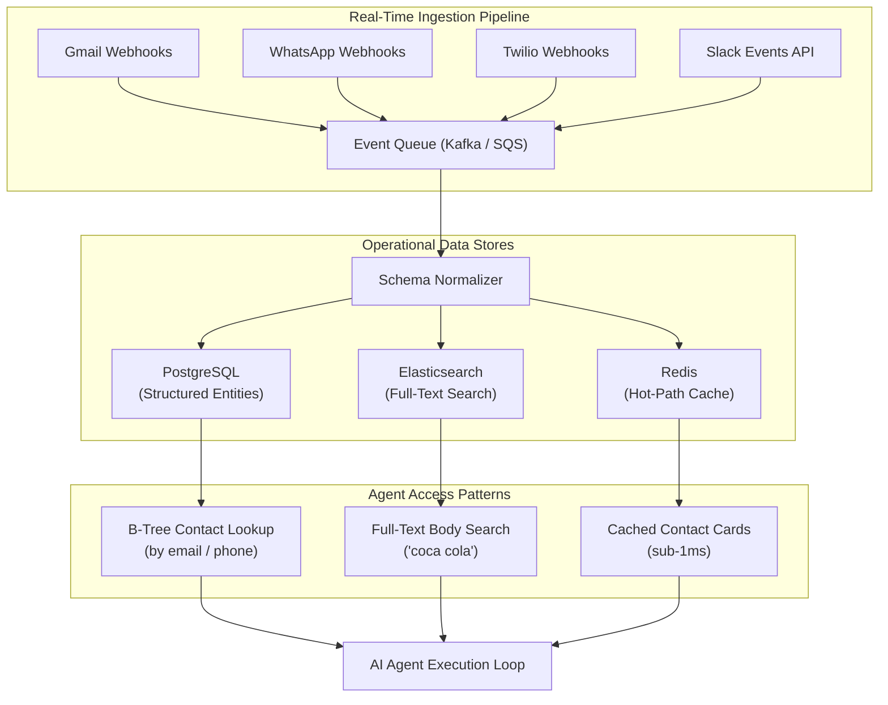
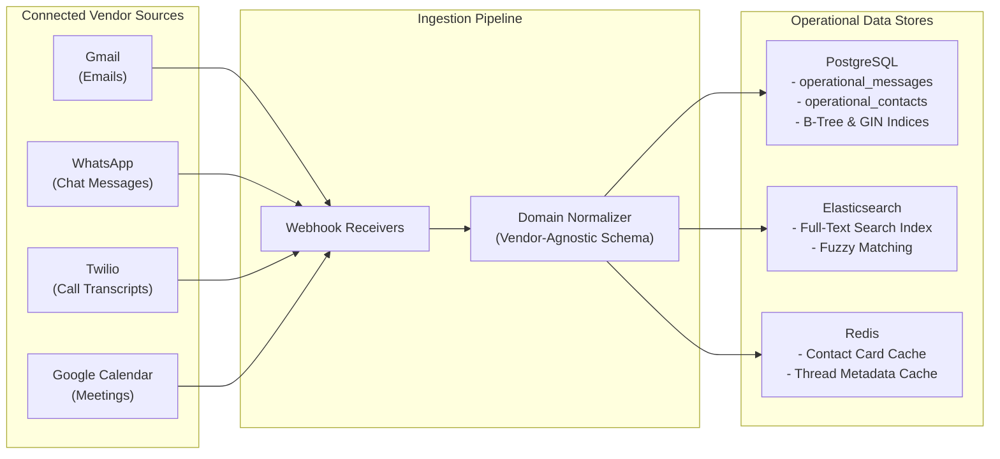

*This is Part 4 of our 7-part technical series on Context Layers for AI Agents. If you have not read the earlier installments, start with [Part 1: What Is a Context Layer](/en/tech/building-an-effective-context-layer-part-1), [Part 2: Defining and Measuring an Effective Context Layer](/en/tech/building-an-effective-context-layer-part-2), and [Part 3: The 4-Layer Context Architecture](/en/tech/building-an-effective-context-layer-part-3).*

---

## Why Do We Need This Layer?

The first layer of the Context Layer architecture exists to solve the most fundamental problem: **fetching raw data fast, in real time, without calling external vendor APIs during agent execution.**

This is not an AI problem. This is a classical backend engineering problem. When an AI Agent needs to look up "all emails from avi@gmail.com," it should not be making a live HTTP request to Gmail's REST API inside the conversation loop. That path leads to rate limits, network latency, and fragile vendor dependencies (as we covered in [Part 3's 5 Major Production Failure Modes](/en/tech/building-an-effective-context-layer-part-3)).

But there is a deeper reason this layer matters: **the raw operational store is not only for the agent.** It is the foundation for your entire product. Janet's CRM system needs this data for the product UI itself: rendering a communication timeline, showing a contact card, displaying a unified inbox. The agent is just one consumer of this data. If you build it right, you build it once.

---

## Benefits of This Layer

When you invest in a well structured domain model for your raw operational data, you unlock the ability to build **multiple products on the same data foundation**:

* **Unified Communication Timeline**: Render every interaction for a contact in a single chronological feed, regardless of vendor. Notice that you are no longer talking about "WhatsApp messages" or "Gmail emails." You are talking about **messages**. The domain abstraction strips away vendor identity entirely.
* **Cross-Vendor Search**: Search for "coca cola" across all communication channels in a single query, something impossible when querying vendor APIs individually.
* **Real-World Action Capability**: Because you control the data model, you can build tools that trigger real-world actions (send a follow-up email, schedule a meeting, update a deal stage) on top of the same structured entities.
* **Agent Tooling Foundation**: Every AI Agent tool call (contact lookup, thread search, message fetch) queries your operational store directly with sub-15ms latency instead of 3 to 5 second vendor API round trips.

<figure class="article-screenshot-figure">
  
  <figcaption>Janet's unified CRM communication timeline: consolidating Gmail, WhatsApp, and call logs into a single vendor-agnostic feed.</figcaption>
</figure>

### Vendor-Agnostic by Design

This is perhaps the most important architectural benefit: once your domain model speaks in **messages**, **contacts**, and **threads** instead of Gmail threads, WhatsApp chats, and Twilio call logs, adding a new vendor becomes trivial. Next quarter when the product team wants to integrate Outlook or Slack, you write a new ingestion adapter and normalize into the same schema. **Your agent does not change at all.** It already knows how to query messages; it does not care where they came from.

<figure class="article-screenshot-figure">
  
  <figcaption>Normalizing multi-vendor payloads (Gmail, WhatsApp, Twilio) into unified domain models: Messages, Contacts, and Threads.</figcaption>
</figure>

### The Home for Proprietary Product Logic

Layer 1 is also where all of your **heavy proprietary product logic** lives. Association of incoming emails to the correct contact record, deduplication of messages that arrive from multiple vendors, threading of related conversations, resolving which phone number belongs to which account: all of this logic runs at ingestion time in Layer 1, not inside the agent loop. The agent receives clean, pre-associated data and can focus entirely on reasoning about it.

The key insight is that a well structured operational store turns your data into a **platform**, not a collection of one-off integrations.

---

## What Tools Do I Need?

Think about this the way you would approach a [system design interview](https://github.com/donnemartin/system-design-primer). You need to answer three core questions about your data:

<figure class="article-screenshot-figure">
  
  <figcaption>Event-driven system design architecture: webhooks, ingestion workers, PostgreSQL operational store, and indexing strategies.</figcaption>
</figure>

1. **What data am I saving?** (messages, contacts, threads, attachments, deal stages)
2. **How will I access it?** (by contact email? by keyword search? by thread chronology?)
3. **What will be the cost of changing this schema in the future?** (adding a new vendor, adding a new entity type)

### SQL vs NoSQL

The first architectural decision is your primary data store:

* **PostgreSQL (Relational SQL)**: Best when your access patterns are well defined and structured. You need B-Tree indices for exact lookups, foreign key relationships between contacts and messages, and transactional consistency. For most CRM operational data, PostgreSQL is the right default choice.
* **MongoDB / DynamoDB (NoSQL)**: Useful when your schema is highly variable or when you need flexible document structures. The trade-off is weaker query flexibility and no native JOIN support.

For Janet's CRM, PostgreSQL is the right choice because we have clearly defined entities (messages, contacts, threads) with predictable relationships.

### Search: Elasticsearch / OpenSearch

If you need to search across message bodies (and you will), a relational database alone is not enough. Elasticsearch provides:

* **Inverted Indices (GIN equivalent)**: Sub-15ms full-text search across millions of messages.
* **Fuzzy Matching**: Handling typos and partial matches in user queries.
* **Relevance Scoring**: Ranking search results by relevance, not just timestamp.

### Caching: Redis

For hot-path lookups that happen on every agent invocation (contact metadata, thread summaries, recent messages), Redis provides:

* **Sub-millisecond reads**: Contact card lookups in under 1ms.
* **TTL-based invalidation**: Automatic cache expiry when underlying data changes.
* **Session context**: Storing the agent's current conversation state between tool calls.

### Event-Driven Ingestion: Kafka and At-Least-Once Delivery

The ingestion pipeline itself is an **event-driven architecture**. Vendor webhooks push events into a message queue (Kafka, SQS, or RabbitMQ), and worker consumers process them asynchronously into your operational stores.

The critical design consideration here is **delivery guarantees**:

* **At-Least-Once Delivery**: Most webhook providers and message queues guarantee at-least-once delivery, meaning the same event may arrive more than once. Your ingestion pipeline **must be idempotent**: processing the same Gmail webhook payload twice should not create duplicate message records. Achieve this by enforcing unique constraints on vendor-specific message IDs (e.g., `gmail_message_id` or `whatsapp_message_id`) at the database level.
* **Ordering**: Kafka provides ordering guarantees within a partition. Partition by tenant or account ID so that all messages for a single account are processed in order, preventing race conditions in contact association and thread resolution.
* **Dead Letter Queues**: Events that fail processing (malformed payloads, transient database errors) should route to a dead letter queue for manual inspection rather than blocking the entire pipeline.

### The Core Trade-Off: Latency vs Cost

Every architectural choice in Layer 1 comes down to this trade-off. Elasticsearch gives you sub-15ms search but costs more to operate than a PostgreSQL GIN index. Redis gives you sub-1ms reads but requires memory management. Kafka adds infrastructure complexity but decouples ingestion from processing. The right answer depends on your query volume, data size, and latency requirements.



---

## Common Pitfalls

The pitfalls of Layer 1 are **not AI pitfalls**. They are classical backend engineering mistakes:

### 1. Not Defining Access Patterns Before Choosing a Database

If you pick MongoDB because "it's flexible" without understanding that your primary query is "get all messages from contact X sorted by time," you will regret it when you need to add composite indices months later. **Start from the queries, work backward to the schema.**

### 2. Ignoring Index Cost (Write Amplification vs Read Speed)

Every index you add speeds up reads but slows down writes. A GIN full-text index on a message body column dramatically speeds up search, but every new message insert must update the inverted index. At 10,000 messages per day this is invisible. At 10 million messages per day, write amplification becomes a bottleneck.

### 3. Not Planning for Schema Evolution

Your CRM has Gmail and WhatsApp today. Next quarter, the product team adds Outlook, Slack, and Zendesk. If your message schema is tightly coupled to Gmail-specific fields (like `labelIds` or `threadId`), adding a new vendor becomes a painful migration. **Design your domain model to be vendor-agnostic from day one.**

### 4. Treating Ingestion as a One-Time ETL

A daily batch ETL job that syncs emails at midnight is useless for a sales agent that needs to know about an email that arrived 30 seconds ago. Layer 1 requires **continuous ingestion** via webhooks, CDC (Change Data Capture), or streaming event queues.

### 5. Storing Raw Vendor Payloads Without Normalization

Dumping raw Gmail API responses into your database feels fast today but creates chaos tomorrow. When the agent asks "get messages from avi@gmail.com," it should not need to understand five different vendor schemas. **Normalize at ingestion time, not at query time.**

---

## Real-Life Example: Janet's CRM in Action

In Janet's CRM system, data flows continuously from all connected vendors through a real-time ingestion pipeline into the unified operational store:



### Example Query: Cross-Vendor Communication Lookup

A user prompts the AI Agent: *"Get all communications from avi@gmail.com discussing the Coca Cola deal."*

The agent executes a single tool call against the operational store. The query hits the Elasticsearch GIN index for "coca cola" filtered by sender email via the PostgreSQL B-Tree index:

```json
[
  {
    "vendor": "whatsapp",
    "sender_email": "avi@gmail.com",
    "recipient_name": "Janet H.",
    "content_body": "Can you check the revised payment schedule for Coca Cola Enterprise?",
    "timestamp": "2026-08-01T14:20:00Z"
  },
  {
    "vendor": "gmail",
    "sender_email": "avi@gmail.com",
    "recipient_name": "Janet H.",
    "content_body": "Attached is the signed Coca Cola contract addendum.",
    "timestamp": "2026-08-01T11:05:00Z"
  }
]
```

**Result**: The agent receives unified cross-vendor records in 12 milliseconds, without making a single external API call.

---

## Conclusion & Next Steps

Layer 1 solves the fundamental problem of operational fragmentation. By building real-time ingestion pipelines, normalizing vendor data into a unified domain model, and enforcing dedicated indices (B-Tree for lookups, GIN for search, Redis for caching), your AI Agent queries multi-vendor history instantly with zero network rate-limit errors.

The core trade-off at this layer is **latency against cost**: faster reads require more infrastructure investment. Design your access patterns first, then pick the tools that match.

Continue to [Part 5: Deep Dive into Layer 2 (Analytical Metrics & Aggregations)](/en/tech/building-an-effective-context-layer-part-5) to explore how pre-computed statistical baselines give AI Agents quantitative business intelligence.
