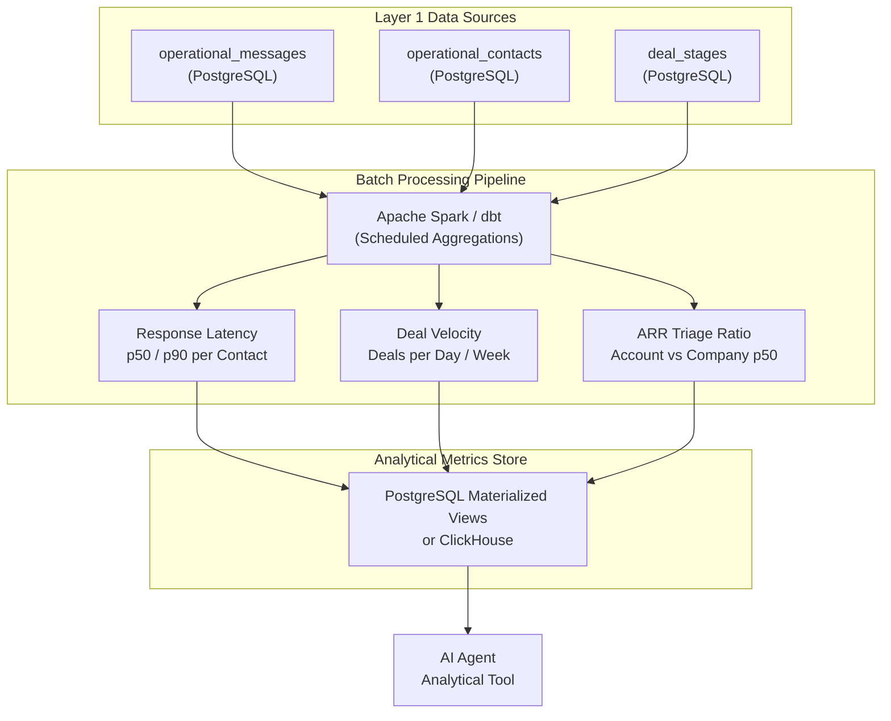

*This is Part 5 of our 7-part technical series on Context Layers for AI Agents. Before reading this deep dive, make sure to read [Part 3: Architecture Overview](/en/tech/building-an-effective-context-layer-part-3) and [Part 4: Deep Dive into Layer 1 Operational Data](/en/tech/building-an-effective-context-layer-part-4).*

---

## Why Do We Need This Layer?

Layer 1 answers *"what happened"*: the raw messages, the contacts, the threads. But it cannot answer *"what does it mean?"*

Consider a simple question: *"Janet H. hasn't replied in 48 hours. Should I send an urgent follow-up?"* Layer 1 can tell you Janet's last message was 48 hours ago. But is 48 hours of silence unusual for Janet? Is this account even worth the urgency? These are **quantitative, analytical questions** that require statistical baselines computed over historical data.

An AI Agent cannot compute p50 response latencies, deal velocities, or ARR benchmarks on the fly during a conversation by scanning raw message strings. These metrics must be **pre-calculated** using data engineering pipelines and exposed as structured analytical context.

Without Layer 2, your agent is a message reader. With Layer 2, your agent is a business analyst.

---

## Benefits of This Layer

### Business Intelligence Inside the Agent Loop

Pre-computed analytical metrics unlock an entirely new class of agent capabilities:

* **Silence Detection**: Calculating p50 (median) and p90 response latency baselines per contact. If Janet's p50 response latency is 72 hours, a 48 hour pause is normal behavior. If her p50 is 2 hours, 48 hours of silence is a critical anomaly that triggers an alert.

<figure class="article-screenshot-figure">
  
  <figcaption>Silence detection using contact response latency baselines: comparing current silence against historical p50 and p90 response times.</figcaption>
</figure>

* **Deal Velocity and Volume Impact**: Understanding how many deals your business processes daily changes the decision calculus. If Janet closes 1 deal per day, every deal has massive impact and warrants human attention. If she closes 100 deals per day, automated rules should handle most of them.

* **ARR Triage and Effort Allocation**: Computing the ratio of an account's ARR relative to the company's median (p50) account ARR. If this account is worth $10,000 ARR while the company p50 benchmark is $100,000 ARR, and the client is sending 15 complex feature requests, the agent should recommend standard product features instead of custom engineering effort.

<figure class="article-screenshot-figure">
  
  <figcaption>ARR triage decision matrix: evaluating account ARR relative to company benchmarks to allocate engineering effort efficiently.</figcaption>
</figure>

* **Trend Detection**: Tracking metrics over time reveals trends invisible in raw data. Is this account's response time getting slower month over month? Is deal velocity accelerating or decelerating?

### From Reactive to Proactive

The most powerful benefit of Layer 2 is that it shifts the agent from **reactive** (answering questions when asked) to **proactive** (surfacing insights before the user even asks). The agent can flag *"Janet's response time has increased 3x compared to her historical baseline"* without any user prompt.

---

## What Tools Do I Need?

<figure class="article-screenshot-figure">
  
  <figcaption>Batch data engineering pipeline: leveraging Apache Spark and dbt to aggregate historical operational metrics for the Context Layer.</figcaption>
</figure>

### Batch Processing Engines

The core tooling for Layer 2 is batch data processing:

* **Apache Spark**: For large scale aggregations across millions of records. Spark excels at computing statistical distributions (p50, p90, p99 percentiles) across entire datasets. Best for companies with significant data volumes.
* **dbt (Data Build Tool)**: For SQL based transformations that are easier to maintain and version control. dbt models define your metrics as SQL queries that run periodically. Best for teams that want to stay in the SQL ecosystem.



### Storage: Materialized Views vs Data Warehouse

Where you store pre-computed metrics depends on your scale:

* **PostgreSQL Materialized Views**: For teams that want to keep everything in one database. Create materialized views that pre-compute your rollups and refresh them periodically. Simple, effective, and sufficient for most startups.
* **ClickHouse / TimescaleDB**: For time-series heavy workloads where you need sub-second analytical queries over billions of rows.
* **BigQuery / Redshift**: For organizations that already have a data warehouse. Compute metrics there and sync results back to the operational store.

### Scheduling: Orchestration

Batch jobs need to run on a schedule:

* **Apache Airflow**: Industry standard for orchestrating complex data pipeline DAGs. Handles dependencies, retries, and monitoring.
* **Simple Cron Jobs**: For smaller teams, a scheduled cron job running a dbt model every hour is often sufficient. Do not over-engineer the orchestration layer before you need it.

### The Core Trade-Off: Freshness vs Compute Cost

How often should you recalculate metrics? Every hour? Every 15 minutes? Every minute?

Refreshing materialized views more frequently gives the agent fresher data but costs more compute. For most CRM use cases, **hourly recalculation** is the sweet spot: response latency baselines do not shift meaningfully within an hour, and the compute cost stays manageable.

---

## Common Pitfalls

### 1. Computing Metrics at Query Time

The most common mistake is skipping pre-computation entirely and computing aggregations inside the agent's tool call. An SQL query that calculates p50 response latency across 2 million messages takes 3 to 8 seconds. That latency is unacceptable inside a conversational loop. **Pre-compute, do not query-time compute.**

### 2. Not Versioning Metric Definitions

What counts as "response time"? Time from the last message to the first reply? Or time from any message to any reply? If you change this definition without versioning it, historical comparisons become meaningless. **Treat metric definitions like code: version them, test them, review changes.**

### 3. Ignoring Statistical Edge Cases

A new account with only 2 messages has no meaningful p50 baseline. An account with a single data point produces a meaningless "median." Your pipeline needs **minimum sample thresholds** before generating confidence metrics. Without them, the agent makes decisions based on statistically insignificant data.

### 4. Over-Engineering the Data Stack

Not every team needs Apache Spark, Airflow, and a dedicated data warehouse on day one. If you have 50,000 messages, a PostgreSQL materialized view refreshed by a cron job every hour is more than sufficient. **Start with the simplest tool that solves your access pattern, then scale when the data demands it.**

### 5. Not Aligning Metric Windows with Business Reality

Should your deal velocity metric use a rolling 30 day window or a calendar month? Should response latency baselines cover the last 90 days or the last 12 months? These are **business decisions**, not engineering decisions. Align your metric windows with how the business actually thinks about time.

---

## Real-Life Example: Janet's CRM in Action

In Janet's CRM system, Layer 2 consumes raw operational data from Layer 1 and produces pre-computed analytical metrics that the agent queries instantly.

### Scenario: Silence Detection with Response Latency Baselines

A user prompts the AI Agent: *"Janet H. hasn't replied to our proposal sent 48 hours ago. Should I send an urgent follow-up?"*

The agent calls its analytical tool, which queries the pre-computed metrics store:

```json
{
  "account_email": "janet@business.com",
  "p50_response_latency_hours": 72.0,
  "p90_response_latency_hours": 96.0,
  "hours_currently_silent": 48.0,
  "is_anomalously_silent": false,
  "account_arr_usd": 340000.0,
  "arr_ratio_to_company_p50": 3.4,
  "deal_velocity_per_week": 2.3,
  "response_trend_30d": "stable"
}
```

**Agent Response**: *"Janet's baseline response latency is 3 days (p50). At 48 hours, she is still within her normal response window. Because this is a high-value account ($340k ARR, 3.4x company baseline), I recommend waiting another 24 hours before following up to avoid appearing overly aggressive."*

### Scenario: ARR Triage and Effort Allocation

A different user asks: *"Client Dave sent 15 feature requests. How much custom engineering should we invest?"*

```json
{
  "account_name": "Dave's Startup",
  "account_arr_usd": 8500.0,
  "arr_ratio_to_company_p50": 0.085,
  "custom_request_count": 15,
  "avg_engineering_hours_per_request": 4.0,
  "total_estimated_hours": 60.0
}
```

**Agent Response**: *"Dave's account ARR ($8,500) is 8.5% of our company median ($100,000). Investing 60 engineering hours on custom features for this account is not cost-effective. I recommend offering standard product features and escalating only the top 2 requests for product team review."*

---

## Conclusion & Next Steps

Layer 2 transforms raw event strings into quantitative business intelligence. By running Spark or dbt rollups on a schedule, your AI Agent evaluates statistical baselines instantly without running slow runtime SQL aggregations.

The core trade-off at this layer is **freshness against compute cost**: more frequent recalculation gives fresher metrics but costs more. For most use cases, hourly refresh is the right balance.

Continue to [Part 6: Deep Dive into Layer 3 (Preprocessed Signals & Multimodal OCR)](/en/tech/building-an-effective-context-layer-part-6) to see how asynchronous feature extraction parses sentiment, intent, and document attachments before the agent loop runs.
