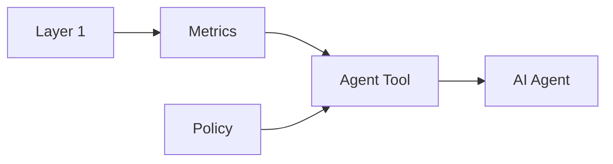
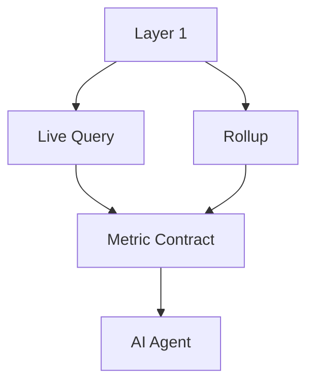

*This is Part 5 of our 7 part technical series on Context Layers for AI Agents. [Part 4: Ingesting Raw Operational Data](/en/tech/building-an-effective-context-layer-part-4) showed how the CRM gives every consumer one reliable record of contacts, messages, and threads. This part turns that history into governed analytical context.*

**TL;DR**: Layer 2 is a governed analytical interface. It defines what each metric means, computes it through a measured serving path, and returns the value together with its cohort, sample size, uncertainty, freshness, version, and lineage. The metric supplies evidence. A separate business policy decides whether the AI Agent should wait, notify a user, or escalate.

## Is Janet's silence unusual?

The CRM sent Janet a renewal proposal on Monday morning. It is now Wednesday morning, and Janet has not replied. A user asks the AI Agent:

*"Janet has been silent for 48 hours. Should I send an urgent follow up?"*

Layer 1 can retrieve the proposal, its send time, the thread, and Janet's identity. That proves what happened. It does not tell us whether the silence is unusual.

Even the phrase "48 hours" hides decisions. The interval may include two nights. It may include a weekend or a holiday in Janet's country. Janet may usually answer renewal emails more slowly than support questions. The CRM may also have received only a few past replies from her.

Before choosing PostgreSQL, ClickHouse, or a warehouse, write down the questions the analytical interface must answer:

1. **Current duration**: How many business hours have passed since the message that needs a reply?
2. **Expected behavior**: How often are comparable conversations still unanswered after that duration?
3. **Evidence quality**: Which conversations formed the comparison, and how much uncertainty remains?
4. **Data health**: How current and complete are the source records?
5. **Decision policy**: Given that evidence, what does the business want the AI Agent to do?

> **Start from the decision question**: A metric is useful only when its definition and evidence match the decision that consumes it.

## Layer 2 is an interface, not a batch pipeline

Layer 2 gives the product one governed contract for analytical questions. The contract can be served by a live warehouse query, an indexed PostgreSQL query, ClickHouse, or a maintained serving table. Scheduled rollups are one implementation, not the layer itself.


```mermaid
flowchart LR
    Events["Layer 1"] --> Metrics["Metrics"]
    Metrics --> Tool["Agent Tool"]
    Policy["Policy"] --> Tool
    Tool --> Agent["AI Agent"]
```

The AI Agent should not know which database ran the calculation. It should know what the result means, when it was calculated, and whether the evidence is strong enough to use.

This distinction matters because changing the execution engine should not change the meaning of `response_latency`. Changing the meaning should create a new metric version even if the SQL still runs in the same database.

## Define the response metric before computing it

"Response time" sounds obvious until two teams implement it differently. One starts the clock at the first message in a burst. Another starts at the last message. One includes automated acknowledgements. Another counts only a human reply. Both return a number called `response_latency_hours`, but those numbers are not comparable.

For Janet's history in the CRM, define one contract:

| Contract field | Definition |
|---|---|
| Metric | `contact_response_survival` |
| Pairing | A company turn ends at the first human customer reply in the same thread |
| Start event | The last human company message that requires a reply |
| Message burst | Company messages within 30 minutes, with no customer reply between them |
| Clock | Business hours in the account calendar and time zone |
| Exclusions | Automated acknowledgements, internal notes, and bounced messages |
| Event time | The source `occurredAt` value, not the ingestion time |
| Window | The previous 180 days as of the requested observation time |
| First cohort | The same contact and channel |
| Fallback cohort | The same account segment and channel |
| Sample rule | Use the contact cohort only after 20 observed conversations |
| Version | `contact_response_survival_v2` |
| Freshness target | Source watermark no more than 15 minutes old |

The sample rule is a product reliability choice, not a universal statistical law. Its purpose is to stop the system from presenting one or two past replies as a stable personal pattern. When Janet has too little history, the tool uses the declared fallback cohort and says so.

Business hours also belong in the contract. If the proposal was sent Monday at 4 PM and the CRM asks on Wednesday at 10 AM, the result might be 10 business hours rather than 42 wall clock hours. The calendar, time zone, and holiday source must therefore be versioned inputs.

Metric definitions are public interfaces. [dbt model contracts](https://docs.getdbt.com/docs/mesh/govern/model-contracts) can enforce output columns and data types, while [dbt model versions](https://docs.getdbt.com/docs/mesh/govern/model-versions) provide a migration path when a breaking definition changes. These controls do not replace a written semantic contract, but they help keep its implementation honest.

## An unanswered conversation has no final response time

Suppose Janet answered five earlier proposals after 3, 6, 8, 20, and 30 business hours. Her current conversation has been open for 16 business hours.

It would be tempting to calculate a median from the five completed replies and compare 16 with that number. The problem is that the current conversation has no completed duration yet. We only know that its response time is greater than 16 hours.

This is called **right censored data**. In plain language, the clock is still running. Throwing away every open conversation makes the fastest completed replies dominate the baseline. Pretending the current duration is final makes the response look faster than it may eventually be.

A survival curve handles both completed and still open conversations. Here, "survival" simply means "still unanswered." At 16 business hours, the tool can estimate the probability that a comparable conversation remains unanswered beyond that point.

If the estimate is 68 percent, Janet's silence is common in the selected cohort. If it is 4 percent, the silence is unusual. Neither number alone decides what to do. The result also needs a sample count and an uncertainty interval, especially when Janet has little history.

The [NIST explanation of censored data](https://itl.nist.gov/div898/handbook/apr/section1/apr131.htm) describes observations whose final event has not happened during the observation period. Its [Kaplan Meier guide](https://www.itl.nist.gov/div898/handbook/apr/section2/apr215.htm) shows how to estimate a distribution from completed and censored observations without assuming a particular distribution shape.

<figure class="article-screenshot-figure">
  
  <figcaption>Janet's current silence is placed against comparable completed and still open conversations, with the cohort and sample size kept visible.</figcaption>
</figure>

Percentiles can still help summarize completed durations. PostgreSQL provides `percentile_cont`, and Apache Spark provides `percentile_approx` with an explicit accuracy and memory tradeoff. A percentile is a summary, though, not proof that an observation is urgent. The [PostgreSQL aggregate documentation](https://www.postgresql.org/docs/current/functions-aggregate.html) and [Spark function documentation](https://spark.apache.org/docs/latest/api/python/reference/pyspark.sql/api/pyspark.sql.functions.percentile_approx.html) also make clear that engines can implement percentile calculations differently. Record the method in the metric contract.

## Evidence and policy are different contracts

The analytical result should answer:

*"How unusual is Janet's current silence, according to this defined comparison?"*

The business policy should answer:

*"Given that evidence and the state of this renewal, what action should the CRM take?"*

Those are not the same question. A rare silence may still be harmless. A common silence may still require action because a contractual deadline is tomorrow. Account value, customer preference, legal commitments, and the cost of a mistaken escalation belong in policy.

A versioned policy might say:

```json
{
  "policy": "renewal_follow_up_v3",
  "rules": {
    "urgent_if_deadline_hours_lte": 24,
    "review_if_survival_probability_lte": 0.1,
    "wait_if_data_is_stale": true,
    "human_approval_for_urgent_message": true
  }
}
```

The AI Agent can explain and apply this policy. It must not invent a threshold because 48 hours sounds long. Keeping policy separate also lets business owners change escalation behavior without silently changing the historical metric.

> **Metrics describe the evidence**: Policies own the action, its thresholds, and the acceptable cost of a wrong decision.

## Choose the serving path from the access pattern

The same metric contract can have several implementations. Choose one by measuring query latency, concurrency, source volume, correction frequency, freshness needs, and operating cost.

| Access pattern | Serving choice | Important behavior |
|---|---|---|
| Bounded query over modest history | Indexed PostgreSQL query | Simple operations and immediate access to corrected source rows |
| Repeated stable aggregation | PostgreSQL materialized view | Stored results, but refresh replaces the view contents |
| Broad analysis already in a warehouse | BigQuery or Redshift query | Strong fit for large scans, with platform specific materialization limits |
| Frequent interactive analytical reads | ClickHouse | Column oriented execution and stored aggregate states |
| Strict low latency contract | Maintained serving table | Fast bounded reads, with another projection to monitor and repair |

Start with PostgreSQL when it meets the measured requirement. PostgreSQL materialized views persist query results in a table like form, but they do not refresh themselves. A regular refresh replaces the contents and can block readers. `REFRESH MATERIALIZED VIEW CONCURRENTLY` avoids blocking selects but requires a suitable unique index. The [PostgreSQL materialized view guide](https://www.postgresql.org/docs/current/rules-materializedviews.html) and [refresh reference](https://www.postgresql.org/docs/current/sql-refreshmaterializedview.html) document these behaviors.

Use the existing warehouse when broad scans or shared analytical models already live there. BigQuery supports scheduled queries for arbitrary recurring calculations, while its incremental materialized views accept a restricted set of aggregate functions. Redshift also limits incremental refresh for materialized views that use percentile functions. These constraints affect the serving design, not the metric contract.

Primary references:

1. [BigQuery scheduled queries](https://cloud.google.com/bigquery/docs/scheduling-queries)
2. [BigQuery materialized view requirements](https://cloud.google.com/bigquery/docs/materialized-views-create)
3. [Redshift materialized view refresh](https://docs.aws.amazon.com/redshift/latest/dg/materialized-view-refresh.html)

ClickHouse is useful when the product repeatedly slices large event histories with low interactive latency. Its incremental materialized views can store intermediate aggregate states as new blocks arrive. That behavior differs from a PostgreSQL refresh, so copying the same SQL shape between them can produce the wrong maintenance model. See the [ClickHouse incremental materialized view guide](https://clickhouse.com/docs/concepts/features/materialized-views/incremental-materialized-view).

dbt is not an alternative execution engine beside Spark or ClickHouse. dbt defines, tests, documents, and materializes transformations by dispatching work to the selected data platform. Its [model documentation](https://docs.getdbt.com/docs/build/models) explains that the data remains in that platform during transformation. Spark is useful when distributed processing is justified by the workload, but it is not a required stop in Layer 2.

<figure class="article-screenshot-figure">
  
  <figcaption>A scheduled aggregation is one possible serving path. Layer 2 remains the analytical contract even when the execution engine changes.</figcaption>
</figure>


```mermaid
flowchart TD
    Events["Layer 1"] --> Query["Live Query"]
    Events --> Rollup["Rollup"]
    Query --> Contract["Metric Contract"]
    Rollup --> Contract
    Contract --> Agent["AI Agent"]
```

There is no universal refresh interval. The response distribution may change slowly, while the current open duration and deadline state change continuously. Give each field an explicit freshness target. If several jobs have dependencies, retries, and backfills, [Apache Airflow](https://airflow.apache.org/docs/apache-airflow/stable/) can orchestrate those finite batch workflows. A simple scheduler may be enough when there is only one reliable job.

## Analytical context must survive change

Historical metrics are projections over changing operational data. A correct first run is not enough.

### Late events

A provider may deliver Tuesday's message on Thursday. Use source event time for the metric, then recompute every affected conversation and aggregate window. If processing streams, a watermark defines how long the system waits for late events before closing state. The [Spark event time guide](https://spark.apache.org/docs/latest/streaming/apis-on-dataframes-and-datasets.html) explains the tradeoff between accepting late data and keeping unbounded state.

### Corrected and deleted records

An edited timestamp, removed automated reply, or provider deletion can change the paired response observation. Preserve the correction in Layer 1, invalidate the derived observation, and rebuild each dependent aggregate. Deletion requirements must propagate into analytical stores rather than leaving the deleted content encoded in a rollup.

### Contact merges

If two records are later confirmed to represent Janet, do not rewrite old facts without a trace. Keep the source identities, record the merge version, and rebuild both contact histories into the new canonical projection. A reversible merge lets the team repair a mistaken identity decision.

### Backfills and definition changes

A backfill must be deterministic for a stated time range, source watermark, and metric version. When `v3` changes message pairing, build it beside `v2`, compare the outputs, and migrate consumers deliberately. dbt [incremental models](https://docs.getdbt.com/docs/build/incremental-models) can process selected new or changed rows, while [dbt snapshots](https://docs.getdbt.com/docs/build/snapshots) retain changes to mutable source records.

### Failed refreshes

Keep the last successful result only if the tool marks it stale and reports the failed refresh. "No unusual silence" and "the metric has not refreshed since yesterday" are different facts. [dbt source freshness](https://docs.getdbt.com/docs/build/sources) supports explicit warning and error thresholds for source data.

### Point in time reproduction

Store enough metadata to answer: *"Why did the AI Agent recommend waiting at 10:05 AM?"* The record needs the observation time, source watermark, metric version, policy version, cohort, and run identifier. Replaying those inputs should reproduce the evidence available at that moment, even if Janet replies later.

## Expose one narrow analytical tool

The agent does not need raw reply histories or an open SQL endpoint. Give it a bounded domain tool such as:

```text
getContactResponseContext(contactId, threadId, observedAt)
```

Its response should carry enough context to interpret the metric without flooding the model:

```json
{
  "contactId": "contact_1842",
  "threadId": "thread_771",
  "observedAt": "2026-08-05T10:00:00Z",
  "currentSilence": {
    "businessHours": 16.0,
    "wallClockHours": 48.0
  },
  "metric": {
    "name": "contact_response_survival",
    "version": "v2",
    "method": "kaplan_meier",
    "probabilityStillUnanswered": 0.68,
    "uncertaintyInterval": [0.52, 0.81]
  },
  "cohort": {
    "scope": "contact",
    "channel": "email",
    "windowDays": 180
  },
  "sample": {
    "completed": 34,
    "rightCensored": 6
  },
  "freshness": {
    "sourceWatermark": "2026-08-05T09:56:00Z",
    "status": "fresh"
  },
  "lineage": {
    "metricRunId": "metric_run_932",
    "sourceRecordCount": 40
  }
}
```

This example is illustrative. The important part is the shape of the evidence. There is no `is_anomalous` field and no hidden instruction to send a message. The policy evaluates the result separately.

## Returning to Janet's renewal

Now return to the opening question:

*"Janet has been silent for 48 hours. Should I send an urgent follow up?"*

The CRM handles it in three explicit operations:

1. `findContact` resolves Janet to the canonical contact ID.
2. `getContactResponseContext` returns 16 business hours of current silence, the survival estimate, uncertainty, cohort, freshness, version, and lineage.
3. `evaluateFollowUpPolicy` applies `renewal_follow_up_v3`, including the renewal deadline and the requirement for human approval before an urgent message.

The AI Agent can now answer:

*"Janet has been silent for 48 wall clock hours, which is 16 business hours in the account calendar. Based on 40 comparable email conversations, the current estimate says 68 percent would still be unanswered at this point. The source data is current as of 9:56 AM. Our renewal policy does not call for an urgent follow up yet, and there is no deadline within 24 hours. I recommend waiting until the next business morning. A user should review the message before any urgent outreach."*

This is a restrained recommendation, not a statistical certainty. The AI Agent names the evidence, applies an owned policy, and leaves room for a person to override it.

## The Layer 2 operating model

Layer 2 is not Spark, dbt, ClickHouse, or a collection of scheduled rollups. It is the governed analytical contract shared by the product and the AI Agent.

> **The Layer 2 Rule**: Define every metric as a versioned contract, serve it through a measured access path, return freshness, sample size, uncertainty, and lineage with the value, and let an explicit business policy decide the action.

Continue to [Part 6: Building Versioned Preprocessed Signals](/en/tech/building-an-effective-context-layer-part-6) to see how asynchronous extraction turns sentiment, intent, and document content into structured signals before the AI Agent needs them.
