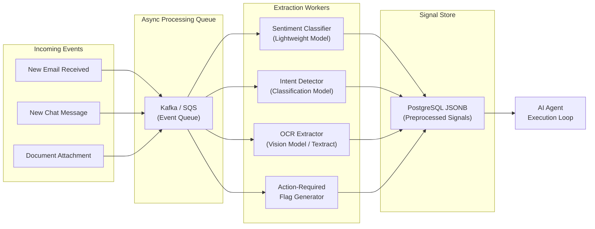

*This is Part 6 of our 7-part technical series on Context Layers for AI Agents. Before reading this deep dive, make sure to read [Part 3: Architecture Overview](/en/tech/building-an-effective-context-layer-part-3), [Part 4: Layer 1 Operational Data](/en/tech/building-an-effective-context-layer-part-4), and [Part 5: Layer 2 Analytical Metrics](/en/tech/building-an-effective-context-layer-part-5).*

---

## Why Do We Need This Layer?

Layer 1 gives you raw data. Layer 2 gives you statistical metrics. But there is a class of questions that requires **intelligence extraction**: understanding meaning, sentiment, and structured content from unstructured inputs.

Ask yourself a simple question: **what data can I process in advance, before the agent loop even starts?**

If an incoming email contains an attached invoice image or a multi-page PDF proposal, forcing the agent to run OCR and extract line items on the fly during user interaction is slow (5 to 15 seconds of model inference) and expensive (frontier model token costs). If you know you will need sentiment analysis on every customer email, there is no reason to compute it live every time. Pre-compute it once when the email arrives, store the result, and serve it instantly when the agent needs it.

The core principle of Layer 3 is: **anything you are confident you will need, and can compute asynchronously, should be preprocessed before the agent loop runs.**

---

## Benefits of This Layer

### 1. Batch Economics: 50% to 90% Cost Reduction

When processing data in advance, you do not need synchronous real-time responses. By sending incoming documents through batch inference APIs, you unlock dramatic cost savings.

Take a look at the [AWS Bedrock pricing table](https://aws.amazon.com/bedrock/pricing/):

<figure class="article-screenshot-figure">
  
  <figcaption>Anthropic pricing model on AWS Bedrock: comparing standard real-time pricing against batch inference and prompt caching discounts.</figcaption>
</figure>

Batch inference offers a **50% discount on token pricing** in exchange for a processing window (up to 24 hours). Combined with prompt caching on repeated system instructions, input token fees drop by up to 90%. You trade real-time delivery speed for massive operational savings.

### 2. Model-Task Matching

In an offline batch pipeline, you can match **specialized, lightweight models** to specific extraction tasks rather than routing every query through an expensive frontier model. A small classification model handles sentiment tagging perfectly. A specialized vision model extracts tabular data from PDFs cheaper and faster than a general-purpose Claude or GPT-4. You do not need a $15/million-token model to answer "is this email angry?"

<figure class="article-screenshot-figure">
  
  <figcaption>Smart model-task matching: routing specific extraction tasks to lightweight specialized models rather than expensive mega-LLMs.</figcaption>
</figure>

### 3. Structured Composability

Every output of preprocessed data is saved back to the database as structured JSON. Higher-level features can **build on top of these building blocks** without invoking an LLM at all.

For example, if an async pipeline calculates and saves a `deal_health` score for every active deal, computing overall `account_health` later does not require an LLM call. You aggregate the preprocessed `deal_health` values deterministically using code or SQL. This composability is only possible when signals are pre-extracted and stored as structured data.

### 4. Offline Product Testing and Evals

Preprocessing data in background worker jobs allows you to **test and evaluate your AI features offline** before they reach live clients. As established in [Part 2: Defining and Measuring an Effective Context Layer](/en/tech/building-an-effective-context-layer-part-2), running automated Evals and simulation suites against preprocessed signals ensures product quality, safety, and regression tracking before user invocation.

### 5. The Main Trade-Off: Speculative Pre-Computation

The primary cost of Layer 3 is **speculative pre-computation**. You spend background compute on features before knowing for sure if a live user session will query them. You bet that the background compute cost is worth the zero-latency, pre-computed response when the agent does need that context in real time. The mitigation is to only preprocess signals with **high expected query rates**: sentiment on customer emails (almost always needed) vs. full OCR on every newsletter attachment (rarely needed).

---

## What Tools Do I Need?

### Message Queues: Async Worker Pipelines

The backbone of Layer 3 is an asynchronous processing pipeline:

* **Kafka / SQS**: For event-driven architectures where incoming emails and documents trigger extraction jobs automatically. Kafka provides ordering and replay capabilities. SQS is simpler to operate for smaller teams.
* **Celery / Bull**: For task-queue patterns where you enqueue extraction jobs and workers pull them. Celery (Python) and Bull (Node.js) are popular choices for teams already in those ecosystems.



### Extraction Models

Different signal types require different extraction tools:

* **Sentiment and Intent Classification**: Fine-tuned classification models or small LLMs. A DistilBERT fine-tuned on customer support data handles sentiment classification at a fraction of the cost of a frontier model.
* **Multimodal OCR**: AWS Textract, Google Document AI, or specialized vision models for extracting structured data (line items, totals, invoice numbers) from scanned PDFs and images.
* **Action-Required Flags**: Rule-based classifiers combined with lightweight models to determine if an incoming interaction requires a human or agent response, or if it is informational (newsletter, system notification, out-of-office reply).

### LLM Batch APIs

For extraction tasks that do require LLM reasoning (complex intent classification, nuanced sentiment analysis), use batch inference endpoints:

* **AWS Bedrock Batch Inference**: 50% token cost discount with up to 24 hour processing window.
* **OpenAI Batch API**: Similar cost reduction for offline processing.
* **Prompt Caching**: When running the same system prompt across thousands of emails, prompt caching reduces input token costs by up to 90%.

### Storage: Structured Signal Store

Preprocessed signals should be stored as **structured JSON** alongside the original message in your operational database:

* **PostgreSQL JSONB columns**: Store extracted signals (sentiment, intent, OCR results) as JSONB fields on the message record. Queryable, indexable, and composable.
* **Dedicated Feature Store**: For larger teams, a dedicated feature store (Feast, Tecton) provides versioning, lineage tracking, and serving infrastructure.

### The Core Trade-Off: Pre-Compute Coverage vs Wasted Compute

Not everything should be preprocessed. The decision framework is simple: **how likely is the agent to query this signal, and how expensive is it to compute live?** High query probability and high compute cost means preprocess. Low query probability and low compute cost means compute on demand.

---

## Common Pitfalls

### 1. Processing Everything Instead of What the Agent Actually Queries

Running full OCR on every email attachment, including marketing newsletters and automated receipts, wastes compute on signals the agent will never use. **Profile your agent's actual tool call patterns** and preprocess only the signals with high hit rates.

### 2. Not Monitoring Extraction Accuracy Over Time

A sentiment classifier trained on 2024 data may drift as customer language patterns evolve. If your classifier starts misclassifying frustrated customers as "neutral," the agent makes wrong triage decisions. **Run periodic Evals on extraction model accuracy** and retrain when accuracy degrades below your threshold.

### 3. Tight Coupling Between Extraction Schema and Agent Tool Schema

If the agent's sentiment tool expects `{"sentiment": "Frustrated"}` and your extraction pipeline outputs `{"tone": "angry"}`, a schema rename in the extraction pipeline silently breaks the agent. **Version your signal schemas** and validate compatibility between extraction output and agent tool input.

### 4. Running Synchronous Extraction Inside the Agent Loop "Just for Now"

Every team that says "we will move this to async later" never does. Running OCR inside the agent's real-time loop adds 5 to 15 seconds of latency per document. **Start async from day one.** The infrastructure cost of setting up a Kafka consumer is trivial compared to the user experience cost of a 15 second agent response.

### 5. Not Leveraging Prompt Caching for Batch Jobs

When processing 10,000 emails through the same system prompt, each email pays full input token cost for the system instructions. Prompt caching reduces this to near zero after the first invocation. **Always enable prompt caching in batch inference pipelines.**

---

## Real-Life Example: Janet's CRM in Action

In Janet's CRM system, an incoming email arrives from client Dave with an attached scanned PDF invoice.

### The Async Processing Flow

When the email lands, the ingestion pipeline (Layer 1) stores the raw message. Simultaneously, it pushes an extraction event to the Kafka queue. The Layer 3 workers pick it up and run three extraction jobs in parallel:

1. **Sentiment Classification**: Analyzes the email body and detects frustrated tone.
2. **Intent Detection**: Classifies the email as a "Billing Dispute."
3. **OCR Extraction**: Parses the attached PDF invoice and extracts structured line items.

### Pre-Computed Signal Payload

When a user opens the ticket minutes later, the agent queries the preprocessed signal store and receives everything instantly:

```json
{
  "sender_email": "dave@client.com",
  "sentiment": "Frustrated",
  "intent_classification": "Billing Dispute",
  "requires_human_escalation": true,
  "extracted_invoice": {
    "invoice_number": "INV-9042",
    "disputed_line_item": "Custom Integration Fee",
    "disputed_amount_usd": 1500.0,
    "invoice_date": "2026-07-15",
    "total_amount_usd": 4200.0
  }
}
```

**Result**: The agent immediately flags the billing dispute, presents the exact disputed line item ($1,500 integration fee), and drafts a tailored resolution. Zero runtime model invocation. Zero PDF parsing delay. The entire response is pre-computed.

---

## Conclusion & Next Steps

Layer 3 removes document processing and intelligence extraction from the real-time agent loop. By leveraging batch economics, model-task matching, structured composability, and offline Evals, your agent receives rich, structured feature flags with zero runtime delay.

The core trade-off at this layer is **speculative pre-computation**: you invest background compute on the bet that the agent will need these signals. Mitigate waste by profiling actual query patterns and preprocessing only high-hit-rate signals.

Move on to the final installment, [Part 7: Deep Dive into Layer 4 (Semantic Memory & Graph RAG)](/en/tech/building-an-effective-context-layer-part-7), to learn how organizational memory and relationship history complete the Context Layer.
