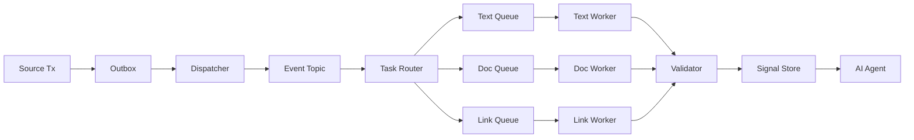

*This is Part 6 of our 7-part technical series on Context Layers for AI Agents. Before reading this deep dive, start with [Part 3: The 4 Layer Context Architecture](/en/tech/building-an-effective-context-layer-part-3), [Part 4: Layer 1 Operational Data](/en/tech/building-an-effective-context-layer-part-4), and [Part 5: Layer 2 Analytical Metrics](/en/tech/building-an-effective-context-layer-part-5).*

**TL;DR**: Layer 3 turns expensive derived work into versioned signals before the AI Agent needs it. Each signal remains linked to its source evidence, extractor version, confidence, freshness, and review state. A reliable pipeline publishes work through a transactional outbox, processes idempotent tasks, validates results, and exposes `ready`, `pending`, `stale`, `failed`, or `review_required` instead of pretending every model output is a fact.

## Janet disputes an invoice

Janet, a customer contact in the CRM, sends an email with a scanned invoice attached:

> The setup charge on page two does not match what we agreed. Can you check it before I approve this invoice?

A user later asks the AI Agent: *"What is Janet disputing, and which invoice line supports her claim?"*

Layer 1 already stored the email and attachment. The answer still requires derived work. The system must recognize a billing dispute, read the scanned invoice, extract its line items, and connect Janet's phrase “setup charge” to the best matching row.

The AI Agent could perform all of that after the user asks. That puts document parsing, model latency, provider availability, and retry behavior inside the conversation. Layer 3 moves suitable work earlier. It processes the email and invoice after ingestion, then stores a result that the AI Agent can read through one narrow contract.

The result is not unquestionable truth. It is a **versioned derived claim** supported by evidence.

## Define the signal before choosing the pipeline

A preprocessed signal is a claim derived from source records. It can be a sentiment label, an intent, a document field, an action flag, or a link between two pieces of evidence.

For Janet's email, useful signals might include:

1. The email intent is `billing_dispute`.
2. The invoice number is `INV-9042`.
3. The invoice contains a `Custom Setup Fee` for `$1,500`.
4. Janet's phrase `setup charge` probably refers to that line item.
5. The last claim needs review because the wording is not an exact match.

That distinction matters. The invoice number may come directly from a document parser with high confidence. The disputed line item is an inference that joins the email to one invoice row. The second claim can be wrong even when every OCR token is correct.

A signal contract must preserve that difference:

```json
{
  "id": "sig_invoice_dispute_4820_v3",
  "tenantId": "tenant_42",
  "kind": "invoice_dispute",
  "status": "review_required",
  "value": {
    "invoiceNumber": "INV-9042",
    "candidateLineItem": "Custom Setup Fee",
    "candidateAmountUsd": 1500,
    "intent": "billing_dispute"
  },
  "source": {
    "messageId": "msg_4820",
    "messageVersion": 4,
    "attachmentId": "att_913",
    "contentSha256": "53d7...9a21"
  },
  "extractor": {
    "name": "invoice_dispute_linker",
    "version": "3.2.1",
    "model": "invoice-parser-plus-classifier",
    "promptVersion": "billing-link-v5"
  },
  "schemaVersion": 2,
  "evidence": [
    {
      "sourceId": "msg_4820",
      "quote": "The setup charge on page two does not match what we agreed."
    },
    {
      "sourceId": "att_913",
      "page": 2,
      "field": "line_items[3]",
      "text": "Custom Setup Fee  $1,500.00"
    }
  ],
  "confidence": {
    "overall": 0.78,
    "invoiceNumber": 0.99,
    "lineItemLink": 0.78
  },
  "producedAt": "2026-08-01T11:06:42Z",
  "expiresAt": "2026-08-08T11:06:42Z",
  "review": {
    "required": true,
    "state": "pending",
    "reason": "ambiguous_line_item"
  }
}
```

<figure class="article-screenshot-figure">
  
  <figcaption>Each task uses the smallest extraction method that passes its quality gate.</figcaption>
</figure>

The value can change when the source changes, the extractor improves, or a reviewer corrects it. Keep old versions for audit and comparison, then point consumers to the active version. Do not overwrite history and make a new prediction look as if it had always been true.

## Decide what to preprocess

Preprocessing is useful only when its expected value exceeds its full cost. Query frequency is one input, not the entire decision.

Use this model:

```text
preprocess when:

expected use
× avoided interactive latency and live compute cost

is greater than:

preprocessing cost
+ refresh cost
+ storage cost
+ privacy cost
+ expected error cost
```

Apply it to a few concrete cases:

1. **Invoice fields**: Preprocess when invoice questions are common and users need fast answers. Refresh when the attachment changes or the parser version is promoted.
2. **Action required classification**: Preprocess when the inbox uses it for routing. False negatives may be expensive, so include an abstention path.
3. **Full attachment extraction**: Do not run it for every newsletter by default. First classify the attachment or observe that the product regularly queries it.
4. **Rare investigation questions**: Compute them on demand when the chance of use is low and stale results would be misleading.

Freshness changes the calculation. A signal that becomes invalid whenever a message is edited may cost more to maintain than it saves. Privacy also changes it. Extracting and retaining sensitive identity or financial fields creates obligations even if no user ever asks for them.

> **Precompute measured value**: Move work earlier when it avoids a real interactive cost and can remain fresh, private, and accurate enough for the decision it supports.

## Publish work without losing it

Layer 1 must store Janet's message and arrange its follow up work as one reliable operation. Writing the message and then publishing to Kafka or SQS creates a dual write problem. The process can crash after the database commit but before the publish, leaving a message that will never be enriched.

Use a [transactional outbox](https://docs.aws.amazon.com/prescriptive-guidance/latest/cloud-design-patterns/transactional-outbox.html):

1. Save the source record and an outbox row in the same database transaction.
2. Let a dispatcher publish committed outbox rows to the event system.
3. Mark each outbox row as published only after the broker confirms it.
4. Expect duplicate delivery and make every consumer idempotent.

One event also does not automatically run every extractor. Consumers in one [Kafka consumer group](https://kafka.apache.org/43/javadoc/org/apache/kafka/clients/consumer/KafkaConsumer.html) divide records among themselves. Workers on one SQS queue compete for a message while it is hidden by the [visibility timeout](https://docs.aws.amazon.com/AWSSimpleQueueService/latest/SQSDeveloperGuide/sqs-visibility-timeout.html).

Use explicit fanout. A task router can publish one task per signal type. With Kafka, each logical extractor can use its own consumer group or task topic. On AWS, an [SNS topic can fan out to separate SQS queues](https://docs.aws.amazon.com/sns/latest/dg/sns-common-scenarios.html).


```mermaid
flowchart LR
    Source["Source Tx"] --> Outbox["Outbox"]
    Outbox --> Dispatch["Dispatcher"]
    Dispatch --> Events["Event Topic"]
    Events --> Router["Task Router"]
    Router --> TextQ["Text Queue"]
    Router --> DocQ["Doc Queue"]
    Router --> LinkQ["Link Queue"]
    TextQ --> Text["Text Worker"]
    DocQ --> Doc["Doc Worker"]
    LinkQ --> Link["Link Worker"]
    Text --> Check["Validator"]
    Doc --> Check
    Link --> Check
    Check --> Store["Signal Store"]
    Store --> Agent["AI Agent"]
```

The router can also express dependencies. The line item linker should wait for both the email intent and invoice fields. That is different from pretending three independent workers can all consume the same queue message.

## Make retries safe

Queues normally provide at least once processing under failure. A worker may finish an external request, crash before acknowledging the task, and receive the same task again. Both [Celery](https://docs.celeryq.dev/en/stable/userguide/tasks.html) and [BullMQ](https://docs.bullmq.io/patterns/idempotent-jobs) recommend idempotent jobs when retries are possible.

Build a deterministic job key from:

```text
tenant
+ source identity
+ source version
+ signal kind
+ extractor version
+ schema version
```

The worker can then upsert one result for that key. Repeating the task does not create a second active claim or repeat a downstream side effect.

Failure handling should be explicit:

1. Set timeouts on every model, parser, and storage call.
2. Retry temporary failures a limited number of times with backoff and jitter.
3. Do not retry an invalid file forever. Record a terminal failure and retain enough detail to diagnose it.
4. Move exhausted tasks to a dead letter path that operators can inspect and replay.
5. Persist partial provider results by record identity. Bedrock batch jobs can finish as `PartiallyCompleted`, and their result manifest separates successful and failed records.
6. Acknowledge work only after its result or terminal failure is durable.
7. Monitor outbox age, queue age, success rate, retry count, dead letter volume, and time from source ingestion to usable signal.

Bedrock exposes processed, successful, and failed record counts in the [batch result manifest](https://docs.aws.amazon.com/bedrock/latest/userguide/batch-inference-results.html). The signal store should preserve the same distinction instead of treating a completed provider job as proof that every record succeeded.

When Janet edits the email or uploads a corrected invoice, do not silently serve the old result. Mark signals derived from the previous source version as `stale`, publish new tasks, and keep the old evidence available until retention policy removes it.

## Choose the smallest method that passes

Start with the simplest method that can meet the measured requirement:

1. Use rules for exact and stable conditions.
2. Use a document parser for invoice fields and table structure.
3. Use a trained classifier for a narrow label set.
4. Use a language model when the task requires flexible reasoning or linking evidence across sources.

[Amazon Textract AnalyzeExpense](https://docs.aws.amazon.com/textract/latest/dg/expensedocuments.html) and [Google Document AI Invoice Parser](https://cloud.google.com/document-ai/docs/processors-list) return invoice fields and line items. That work includes OCR, layout analysis, field extraction, and normalization. It is more than plain text recognition.

A classifier such as DistilBERT can be efficient, but it is not automatically correct for customer support language. The original [DistilBERT paper](https://arxiv.org/abs/1910.01108) reports strong results on its evaluated tasks, not perfect performance on every domain. Compare candidates on your own labeled messages.

The decision should come from an evaluation, not from the model category. A larger model may handle a difficult evidence linking task better. A specialized parser may be cheaper and more consistent for standard invoices. A rule may outperform both when the source field is exact.

## Price batch and caching separately

The following claims were checked against provider documentation on August 27, 2026. Prices and supported models change, so production cost models should retain the model, region, price date, input volume, output volume, and measured cache hits.

### Amazon Bedrock

[Amazon Bedrock pricing](https://aws.amazon.com/bedrock/pricing/) lists batch inference at 50 percent below on demand pricing for selected models. It is not a universal discount for every model.

Current Bedrock jobs accept a [timeout from 24 through 168 hours](https://docs.aws.amazon.com/bedrock/latest/APIReference/API_CreateModelInvocationJob.html). They can complete, partially complete, fail, stop, or expire. Design the pipeline around record results, not only the job status.

Bedrock [prompt caching is available only for on demand inference](https://docs.aws.amazon.com/bedrock/latest/userguide/prompt-caching.html). It is not supported by the Bedrock batch inference API. Do not add the batch discount and cache discount together.

### Anthropic

The direct Anthropic [Message Batches API](https://docs.anthropic.com/en/docs/build-with-claude/batch-processing) charges 50 percent of standard API token prices. Batches expire if processing does not complete within 24 hours, although most finish sooner according to Anthropic.

Anthropic supports prompt caching inside Message Batches, and the discounts can stack. Cache hits are still best effort because requests run asynchronously and may execute in any order. Anthropic reports typical batch cache hit rates from 30 percent through 98 percent. Use the longer cache duration when appropriate, preserve stable prompt prefixes, and measure actual cache reads.

### OpenAI

The [OpenAI Batch API](https://developers.openai.com/api/docs/guides/batch) provides a 50 percent discount relative to synchronous APIs, a separate rate limit pool, and a 24 hour completion window.

OpenAI [prompt caching](https://developers.openai.com/api/docs/guides/prompt-caching) can discount eligible reused input tokens by up to 90 percent on supported models. That is not a 90 percent reduction in the entire request. Output tokens remain separate, prefixes must meet the model's minimum cacheable length, and the newest models described in the guide charge for cache writes. The Batch guide does not promise a combined cache outcome, so model the batch discount and cache behavior separately, then verify cached token reporting for the exact endpoint and model.

### Document parsers

Document services often charge by page or document rather than token. As of the same date, [Textract pricing](https://aws.amazon.com/textract/pricing/) lists AnalyzeExpense at `$0.01` per page for the first one million pages in US West, Oregon. [Google Document AI pricing](https://cloud.google.com/document-ai/pricing) lists Invoice Parser at `$0.10` for a document containing one through ten pages.

Those prices are not direct quality comparisons. Measure field accuracy, supported layouts, region, language, latency, and review load before selecting a service.

## Promote extractors through evaluation gates

A signal is useful only when its errors are understood. Build a labeled test set from the document types and messages the product actually receives. Include poor scans, unusual layouts, long invoices, multiple currencies, edited messages, multiple languages, and ambiguous references such as Janet's “setup charge.”

Measure each task according to its failure mode:

1. **Classification**: Track precision, recall, and F1 for every important class. A single overall accuracy score can hide poor recall for rare billing disputes.
2. **Document fields**: Track exact or normalized match for invoice number, date, currency, total, and each line item. Also validate arithmetic relations such as subtotal plus tax equaling total.
3. **Confidence thresholds**: Measure precision and recall at each threshold. [Google Document AI evaluation](https://docs.cloud.google.com/document-ai/docs/evaluate) exposes this tradeoff directly.
4. **Important slices**: Break results down by language, scanner quality, document template, source channel, customer segment, and attachment type.
5. **Abstention**: Measure how often the extractor returns `review_required`, plus the error rate among the results it accepts. Lower coverage can be the correct choice for costly decisions.
6. **Downstream outcomes**: Test whether the AI Agent selects the right invoice, cites the correct evidence, avoids false escalation, and helps the user complete the task.

Before promotion, run the new extractor beside the active version. Compare both on the same sources, inspect regressions, and backfill a bounded sample. Promote only after it meets the quality, cost, latency, and review rate gates defined for that signal.

Production monitoring completes the loop. Track changes in input distribution, field missing rates, confidence, reviewer corrections, failure states, and downstream agent success. A model can pass an old test set and still drift as customer language or document layouts change.

[Anthropic's evaluation guidance](https://platform.claude.com/docs/en/test-and-evaluate/develop-tests) and the [OpenAI Evals guide](https://developers.openai.com/api/docs/guides/evals) both start from explicit success criteria and representative test data. Layer 3 should apply that discipline to every promoted extractor.

## Store each result by its access pattern

Do not place one unbounded extraction document on the message row and call the storage design complete.

1. **Typed relational fields**: Use columns and constraints for stable values that the product filters or joins often, such as signal kind, status, tenant, source identity, source version, schema version, confidence, and produced time.
2. **JSONB details**: Use PostgreSQL JSONB for signal specific values and evolving evidence metadata. It is queryable and supports [GIN indexes](https://www.postgresql.org/docs/current/datatype-json.html), but each index should match a real query.
3. **Large artifacts**: Keep original PDFs, page images, full OCR blocks, and provider response files in object storage. Store a content hash, location, retention state, and access policy in the relational record.
4. **ML feature stores**: Use Feast or Tecton when the same numerical features must be consistent across training, batch prediction, and low latency serving. They are not required for ordinary invoice JSON. Feast documents its online and offline stores in its [feature store configuration](https://docs.feast.dev/reference/feature-repository/feature-store-yaml), while Tecton describes shared training and serving contracts through [Feature Services](https://docs.tecton.ai/docs/reading-feature-data/feature-services).

The active signal can be a small relational pointer to an immutable version. This makes rollback cheap and lets auditors reconstruct what the AI Agent saw at a given time.

Tenant authorization and retention apply to every copy. A source deletion must propagate to active signals, indexes, caches, evaluation samples, and stored artifacts. Treat attachment content as untrusted evidence, not as instructions that a model or AI Agent should follow.

## Give the AI Agent honest operating states

The AI Agent should never infer readiness from a missing row. Return one explicit state with a defined fallback:

| State | Meaning | AI Agent behavior |
|---|---|---|
| `ready` | Current source version passed validation | Use the value and cite its evidence |
| `pending` | Work is queued or running | Explain that extraction is still running, then offer a bounded live fallback if the request cannot wait |
| `stale` | A newer source or extractor version exists | Disclose the timestamp and avoid presenting the old value as current |
| `failed` | Processing reached a terminal failure | Return the failure category, use raw source data if safe, or ask for a clearer document |
| `review_required` | Evidence is ambiguous or confidence is below the decision threshold | Present candidates and request human confirmation before a costly action |

The tool contract can return the active signal, source freshness, evidence, and retry guidance. It should not expose queue names or provider response formats to the AI Agent.

## Returning to Janet's invoice

Now return to the opening question: *"What is Janet disputing, and which invoice line supports her claim?"*

The CRM does not wait for the AI Agent to discover the invoice for the first time:

1. Layer 1 stores Janet's email, attachment, and an outbox event in one source transaction.
2. The dispatcher publishes the committed event.
3. The task router creates separate intent and document tasks.
4. Idempotent workers classify the email and extract invoice fields.
5. The linking worker compares Janet's words with the extracted rows.
6. Validation finds two setup related rows and marks the link `review_required` at `0.78` confidence.

The AI Agent answers:

> Janet is disputing a setup charge on invoice `INV-9042`. The strongest match is `Custom Setup Fee` for `$1,500` on page two, but the signal requires review because the invoice contains another setup related row. I have cited both the email sentence and invoice row. Confirm the correct row before changing the invoice.

A reviewer confirms the `$1,500` row. The system writes a new signal version with the review decision, updates the active pointer, and changes the operating state to `ready`. The AI Agent can now use the approved claim without hiding how it was derived.

Layer 3 removed repeat document work from the conversation, but it did not remove uncertainty. It made uncertainty visible and manageable.

## The Layer 3 operating model

Layer 3 is not a folder of model outputs. It is the contract for derived claims that the product can reproduce, evaluate, refresh, and safely decline to use.

> **The Layer 3 Rule**: Precompute valuable derived claims before the conversation, preserve their source evidence and versions, publish work reliably, and let the AI Agent distinguish current results from pending, stale, failed, or uncertain ones.

Continue to [Part 7: Building Evidence Backed Memory](/en/tech/building-an-effective-context-layer-part-7) to explore how organizational memory and relationship history build on these governed signals.
