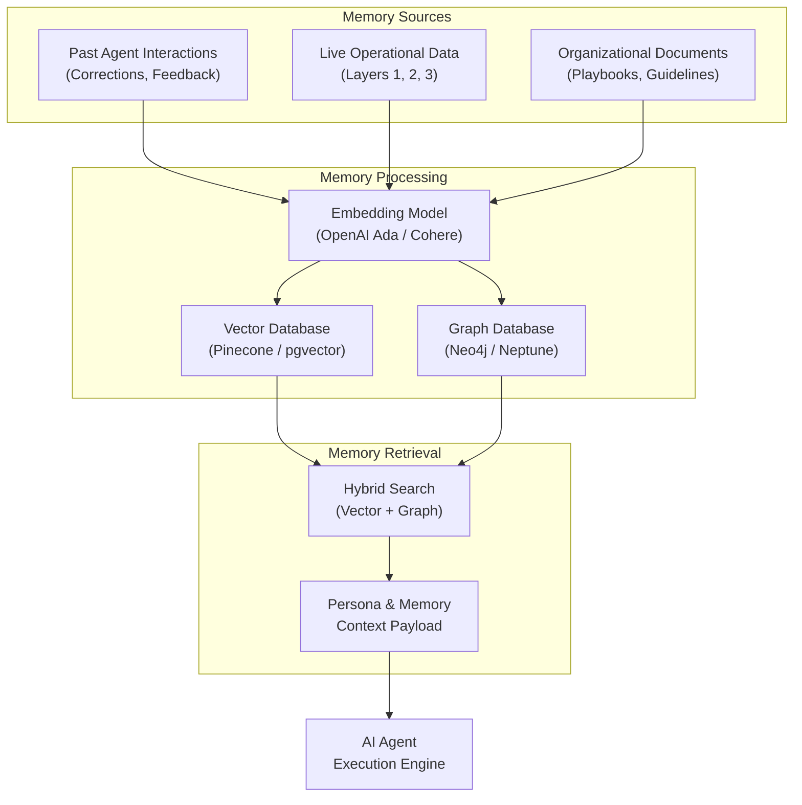

*This is Part 7, the final installment of our 7-part technical series on Context Layers for AI Agents. Before reading this deep dive, make sure to review [Part 3: Architecture Overview](/en/tech/building-an-effective-context-layer-part-3), [Part 4: Operational Data](/en/tech/building-an-effective-context-layer-part-4), [Part 5: Analytical Metrics](/en/tech/building-an-effective-context-layer-part-5), and [Part 6: Preprocessed Signals](/en/tech/building-an-effective-context-layer-part-6).*

---

<figure class="article-screenshot-figure">
  
  <figcaption>Layer 4 Semantic Memory: Long-term organizational memory, persona voice alignment, hybrid vector search, and Graph RAG entity links.</figcaption>
</figure>

## Why Do We Need This Layer?

The first three layers answer operational, analytical, and signal extraction questions. But the deepest, hardest questions cross **all your data, all your past interactions, and all your organizational knowledge** in ways that no single query or pre-computed metric can resolve.

Questions like:
* *"How do I usually answer?"*
* *"What do I think about Janet?"*
* *"What are our historical contract terms and relationship preferences with this account?"*

These are not database lookups. They require a **synthesized, concise representation** of accumulated knowledge, relationship dynamics, and personal communication style. Layer 4 is the brain that sits on top of everything else.

### The Golden Goal (and the Unsolved Frontier)

Layer 4 is the ultimate holy grail of context architecture. Rather than operating in isolation, it consumes and uses all the underlying layers (Layer 1 operational data, Layer 2 analytical metrics, and Layer 3 preprocessed signals) as raw material to construct a living representation of memory, intent, and persona.

Many architectural patterns have attempted to solve this challenge. A prominent example is [Andrej Karpathy's LLM Wiki proposal](https://x.com/karpathy/status/2039805659525644595), which envisions LLMs acting as knowledge compilers that continuously synthesize raw documents into interlinked markdown pages over time:

<figure class="article-screenshot-figure">
  <a href="https://x.com/karpathy/status/2039805659525644595" target="_blank" rel="noopener noreferrer">
    
  </a>
  <figcaption>Andrej Karpathy on LLMs as knowledge base compilers, continuously synthesizing raw documents into interlinked markdown wiki pages.</figcaption>
</figure>

While many approaches exist (including Graph RAG, vector memory stores, compiled wikis, and agent memory frameworks), **none have yet established a fully scalable, production-proven standard** for long-term agent memory without context decay or hallucination. Layer 4 remains the active frontier of context engineering.

---

## Benefits of This Layer

### Persona Alignment: Writing in Your Voice

Without Layer 4, every agent response sounds like generic AI output. With Layer 4, the agent knows that Janet's account manager writes in short, direct sentences with dry humor and no exclamation marks. The agent matches the user's **authentic communication style**, not a default corporate tone.

### Relationship Memory: Knowing Your History

The agent remembers that Janet prefers bullet-point summaries, previously agreed to 10% annual renewals, and is sensitive to unexpected setup fees. This is not information stored in a CRM field. It is accumulated knowledge from months of interactions, corrections, and feedback that the agent internalizes over time.

### Organizational Knowledge: Institutional Wisdom

Beyond individual relationships, Layer 4 captures company-wide knowledge: standard negotiation guidelines, pricing playbooks, escalation procedures, and contractual precedents. A new account manager joining the team gets the benefit of the organization's entire history without reading thousands of email threads.

### Continuous Evolution: The Agent Gets Better

Unlike Layers 1 through 3 (which reflect current data), Layer 4 **evolves**. When a user corrects an agent draft ("I would never say it that way"), the correction updates the persona model. When a deal closes with unexpected terms, the relationship memory updates. The agent improves with every interaction.

---

## What Tools Do I Need?

### Vector Databases: Semantic Similarity Search

The foundation of Layer 4 is **semantic search**: retrieving contextually relevant memories based on meaning, not exact keyword matches.

* **Pinecone / Weaviate / Qdrant**: Dedicated vector databases optimized for high-throughput similarity search. Best for production systems with millions of embeddings.
* **pgvector**: PostgreSQL extension that adds vector similarity search to your existing database. Best for teams that want to avoid a separate infrastructure component.



### Graph Databases: Relationship Entity Linking (Graph RAG)

Vector search finds semantically similar memories, but it does not understand **relationships between entities**. Graph RAG adds structured relationship traversal:

* **Neo4j**: Industry standard graph database. Model contacts, companies, contracts, and deals as nodes with typed edges (WORKS_AT, SIGNED, NEGOTIATED_BY).
* **Amazon Neptune**: Managed graph database for teams on AWS.

Graph RAG allows the agent to traverse: Janet (Contact) -> WORKS_AT -> Coca Cola Enterprise (Company) -> HAS_CONTRACT -> Contract #882 -> AGREED_TERM -> 10% annual renewal. This structured traversal is impossible with vector similarity alone.

### Embedding Models

Converting text into vector representations requires an embedding model:

* **OpenAI text-embedding-ada-002 / text-embedding-3-small**: Low cost, high quality embeddings. The default choice for most teams.
* **Cohere Embed**: Strong multilingual support if your data spans multiple languages.
* **Open-source alternatives (Sentence Transformers)**: For teams that need on-premise deployment or want to avoid vendor lock-in.

### Memory Logging: Dual Memory Streams

Layer 4 memory comes from two distinct sources that update continuously:

* **System Memory (Agent Feedback Loop)**: Every time a user corrects an agent draft, accepts a suggestion, or rejects a recommendation, that signal updates the persona and preference model. This is the agent learning from its own interactions.
* **Live Operational Memory**: Extracting long-term entity facts from ongoing real-world communications. When a new contract is signed or a pricing agreement changes, the relationship memory updates automatically from Layer 1 data.

### Knowledge Compilation Approaches

Approaches like Karpathy's LLM Wiki concept propose using LLMs as **knowledge compilers**: periodically synthesizing raw documents and interactions into clean, interlinked summary pages. Instead of retrieving 500 raw emails about Janet, the compiled wiki would contain a single, continuously updated page: "Janet H.: Prefers bullet points, 10% annual renewal terms, sensitive to setup fees, last interaction 3 days ago."

### The Core Trade-Off: Context Decay vs Hallucination

The fundamental tension in Layer 4 is between **stale memories and hallucinated memories**:

* Too conservative (never update memories): The agent operates on outdated facts. Janet changed companies 6 months ago, but the agent still references her old role.
* Too aggressive (synthesize aggressively): The agent starts compounding inferred facts into "memories" that were never explicitly stated. If Janet mentioned "budget concerns" once in passing, an aggressive memory system might synthesize this into "Janet's company has financial difficulties," which is a hallucination.

The mitigation is to **separate factual memory (explicit statements, signed contracts) from inferred memory (sentiment trends, behavioral patterns)** and weight them differently in retrieval.

---

## Common Pitfalls

### 1. Treating Memory as a Simple Key-Value Store

Storing memory as `{"janet": "likes bullet points"}` misses the temporal, relational, and contextual dimensions. Memories have timestamps (when was this learned?), confidence levels (how many signals support this?), and source attribution (was this stated explicitly or inferred?). **Memory is a graph, not a dictionary.**

### 2. Not Handling Memory Decay

A preference Janet expressed 18 months ago may no longer be valid. Without a decay mechanism, the agent treats all memories as equally current. **Implement recency weighting** in your retrieval: recent memories rank higher than old ones, and memories that conflict with newer data get automatically demoted.

### 3. Over-Relying on Vector Similarity Without Structured Relationships

Vector search will find that "Janet" and "Coca Cola Enterprise" appear in similar contexts, but it cannot tell you the structured relationship between them. **Combine vector search with Graph RAG** for queries that need relationship traversal ("What contracts does Janet's company have with us?").

### 4. Not Separating User Persona from Organizational Knowledge

The user's communication style and the company's negotiation guidelines evolve at different rates. User persona changes with every interaction; organizational knowledge changes quarterly at most. **Store them in separate memory stores** with different update frequencies and retrieval strategies.

### 5. Hallucination Amplification

If the memory layer contains a hallucinated fact ("Janet's company is struggling financially"), every future agent response that queries this memory will incorporate and reinforce the hallucination. Over time, a single bad inference compounds into a systematic bias. **Require explicit source attribution for every memory entry** and periodically audit high-confidence memories against source data.

---

## Real-Life Example: Janet's CRM in Action

In Janet's CRM system, a user prompts the AI Agent: *"Draft a rate renewal update email for Janet H."*

The agent queries Layer 4's semantic memory and Graph RAG store to retrieve everything it knows about this relationship:

### Layer 4 Semantic Memory Payload

```json
{
  "user_persona_style": "Direct, concise, dry humor, maximum 3 sentences, no exclamation marks",
  "relationship_memory": {
    "contact": "Janet H.",
    "preferences": "Prefers short bullet points, previously agreed to 10% annual renewals, sensitive to unexpected setup fees",
    "last_interaction": "2026-07-28T09:15:00Z",
    "sentiment_trend": "Positive, stable over last 6 months",
    "memory_confidence": 0.92
  },
  "graph_rag_entities": {
    "contact": "Janet H.",
    "company": "Coca Cola Enterprise",
    "active_contract": "Contract #882",
    "agreed_renewal_term": "10% annual adjustment",
    "contract_expiry": "2027-01-15"
  },
  "organizational_guidelines": {
    "renewal_policy": "Standard 10% annual adjustment for accounts above $200k ARR",
    "escalation_threshold": "Notify VP Sales for renewals above $500k ARR"
  }
}
```

### Agent-Generated Email

Based on the persona style, relationship memory, and contract details, the agent generates:

> Hi Janet. Attached is the 2026 rate update incorporating the 10% annual adjustment we agreed on. Let me know if you want to review the schedule on Tuesday.

The email matches the user's voice (direct, concise, 3 sentences, no exclamation marks), references the specific contractual terms (10% annual adjustment from Contract #882), and avoids mentioning setup fees (a known sensitivity). None of this context was in the user's prompt. All of it came from Layer 4.

---

## Conclusion: The Complete 4-Layer Context System

With all four layers operational:

* **Layer 1** unifies multi-vendor raw communications into a vendor-agnostic operational store with dedicated indices and idempotent event-driven ingestion.
* **Layer 2** pre-computes statistical metrics (p50/p90 latency baselines, deal velocity, ARR triage ratios) using Spark or dbt batch pipelines.
* **Layer 3** extracts sentiment, intent, and multimodal OCR signals asynchronously through Kafka worker pipelines with batch economics.
* **Layer 4** maintains long-term semantic memory, user persona, organizational knowledge, and relationship dynamics through vector search and Graph RAG.

A production Context Layer elevates an AI Agent from a fragile API wrapper into a resilient, data-aware intelligence platform capable of operating autonomously at scale.

The quality of your agent is not determined by the model you pick or the prompt tricks you apply. It is determined by the precision, structure, and depth of the context you provide. Build the layers. Measure with Evals. Iterate relentlessly.
