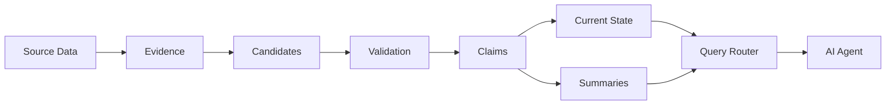
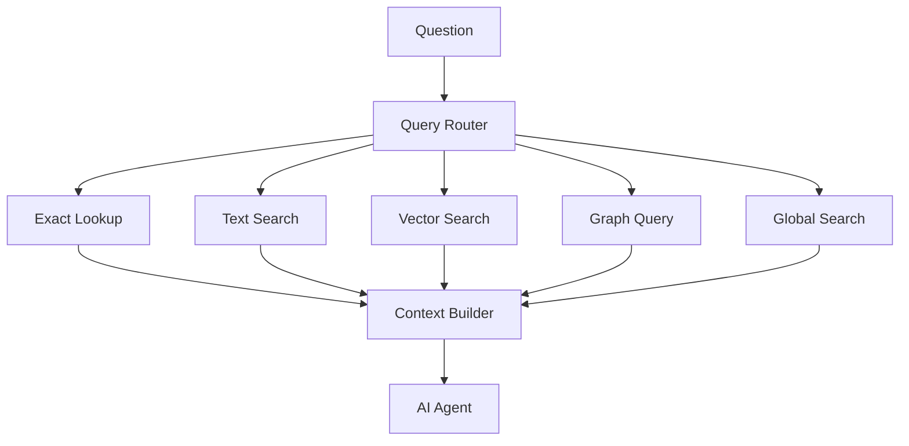

*This is Part 7, the final installment of our 7 part technical series on Context Layers for AI Agents. [Part 4: Operational Data](/en/tech/building-an-effective-context-layer-part-4) established the system of record. [Part 5: Analytical Context](/en/tech/building-an-effective-context-layer-part-5) separated metrics from business policy. [Part 6: Preprocessed Signals](/en/tech/building-an-effective-context-layer-part-6) made derived claims versioned and reviewable. This part builds long term memory without weakening those boundaries.*

**TL;DR**: Layer 4 is a derived and revisable memory and retrieval plane. It does not replace the operational system of record. Preserve source evidence, distinguish candidate claims from validated claims, track when each claim was true and when the system learned it, retain contradictions, and route each question to the retrieval path that can answer it. Give the AI Agent a small, cited context payload rather than one confident summary of everything.

## Draft Janet's renewal message

A user asks the AI Agent:

*"Draft a renewal message for Janet. Use the current terms and handle it the way she prefers."*

The request sounds simple, but its answer crosses several kinds of context:

1. **Authoritative state**: What adjustment, effective date, and response deadline are in the current renewal proposal?
2. **Source evidence**: What did Janet actually write in earlier emails and messages?
3. **Relationship memory**: Does Janet prefer a written summary, a call, or a particular order?
4. **Current interpretation**: Which preference is still valid if Janet changed her mind?
5. **Organizational guidance**: Which approved communication policy applies to this account?

The first question belongs to Layer 1. The current proposal is an operational record, not a memory inferred from old messages. Layer 2 may contribute a governed metric, such as whether the renewal is unusually delayed. Layer 3 may contribute a reviewed signal, such as a classified renewal objection. Layer 4 connects relevant evidence and revisable claims across time.

This boundary is the foundation of the layer:

> **Layer 4 does not become the source of truth**: It remembers evidence, interpretations, and relationships while exact current facts continue to come from their authoritative layer.

## Memory is a derived contract

A useful memory system does more than save text and search it later. It maintains a contract between raw history and the context sent to the AI Agent.

That contract has five distinct records.

### Immutable evidence

Evidence is the source material that supports a future claim: a message, contract version, meeting transcript, review decision, or approved policy. Immutable means that a stored version is not silently rewritten. A correction creates another version. A required deletion removes protected content from every derived store and leaves only the permitted deletion record.

Evidence should preserve its tenant, source identity, source version, event time, ingestion time, authorization scope, and a stable location or quote.

### Candidate claims

A candidate claim is a possible interpretation that has not passed its validation rule. For example:

*"Janet prefers a call before receiving a renewal summary."*

The claim may come from one message, an extractor, or a repeated pattern. It is not yet a fact merely because a model produced it.

### Validated claims

A validated claim has enough evidence and review for its intended use. Validation can mean an exact rule, several independent sources, explicit user confirmation, or human review. The rule should depend on the cost of being wrong.

A preference used to reorder a draft may need a lower threshold than a claim used to alter a contract. Some claims should never become active without an authoritative source.

### Current state projections

A current projection answers what the memory system believes now for a specific scope. It points to active validated claims while retaining the claims they refined, superseded, or contradicted.

The projection is convenient to query, but it is reproducible. If the underlying evidence or validation rule changes, the system can rebuild it.

### Derived summaries

A summary compresses several claims for a bounded purpose, such as preparing renewal outreach. It is useful context, not new evidence. Store which claim versions produced it, when it was generated, which summarizer created it, and when it must be rebuilt.

This separation prevents a common failure: an AI generated summary gets stored as truth, retrieved later, summarized again, and gradually loses the evidence that justified it.


```mermaid
flowchart LR
    Sources["Source Data"] --> Evidence["Evidence"]
    Evidence --> Candidate["Candidates"]
    Candidate --> Validate["Validation"]
    Validate --> Claims["Claims"]
    Claims --> Current["Current State"]
    Claims --> Summary["Summaries"]
    Current --> Router["Query Router"]
    Summary --> Router
    Router --> Agent["AI Agent"]
```

## Time has two meanings

Long term memory becomes unreliable when it stores only one timestamp.

Suppose Janet wrote on January 10:

> Please send a short written summary before we schedule a renewal call.

Her mailbox integration was disconnected, so the CRM did not receive that email until February 2.

The claim was valid from January 10 because that is when Janet expressed the preference. The system observed the claim on February 2 because that is when it learned about the email.

In plain language:

* **Valid time** answers: When was this true in the real world?
* **Observation time** answers: When did our system know it?

Both matter. If the user asks why the AI Agent drafted a message on January 20, the late email must not appear in the evidence available on that date. If the user asks today what Janet preferred in January, the email should appear.

Now suppose Janet writes on July 18:

> For this renewal, call me first. The written summary can follow.

The new claim does not erase the old email. It supersedes the earlier preference for this renewal from July 18 onward. The earlier claim remains correct for its own period and can still explain past behavior.

A minimal temporal claim might look like this:

```json
{
  "claimId": "claim_pref_204",
  "subjectId": "contact_1842",
  "predicate": "renewal_contact_order",
  "value": "call_before_summary",
  "scope": "renewal_2027",
  "validFrom": "2026-07-18T09:12:00Z",
  "validTo": null,
  "observedAt": "2026-07-18T09:13:04Z",
  "status": "validated",
  "evidenceIds": ["msg_7712"],
  "supersedes": ["claim_pref_119"]
}
```

The current projection points to `claim_pref_204`. It does not copy its value into an untraceable `janet_preferences` string.

## Keep contradictions as data

Conflicts are normal in a system that observes people and organizations over time. Two messages may describe different periods. Two sources may disagree. A new message may narrow an old rule rather than replace it.

Do not delete the losing claim. Connect claims through explicit relationships:

* `supports`: New evidence strengthens the same claim.
* `refines`: A claim narrows the scope or adds detail.
* `supersedes`: A newer claim replaces an older claim for a stated time and scope.
* `conflicts_with`: The claims cannot both be accepted for the same time and scope.

These links should have evidence too. An extractor can propose `supersedes`, but a validation rule or reviewer decides whether that relationship becomes active.

The distinction protects against two opposite errors. Blindly preferring the newest record can discard a durable contract term because somebody mentioned a hypothetical alternative yesterday. Blindly keeping the highest confidence record can preserve an old preference after Janet explicitly changed it.

Resolve a conflict using source authority, time, scope, evidence strength, and the cost of a wrong answer. When those rules cannot produce one safe result, return the conflict and let the AI Agent abstain or ask for confirmation.

[W3C PROV](https://www.w3.org/TR/prov-o/) offers a standard vocabulary for entities, activities, agents, generation, use, and derivation. A product does not need to adopt the complete ontology, but its core idea is important: a derived record should remain connected to what produced it and who was responsible.

## Design the memory write path

Memory quality starts before retrieval. A fast search index cannot repair claims that were stored without evidence or scope.

Use an explicit write path:

1. **Receive a source change**: Consume a committed Layer 1 event, a promoted Layer 3 signal, an approved policy version, or direct user feedback.
2. **Preserve the evidence reference**: Record source identity, version, time, authorization, and the exact span that supports the claim.
3. **Extract candidate claims**: Produce small typed claims instead of one broad profile.
4. **Resolve identity**: Link the claim to the canonical contact, account, thread, or policy from Layer 1.
5. **Compare existing claims**: Detect support, refinement, supersession, and conflict within the same predicate and scope.
6. **Validate for the intended use**: Apply a rule, confidence threshold, or human review based on the cost of error.
7. **Update projections**: Move the current pointer without rewriting claim history.
8. **Refresh indexes and summaries**: Rebuild every derived view affected by the new claim, correction, authorization change, or deletion.

Feedback needs the same discipline. A user editing one sentence does not prove a permanent persona preference. The edit may correct a fact, fit one recipient, or reflect the mood of that message. Store the correction as evidence, infer a narrow candidate claim, and broaden its scope only after repeated or explicit confirmation.

Authorization also travels through the write path. A memory derived from a private executive note must not become visible through a broad account summary. Every claim and summary inherits the most restrictive relevant source scope unless an explicit policy says otherwise.

## Route each question to the right retrieval path

There is no single memory query that works for every question. Route by the type of answer the user needs.

### Exact current facts

Question: *"What adjustment is in Janet's active renewal proposal?"*

Read the current proposal from Layer 1 through an indexed operational tool. Do not ask a vector index to rediscover the number from old emails.

### Exact words and identifiers

Question: *"Where did Janet mention a call before the summary?"*

Use lexical or full text search with tenant, contact, and time filters. Exact phrases, contract numbers, and names often need keyword matching.

### Semantically related evidence

Question: *"Which conversations describe how Janet likes renewal discussions to begin?"*

Use embedding retrieval to find messages that express the idea with different words. Apply authorization and metadata filters before context reaches the model. Rerank candidates against the actual question, then return source spans rather than vector scores alone.

Vector infrastructure is an implementation choice. [pgvector](https://github.com/pgvector/pgvector) can keep exact fields, authorization metadata, and vectors in PostgreSQL. Dedicated systems such as [Pinecone](https://docs.pinecone.io/guides/search/hybrid-search), [Weaviate](https://docs.weaviate.io/weaviate/search/hybrid), and [Qdrant](https://qdrant.tech/documentation/search/hybrid-queries/) add their own scaling, filtering, sparse retrieval, and operational tradeoffs. Choose after measuring recall, filtered latency, tenancy, update rate, and operating cost.

### Typed relationships

Question: *"Which renewal, account, and messages are connected to Janet?"*

Use relational joins or a graph traversal over canonical entities and typed relationships. A graph database such as [Neo4j](https://neo4j.com/docs/neo4j-graphrag-python/current/) or [Amazon Neptune](https://docs.aws.amazon.com/neptune/latest/userguide/feature-overview-data-model.html) can help when the product repeatedly explores deep or changing relationship paths. A graph database is not required when indexed relational joins serve the access pattern well.

### Corpus level questions

Question: *"What themes recur across all renewal objections this year?"*

This is different from looking up Janet's account path. It requires broad synthesis across a corpus.

[Microsoft GraphRAG](https://microsoft.github.io/graphrag/) is a specific research approach for this kind of question. Its indexer extracts entities and relationships from text, builds a hierarchy of communities, and generates community reports. Global Search uses those reports in a map and reduce process for questions about the corpus as a whole. Local Search combines graph data with linked source text for entity focused questions.

That is not the same as traversing `Janet -> Account -> Renewal`.

Microsoft's [official GraphRAG repository](https://github.com/microsoft/graphrag) now describes the project as a research project that is largely in maintenance mode. It accepts bug fixes and dependency updates rather than new features. Its indexing and global query paths require substantial model work, and the official documentation describes Global Search as resource intensive. Use it when a measured corpus level question justifies that cost, not as the default storage engine for all memory.

The original [GraphRAG paper](https://www.microsoft.com/en-us/research/publication/from-local-to-global-a-graph-rag-approach-to-query-focused-summarization/) reports gains over conventional RAG for a class of global sensemaking questions on corpora around one million tokens. That is useful evidence for those questions. It is not proof that GraphRAG solves changing preferences, contract authority, or every production memory workload.


```mermaid
flowchart TD
    Question["Question"] --> Router["Query Router"]
    Router --> Exact["Exact Lookup"]
    Router --> Lexical["Text Search"]
    Router --> Semantic["Vector Search"]
    Router --> Graph["Graph Query"]
    Router --> Global["Global Search"]
    Exact --> Context["Context Builder"]
    Lexical --> Context
    Semantic --> Context
    Graph --> Context
    Global --> Context
    Context --> Agent["AI Agent"]
```

## Build an auditable context payload

The query router should return a compact payload designed for the task. It should not return everything the system knows about Janet.

For the renewal draft, the payload might be:

```json
{
  "request": "draft_renewal_message",
  "subject": {
    "contactId": "contact_1842",
    "displayName": "Janet"
  },
  "authoritativeState": {
    "layer": 1,
    "recordId": "renewal_2027_v4",
    "status": "active",
    "annualAdjustmentPercent": 6,
    "effectiveDate": "2027-01-15",
    "responseDueDate": "2026-09-05",
    "sourceVersion": 4,
    "observedAt": "2026-08-27T09:55:00Z",
    "authorizationScope": "account_team"
  },
  "evidence": [
    {
      "evidenceId": "msg_7712",
      "sourceId": "gmail_msg_7712",
      "quote": "For this renewal, call me first. The written summary can follow.",
      "occurredAt": "2026-07-18T09:12:00Z",
      "observedAt": "2026-07-18T09:13:04Z",
      "authorizationScope": "account_team"
    },
    {
      "evidenceId": "msg_4401",
      "sourceId": "gmail_msg_4401",
      "quote": "Please send a short written summary before we schedule a renewal call.",
      "occurredAt": "2026-01-10T14:20:00Z",
      "observedAt": "2026-02-02T08:41:00Z",
      "authorizationScope": "account_team"
    }
  ],
  "claims": [
    {
      "claimId": "claim_pref_204",
      "value": "call_before_summary",
      "scope": "renewal_2027",
      "evidenceIds": ["msg_7712"],
      "validFrom": "2026-07-18T09:12:00Z",
      "validTo": null,
      "observedAt": "2026-07-18T09:13:04Z",
      "status": "validated",
      "authorizationScope": "account_team",
      "retrievalReason": "active preference for this renewal",
      "supersedes": ["claim_pref_119"]
    },
    {
      "claimId": "claim_pref_119",
      "value": "summary_before_call",
      "scope": "renewal_contact",
      "evidenceIds": ["msg_4401"],
      "validFrom": "2026-01-10T14:20:00Z",
      "validTo": "2026-07-18T09:12:00Z",
      "observedAt": "2026-02-02T08:41:00Z",
      "status": "superseded",
      "authorizationScope": "account_team",
      "retrievalReason": "explains the preference changed over time",
      "supersededBy": ["claim_pref_204"]
    }
  ],
  "summary": {
    "text": "For the current renewal, Janet asked for a call before the written summary.",
    "derivedFromClaimIds": ["claim_pref_204"],
    "generatedAt": "2026-08-27T09:56:00Z",
    "status": "current",
    "authorizationScope": "account_team",
    "retrievalReason": "compact drafting context"
  },
  "retrieval": {
    "routes": ["layer_1_exact", "claim_projection", "source_evidence"],
    "asOf": "2026-08-27T10:00:00Z",
    "conflictsReturned": 0,
    "nextCursor": null
  }
}
```

Every claim carries evidence, validity, observation time, status, authorization scope, and a reason it entered the context. The older preference is present because it explains a change, but its `superseded` status prevents the AI Agent from treating both preferences as current.

The annual adjustment and dates appear under `authoritativeState`. They are not copied into relationship memory or assigned a model confidence score.

## Return bounded context and honest uncertainty

Context assembly is a ranking and safety step, not a data dump.

For each request:

1. Apply tenant and authorization filters before retrieval.
2. Retrieve candidates from the selected paths.
3. Resolve current state and explicit conflicts.
4. Rerank evidence for the concrete task.
5. Prefer direct source spans over repeated summaries.
6. Fit the smallest useful set within the context budget.
7. Include freshness, missing data, and continuation state.
8. Abstain when authority, validity, or conflict cannot be resolved safely.

Recency is only one ranking signal. It can help with changing preferences and recent events. It should not make an old signed agreement less true merely because it is old. Current state comes from authority, valid time, scope, and supersession.

The [Generative Agents paper](https://arxiv.org/abs/2304.03442) combined relevance, recency, and importance when retrieving experiences for simulated agents. That is a useful early pattern, not a universal formula for business memory. A CRM must add source authority, authorization, temporal validity, and explicit conflict handling.

## Evaluate writes, retrieval, and answers separately

“The AI Agent remembered Janet” is not an evaluation result. A memory system can fail while writing a claim, retrieving evidence, resolving time, assembling context, or generating the final answer.

Measure each stage:

1. **Memory write quality**: Among candidate claims, how many useful claims were extracted, and how many accepted claims are actually supported?
2. **Retrieval recall**: For labeled questions, how often does the candidate set contain every required evidence item?
3. **Context precision**: How much of the context sent to the model is relevant to the question?
4. **Temporal update accuracy**: Does the current projection select the right claim before and after a late event or superseding statement?
5. **Conflict resolution**: Does the system retain both sides, choose the right current state when rules allow it, and expose unresolved cases?
6. **Attribution**: Can each answer statement be traced to the source span or authoritative record that supports it?
7. **Abstention**: Does the system decline to assert a preference when evidence is missing, stale, unauthorized, or unresolved?
8. **Latency and cost**: Measure write cost, index refresh time, retrieval latency, reranking cost, and tokens passed to the model.
9. **Final task quality**: Does the message use the correct terms, follow the current preference, avoid unsupported claims, and help the user finish the renewal task?

[LoCoMo](https://arxiv.org/abs/2402.17753) evaluates long conversations with factual, temporal, and causal questions. [LongMemEval](https://arxiv.org/abs/2410.10813) includes knowledge updates, temporal reasoning, preference recall, multisession recall, and abstention across long histories. Both show that longer context and ordinary RAG improve some cases but do not remove the problem.

[RAGAS](https://arxiv.org/abs/2309.15217) separates retrieval context quality, answer relevance, and faithfulness. Its automated scores can speed up experiments, but important renewal decisions still need labeled cases and human review.

Build evaluation cases from real memory transitions:

* A preference arrives late.
* A newer preference narrows an older one.
* Two sources conflict for the same period.
* A user loses access to one supporting message.
* A source deletion invalidates a summary.
* No source supports the requested claim.

Run the new write rule, embedding model, graph extractor, or ranking strategy beside the active version before promotion. Rebuild a bounded sample and compare both quality and cost.

## Returning to Janet's renewal

Now return to the opening request:

*"Draft a renewal message for Janet. Use the current terms and handle it the way she prefers."*

The CRM performs four explicit operations:

1. `getActiveRenewal` reads the 6 percent adjustment, effective date, and response deadline from Layer 1.
2. `getCurrentRelationshipClaims` returns Janet's active renewal preference and the superseded claim that explains the change.
3. `getClaimEvidence` returns the two authorized source quotes with valid time and observation time.
4. `buildDraftContext` assembles the bounded payload and records why each item was selected.

The AI Agent can draft:

> Hi Janet. I would like to walk through the renewal before I send the written summary, as you requested. The current proposal applies a 6 percent adjustment from January 15, 2027. Would Tuesday at 10:30 work for a short call?

The adjustment and effective date come from the active Layer 1 record. The order of communication comes from a validated Layer 4 claim supported by Janet's July message. The older January preference remains available for audit but does not control the draft.

If the July message were missing, unauthorized, or in unresolved conflict with another current instruction, the AI Agent should not guess. It should draft from authoritative terms only and ask the user which communication order to use.

## The frontier is compilation, not magic

Long term memory is still an active research area. Several useful approaches explore different parts of the problem.

[MemGPT](https://arxiv.org/abs/2310.08560) treats context management like moving data between limited working memory and external storage. [HippoRAG](https://arxiv.org/abs/2405.14831) combines a knowledge graph with Personalized PageRank for associative, multihop retrieval. Microsoft GraphRAG builds graph communities and summaries for broad corpus questions. None removes the need to define authority, time, provenance, authorization, and evaluation for a production CRM.

Andrej Karpathy's [LLM Wiki proposal](https://gist.github.com/karpathy/442a6bf555914893e9891c11519de94f) offers another useful frame. The LLM incrementally compiles raw sources into linked Markdown pages, updates existing synthesis, and records contradictions rather than starting from raw documents for every query.

<figure class="article-screenshot-figure">
  <a href="https://gist.github.com/karpathy/442a6bf555914893e9891c11519de94f" target="_blank" rel="noopener noreferrer">
    
  </a>
  <figcaption>The LLM Wiki keeps raw sources separate from an AI maintained, linked, and revisable knowledge layer.</figcaption>
</figure>

The durable lesson is not that every team should use Markdown, a vector database, or a graph database. It is that useful memory is maintained. New evidence must update existing understanding without destroying the history that made the update explainable.

## The Layer 4 operating model

Layer 4 is not a brain, a single profile document, or a collection of embeddings. It is the contract for turning retained evidence into revisable, authorized, and testable context.

It completes the four layer system:

1. Layer 1 preserves authoritative operational records and their history.
2. Layer 2 returns governed analytical evidence without hiding policy.
3. Layer 3 produces versioned derived claims with explicit operating states.
4. Layer 4 connects evidence and claims across time, resolves current memory, and routes each question to the right retrieval path.

> **The Layer 4 Rule**: Keep authoritative state in its source layer, preserve evidence behind every memory, model time and contradictions explicitly, and give the AI Agent only the authorized claims it can trace, evaluate, and safely use.
