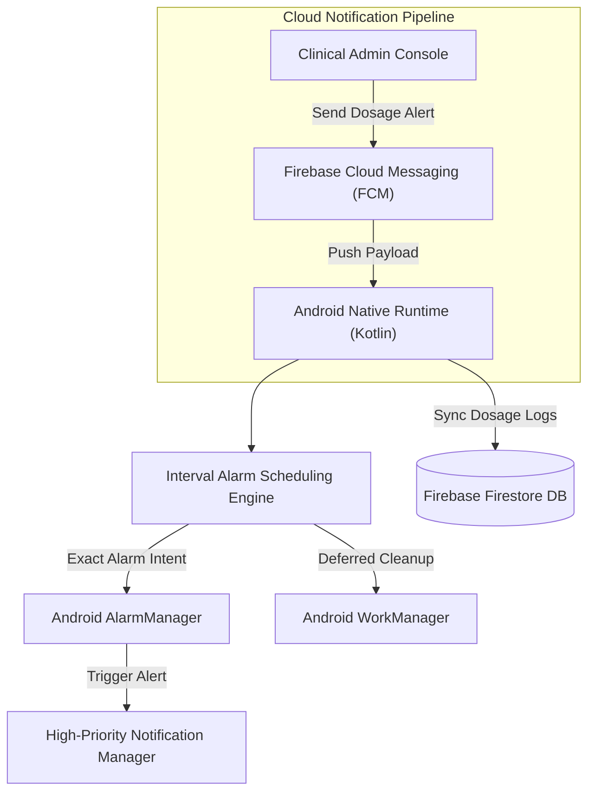
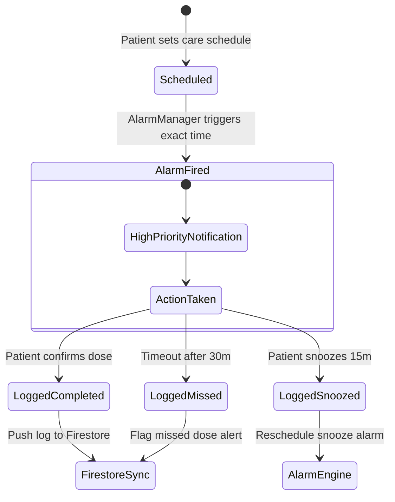

# EyeDrop Alarm Clock — Backend Architecture Design Doc

## Overview

**EyeDrop Alarm Clock** is an Android medical compliance platform engineered for post-operative ophthalmology care. The application guarantees strict interval alarm scheduling and synchronization with Firebase services.

---

## High-Level System Architecture

---

## Alarm Scheduling State Machine

---

## Key Design Decisions

**Exact Alarm Privileges (`setExactAndAllowWhileIdle`).** Modern Android OS battery optimization (Doze Mode) defers background execution. To prevent missed medical doses, the engine requires exact alarm permissions and executes via `AlarmManager.setExactAndAllowWhileIdle()`.

**Local-First Alarm Resilience.** Alarm triggers do not rely on an active internet connection. Medication schedules are calculated and saved in a local SQLite database, ensuring alarms fire even if the device is offline or in flight mode.

**Firestore Log Auditing.** Dosage logs are asynchronously synced to Firebase Firestore when network connectivity is restored, providing clinicians with verifiable patient adherence metrics.
