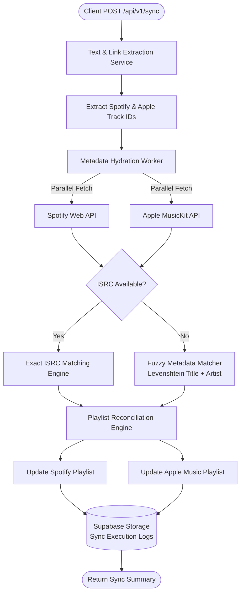
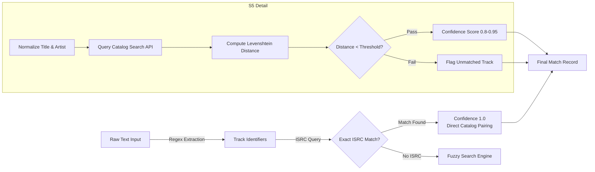
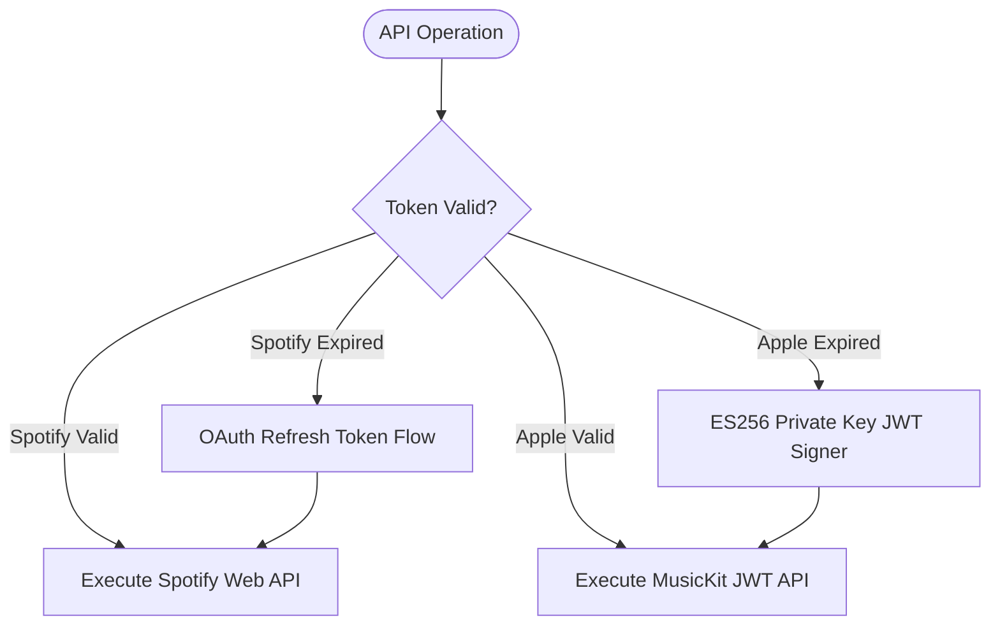

# Music Sync — Backend Architecture Design Doc

## Overview

Music Sync is a high-performance TypeScript backend service designed to extract music tracks from raw text and sync playlists bi-directionally between **Spotify** and **Apple Music**. It addresses catalog fragmentation across streaming services using strict ISRC resolution and fallback fuzzy matching.

---

## High-Level Request Pipeline

---

## Track Resolution Pipeline — State Transitions

---

## Authentication & Token Rotation Engine

---

## Key Design Decisions

**ISRC First, Fuzzy Second.** Catalog track IDs are strictly platform-dependent. The engine requires ISRC (International Standard Recording Code) matching as the primary key. Fuzzy string matching is only invoked on cache/ISRC miss to prevent false positive track pairings.

**Decoupled Extractor Architecture.** Link extraction runs as an isolated stateless parser prior to any API calls. This avoids consuming API rate-limit quotas on invalid or malformed input text.

**Asynchronous Token Self-Healing.** Spotify OAuth tokens and Apple MusicKit Developer JWTs are managed by a centralized singleton token service (`AuthTokenService`) that handles rotation and rate-limit backoff independently of HTTP route controllers.
