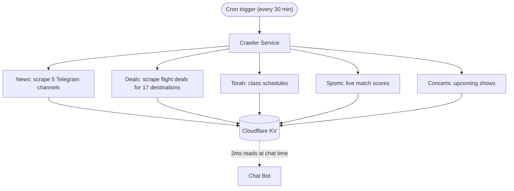
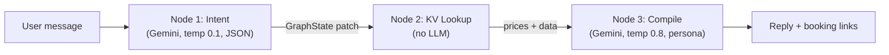
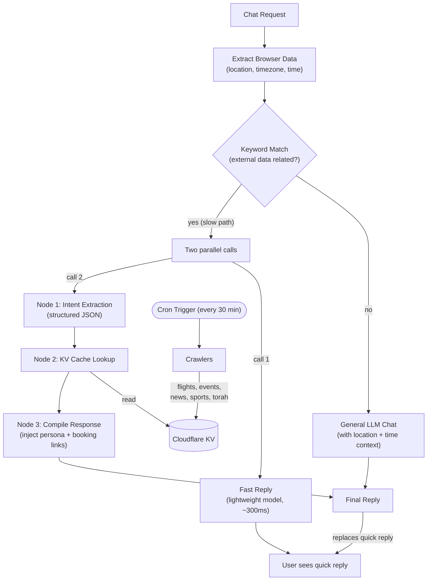

## What Is NehorAI

NehorAI is a Hebrew language AI assistant that helps users find vacation deals, concert tickets, Torah classes, sports scores, and breaking news: all through a natural chat interface. It runs as a Telegram bot, a web chatbot embedded on [nehorai.ai](https://nehorai.ai), and as a referral based vacation deal finder.

The core idea: instead of browsing five different websites to plan a weekend getaway, you just tell NehorAI "I want to fly somewhere warm in August" and it comes back with flight prices, hotel options, and booking links, all in the same conversational tone as your friend from the neighborhood.

<iframe src="https://nehorai.ai" width="100%" height="600" style="border:none;border-radius:12px;" loading="lazy" title="NehorAI live demo"></iframe>

---

## The Three Problems I Had to Solve

When I started building NehorAI, I thought the hard part would be connecting to an LLM API. It wasn't. The real challenges were:

### 1. How do you get fresh data?

An AI bot that gives you yesterday's flight prices is useless. But calling live pricing APIs during a chat conversation means 3 to 5 second response times: nobody waits that long in a chat.

### 2. How do you make it actually talk like a real person?

Hebrew slang is not something you can solve with a single system prompt. The bot has a specific persona: a street smart character from Bat Yam who swears on his mother's life that the deal he found you is the best one. Getting that voice right while also returning structured data (prices, links, dates) was a constant tension.

### 3. How do you keep it all fast and cheap?

Every LLM call costs money. Every LLM call adds latency. When a user asks "what concerts are happening this week?" you don't need a $0.01 Gemini call to figure out the intent: a string match on the word "concert" does the job.

---

## How I Solved Them: The Real Architecture

### The Crawl First, Chat Later Pattern

The single most important architectural decision: **never call a live pricing API during a chat**. Instead, scheduled crawlers run on [Cloudflare Workers Cron Triggers](https://developers.cloudflare.com/workers/configuration/cron-triggers/) every 30 minutes, scraping flight deals across 17 popular destinations, Torah class schedules, concert listings, sports scores, and news from five Telegram channels.

All of that data gets stored in [Cloudflare KV](https://developers.cloudflare.com/kv/) under predictable keys like `deals:latest`, `torah:places`, `concerts:latest`. When a user asks about flights to Larnaca in August, the bot reads from KV: a 2ms lookup instead of a 4 second API call.

The crawler includes a self healing mechanism: if the `deals:latest` key is missing from KV on any cron tick (whether from cold start, eviction, or a deployment mishap), a full daily crawl is forced regardless of the hour. No operator intervention needed.

---

## The Three Node Graph Engine

When a user sends a message about vacation deals, the bot doesn't just fire a single LLM call. It runs a three stage pipeline where each stage has a specific job and a specific model configuration:

**Node 1: Intent Extraction.** A low temperature Gemini call (temp 0.1, JSON mode) that extracts structured parameters: where does the user want to go, when, how many people, what style of vacation? No personality, no slang: pure data extraction. If the user said "I want to fly somewhere warm" but didn't specify a month, this node flags `needsMoreData: true` with `missingFields: ['month']`.

**Node 2: KV Cache Lookup.** Zero LLM calls. Takes the structured output from Node 1 (destination IATA code, dates) and fetches the matching data from KV. For vacation intent, it looks up `deal:v2:{IATA}:{outbound}:{return}`. For other intents (news, torah, concerts, sports), it pulls from the corresponding latest key.

**Node 3: Response Compilation.** A high temperature Gemini call (temp 0.8) that takes the raw data from Node 2 and wraps it in the NehorAI persona. This is where the bot says "Listen brother, I found you a deal to Larnaca: flights at 380 shekels direct with Wizz Air, hotel 4 stars for 220 a night, total damage is 1,600 shekels for two. I swear on the mezuzah this is the best price this month."

Each node returns `Partial<GraphState>` that gets merged into a shared state object. This makes every stage independently testable; you can unit test Node 1's intent extraction without caring about Node 3's persona output.

### Keyword Routing Before LLM

Not every message needs the full graph. The chat router runs a keyword pre filter first: if the message contains travel related words, it goes through the graph. If not, it falls through to a standard Gemini chat call with location and time context.

This avoids a model call just to classify intent on every single message. When someone says "hey what's up", a string match is faster and cheaper than a Gemini round trip.

### The Two Phase Quick Mode Trick

Even with the graph, the full pipeline takes 2 to 4 seconds. That's an eternity in a chat UI. So the client sends two requests in parallel:

1. A `quickMode: true` request that hits a tiny fast model (`gemini-2.0-flash-lite`) to generate an immediate in persona acknowledgment: "Hold on brother, checking deals for you right now..."
2. A `quickMode: false` request that runs the full graph pipeline.

The user sees the quick reply in ~300ms, then the full answer replaces it 2 to 3 seconds later. It feels instant.

### The Persona Is Injected Late

This was a deliberate design decision. The NehorAI street slang persona is only applied in Node 3 (the compilation step) and in the general chat fallback. Nodes 1 and 2 use neutral, structured prompts.

Why? Because when you ask Gemini to extract JSON parameters while also maintaining a persona, the structured output quality drops. The model starts putting slang in the JSON values. Separating "understand the intent" from "talk like a human" made both steps dramatically more reliable.

---

## Personalization Without a Questionnaire

Personalization does not have to begin with "where do you live?" The browser and request already carry a few useful hints: language, rough region, timezone, and local time. That is not GPS data or an exact address, but it is usually enough to make the first answer more relevant without stopping the conversation.

I add those signals to the bot's context. If someone writes "find me a Torah class," NehorAI can show classes in Holon and nearby cities before listing places across the country. When the location is too vague, the bot asks a follow-up question.

<figure class="article-screenshot-figure">
  
  <figcaption>A short request becomes a list of options in the relevant area.</figcaption>
</figure>

The same idea applies across a conversation. The graph remembers the destination, dates, number of travelers, and vacation style, then reuses them in the next request. The user does not need to repeat everything in every message.

<figure class="article-screenshot-figure">
  
  <figcaption>Conversation context stays available until the bot returns a bookable deal.</figcaption>
</figure>

---

## The Telegram News Pipeline

NehorAI also runs a Telegram channel ([@nehorainews](https://t.me/nehorainews)) that broadcasts news summaries via the [Telegram Bot API](https://core.telegram.org/bots/api). Every 30 minutes (during active hours, 8AM to 8PM Israel time, on even hours), the crawler scrapes five Israeli Telegram news channels, filters for items from the last hour, and sends them through Gemini with the NehorAI persona to generate a street slang news summary that gets posted to the bot's own Telegram channel.

At 8PM daily, it generates a "daily summary" of the top 10 stories from the last 12 hours.

The system tracks what was already sent using a `news:recently_sent_posts` KV key to avoid duplicate broadcasts, and stores per channel timestamps to only process genuinely new items.

---

## Why I Chose Each Tool

I was not looking for the most fashionable stack. I wanted tools that would keep the bot fast, inexpensive, and easy to maintain.

### Cloudflare KV over Redis or Postgres

I considered Redis and Postgres, but they were more than this workload needed. The crawler writes data every 30 minutes, while the bot reads it repeatedly. [Cloudflare KV](https://developers.cloudflare.com/kv/) fits that pattern: reads come from a nearby edge location in about 2ms, without a database server or connection pool. Inside a Worker, the lookup is just `env.DEAL_CACHE.get()`. The [KV documentation](https://developers.cloudflare.com/kv/) and [architecture overview](https://developers.cloudflare.com/kv/concepts/how-kv-works/) explain the details.

### Cloudflare Workers over AWS Lambda or Vercel Serverless

I chose [Cloudflare Workers](https://developers.cloudflare.com/workers/) because I did not want a chat message waiting for a cold start. Workers start in under 5ms, compared with hundreds of milliseconds or more for container-based functions. Cron Triggers also run the crawlers on the same infrastructure, so there is no separate scheduling service. Cloudflare documents both [Workers](https://developers.cloudflare.com/workers/) and the difference between [V8 isolates and containers](https://developers.cloudflare.com/workers/reference/how-workers-works/).

### Google Gemini 2.0 over OpenAI or Claude

This choice was practical: Gemini was fast and inexpensive for the bot's workload. `gemini-2.0-flash-lite` returns the first acknowledgment in about 300ms, while `gemini-2.0-flash` handles intent extraction and response generation. Its JSON mode is reliable enough for structured parameters, and Google Search Grounding helps with current information. The [Gemini documentation](https://ai.google.dev/docs) and [model overview](https://ai.google.dev/gemini-api/docs/models/gemini) cover the available models.

### Hono over Express or Fastify

The same reasoning led me to [Hono](https://hono.dev/). Express and Fastify are excellent in Node.js, but they bring pieces I do not need at the edge. Hono is small, uses Web Standards, and works with Workers without extra adapters. Hono has a short [framework guide](https://hono.dev/) and a dedicated [Cloudflare Workers guide](https://hono.dev/docs/getting-started/cloudflare-workers).

---

## Key Takeaways

**Pre fetch everything you can.** The crawl first pattern is the single biggest win. It turns a 4 second API call into a 2ms KV read and decouples data freshness from chat latency.

**Separate understanding from speaking.** Using different model configurations for intent extraction (low temp, JSON mode) vs. response generation (high temp, persona prompt) made both dramatically more reliable.

**String matching is underrated.** Before reaching for an LLM to classify intent, check if a regex or keyword set can do the job. It's free, it's fast, and it covers 80% of cases.

**Self healing beats monitoring.** The crawler checks for missing KV keys and auto recovers. I've never had to manually trigger a recrawl.

---

## What's Next

Building a Twitter/X bot that uses the same backend infrastructure (same crawlers, same KV data, same graph engine), but posts curated deal threads and news takes instead of responding to chat messages. The persona stays the same; the distribution channel changes.

---

## The Full System Flow

This diagram traces the logical path of every chat request, from the moment it arrives to the final reply. It also shows how the background crawlers keep the data fresh independently.

The flow breaks down into two independent cycles:

**Request cycle.** A chat message arrives. The system extracts browser data (rough location, timezone, local time) and runs a keyword regex check. If the message does not need external data, it goes straight to the LLM with location and time context and replies directly. If it does need external data (the slow path), the client fires two calls in parallel: one hits a fast lightweight model to give the user an instant acknowledgment, while the other runs the three node graph (extract intent, look up cached data from KV, compile a persona response with booking links). When the graph finishes, the full reply replaces the quick acknowledgment.

**Data cycle.** Every 30 minutes, scheduled crawlers scrape flight deals, event listings, sports scores, Torah class schedules, and news. All of it gets written to Cloudflare KV so the request cycle reads fresh data in milliseconds without ever calling a live pricing API during chat.

---

## This Is Still Not a Finished Product

NehorAI is not fully polished, and that was never my main goal. I built it to learn what happens when an AI bot leaves the demo and meets real users, changing data, latency, costs, and failures.

There are still rough edges, but it already works in the real world instead of being another chat window connected to a model. That is the point for me: learning through a live product how to build an AI system people can actually use.
