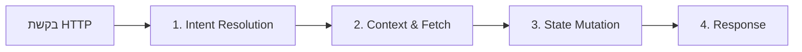
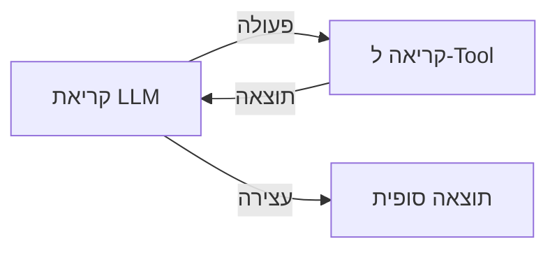
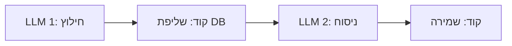
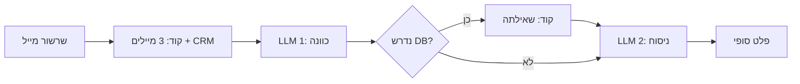

## בהלת ה-Agents והפטיש שרואה הכל כמסמר

כרגע, עולם הטכנולוגיה מרגיש כמו בהלת זהב. כולם רצים לבנות "AI Agent", מתוך חלום ליצור ישות אוטונומית קסומה שתקבל Prompt, תבין את העולם בעצמה, ותביא את המכה.

כאשר מופיעה טכנולוגיה חדשה, הטבע האנושי נכנס לפעולה: כשיש לך פטיש ביד, כל בעיה נראית כמו מסמר. בגלל ש-LLM יכול לקרוא ל-Tools, מפתחים פתאום רואים בכל בעיית תוכנה סיבה להפעיל לולאת Agent אוטונומית.


אנחנו חייבים לעצור ולהגדיר מה היצור המיסטי הזה שנקרא Agent באמת אומר, לעומת מה שאנשים בונים בפועל.

מאמר זה מתבסס באופן ישיר ומפנה לווידאו אנליזה המצוין בנושא Agents vs Workflows:

<iframe src="https://www.youtube.com/embed/AtYtuVTZCQU" width="100%" height="450" style="border:none;border-radius:12px;" loading="lazy" title="Agents vs Workflows Video Essay" allow="accelerometer; autoplay; clipboard-write; encrypted-media; gyroscope; picture-in-picture" allowfullscreen></iframe>

מבט ב[מדריך של Anthropic לבניית Agents אפקטיביים](https://www.anthropic.com/engineering/building-effective-agents) לצד הוידאו שלמעלה מציג שישה דפוסי ארכיטקטורה מרכזיים: Prompt Chaining, Routing, Parallelization, Orchestrator-Workers ו-Evaluator-Optimizer.

הנה הסוד הגדול של התעשייה: כמעט כל הדפוסים האלה הם **Workflows**, ולא Agents אוטונומיים.

---

## מהי מערכת LLM? נקודת קצה REST Endpoint דינמית

כדי להבין את ההבדל בין Agents ל-Workflows, צריך תחילה להבין מהי מערכת מבוססת LLM ברמת הארכיטקטורה.

בפיתוח תוכנה מסורתי, כשרכיב לקוח רוצה לבצע פעולה, הוא שולח בקשת HTTP ל-REST Endpoint מוגדר:

```
POST /api/v1/orders/cancel
Headers: Authorization: Bearer <token>
Body: { "orderId": "ord_99812", "reason": "changed_mind" }
```

בעולם המסורתי הזה:
1. נתיב ה-URL מזהה בדיוק את קטע הקוד שיש להריץ.
2. המפתח מגדיר מראש בקוד את שאילתות בסיס הנתונים, בדיקות המצב וקריאות ה-API.
3. השרת מחשב את התשובה בצורה דטרמיניסטית ומחזיר את התוצאה.

מערכת מבוססת LLM היא למעשה אבולוציה של אותו דפוס exact. במקום לדרוש מהמשתמש או מתוכנת הלקוח למפות את הכוונה שלהם ל-REST Endpoint ספציפי, המערכת מקבלת כוונה בשפה טבעית:

```
POST /api/v1/agent/chat
Body: { "message": "בטל לי את ההזמנה מיום שלישי שעבר אם היא עוד לא נשלחה." }
```

מתחת למכסה המנוע, המערכת מבצעת ארבעה שלבים מוכרים:
1. **Intent Resolution**: זיהוי מה המשתמש רוצה להשיג.
2. **Context & Data Fetching**: שליפת מידע מבסיסי נתונים פנימיים או ממשקי API חיצוניים.
3. **Execution Plan & Tool Calls**: החלטה אילו שינויים לבצע בעולם (למשל קריאה ל-API של זיכוי).
4. **Response Generation**: עיצוב והחזרת התוצאה למשתמש.



ההבדל בין תוכנה מסורתית לתוכנת AI אינו בביצוע הקוד עצמו, אלא ב**מי שכותב את לוגיקת הניתוח**. ב-REST API מסורתי, המפתח מגדיר מראש כל הסתעפות בקוד. במערכת LLM, המודל מנתח את הכוונה והמצב כדי לבחור באיזה נתיב ללכת.

---

## למה Agents אוטונומיים נכשלים בפרודקשן מהקופסה

בהנדסה קלאסית, כשמערכת נתקלת בבעיות ב-Production, אנחנו מאבחנים את גורם הכשל ומיישמים דפוסי ארכיטקטורה מוכחים:
* שאילתת בסיס נתונים איטית מדי עבור לקוח גדול? **מבצעים Database Sharding או מוסיפים אינדקסים.**
* API חיצוני נכשל תחת עומס? **מוסיפים Rate Limiters, Retries ו-Exponential Backoff.**

כשמפתחים מנסים להעלות לפרודקשן Agents אוטונומיים מלאים, שבהם ה-LLM מקבל מטרה ומקבל חופש להחליט על *כל מיקרו-פעולה* בלולאה פתוחה, הם פוגשים כשלים ששום Prompt Engineering לא יכול לפתור.



### 1. אינפלציית עלויות ו-Latency
כש-LLM מחליט על כל תת-צעד קטן באופן דינמי, פעולה שיכולה לקחת קריאת API בודדת לוקחת פתאום שבע קריאות. כל סיבוב מחייב שליחה מחדש של כל היסטוריית השיחה. זמן התגובה (Latency) מזנק מ-500 מילי-שניות ל-45 שניות, ועלות הטוקנים גדלה בצורה ריבועית.

### 2. Context Bloat ואובדן שליטה
כדי לשאול LLM "מה הצעד הבא שלך?" בצעד 6, חייבים להזין לו את היסטוריית צעדים 1 עד 5, כולל כל תשובות ה-JSON מהכלים. ככל שה-Context גדל (Context Bloat), הריכוז של המודל יורד. הוא נכנס בלולאות חזרתיות, שוכח אילוצים מוקדמים, או ממציא פרמטרים שלא קיימים.

### 3. בעיית "העובד החדש בכל בקשה" (חסר SOPs)
מתן חופש מוחלט ל-LLM בכל בקשה שקול להעסקת עובד חדש לחלוטין (לא משנה כמה ה-IQ שלו גבוה) ובקשה ממנו להמציא מחדש את תהליכי העבודה (SOPs) של החברה עבור כל פניית שירות. בכל ריצה הוא ימציא מתודולוגיה חדשה. ריצה אחת תהיה מבריקה, הריצה הבאה תיכשל בשקט, והשלישית תמציא נתוני לקוחות.

---

## Workflows: הפתרון של 90% מהמוצרים האמיתיים

זה מביא אותנו להבחנה המרכזית בין **Agent** ל-**Workflow**.

* **Agent**: ארכיטקטורה שבה ה-LLM שולט באופן דינמי בלולאת הביצוע. המודל מעריך את המצב, בוחר Tools, ומחליט מתי המשימה הושלמה.
* **Workflow**: ארכיטקטורה שבה מסלול הביצוע מוגדר מראש בקוד, וקריאות ל-LLM מבוצעות בנקודות מוגדרות ומובנות מראש לביצוע משימות עיבוד או ניתוח נקודתיות.



### האשליה של `SKILL.md` ו-Prompt Memory
מפתחים רבים מנסים לפתור את חוסר העקביות של Agents על ידי טעינת קובצי הנחיות (לרוב נקראים `SKILL.md`, קובצי מיומנות או System Prompts) לתוך ה-Context של ה-Agent.

בעוד שקובצי הקשר עוזרים, LLM הוא ביסודו **מודל סטטיסטי**. הזרקת הנחיות טקסט לפרומפט לא הופכת מודל הסתברותי למכונת מצבים דטרמיניסטית. להגיד ל-Agent בטקסט "תמיד תבדוק את סוג המנוי של המשתמש לפני קריאה לכלי X" עובד ב-85% מהמקרים. בתוכנת Production, 85% פירושו כשל.

### דוגמה מהעולם האמיתי: בניית רכיב לניסוח אימיילים (Email Drafter)
נניח שאנחנו בונים פיצ'ר שמנסח תשובות מותאמות אישית למיילים עבור צוות תמיכה.

אם נבנה את זה כ-**Agent אוטונומי**, ניתן ל-LLM כלים לקריאת מיילים, חיפוש בבסיס הנתונים של הלקוחות וניסוח תשובות, וניתן לו להחליט איך להתקדם בכל שלב.

ה-Agent יעמוד בפני החלטות לא מונחות בכל ריצה:
* האם לקרוא רק את שרשור המייל הנוכחי, או את 50 המיילים האחרונים מהשולח?
* האם לשלוף את נתוני ה-CRM של הלקוח?
* באיזה סגנון כתיבה להשתמש?
* איך לדרג את דחיפות המייל?

כל מיקרו-החלטה לא מונחית עולה ביוקר: לא רק ב-Latency ובעלויות טוקנים, אלא קודם כל ב**איכות התוצאה**.

כאשר מבקשים מ-LLM לקבל החלטות דינמיות בכל צעד, לכל החלטה יש אחוז שגיאה מסוים. גם אם נניח באופן אופטימי רמת דיוק של 99% לכל מיקרו-החלטה (רמת דיוק = 0.99), הסתברות ההצלחה הכוללת לאורך N החלטות יורדת בצורה אקספוננציאלית:

**שיעור הצלחת המערכת = 0.99<sup>N</sup>**

אם Agent מקבל 20 מיקרו-החלטות בלולאת ביצוע אחת, שיעור ההצלחה הכולל של המערכת יורד ל:

**0.99<sup>20</sup> ≈ 81.8%**

זה פירושו שיעור כשל של 18.2%. אם נגדיל את הלולאה ל-50 מיקרו-החלטות, דיוק המערכת צונח ל-**0.99<sup>50</sup> ≈ 60.5%**, כשל של כמעט 40% מהמקרים.

השארת ההחלטות האלה ל-LLM בצורה דינמית מייצרת הצטברות אקספוננציאלית של שגיאות.

אם נבנה את זה כ-**Workflow**, נבצע בדיקות במוצר אמיתי, נבין מהם החוקים שמביאים לתוצאה הטובה ביותר, ונבצר את החוקים האלה בקוד:
1. **שלב קוד**: קריאת השרשור הנוכחי (3 הודעות אחרונות) ושליפת סוג הלקוח מ-Postgres.
2. **קריאת LLM 1**: חילוץ הכוונה המרכזית ומידע חסר מהשרשור.
3. **שלב קוד**: אם הכוונה דורשת בדיקת סטטוס בחשבון, ביצוע שאילתת DB דטרמיניסטית.
4. **קריאת LLM 2**: הזרקת פרומפט הסגנון הנבחר יחד עם נתוני הלקוח שנישלפו, ליצירת הניסוח הסופי.



### תקן האמינות של אמאזון (Amazon-Grade Reliability)
כשבונים תוכנה שלקוחות משלמים עליה, אי אפשר למכור מוצר שהוא "50% מצוין, 30% בינוני, ו-2% מדהים". אנחנו לא מנהלים גלריית אמנות; אנחנו בונים תוכנה לפרודקשן. לקוחות מצפים ל**אמינות ברמה של אמאזון** (99.9% עקביות).

Workflows מספקים עקביות מכיוון שמהנדסים משמרים את ידע הדומיין בקוד דטרמיניסטי, ומשתמשים ב-LLM רק איפה שהוא מצטיין: הבנה וניסוח בשפה טבעית.

---

## סיכום: תפסיקו לבנות Agents, תתחילו לבנות מוצרים

בפעם הבאה שאתם יושבים לבנות פיצ'ר AI, תתנגדו לדחף להתחיל מ-Framework של Agent פתוח.

שאלו את עצמכם:
1. **האם אני יודע מהם השלבים הנדרשים לפתרון הבעיה ב-80% מהמקרים?** אם כן, כתבו את השלבים האלה בקוד. זה Workflow.
2. **איפה אקראיות מוסיפה ערך ואיפה היא גורמת לכשל?** השתמשו ב-LLM להבנה, סיכום ותרגום יצירתי. השתמשו בקוד לניתוח, הרשאות, ניהול מצב וקריאות API.
3. **האם הייתם שוכרים אדם להמציא מחדש את תהליך העבודה בכל פנייה?** אם לא, אל תבקשו מה-LLM שלכם לעשות את זה.

אלגנטיות הנדסית אמיתית אינה הפיכת המערכת למורכבת ואוטונומית ככל האפשר. היא בניית המערכת הפשוטה והדטרמיניסטית ביותר שפותרת את הבעיה של המשתמש בצורה אמינה. ב-90% מהמקרים, המערכת הזו היא Workflow.
