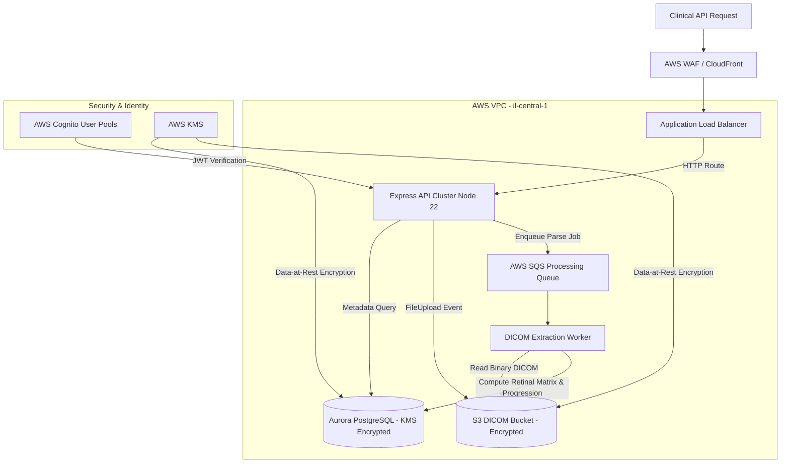
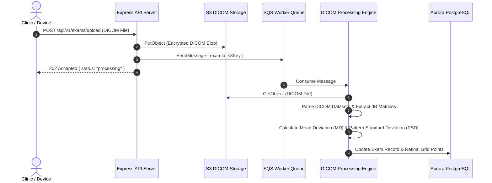

# Visual Field Analyzer — מסמך תכנון ארכיטקטוני (Backend Design Doc)

## סקירה כללית (Overview)

מערכת **Visual Field Analyzer (AL VF Analyzer)** הינה פלטפורמת ענן רפואית מרובת דיירים (Multi-Tenant) שנבנתה עבור המרכז הרפואי שיבא בתל השומר ומכון גולדשלגר לעיניים. המערכת מיועדת לעיבוד, פענוח וניתוח בדיקות שדות ראייה מסוג Humphrey Visual Field תחת תקני תושבות מידע ואבטחה רפואית מחמירים.

---

## ארכיטקטורת ענן ותשתית AWS (`il-central-1`)

---

## צינור עיבוד אסינכרוני לקובצי DICOM

---

## החלטות ארכיטקטוניות מרכזיות (Key Design Decisions)

1. **עמידה בתושבות מידע (AWS Israel `il-central-1`)**: בהתאם לרגולציה הרפואית בישראל, כל המשאבים (ECS, S3, Aurora) מופעלים בלעדית ב-VPC סגור באזור `il-central-1` ומוגדרים כקוד ב-Terraform.
2. **עיבוד אסינכרוני של DICOM דרך SQS**: פענוח קובצי DICOM מורכבים וחישוב מטריצות רגישות רטינלית דורשים משאבי עיבוד. העלאת הקובץ מחזירה תגובה מיידית `202 Accepted` והעיבוד מועבר ל-Worker ייעודי דרך SQS למניעת Timeouts.
3. **הפרדת דיירים ברמת Prisma**: כל שאילתות ה-DB מחייבות סינון לפי `tenantId` למניעת זליגת מידע רפואי בין מוסדות קליניים.
