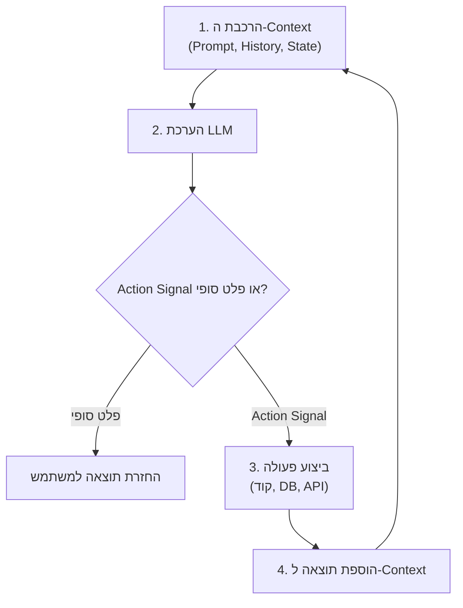

<figure class="article-screenshot-figure">
  
  <figcaption>ארכיטקטורת Context Layer עבור AI Agent, המרכזת מקורות מידע מבוזרים ל-Context מובנה ונקי עבור לולאת הביצוע המרכזית.</figcaption>
</figure>

## מה זה AI Agent בבסיס שלו?

אם נוריד רגע את ה-Buzzwords, את ה-Frameworks ואת מצגות ה-Marketing: מה זה AI Agent ברמת ה-System Architecture היסודית ביותר?

בסופו של דבר, AI Agent הוא פשוט execution loop הקוראת ל-Large Language Model (LLM) עם Context Window מסוים.

בכל איטרציה של הלולאה הזו:
* ה-LLM מקבל את ה-System Prompt, את ה-Conversation History ואת ה-Environment State הנוכחי.
* ה-LLM מעריך את ה-Context ומפיק Final Text Output או Structured Action Signal המציין שהוא רוצה לתקשר עם העולם החיצוני.
* המערכת מבצעת את הפעולה המבוקשת: בין אם מדובר בהרצת קוד, שאילתה ל-Database, קריאה ל-API או Data Retrieval.
* המערכת מוסיפה את התוצאה חזרה ל-Context Window וקוראת למודל מחדש.

זה הכל.

כל קונספט באקוסיסטם המודרני של Agents: בין אם מדובר ב-Model Context Protocol (MCP), ב-Custom Skills, ב-Event Hooks או בהגדרות Tools ייעודיות: הוא למעשה פשוט מעטפת מובנית סביב הדפוס הבסיסי הזה. המנגנונים הללו קיימים אך ורק כדי לארוז קלטים, לעצב הגדרות Tools ולהגדיר איך קריאות המודל מתממשקות עם מערכות חיצוניות.

---

## אז למה לא פשוט לתת ל-Agent את כל המידע בעולם?

האינסטינקט הטבעי אחרי שמבינים את הלולאה הזו הוא פשוט: אם Agent הוא רק כמו ה-Context שלו, למה לא להזין לו הכל? תן לו גישה לכל API, לכל Database, לכל מסמך, ותן לו להסתדר.

זה בדיוק איך הגל הראשון של Autonomous Agents נבנה. מתייחסים ל-LLM כאל עובד דיגיטלי בעל יכולות חשיבה אנושיות. מספקים לו מעטפת עצומה של Tools (כמו Gmail, Contacts, Calendar, CRM, File System) ומאפשרים למודל לנהל את ה-Planning באופן דינמי. בכל מחזור, ה-LLM בוחן את כל ה-Context שיש לו ומחליט מה הצעד הבא.

בפועל, הגישה הזו נשברת שוב ושוב במערכות Production. כפי שהורחב במאמר [Agents vs Workflows](/he/tech/agents-vs-workflows), מתן אפשרות ל-LLM לקבוע כל מיקרו-צעד מוביל לבעיות אמינות קשות.

<figure class="article-screenshot-figure">
  
  <figcaption>השוואה חזותית: LLM ללא Context התקוע בעומס נתונים מול LLM המועצם על ידי Context Layer מובנה המפיק ערך עסקי ברור.</figcaption>
</figure>

### למה Unconstrained Planning נכשל

ברמת ה-Neural Network הבסיסית, LLMs מאומנים למטרה אחת מרכזית: מינימיזציה של Loss Function המוגדרת על פי Next Token Prediction ברצף. המודל אינו מבצע אופטימיזציה טבעית לביצוע משימות ארוכות טווח, לשמירה על חוקים עסקיים או להבטחת נכונות של תוכנית פעולה כוללת. הוא מנבא Tokens על בסיס דפוסים הסתברותיים שנלמדו בזמן האימון.

לצלילה מתמטית עמוקה לאופן שבו מודלי שפה מעבדים רצפים ומחשבים הסתברויות, אנדריי קרפתי (Andrej Karpathy) מספק הסבר מעולה על מושגי היסוד של רשתות נוירונים ודינמיקת אימון:

<iframe src="https://www.youtube.com/embed/PaCmpygFfXo" width="100%" height="450" style="border:none;border-radius:12px;" loading="lazy" title="Andrej Karpathy - Intro to Large Language Models" allow="accelerometer; autoplay; clipboard-write; encrypted-media; gyroscope; picture-in-picture" allowfullscreen></iframe>

בגלל ש-Next Token Prediction אינו שקול לחשיבה ותכנון לטווח ארוך, התעשייה ניסתה מגוון פתרונות אלגוריתמיים כדי לתקן את בעיית ה-Planning:
* **Inference-Time Search Algorithms**: עטיפת ה-LLM בשיטות Monte Carlo Tree Search (MCTS) כגון [Tree of Thoughts (ToT)](https://arxiv.org/abs/2305.10601) או [Language Agent Tree Search (LATS)](https://arxiv.org/abs/2310.04406).
* **Process Reward Models (PRMs)**: אימון מודלי הערכה משניים כדי לדרג ולתת ניקוד לשלבי חשיבה באמצע הדרך, כפי שהוצג במחקר [Let's Verify Step by Step](https://arxiv.org/abs/2305.20050) של OpenAI.
* **Symbolic Solver Integration**: העברת ה-Planning המבני למנועי לוגיקה חיצוניים, כגון [LLM+P](https://arxiv.org/abs/2304.11477) או פריימוורקים של [LLM-Modulo](https://arxiv.org/abs/2402.01817).

במערכות Production, הפתרונות הללו נתקלים ישירות במגבלות קשות: פגיעה חריפה ב-Latency, פיצוץ בעלויות ה-Tokens, והעובדה שמודל שמעריך את הצעדים של עצמו עדיין נוטה ללולאות Hallucinations.

שפיכת הכל לתוך ה-Context Window לא הופכת את ה-Agent לחכם יותר. היא הופכת אותו לאיטי יותר, יקר יותר, ופחות אמין.

---

## חזרה ליסודות: מה באמת הופך Agent לטוב?

אם מתן מידע ללא הגבלה וחופש מוחלט ל-Agent לא עובד, מה כן?

בואו נחשוב על CPU ו-Memory. ברמת ה-Hardware הנמוכה ביותר, העברת Data דרך ה-Registers ושינוי Bits ב-Memory זהים לחלוטין: בין אם בונים אפליקציית Notes פשוטה, ובין אם מנוע חיפוש בשווי מיליארדי דולרים שהופך לנקודת ההתחלה של כל שאלה ביקום. הקסם אינו ה-Hardware כשלעצמו, אלא הידיעה אילו Bits מדויקים להזין ל-Pipes הללו בכל מיקרו-שנייה.

אותו סיפור בדיוק קורה עם AI Agents. ברמת המודל, כל Framework של Agents מעביר Tokens דרך אותם צינורות של כפל מטריצות. הגורם המבדל הוא אף פעם לא לולאת הביצוע או הסינטקס של ה-Framework: אלא **המידע עצמו**.

כעת נבחן דוגמה קונקרטית. דמיין שתיתן הנחיה פשוטה: *"שלח מייל לג'אנט ותגיד לה תודה על מתנת יום ההולדת שלה."*

בין אם אדם או AI מטפלים במשימה הזו, ביצוע מוצלח דורש מענה על שורה של שאלות ספציפיות:
* מי זאת ג'אנט?
* מה כתובת המייל שלה?
* איזו מתנה היא בעצם הביאה?
* באיזה Tone כדאי לכתוב את ההודעה?

<figure class="article-screenshot-figure">
  
  <figcaption>מעבר מכלים פרימיטיביים לארכיטקטורת Context רבת עוצמה: כמו מעבר מאת חפירה ידנית לדחפור D9 כבד.</figcaption>
</figure>

תן לעובד אנושי כלים פרימיטיביים ומידע עמום, והתפוקה שלו תהיה איטית ומלאת שגיאות. תן לאותו עובד Context ברור וכלים עתירי עוצמה: מעבר מאת חפירה ידנית לדחפור D9: והתפוקה שלו תצמח מעריכית. אותו דבר בדיוק נכון לגבי LLM. איכות הפלט פרופורציונלית ישירות לאיכות ה-Context שהוא מקבל.

---

## התכונות של Context Layer

אז איך זה נראה בפועל? נחזור לתרחיש המייל לג'אנט ונבחן שלוש גישות ארכיטקטוניות:

<figure class="article-screenshot-figure">
  
  <figcaption>ניווט בין מיילים מפוזרים ולא מאונדקסים לבין Context Curation ממוקד ב-Production.</figcaption>
</figure>

1. **Unstructured Data Dump**: ה-Agent מקבל גישה לקובץ Log לא מאונדקס או לקובץ נתונים גולמי. סריקת הטקסט הבלתי מעובד צורכת אלפי Tokens, פוגעת במיקוד של המודל, ומובילה לפספוס פרטים או לתשובות גנריות.
2. **API Tool Access סטנדרטי**: ה-Agent מקבל כלים עבור Gmail ו-Google Contacts. המודל צריך לבנות שאילתות חיפוש, לפענח אנשי קשר, לחפש ב-Email Threads, לחלץ את האזכור של המתנה ולסנתז את התוצאה. זה אומנם עובד, אך דורש איטרציות מרובות של ה-LLM, מעלה את צריכת ה-Tokens ומכניס נקודות כשל פוטנציאליות בכל שלב.
3. **פתרון ה-Context Layer**: מערכת ביניים מזהה ומחברת את הישויות המעורבות עוד לפני שלב יצירת הטקסט. היא שולפת את איש הקשר של ג'אנט, מושכת את חילופי המיילים האחרונים שקשורים ליום ההולדת, מחלצת את פרטי המתנה המדויקים, ומזריקה Context Block מאוחד ואוצר ישירות ל-Prompt. מעבר לכך, ה-Context Layer כבר יודע מראש איך המשתמש מעדיף להגיב על בסיס מאות ואלפי אינטראקציות עבר. כיוון שהידע ההתנהגותי הזה כבר נלמד ונשמר מראש, המערכת אינה צריכה לחשב או לגבש את סגנון התקשורת מחדש עבור כל בקשה.

### Core Properties של Context Layer

עם Context Layer ייעודי, המודל מקבל תפיסת מצב מלאה בקריאה אחת, מה שהופך חיפוש מורכב רב-שלבי ליצירה מדויקת ומיידית.

Context Layer הוא הארכיטקטורה המומחית האחראית על איסוף, סינון, חיבור וארגון נתוני הסביבה לכדי בלוקי Context אופטימליים עבור ה-LLM. תכונות הליבה שלו:
* **Entity Resolution**: זיהוי ושליפה אוטומטית של הישויות הרלוונטיות (Contacts, Email Threads, Records) עוד לפני שהמודל רואה את ה-Prompt.
* **Behavioral Pre-Indexing**: לכידת דפוסים נלמדים מאינטראקציות עבר (סגנון תקשורת, העדפות, קשרים חוזרים) כך שהמערכת לעולם לא מתחילה מאפס.
* **Context Curation**: בחירת נקודות הנתונים המדויקות והרלוונטיות בלבד, ועיצובן ל-Payload תמציתי שנכנס בצורה נקייה לחלון הקשב של המודל.
* **Single-Call Readiness**: הרכבת כל ה-Context הנדרש מראש כדי שה-LLM יוכל להפיק את הפלט הסופי בשלב יצירה אחד, ובכך לחסל לולאות חיפוש רב-שלביות.

---

## סיכום: למה אנחנו חייבים Context Layer?

בסופו של יום, Context Layer הוא ה-Gatekeeper עבור Data בכל נקודת אינטראקציה במערכת.

בלעדיו, ה-Agent שלך נאלץ לטבוע באלפי Tokens גולמיים ולא מאונדקסים, או לבזבז איטרציות מרובות, איטיות ויקרות בביצוע קריאות API פרימיטיביות רק כדי להבין את ה-Context הבסיסי של המשימה.

Context Layer יושב בדיוק בין ה-Environment Data של המערכת לבין ה-Model Execution Loop. הוא מבצע Entity Resolution אוטומטי, אוצר את העובדות הרלוונטיות בלבד, מאנדקס מראש העדפות התנהגותיות מהעבר, ומזריק Payload מאוחד מראש. הוא הופך לולאות חיפוש רב-שלביות ל-Single-Call Generations.

עכשיו כשמבינים מה זה Context Layer ולמה כל מערכת Agents ב-Production חייבת כזה, מגיעים לשאלה הקשה באמת: **איך מזהים מה אפקטיבי ואיך בונים כזה בפועל?**

המשך לקרוא ב[חלק 2: איך למדוד ולהעריך Context Layer אפקטיבי (Evals, Evals, Evals)](/he/tech/building-an-effective-context-layer-part-2) כדי להבין איך למדוד ולהעריך את המערכת שלך לפני שבונים כלים.
