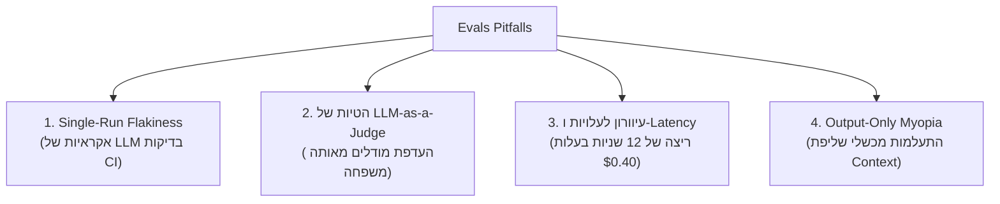

*זהו חלק 2 בסדרה הטכנית על Context Layers עבור AI Agents. אם עניין אותך לקרוא את המאמר הראשון, התחל מ[חלק 1: מה זה Context Layer ולמה אתה חייב כזה](/he/tech/building-an-effective-context-layer-part-1).*

---

<figure class="article-screenshot-figure">
  
  <figcaption>מערך ה-Evals ב-4 רמות: מבחני יחידה, בדיקות אינטגרציה, סימולציות Sandbox ומשוב אנושי.</figcaption>
</figure>

## מה זה בעצם אומר "אפקטיבי"?

בחלק הראשון של הסדרה, הגדרנו שכל AI Agent הוא בסופו של דבר execution loop המעבירה נתונים לצינורות של כפל מטריצות. הגורם המבדל בין Prototype שביר לבין מערכת Production אינו ה-Syntax של ה-Framework: אלא האיכות והמבנה של ה-Data שאתה מספק.

זה מוביל אותנו לאתגר המרכזי של חלק 2. כדי לבנות Context Layer אפקטיבי, אנחנו חייבים להתחיל מהשאלה החשובה ביותר בהנדסת AI: **איך אנחנו מזהים מה באמת אפקטיבי?**

נחזור לתרחיש העוגן שלנו: לבקש מסייען AI לשלוח מייל תודה לג'אנט על מתנת יום ההולדת שלה. לפני שכותבים שורת קוד אחת של הרכבת Context, חייבים להעריך איך נראים הצלחה וכישלון בדומיין הספציפי שלך:
* מה קורה אם ה-Agent שולח את המייל לג'אנט הלא נכונה?
* מה קורה אם הוא מודה על ספל קפה כאשר היא בעצם הביאה בלנדר?
* מה קורה אם הוא משתמש ב-Tone הלא נכון?

למוצרים שונים יש סדר עדיפויות שונה לחלוטין:
* **הגישה הקפדנית של Directory Strict**: עבור אפליקציית HR ארגונית, זיהוי ג'אנט הנכונה (ג'אנט מניהול מול ג'אנט המתמחה) הוא בסדר עדיפויות עליון. נמען שגוי הוא דליפת אבטחה חמורה.
* **גישת Human In The Loop**: עבור כלי לסייען ניהולי, לבחור מזהה פנימי שגוי בזמן טיוטת ההודעה זה נסבל, כל עוד המערכת מציגה את הבחירה לפני השליחה כך שהמשתמש יכול לתקן אותה ("תכננתי לג'אנט מניהול, לא לג'אנט המתמחה").
* **גישת Tone First**: עבור אפליקציה המבוססת על אישיות, העדיפות העליונה עשויה להיות ה-Tone הפסיבי אגרסיבי של ההודעה. מייל התודה צריך לפגוע ב-Tone הסיינפלדי המדויק ("תודה על המתנה, אשתדל למצוא לזה פינה בארון בסופו של דבר.") כדי שג'אנט תבין שהמתנה בסדר, אבל לא מעבר.

לפני שבונים פיצ'רים של Context, חייבים להעריך: אילו פונקציות קריטיות המערכת שלך חייבת לבצע בצורה מעולה, אילו פונקציות יכולות להיות רק בסדר, ואיפה אפשר להשלים עם פשרות?

---

## פילוסופיית "Evals, Evals, Evals"

אם סטיב באלמר היה מעביר כיום הרצאה מרכזית על הנדסת AI Agents, הוא לא היה צועק "Developers, developers, developers!". הוא היה מזיע דרך החולצה שלו וצועק מילה אחת: **Evals! Evals! Evals!**

<iframe src="https://www.youtube.com/embed/Vhh_GeBPOhs" width="100%" height="450" style="border:none;border-radius:12px;" loading="lazy" title="Steve Ballmer Developers" allow="accelerometer; autoplay; clipboard-write; encrypted-media; gyroscope; picture-in-picture" allowfullscreen></iframe>

בניית Context Layer ללא מערך Evaluation היא כמו ניווט ספינה ללא מצפן. אתה תבלה שבועות בבניית צינורות Graph RAG מורכבים או טריקים של Vector Retrieval מבלי לדעת אם באמת שיפרת את המערכת או הכנסת רגרסיות שקטות. הערכה (Evaluation) היא עולם שלם, אבל כשבונים Context Layers עבור Agents, הבדיקות מתחלקות לארבע רמות מעשיות.

---

## 4 הרמות של הערכת Agents ו-Context

<figure class="article-screenshot-figure">
  
  <figcaption>פירמידת 4 רמות ה-Evals עבור AI Agents: בדיקות יחידה, בדיקות אינטגרציה, סימולציות Sandbox ומשוב אנושי.</figcaption>
</figure>

### רמה 1: בדיקות דטרמיניסטיות ותכנותיות (Functional & Execution)

בדיקות ברמה 1 מתמקדות אך ורק במכניקת הביצוע. האם המערכת ביצעה את הפעולה המבוקשת מבלי לזרוק שגיאות או להפר מגבלות פורמט?

הבדיקות המרכזיות כוללות:
* **תקינות Payload ו-Syntax**: האם המודל הפיק JSON תקין התואם ל-Schema המבוקש?
* **קריאה ל-Tools (Tool Invocation)**: האם המערכת הפעילה את כלי היעד או עדכנה את מצב ה-Database?
* **מגבלות בטיחות ו-PII**: האם המערכת נמנעה מדליפת מידע רגיש או מפעולות מחוץ לתחום?

**תרחיש ג'אנט**: האם ה-Agent חיפש ב-Directory, מצא רשומה, ובנה Payload תקין של מייל מבלי לקרוס? בדיקה זו מאמתת שהמערכת רצה, אך היא אינה אומרת אם היא עשתה את הדבר הנכון.

```python
from pydantic import BaseModel, EmailStr, Field

class EmailPayload(BaseModel):
    recipient_email: EmailStr
    status_code: int = Field(..., equals=200)

def assert_execution(agent_output: dict):
    # Verifies valid JSON payload and 200 OK
    payload = EmailPayload(**agent_output)
    print("[PASSED] Functional Check: Valid payload")
```

---

### רמה 2: בדיקות הקשר ונאמנות (Data Fidelity ו-RAG Triad)

בדיקות ברמה 2 מעריכות את דיוק המידע ומניעת הזיות (Hallucinations) באמצעות עקרונות מתוך ה-RAG Triad:
* **Retrieved Relevance**: האם ה-Context Layer שלף מידע שבאמת מכיל את הפרטים הנדרשים לפעולה?
* **Groundedness / Faithfulness**: האם כל טענה בתשובה נשענת strictly על ה-Context שנשלף?
* **Answer Relevance**: האם הפלט מענה ישירות לכוונה של המשתמש מבלי להוסיף רעש לא רלוונטי?

**תרחיש ג'אנט**: האם המערכת חילצה את קבלת הקנייה המקורית עבור הבלנדר, או שהיא המציאה סיפור על ספל קפה שלא הוזכר כלל בהקשר?

```python
def assert_groundedness(draft_text: str, input_context: dict):
    # Verify draft references actual gift (blender vs mug)
    is_blender = "blender" in draft_text.lower()
    mentioned_item = "blender" if is_blender else None
    actual_item = input_context.get("receipt_item", "").lower()

    err_msg = f"Expected '{actual_item}', got '{mentioned_item}'"
    assert mentioned_item == actual_item, err_msg
    print("[PASSED] Groundedness Check: Gift matches receipt")
```

---

### רמה 3: בדיקות מסלול ולוגיקה (Execution History)

בדיקות ברמה 3 בוחנות איך ה-Agent הגיע להחלטה שלו על ידי ניתוח ה-Trace Logs וצעדי החשיבה שבדרך:
* **Entity Selection Accuracy**: האם המערכת מיפתה פרמטרים עמומים לישות הנכונה בעולם האמיתי?
* **Step Efficiency**: האם ה-Agent פתר את המשימה ב-2 צעדים לוגיים, או שהוא נכנס ללולאה של 10 צעדים עם קריאות API כפולות?
* **Reasoning Coherence**: האם כל פעולת ביניים נובעת לוגית מהמצב של הצעד הקודם?

**תרחיש ג'אנט**: האם המערכת בחרה בג'אנט מניהול על בסיס היסטוריית המיילים, או שהיא בחרה בג'אנט המתמחה בגלל שהיא התעלמה מרמזי ה-Context?

```python
def assert_target_selection(agent_trace: list[dict], expected_id: str):
    # Parse trace to verify Janet H. (manager) was selected
    send_step = next(
        s for s in agent_trace if s["tool"] == "SendEmail"
    )
    selected_id = send_step["args"]["selected_user_id"]

    err_msg = f"Selected {selected_id} instead of {expected_id}"
    assert selected_id == expected_id, err_msg
    print("[PASSED] Trajectory Check: Correct Janet selected")
```

---

### רמה 4: בדיקות איכות וטון (Tone & Persona)

בדיקות ברמה 4 מעריכות איכות סובייקטיבית, התאמת Tone ועמידה בחוקים מורכבים:
* **Tone & Persona Alignment**: האם סגנון הכתיבה מתאים ל-Persona המבוקשת?
* **Constraint Satisfaction**: האם הפלט כיבד הנחיות משתמעות (כמו "שמור על זה מתחת לשלושה משפטים" או "אל תישמע נלהב מדי")?
* **Completeness & Task Success**: אישור מקצה לקצה שהמטרה המרכזית הושגה כראוי מנקודת המבט של המשתמש.

**תרחיש ג'אנט**: האם המייל פגע ברמת ה-Tone הפסיבי אגרסיבי הנדרשת?

```python
import json
from openai import OpenAI

client = OpenAI()

def assert_tone(draft_email: str) -> dict:
    # Use LLM Judge for Seinfeldian passive-aggressiveness
    sys_prompt = (
        "Rate tone 1-5: 1=Enthusiastic, 3=Polite, 5=Passive-aggressive.\n"
        "Return JSON: {\"score\": int, \"reasoning\": str}"
    )
    response = client.chat.completions.create(
        model="gpt-4o",
        response_format={"type": "json_object"},
        messages=[
            {"role": "system", "content": sys_prompt},
            {"role": "user", "content": draft_email}
        ]
    )
    result = json.loads(response.choices[0].message.content)
    score, reason = result["score"], result["reasoning"]
    assert score >= 4, f"Tone failure: Score {score} ({reason})"
    print("[PASSED] Qualitative Check: Target tone reached")
    return result
```

### מטריצת סיכום ההערכה

חיבור כל ארבע הרמות יחד עבור תרחיש המייל לג'אנט יוצר מטריצת Evaluation שלמה:

<figure class="article-screenshot-figure">
  
  <figcaption>מטריצת הערכה ומעקב עבור Context Layer: מדדי Precision, Recall, Latency וחיסכון בעלויות Tokens.</figcaption>
</figure>

| Tier | מה נבדק? | שאלת הבדיקה בתרחיש של ג'אנט |
|------|--------|---------------------|
| **Tier 1** (Execution) | Tool Sequence, Schema, PII | האם ה-Agent הפעיל `SearchDirectory` ואז `SendEmail` עם Payload תקין וללא דליפת PII? |
| **Tier 2** (Context) | Retrieved Relevance, Groundedness | האם ה-Draft מזכיר את הבלנדר מתוך הקבלה שנשלפה, ללא פריטים שהומצאו? |
| **Tier 3** (Trajectory) | Entity Selection, Step Count, Order | האם ה-Trace אישר שג'אנט מניהול נבחרה, מתחת ל-5 צעדים, עם Search לפני Send? |
| **Tier 4** (Qualitative) | Tone, Persona, Constraints | האם ה-Tone תאם את ה-Persona הפסיבית אגרסיבית של המשתמש, ומתחת ל-3 משפטים? |

---

## מלכודות ואסטרטגיות מתקדמות: מה עוד אפשר לעשות?

4 הרמות שתיארנו הן נקודת ההתחלה, לא הסוף. יש עשרות גישות Evaluation נוספות שעובדות טוב יותר או גרוע יותר בהתאם לדומיין שלך. יש צוותים שמדלגים על כל מה שתואר למעלה ומסתמכים אך ורק על A/B Testing מול משתמשים חיים: לחכות לפידבק שלילי ב-Production היא הגישה העצלנית והמסוכנת ביותר, אבל היא קיימת כשהמערכת חסרה בדיקות אוטומטיות.

ככל שה-Context Layer שלך גדל ב-Production, תיתקל בארבע מלכודות Evals נפוצות:



### 1. מלכודת הריצה הבודדת (Single-Run Flakiness)
בגלל ש-LLMs הם אינם דטרמיניסטיים, הרצת סבב בדיקה בודד בצינור ה-CI/CD מעניקה תחושת ביטחון מוטעית. Agent עשוי לעבור בדיקת מסלול ברמה 3 בפעם אחת מתוך 5 בגלל מזל בלבד. חייבים להריץ Evals לאורך מספר איטרציות כדי למדוד אחוזי מעבר סטטיסטיים.

### 2. הטיית LLM-as-a-Judge
כאשר משתמשים במודלים כמו `gpt-4o` כדי לשפוט פלטים ברמה 4, המעריכים מציגים הטיות שיטתיות: העדפת תשובות ארוכות, מתן ציון גבוה לפלטים מזהים של אותה משפחת מודלים, או המצאת נימוקים לציון.

### 3. התעלמות מעלות, Latency ויעילות Tokens
נכונות היא רק מחצית מהמשוואה. אם ה-Context Layer שלך שולף 50,000 Tokens של היסטוריה גולמית, לוקח 12 שניות ועולה $0.40 לכל הרצה רק כדי לשלוח מייל תודה פשוט לג'אנט, הארכיטקטורה שלך שבורה ב-Production.

### 4. הערכת הפלט בלבד (Output-Only Myopia)
בדיקת המייל הסופי בלבד מסווה את הסיבה לכישלון. האם זה היה כשל שליפה (ה-Context Layer שלף את ג'אנט הלא נכונה), כשל דחיסת Context (נתונים הושמטו), או כשל במעקב אחר הנחיות (ה-LLM התעלם מהמידע שנשלף)?

---

## מאיפה מתחילים? פיתוח מונחה Benchmark Simulation

<figure class="article-screenshot-figure">
  
  <figcaption>פיתוח מונחה Benchmark Simulation: גיבוש Baseline ומדידת אימפקט לפני בניית כלים.</figcaption>
</figure>

עכשיו כשאתה יודע איך לבדוק את המערכת שלך, איך מחליטים מה לבנות קודם? בדיוק כמו בכל פיתוח תוכנה ב-Production, מתחילים עם **Benchmark Simulation Driven Development**:
1. **אוספים נתוני אמת**: מגבשים Dataset ריאליסטי של אינטראקציות Production או בדיקות משתמשים.
2. **מריצים הערכת בסיס (Baseline)**: מריצים את המערכת הנוכחית מול ה-Benchmark ומקבלים ניקוד בסיסי בכל ארבע הרמות.
3. **מתעדפים צווארי בקבוק**: מזהים באיזו רמה מתקבל הניקוד הנמוך ביותר או הסיכון הגבוה ביותר עבור יעדי המוצר שלך.

לפני שכותבים קוד עבור פיצ'ר Context חדש, אתה חייב להיות מסוגל להגיד: *"אם אני אבנה את כלי ה-Entity Resolution הספציפי הזה, ניקוד הדיוק של המסלול שלנו יעלה ב-30%."* אם אתה לא יכול להגיד את המשפט הזה כשהוא מגובה בנתוני Evaluation, אתה מבזבז את זמן הפיתוח שלך על תשתיות שלא הוכחו.

---

## Offline Evals מול ניטור בזמן אמת ב-Online

הערכה ב-Offline בזמן פיתוח וב-CI/CD היא חיונית, אך הערכת Offline בלבד אינה מספיקה. חייבים לבצע הערכה רציפה גם ב-Online במערכת הייצור.

בדיקות Offline מאמתות את הנחות היסוד לפני העלאת הקוד. ניטור Online מפקח על Prompts של משתמשים אמיתיים, מזהה קפיצות ב-Latency, מגלה סטיות שליפה, ולוכד פידבק משתמשים בזמן אמת.

לצלילה עמוקה למסגרות הערכה ב-Production ו-Online Observability, מומלץ לקרוא את המדריכים הבאים:
* [Datadog LLM Evaluation Framework & Best Practices](https://www.datadoghq.com/blog/llm-evaluation-framework-best-practices/)
* [Langfuse Evals & Production Monitoring Guide](https://langfuse.com/blog/2025-11-12-evals)

---

## מה הצעד הבא?

ברגע שבנית את מערך ה-Evaluation שלך וזיהית את צווארי הבקבוק המרכזיים, אתה מוכן לבנות Context Abstractions שמשנות באופן ישיר את התוצאות.

ב-[חלק 3: ארכיטקטורת נתונים בשכבות וכלים מתקדמים](/he/tech/building-an-effective-context-layer-part-3), נצלול לבניית צינורות נתונים תפעוליים ואנליטיים באמצעות Apache Spark, Airflow ו-SQL.
