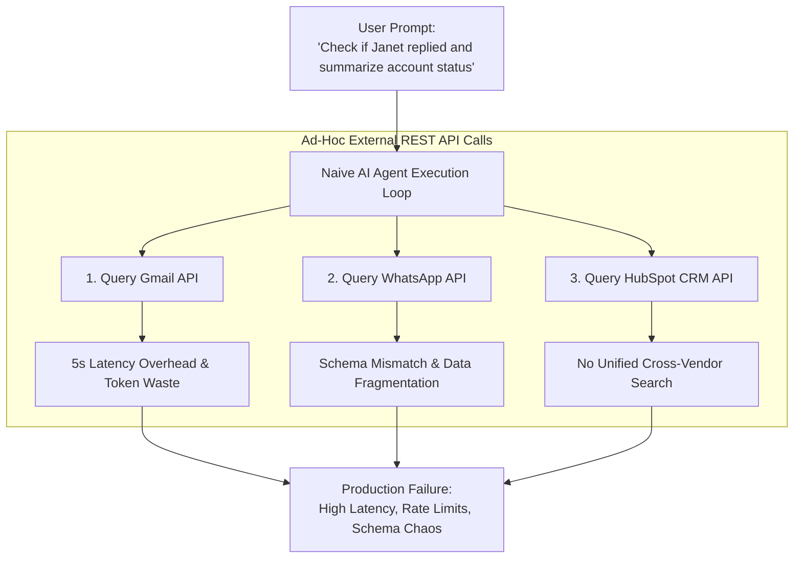
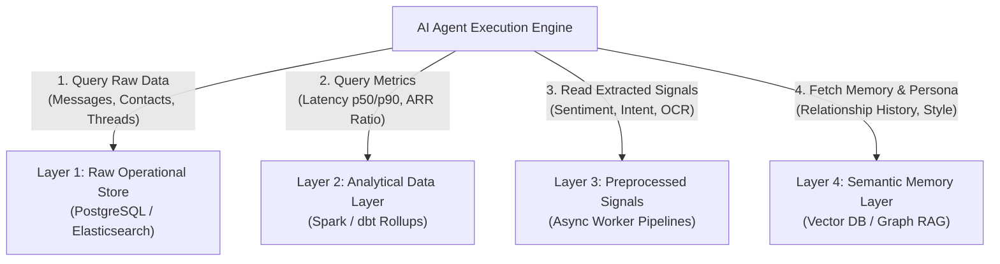
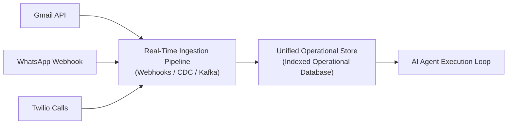
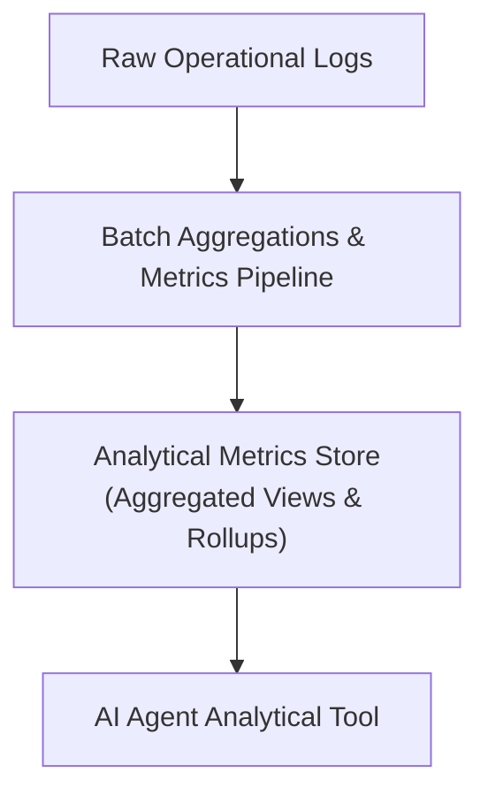
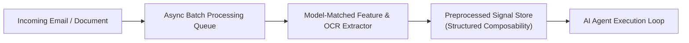
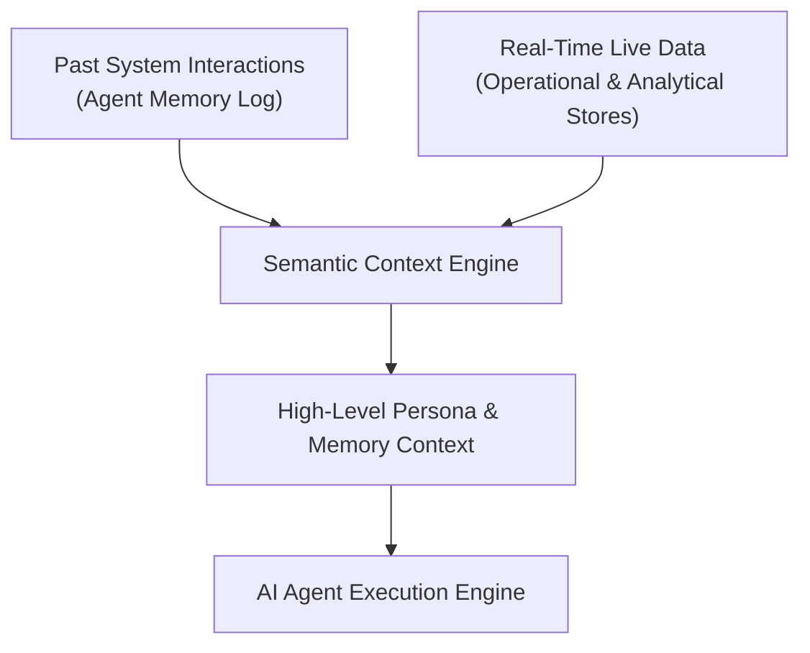

*זהו חלק 3 בסדרה הטכנית בת 7 חלקים על Context Layers עבור AI Agents. אם טרם קראת את החלקים הקודמים, מומלץ להתחיל עם [חלק 1: מה זה ולמה אתה חייב כזה](/he/tech/building-an-effective-context-layer-part-1) ו-[חלק 2: הגדרה ומדידה של Context Layer אפקטיבי](/he/tech/building-an-effective-context-layer-part-2).*

---

<figure class="article-screenshot-figure">
  
  <figcaption>מבנה 4 השכבות הפונקציונליות: דאטה תפעולי גולמי, מטריקות אנליטיות, אותות מעובדים מראש וזיכרון סמנטי.</figcaption>
</figure>

## הנחת היסוד והסיפור: בניית AI CRM עבור ג'אנט

בחלקים 1 ו-2 של הסדרה הגדרנו את הארכיטקטורה הבסיסית של AI Agent ובנינו מערך Evals למדידת אפקטיביות ה-Context. הראינו כי איכות ה-Agent אינה נקבעת על ידי מניפולציות ב-Prompt או בחירת Framework, אלא על ידי הדיוק והמבנה של נתוני הסביבה שאתה מספק ל-LLM.

כעת אנו עומדים בפני שאלת הארכיטקטורה המרכזית: **כיצד עלינו לארגן את ה-Context Layer בשכבות כדי ש-AI Agent יוכל לענות על שאלות תפעוליות, אנליטיות ואסטרטגיות מורכבות?**

כדי להבין מבנה זה, נעיין בג'אנט. ג'אנט מנהלת עסק צומח וזקוקה ל-AI Agent עבור מערכת ה-CRM שלה. מטרת ה-Agent היא לסייע באוטומציה של צינורות המכירות, לתעדף לידים שנכנסים, לעקוב אחר התקדמות עסקאות ולנהל תקשורת מול לקוחות.

במערכת ה-CRM של ג'אנט, נתונים זורמים באופן שוטף מספקים שונים ומגוונים:
* אימיילים גולמיים שמגיעים מ-Gmail ו-Outlook.
* תזקיקי שיחות טלפון שמגיעים מ-Twilio ו-Zoom.
* שרשראות הודעות מ-WhatsApp ו-Slack.
* שלבי עסקאות הרשומים ב-HubSpot או ב-PostgreSQL.
* פגישות ב-Google Calendar.

---

## הבעיות בחיבור APIs ישיר

הגישה הנאיבית לבניית Agent כזה מסתמכת על קריאות API ישירות ומזדמנות. כשהמשתמש מבקש: *"בדוק אם ג'אנט ענתה להצעה שלנו וסכם את מצב החשבון,"* ה-Agent מנסה לפנות בזה אחר זה ל-Gmail API, WhatsApp API וספקי CRM תוך כדי לולאת הביצוע.

### 5 בעיות מרכזיות ב-Production

גישה נאיבית זו נכשלת ב-Production בגלל חמש בעיות מרכזיות:

1. **Rate Limits ו-Latency של ספקים מרובים**: ביצוע קריאות HTTP סדרתיות לשלושה ספקי API חיצוניים בתוך לולאת ה-LLM מייצר השהיה של 5 עד 10 שניות בכל צעד.
2. **Schemas לא אחידים**: המבנה של הודעת WhatsApp אינו דומה כלל לשרשרת מ-Gmail או לכרטיס מ-Zendesk. ה-LLM מבזבז Tokens יקרים על ניווט בין ה-Schemas השונים.
3. **חוסר יכולת לבצע חיפוש חוצה ספקים**: API חיצוני אינו מסוגל לבצע חיפוש טקסטואלי מאוחד מול אימיילים, הודעות WhatsApp והערות שיחה בקריאה אחת.
4. **עיוורון אנליטי**: API חיצוני של REST יכול להחזיר הודעות גולמיות, אך הוא אינו יכול לומר אם שתיקה של 48 שעות מצידו של לקוח חורגת מ-p50 Response Latency ההיסטורי שלו, או אם ה-ARR של החשבון מוצדק עבור השקעת חמש שעות בעבודה מותאמת אישית.
5. **עמימות ישויות וחוסר הבנה של מבנה הנתונים**: כשה-Agent מנסה לתשאל APIs גולמיים באופן ישיר, חסר לו Context סמנטי לגבי הגדרת מזהים. למשל, מה משמעות השדה `userId`? האם מדובר ב-Internal System `account_user_id` ב-PostgreSQL, או ב-External `google_sub_id` / `whatsapp_sender_id`? איזה API הוא המקור המוסמך ביותר עבור נתוני תשלום לעומת פרטי איש קשר? ללא Context Layer שמגדיר מודלים מאוחדים וברורים (כפי שהסברנו במאמר *Agents vs Workflows*), ה-LLM מתבלבל במיפוי הפרמטרים ובוחר בקריאות API שגויות.

## תראה לי את הכסף

<figure class="article-screenshot-figure">
  
  <figcaption>המטרה המרכזית של Context Layer: הצגת ROI כמותי וביצועים קונקרטיים ב-Production במקום הבטחות תיאורטיות.</figcaption>
</figure>

אנו מבינים שהבעיה הזו קשה מאוד ורבים מנסים לפתור אותה במגוון גישות. כעת אדריך אותך בתוך ה-Framework שבאמצעותו נבנה את ה-Context Layer האפקטיבי שלנו.

כעת אנו הולכים להציג דוגמה מעשית מהחיים האמיתיים של ארכיטקטורה ב-4 שכבות, ולהראות כיצד לבנות בפועל Context Layer אפקטיבי.

---

## ארכיטקטורת ה-Context ב-4 שכבות

כדי לשרת AI Agents ביעילות, יש לארגן את נתוני ה-Context בארבע שכבות פונקציונליות נפרדות:

---

## 1. שכבת הנתונים הגולמיים (Raw Data Layer)

השכבה הראשונה מספקת את היכולת לשלוף נתונים גולמיים כפי שהם ללא קריאות ל-APIs חיצוניים בזמן ביצוע השיחה.

שכבה 1 מאפשרת ל-AI Agent לענות על שאלות תפעוליות גולמיות מסוימות מול כל הספקים:
* *"תן לי את כל האימיילים מ-avi@gmail.com."*
* *"חפש את כל האימיילים המכילים קוקה קולה."*
* *"מצא את מספר הטלפון של איש הקשר בשם ג'אנט."*

אתה יכול לפנות ישירות ל-Gmail כדי לקבל את כל האימיילים, אך מה תעשה אם אתה עובד מול ספקים מרובים? כיצד תבצע חיפוש מאוחד מול אימיילים, הודעות WhatsApp ותזקיקי שיחות בקריאה אחת?

בסופו של דבר, אנו עובדים כאן מול **Structured Data** ורוצים להעניק ל-AI את היכולת לתשאל (**Query**) את הנתונים הללו בדרך האפקטיבית ביותר. לשם כך, אנו זקוקים לאינדקס ייעודי עבור כל שאלה.

*לצלילה טכנית עמוקה בארכיטקטורת Ingestion ואינדוקס בשכבה 1, קרא את [חלק 4: צלילה עמוקה לשכבה 1 (נתונים תפעוליים גולמיים ומובנים)](/he/tech/building-an-effective-context-layer-part-4).*

---

## 2. שכבת הנתונים האנליטיים (Analytical Data Layer)

השכבה השנייה עונה על שאלות אנליטיות טהורות כדי להבין נתונים מאוגדים ומדדי ייחוס היסטוריים.

שכבה 2 מאפשרת ל-AI Agent לענות על שאלות אנליטיות טהורות מול נתונים מאוגדים:
* *"מהו זמן מחזור העסקה הממוצע שלנו?"*
* *"כמה מכרתי בשנה שעברה בחודש מאי?"*
* *"האם לקוח זה שקט פרק זמן ארוך מזמן התגובה הממוצע שלו?"*
* *"האם ה-ARR של חשבון זה מעל או מתחת למדד הייחוס של החברה?"*

אני עשוי לרצות לשאול שאלות אנליטיות טהורות כדי להבין נתונים מאוגדים. נניח שאני רוצה להבין כמה עסקאות יש לי ביום. אם יש לי עסקה אחת ביום, לכל עסקה יש אימפקט אדיר בהשוואה לעסק עם 100 עסקאות ביום.

זמן העסקה יכול להשפיע על הפעולה שאני מבצע. כדי להבין אם לקוח נהיה שקט, אני חייב לדעת מהו זמן התגובה הממוצע שלקוח ספציפי זה לוקח כדי להשיב.

אני עשוי לרצות להבין כמה מאמץ עלי להשקיע בלקוח זה. אם החשבון שווה $10,000 ARR בעוד מדד ה-p50 בחברה שלי הוא $100,000 ARR, והלקוח מבקש יותר מדי ממני, אולי ארצה לסמן אותו כ-ROI נמוך.

*לצלילה עמוקה בחישובי Spark Batch, קווי בסיס של p50/p90 Latency וספי ARR, קרא את [חלק 5: צלילה עמוקה לשכבה 2 (מטריקות ואגרגציות אנליטיות)](/he/tech/building-an-effective-context-layer-part-5).*

---

## 3. שכבת הנתונים המעובדים מראש (Preprocessed Data Layer)

השכבה השלישית עוסקת בשאלה פשוטה: **איזה סוג נתונים אני יכול לעבד מראש, עוד לפני שלולאת ה-Agent מתחילה?**

שכבה 3 מאפשרת ל-AI Agent לענות על שאלות שיהיו איטיות מדי או יקרות מדי לחישוב בזמן אמת:
* *"האם לקוח זה כועס בשרשור האימיילים הזה?"*
* *"חלץ את הטקסט והפריטים מתוך תמונת חשבונית מצורפת זו או קובץ PDF."*
* *"האם אימייל נכנס זה דורש פעולה מיידית?"*

אני יכול לחלץ אותות משרשור אימיילים ולומר לך אם הלקוח כועס, או אם הוא רוצה לבצע פעולה. אני יכול להתמיר נתוני תמונות ולשלוף טקסט מתוך חשבונית. כל מה שאתה חושב שאתה יכול לעשות מראש, ואתה בטוח שתזדקק לזה, צריך להיות מעובד מראש עוד לפני שלולאת ה-Agent רצה.

עיבוד אותות מראש מספק יתרונות הנדסיים וכלכליים קריטיים: ניצול Batch Jobs אסינכרוניים ומנגנון Prompt Caching להפחתת עלויות Tokens ב-50% עד 90% (באמצעות אפשרויות תמחור כמו AWS Bedrock Batch Inference), התאמת מודלים קטנים וייעודיים למשימות חילוץ ספציפיות במקום הפעלת mega-LLM יקר, שמירת פלטים מסיעים כאבני בניין עבור Composability מובנה (כגון אגרגציה דטרמיניסטית של ציוני `deal_health` מחושבים מראש לתוך `account_health` ללא צורך בקריאת LLM), והתאמת בדיקות מוצר ו-Evals ב-Offline לפני הגעה ללקוח. ה-Trade-off הארכיטקטוני המרכזי הוא חישוב מראש ספקולטיבי, המשקיע חישוב ברקע במידע עוד לפני שנודע אם השיחה בלייב תתרומם אליו.

*לצלילה עמוקה בתורי Kafka אסינכרוניים, כלכלת Batch, התאמת מודלים, מודלי Sentiment וחילוץ OCR מנספחים, קרא את [חלק 6: צלילה עמוקה לשכבה 3 (אותות מעובדים מראש ו-OCR מולטימודיאלי)](/he/tech/building-an-effective-context-layer-part-6).*

---

## 4. השכבה הסמנטית הגבוהה (Semantic High-Level Layer - המוח)

השכבה הרביעית היא השכבה הסמנטית הגבוהה (המוח) המיועדת לענות על השאלות העמוקות והקשות ביותר, החוצות את כל הנתונים, כל אינטראקציות העבר וכל הידע הארגוני המעמיק בדרך מתומצתת ונגישה לשליפה.

שכבה 4 מאפשרת ל-AI Agent לענות על שאלות אנושיות ויחסים ברמה גבוהה:
* *"איך אני עונה בדרך כלל?"*
* *"מה אני חושב על ג'אנט?"*
* *"מהם תנאי החוזה ההיסטוריים והעדפות התקשורת מול חשבון זה?"*

### יעד הזהב של ארכיטקטורת ה-Context

שכבה 4 היא יעד הזהב (ה-Golden Goal) והיעד הנכסף של ה-Context Layer. במקום לפעול בנפרד, היא צורכת ומשתמשת בכל השכבות התחתונות (נתונים תפעוליים משכבה 1, מדדים אנליטיים משכבה 2, ואותות מעובדים מראש משכבה 3) כחומרי גלם לבניית ייצוג חי של זיכרון, כוונה ו-Persona.

ניסיונות וגישות ארכיטקטוניות רבות ניסו לפתור אתגר זה. דוגמה בולטת היא [ההצעה של אנדריי קרפתי ל-LLM Wiki](https://x.com/karpathy/status/2039805659525644595), המציגה חזון שבו מודלי שפה פועלים כרכיבי Compilation של ידע הממזגים באופן מתמשך מסמכים גולמיים לתוך דפי Markdown מקושרים לאורך זמן:

<figure class="article-screenshot-figure">
  
  <figcaption>הצעתו של אנדריי קרפתי לניהול מאגרי ידע מבוססי LLM, המאגדים מידע גולמי באופן רציף לתוך דפי Wiki מובנים.</figcaption>
</figure>

אף כי קיימות סקימות ופתרונות מגוונים (כולל Graph RAG, מאגרי זיכרון וקטוריים ו-Wikis מעובדים), אף פתרון לא מצא עדיין דרך סקלאבילית ומוכחת ב-Production לניהול זיכרון Agent לאורך זמן ללא שחיקת Context או הזיות. שכבה 4 נותרה בחזית המחקר והפיתוח של Context Engineering.

*לצלילה עמוקה בהתאמת Persona, תיעוד זיכרון כפול ומיפוי Graph RAG, קרא את [חלק 7: צלילה עמוקה לשכבה 4 (זיכרון סמנטי ו-Graph RAG)](/he/tech/building-an-effective-context-layer-part-7).*

---

## השוואה ארכיטקטונית בין כל 4 השכבות

| Context Layer | אופי הנתונים | סוג ה-Pipeline | השאלה המרכזית שנפתרת |
|---------------|--------------|----------------|----------------------|
| **1. Operational Data** | הודעות גולמיות, אנשי קשר, יומני שרשראות. | Streaming בזמן אמת או ETL תדיר (Airflow). | *"מה הלקוח אמר באימייל האחרון מכל הספקים?"* |
| **2. Analytical Data** | מדדים מחושבים מראש, קווי בסיס סטטיסטיים. | עיבוד Batch (Spark, dbt) או אגרגציות בחלון זז. | *"מהו זמן מחזור העסקה הממוצע וכמה מכרתי במאי האחרון?"* |
| **3. Preprocessed Signals** | JSON מובנה של Sentiment, Intent ו-OCR. | תורי Worker אסינכרוניים (Kafka, Celery). | *"האם הלקוח כועס ומהם הפריטים בחשבונית?"* |
| **4. Semantic & Memory** | Persona של המשתמש, זיכרון ארגוני, Graph RAG. | חיפוש סמנטי היברידי, Graph DB, יומן זיכרון. | *"איך אני עונה בדרך כלל לג'אנט ומה ההיסטוריה איתה?"* |

---

## אינדקס הסדרה המלאה ב-7 חלקים

עיין בסדרה הטכנית המלאה על Context Layers עבור AI Agents:

* **[חלק 1: מה זה ולמה אתה חייב כזה](/he/tech/building-an-effective-context-layer-part-1)**: ארכיטקטורת לולאת ה-Agent, מעטפות Prompt מול Context סביבתי.
* **[חלק 2: הגדרה ומדידה של Context Layer אפקטיבי](/he/tech/building-an-effective-context-layer-part-2)**: מערך ה-Evals ב-4 רמות ומטריצת הדיוק והעלויות.
* **[חלק 3: ארכיטקטורת ה-Context ב-4 שכבות וערך פונקציונלי](/he/tech/building-an-effective-context-layer-part-3)**: תוכנית הערך המפרידה בין שכבות תפעוליות, אנליטיות, אותות מראש וזיכרון סמנטי.
* **[חלק 4: צלילה עמוקה לשכבה 1 (נתונים תפעוליים גולמיים ומובנים)](/he/tech/building-an-effective-context-layer-part-4)**: צינורות Ingestion בזמן אמת, שליפות B-Tree ואינדקסים מסוג GIN.
* **[חלק 5: צלילה עמוקה לשכבה 2 (מטריקות ואגרגציות אנליטיות)](/he/tech/building-an-effective-context-layer-part-5)**: עיבודי Spark, קווי בסיס של p50/p90 Latency וספי ARR.
* **[חלק 6: צלילה עמוקה לשכבה 3 (אותות מעובדים מראש ו-OCR מולטימודיאלי)](/he/tech/building-an-effective-context-layer-part-6)**: חילוץ תכונות אסינכרוני ב-Kafka ופענוח מסמכים.
* **[חלק 7: צלילה עמוקה לשכבה 4 (זיכרון סמנטי ו-Graph RAG)](/he/tech/building-an-effective-context-layer-part-7)**: זיכרון ארגוני, התאמת קול ה-Persona ומיפוי ישויות ב-Graph RAG.
