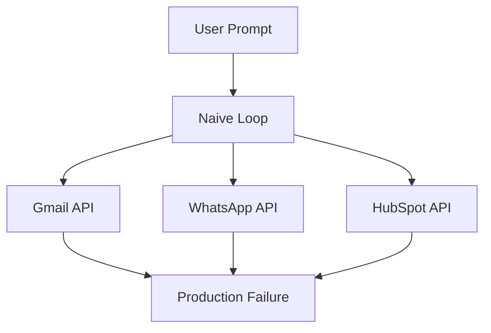
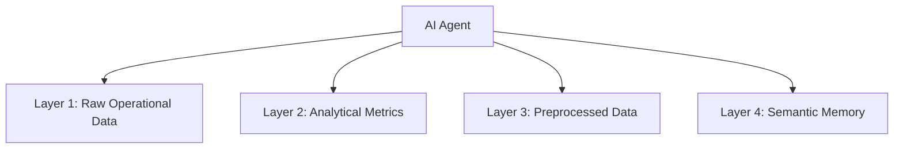
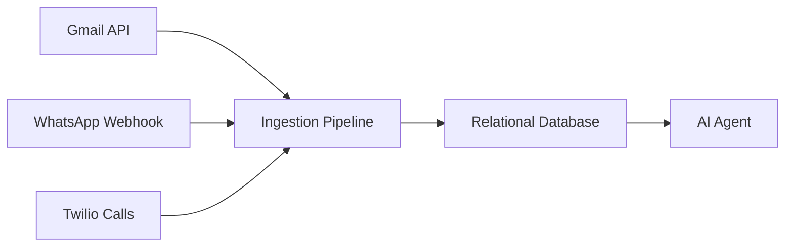
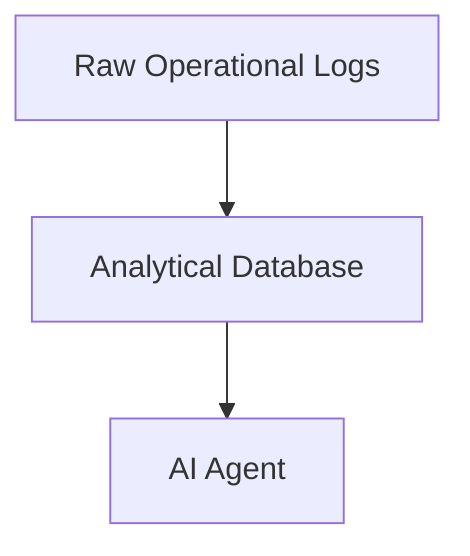
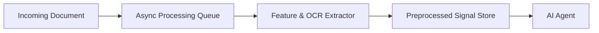
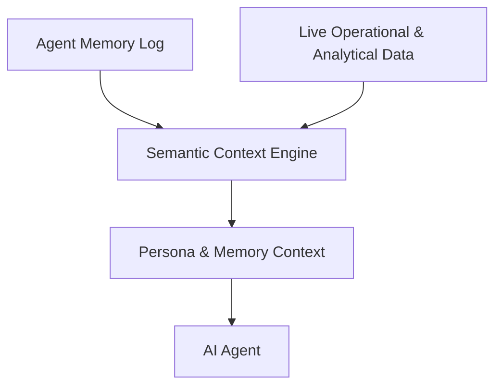

*זהו חלק 3 בסדרה בת 7 חלקים על Context Layers עבור AI Agents. אם עוד לא קראת את החלקים הקודמים, כדאי להתחיל מ[חלק 1: מה זה Context Layer ולמה אתה חייב כזה](/he/tech/building-an-effective-context-layer-part-1) ו[חלק 2: איך מודדים Context Layer אפקטיבי](/he/tech/building-an-effective-context-layer-part-2).*

**TL;DR**: כדי לבנות AI Agents שאפשר לסמוך עליהם ב-Production, חייבים להפסיק להסתמך על קריאות API ישירות תוך כדי ריצה. הפוסט הזה מציג ארכיטקטורה ב-4 שכבות (נתונים גולמיים, מטריקות אנליטיות, אותות מעובדים מראש וזיכרון סמנטי) שפותחת את בעיות ה-Rate Limits, השהיית השאילתות, בלגן הסכמות ועלויות עיבוד המסמכים.

---

<figure class="article-screenshot-figure">
  
  <figcaption>מבנה 4 השכבות הפונקציונליות: דאטה תפעולי גולמי, מטריקות אנליטיות, אותות מעובדים מראש וזיכרון סמנטי.</figcaption>
</figure>

## בניית AI CRM עבור נהוראי

בחלקים 1 ו-2 הנחנו את היסודות: הגדרנו את הארכיטקטורה של AI Agent ובנינו מערך Evals כדי למדוד את איכות ה-Context. ראינו שמה שקובע את הביצועים של ה-Agent זה לא טריקים ב-Prompt או פרימוורק כזה או אחר, אלא המבנה והדיוק של המידע שהוא מקבל מהסביבה.

פה מגיעה השאלה הארכיטקטונית המרכזית: **איך בונים Context Layer שמאפשר ל-Agent לענות על שאלות תפעוליות, אנליטיות ואסטרטגיות מורכבות?**

כדי להבין את זה, בוא נסתכל על נהוראי. נהוראי מנהל עסק שגדל מהר וצריך AI CRM שיעזור לו לאוטמט תהליכי מכירה, לתעדף לידים שנכנסים, לעקוב אחר עסקאות ולנהל את התקשורת מול הלקוחות.

במערכת ה-CRM של נהוראי, נתונים מגיעים ללא הפסקה ממקורות שונים:
* אימיילים מ-Gmail ו-Outlook.
* תמלילי שיחות מ-Twilio ו-Zoom.
* צ׳אטים מ-WhatsApp ו-Slack.
* שלבי עסקאות ב-HubSpot או ב-PostgreSQL.
* פגישות ב-Google Calendar.

---

## הבעיות בחיבור APIs ישיר

הדרך הכי קלה (והכי נאיבית) לבנות את ה-Agent הזה היא פשוט לתת לו קריאות API ישירות. כשהמשתמש שואל: *"בדוק אם נהוראי ענה להצעה שלנו וסכם את מצב החשבון,"* ה-Agent מנסה לפנות בלייב ל-Gmail, ל-WhatsApp ול-CRM תוך כדי הרצת הלולאה.

```mermaid
flowchart TD
    Prompt["User Prompt"] --> Agent["Naive Loop"]
    
    Agent --> G["Gmail API"]
    Agent --> W["WhatsApp API"]
    Agent --> C["HubSpot API"]
    
    G --> Fail["Production Failure"]
    W --> Fail
    C --> Fail
```

כשמנסים לקחת את החיבורים האלה ל-Production, הכל מתרסק בגלל 5 צווארי בקבוק קשים:

1. **Multi-Vendor Rate Limits**: APIs חיצוניים מציבים מכסות קריאה קשיחות, מה שגורם ללולאת הביצוע להיכשל בזמן תהליכי עבודה מרובי שלבים.
2. **Multi-Vendor Latency & Extraction Overhead**: קריאות HTTP סדרתיות וחילוץ מסמכים בזמן אמת (Optical Character Recognition (OCR), סנטימנט וכוונות) בתוך לולאת הביצוע מוסיפים 2 עד 5 שניות של השהיה מצטברת לכל תור.
3. **אי אפשר לחפש במקביל מול כמה מקורות**: REST APIs רגילים לא מסוגלים להריץ חיפוש טקסטואלי מאוחד מול אימיילים, הודעות צ׳אט ותמלילי שיחות בקריאה אחת.
4. **עיוורון אנליטי**: APIs חיצוניים מחזירים נתונים גולמיים בלבד, ללא יכולת לחשב מטריקות כמו p50 Response Latency או תיעוד משאבים לפי Annual Recurring Revenue (ARR).
5. **Schema Chaos ועמימות ישויות**: מבני payload שונים ממערכות שונות ומזהים לא ממופים מאלצים את ה-LLM לבזבז Tokens על תרגום סכמות ולהזות פרמטרים.

## איך פותרים את זה: ארכיטקטורת ה-Context ב-4 שכבות

<figure class="article-screenshot-figure">
  
  <figcaption>אף אחד לא באמת קורא את הטקסט מתחת לתמונה, אז אם אתה קורא את זה תדע שאתה אלוף אמיתי</figcaption>
</figure>

להבין מה שבור זה רק החלק הראשון. כדי להיפטר מצווארי הבקבוק האלה, חייבים לעבור מחיבורי API ישירים לארכיטקטורת Context מובנית ב-4 שכבות.

כפי שהראנו ב[חלק 1: מה זה Context Layer ולמה אתה חייב כזה](/he/tech/building-an-effective-context-layer-part-1), AI Agent צריך דאטה מובנה וכלים ייעודיים כדי לעבוד כמו שצריך. התוכנית הבאה משתמשת ב-CRM של נהוראי כדוגמה מעשית כדי לפרק את 4 השכבות שה-Agent חייב כדי לבצע משימות מורכבות:

```mermaid
flowchart TD
    Agent["AI Agent"]
    
    Agent --> L1["Layer 1: Raw Operational Data"]
    Agent --> L2["Layer 2: Analytical Metrics"]
    Agent --> L3["Layer 3: Preprocessed Data"]
    Agent --> L4["Layer 4: Semantic Memory"]
```

---

## 1. שכבת הנתונים הגולמיים (Raw data layer)

<figure class="article-screenshot-figure">
  
  <figcaption>שכבה 1: איחוד נתונים תפעוליים מאימיילים, צ׳אטים ושיחות לתוך Relational Database (כמו PostgreSQL).</figcaption>
</figure>

השכבה הראשונה דואגת שתוכל לשלוף נתונים גולמיים בלי לקרוא ל-APIs חיצוניים תוך כדי השיחה.

שכבה 1 מאפשרת ל-AI Agent לענות על שאלות תפעוליות ישירות:
* *"תן לי את כל האימיילים מ-avi@gmail.com."*
* *"חפש את כל האימיילים המכילים קוקה קולה."*
* *"מצא את מספר הטלפון של איש הקשר בשם נהוראי."*

למשוך אימיילים ישירות מ-Gmail זה אחלה למשימה בודדת, אבל אם אתה רוצה לחפש במקביל מול אימיילים, הודעות WhatsApp ותמלילי שיחות, אתה חייב אינדוקס מאוחד מול כל המקורות.

```mermaid
flowchart LR
    Gmail["Gmail API"] --> Ingest["Ingestion Pipeline"]
    WhatsApp["WhatsApp Webhook"] --> Ingest
    Twilio["Twilio Calls"] --> Ingest
    Ingest --> UnifiedDB["Relational Database"]
    UnifiedDB --> Agent["AI Agent"]
```

שכבה 1 פועלת על **Structured Data**. המטרה היא לתת ל-AI Agent יכולת ישירה לתשאל (**Query**) את הנתונים אצלך במערכת ביעילות, מה שדורש אינדקס ייעודי לכל שאלה.

> **הכלל של שכבה 1**: אל תקרא בלייב ל-APIs חיצוניים תוך כדי שיחה. תאגור את כל הדאטה התפעולי הגולמי מראש ב-Relational Database אצלך במערכת.

*לצלילה טכנית עמוקה בארכיטקטורת Ingestion ואינדוקס בשכבה 1, קרא את [חלק 4: צלילה עמוקה לשכבה 1 (נתונים תפעוליים גולמיים ומובנים)](/he/tech/building-an-effective-context-layer-part-4).*

---

## 2. שכבת הנתונים האנליטיים (Analytical data layer)

<figure class="article-screenshot-figure">
  
  <figcaption>שכבה 2: חישוב מטריקות מרוכזות, קווי בסיס של p50 Response Latency ואנליטיקת עסקאות היסטורית.</figcaption>
</figure>

השכבה השנייה עוסקת במספרים, אגרגציות ו-Context היסטורי.

שכבה 2 מאפשרת ל-AI Agent לענות על שאלות אנליטיות מול נתונים מחושבים:
* *"מה זמן מחזור העסקה הממוצע שלנו?"*
* *"כמה מכרתי בשנה שעברה בחודש מאי?"*
* *"האם הלקוח הזה שקט יותר מזמן התגובה הממוצע שלו?"*
* *"האם ה-ARR של החשבון הזה מעל או מתחת למדד הייחוס של החברה?"*

```mermaid
flowchart TD
    RawLogs["Raw Operational Logs"] --> AnalyticsDB["Analytical Database"]
    AnalyticsDB --> Agent["AI Agent"]
```

במקום לאלץ את ה-Agent לחשב מספרים בזמן אמת, שכבה 2 נותנת לו כלים לשליפת נתונים אנליטיים מוכנים. זה מאפשר ל-Agent לבדוק ברגע את נפח העסקאות היומי, לתשאל את ClickHouse לגבי זמן התגובה הממוצע של הלקוח כדי לדעת אם הוא סתם נעלם או שאצלו זה נורמלי, או לשלוף מדדי ARR כדי להחליט כמה זמן להשקיע בבקשות מיוחדות שלו.

> **הכלל של שכבה 2**: אל תתן ל-LLM לחשב ממוצעים או מטריקות בלייב. תכין לו מנוע אנליטי (כמו ClickHouse) או Rollups מחושבים מראש שהוא יוכל לתשאל ישירות.

*לצלילה עמוקה בחישובי Spark Batch, קווי בסיס של p50/p90 Latency וספי ARR, קרא את [חלק 5: צלילה עמוקה לשכבה 2 (מטריקות ואגרגציות אנליטיות)](/he/tech/building-an-effective-context-layer-part-5).*

---

## 3. שכבת הנתונים המעובדים מראש (Preprocessed data layer)

<figure class="article-screenshot-figure">
  
  <figcaption>שכבה 3: חילוץ אותות, זיהוי סנטימנט וטקסט מ-OCR מראש באופן אסינכרוני לתוך אבני בניין מובנות.</figcaption>
</figure>

השכבה השלישית מתמקדת באופטימיזציה פשוטה: **איזה מידע אפשר לחשב ולעבד מראש לפני שלולאת ה-Agent מתחילה?**

שכבה 3 מאפשרת ל-AI Agent לענות על שאלות שיהיו איטיות מדי או יקרות מדי לחישוב בלייב:
* *"האם הלקוח הזה עצבני בשרשור האימיילים?"*
* *"תחלץ את הטקסט והשורות מתוך קובץ PDF או תמונת חשבונית מצורפת."*
* *"האם האימייל הנכנס הזה דורש טיפול מיידי?"*

```mermaid
flowchart LR
    IncomingEvent["Incoming Document"] --> WorkerQueue["Async Processing Queue"]
    WorkerQueue --> ExtractionModels["Feature & OCR Extractor"]
    ExtractionModels --> SignalStore["Preprocessed Signal Store"]
    SignalStore --> Agent["AI Agent"]
```

אותות סנטימנט, דחיפות של לקוח וטקסט מחשבוניות PDF יכולים כולם להישלף באופן אסינכרוני. עיבוד פיצ׳רים צפויים מראש מסיר את עומס החישוב בלייב בלולאת הביצוע.

עיבוד אותות מראש באופן אסינכרוני מפחית עלויות Tokens עד 70% ומעלים את השהיית ה-Runtime:

* **חיסכון בעלויות**: ניצול Async Batch Inference (כמו AWS Bedrock Batch) ו-Prompt Caching להפחתת עלויות ה-Tokens.
* **התאמת מודלים למשימות**: שימוש במודלים קטנים ומהירים למשימות חילוץ ספציפיות במקום הפעלת mega-LLM יקר.
* **Composability דטרמיניסטי**: שמירת פלטים כאבני בניין מובנות, כמו חישוב ציון `account_health` מתוך ציוני `deal_health` ללא קריאת LLM.
* **בדיקות ו-Evals ב-Offline**: הרצת סוויטת בדיקות ואיכות על אותות מסיעים עוד לפני הגעת המידע ללקוח.

ה-Trade-off הארכיטקטוני המרכזי הוא חישוב מראש ספקולטיבי: השקעת חישוב ברקע במידע עוד לפני שנודע אם השיחה בלייב תתרומם אליו.

> **הכלל של שכבה 3**: תעבד מראש כל דאטה צפוי עוד לפני שה-Agent רץ. תחלץ סנטימנט, OCR וכוונות ברקע כדי לחסוך Tokens ולמנוע דיליי.

*לצלילה עמוקה בתורי Kafka אסינכרוניים, כלכלת Batch, התאמת מודלים, מודלי Sentiment וחילוץ OCR מנספחים, קרא את [חלק 6: צלילה עמוקה לשכבה 3 (אותות מעובדים מראש ו-OCR מולטימודיאלי)](/he/tech/building-an-effective-context-layer-part-6).*

---

## 4. השכבה הסמנטית הגבוהה (Semantic high-level layer - המוח)

<figure class="article-screenshot-figure">
  
  <figcaption>שכבה 4: סנכרון זיכרון ארגוני ארוך טווח, הפרסונה של המשתמש והיסטוריית מערכות היחסים לתוך גרף סמנטי.</figcaption>
</figure>

השכבה הרביעית היא המוח של המערכת. היא נועדה לענות על השאלות הכי מורכבות, כאלה שדורשות לחבר בין רשומות תפעוליות, אינטראקציות מהעבר וידע ארגוני מעמיק.

שכבה 4 מאפשרת ל-AI Agent לענות על שאלות אנושיות ברמה גבוהה:
* *"איך אני עונה בדרך כלל?"*
* *"מה אני חושב על נהוראי?"*
* *"מה תנאי החוזה ההיסטוריים והעדפות התקשורת של הלקוח הזה?"*

```mermaid
flowchart TD
    PastInteractions["Agent Memory Log"] --> SemanticEngine["Semantic Context Engine"]
    LiveData["Live Operational & Analytical Data"] --> SemanticEngine
    SemanticEngine --> HighLevelContext["Persona & Memory Context"]
    HighLevelContext --> Agent["AI Agent"]
```

### יעד הזהב של ארכיטקטורת ה-Context

שכבה 4 היא יעד הזהב של ה-Context Layer. במקום לפעול בנפרד, היא צורכת את השכבות התחתונות (נתונים תפעוליים משכבה 1, מדדים אנליטיים משכבה 2, ואותות מעובדים מראש משכבה 3) כחומרי גלם לבניית ייצוג חי של זיכרון, כוונה ו-Persona.

בפועל, יישום של שכבה 4 מתחזק מסמך סמנטי המתעדכן באופן רציף עבור כל ישות מרכזית. עבור החשבון של נהוראי, ה-Context Layer ממזג באופן אסינכרוני את היסטוריית התקשורת שלו (שכבה 1), את מדדי זמן התגובה שלו (שכבה 2), ואת מגמות הסנטימנט שחולצו (שכבה 3) לתוך מסמך Account Persona חי. כשה-Agent מנסח הודעת המשך לנהוראי, הוא שולף את מסמך ה-Persona הזה ישירות במקום לסרוק מחדש רשומות גולמיות. המסמך כולל את העדפות התקשורת שלו, זמני התגובה, והסנטימנט שלו לגבי חידוש החוזה.

ניסיונות וגישות ארכיטקטוניות רבות ניסו לפתור אתגר זה. דוגמה בולטת היא [ההצעה של אנדריי קרפתי ל-LLM Wiki](https://x.com/karpathy/status/2039805659525644595), המציגה חזון שבו מודלי שפה פועלים כרכיבי Compilation של ידע הממזגים באופן מתמשך מסמכים גולמיים לתוך דפי Markdown מקושרים לאורך זמן:

<figure class="article-screenshot-figure">
  
  <figcaption>הצעתו של אנדריי קרפתי לניהול מאגרי ידע מבוססי LLM, המאגדים מידע גולמי באופן רציף לתוך דפי Wiki מובנים.</figcaption>
</figure>

למרות שיש המון גישות שונות (כמו Graph RAG, מאגרי וקטורים או Wikis מעובדים), אף פתרון עדיין לא הפך לתקן מוכח ב-Production שמנהל זיכרון של Agent לאורך זמן בלי שה-Context ישחק או שהמודל יתחיל להזות. שכבה 4 היא עדיין החזית הכי חמה והכי מאתגרת ב-Context Engineering.

> **הכלל של שכבה 4**: תאחד את הדאטה התפעולי, המטריקות והאותות המעובדים לתוך מסמך זיכרון חי שמשקף את הפרסונה וההיסטוריה מול הלקוח.

*לצלילה עמוקה בהתאמת Persona, תיעוד זיכרון כפול ומיפוי Graph RAG, קרא את [חלק 7: צלילה עמוקה לשכבה 4 (זיכרון סמנטי ו-Graph RAG)](/he/tech/building-an-effective-context-layer-part-7).*

---

## איך הארכיטקטורה פותרת את כל הבעיות

הנה איך 4 השכבות פותרות את צווארי הבקבוק האלה ב-Production:

* **מגבלות Rate Limits** (נפתר בשכבה 1): אגירת דאטה אסינכרונית ב-Database מונעת קריאות API בלייב תוך כדי הרצת ה-Agent.
* **השהיה ועומס חילוץ מסמכים** (נפתר בשכבות 1 ו-3): שאילתות מהירות ל-Database מקומי מחליפות קריאות HTTP סדרתיות, ובמקביל תורי Worker ברקע מחלצים מראש OCR וסנטימנט לפני שה-Agent רץ.
* **אי אפשר לחפש במקביל מול כמה מקורות** (נפתר בשכבה 1): Relational Database מאוחד עם אינדקסי GIN מאפשר להריץ חיפוש מלא בלייב על אימיילים, צ׳אטים ותמלילים ביחד.
* **עיוורון אנליטי** (נפתר בשכבה 2): Rollups מחושבים מראש ומטריקות ב-ClickHouse נותנים ממוצעים מיידיים בלי שה-LLM יצטרך לחשב אותם ב-Prompt.
* **בלגן בסכמות וזהויות כפולות** (נפתר בשכבות 1 ו-4): שכבה 1 מנרמלת את הסכמות השונות מכל המערכות, ושכבה 4 מחברת מזהים שונים לפרופיל אחיד אחד.

---

## השוואה ארכיטקטונית בין כל 4 השכבות

| Context Layer | אופי הנתונים | סוג ה-Pipeline | השאלה המרכזית שנפתרת |
|---------------|--------------|----------------|----------------------|
| **1. Operational Data** | הודעות גולמיות, אנשי קשר, יומני שרשראות. | Streaming בזמן אמת או ETL תדיר (Airflow). | *"מה הלקוח אמר באימייל האחרון מכל המערכות?"* |
| **2. Analytical Data** | מדדים מחושבים מראש, קווי בסיס סטטיסטיים. | עיבוד Batch (Spark, dbt) או אגרגציות בחלון זז. | *"מה זמן מחזור העסקה הממוצע וכמה מכרתי במאי האחרון?"* |
| **3. Preprocessed Signals** | JSON מובנה של Sentiment, Intent ו-OCR. | תורי Worker אסינכרוניים (Kafka, Celery). | *"האם הלקוח כועס ומה הפריטים בחשבונית?"* |
| **4. Semantic & Memory** | Persona של המשתמש, זיכרון ארגוני, Graph RAG. | חיפוש סמנטי היברידי, Graph DB, יומן זיכרון. | *"איך אני עונה בדרך כלל לנהוראי ומה ההיסטוריה איתו?"* |

---

## אינדקס הסדרה המלאה ב-7 חלקים

כנס לסדרה הטכנית המלאה על Context Layers עבור AI Agents:

* **[חלק 1: מה זה Context Layer ולמה אתה חייב כזה](/he/tech/building-an-effective-context-layer-part-1)**: ארכיטקטורת לולאת ה-Agent, מעטפות Prompt מול Context סביבתי.
* **[חלק 2: איך מודדים Context Layer אפקטיבי](/he/tech/building-an-effective-context-layer-part-2)**: מערך ה-Evals ב-4 רמות ומטריצת הדיוק והעלויות.
* **[חלק 3: ארכיטקטורת ה-Context ב-4 שכבות וערך פונקציונלי](/he/tech/building-an-effective-context-layer-part-3)**: תוכנית הערך המפרידה בין שכבות תפעוליות, אנליטיות, אותות מראש וזיכרון סמנטי.
* **[חלק 4: צלילה עמוקה לשכבה 1 (נתונים תפעוליים גולמיים ומובנים)](/he/tech/building-an-effective-context-layer-part-4)**: צינורות Ingestion בזמן אמת, שליפות B-Tree ואינדקסים מסוג GIN.
* **[חלק 5: צלילה עמוקה לשכבה 2 (מטריקות ואגרגציות אנליטיות)](/he/tech/building-an-effective-context-layer-part-5)**: עיבודי Spark, קווי בסיס של p50/p90 Latency וספי ARR.
* **[חלק 6: צלילה עמוקה לשכבה 3 (אותות מעובדים מראש ו-OCR מולטימודיאלי)](/he/tech/building-an-effective-context-layer-part-6)**: חילוץ תכונות אסינכרוני ב-Kafka ופענוח מסמכים.
* **[חלק 7: צלילה עמוקה לשכבה 4 (זיכרון סמנטי ו-Graph RAG)](/he/tech/building-an-effective-context-layer-part-7)**: זיכרון ארגוני, התאמת קול ה-Persona ומיפוי ישויות ב-Graph RAG.
