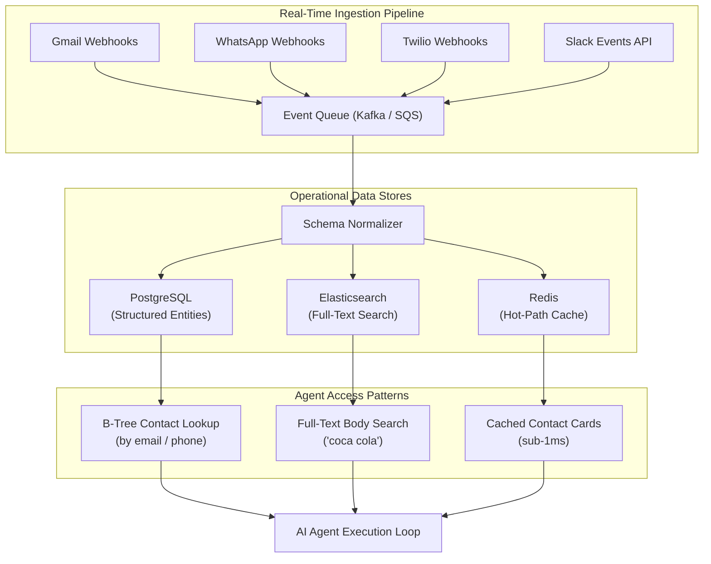
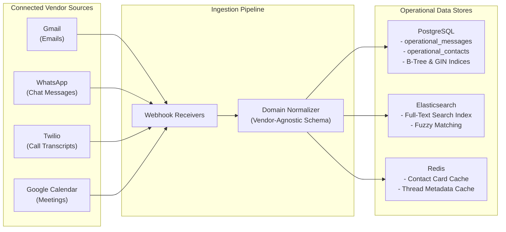

*זהו חלק 4 בסדרה הטכנית בת 7 חלקים על Context Layers עבור AI Agents. לפני קריאת צלילה עמוקה זו, מומלץ לקרוא את [חלק 1: מה זה ולמה אתה חייב כזה](/he/tech/building-an-effective-context-layer-part-1), [חלק 2: הגדרה ומדידה של Context Layer אפקטיבי](/he/tech/building-an-effective-context-layer-part-2), ו-[חלק 3: סקירת ארכיטקטורת ה-Context ב-4 שכבות](/he/tech/building-an-effective-context-layer-part-3).*

---

## למה אנחנו צריכים את השכבה הזו?

השכבה הראשונה בארכיטקטורת ה-Context Layer קיימת כדי לפתור את הבעיה הכי בסיסית: **שליפת נתונים גולמיים מהר, בזמן אמת, בלי לפנות ל-APIs של ספקים חיצוניים בזמן הרצת ה-Agent.**

זו לא בעיה של AI. זו בעיית Backend Engineering קלאסית. כאשר ה-AI Agent צריך לחפש "את כל האימיילים מ-avi@gmail.com," הוא לא אמור לבצע קריאת HTTP חיה ל-Gmail REST API בתוך לולאת השיחה. הדרך הזו מובילה ל-Rate Limits, השהיית רשת ותלות שבירה בספקים (כפי שכיסינו ב-[5 מצבי כשל ב-Production בחלק 3](/he/tech/building-an-effective-context-layer-part-3)).

אבל יש סיבה עמוקה יותר לחשיבות השכבה הזו: **המאגר התפעולי הגולמי הוא לא רק בשביל ה-Agent.** הוא הבסיס למוצר שלך כולו. מערכת ה-CRM של ג'אנט צריכה את הנתונים האלה בשביל ה-UI של המוצר עצמו: הצגת ציר זמן תקשורת, כרטיס איש קשר, תיבת דואר מאוחדת. ה-Agent הוא רק צרכן אחד של הנתונים האלה. אם תבנה את זה נכון, תבנה את זה פעם אחת.

---

## היתרונות של שכבה זו

כאשר משקיעים במודל Domain מובנה היטב עבור הנתונים התפעוליים הגולמיים, נפתחת היכולת לבנות **מוצרים מרובים על אותו בסיס נתונים**:

* **ציר זמן תקשורת מאוחד**: הצגת כל אינטראקציה עבור איש קשר בפיד כרונולוגי יחיד, ללא קשר לספק. שימו לב שאתם כבר לא מדברים על "הודעות WhatsApp" או "אימיילים של Gmail." אתם מדברים על **הודעות**. ההפשטה של ה-Domain מסירה לחלוטין את זהות הספק.
* **חיפוש חוצה ספקים**: חיפוש "קוקה קולה" בכל ערוצי התקשורת בשאילתה אחת, דבר בלתי אפשרי כאשר מתשאלים APIs של ספקים בנפרד.
* **יכולת פעולה בעולם האמיתי**: מכיוון שאתם שולטים במודל הנתונים, אפשר לבנות כלים שמפעילים פעולות בעולם האמיתי (שליחת אימייל מעקב, תזמון פגישה, עדכון שלב עסקה) על גבי אותן ישויות מובנות.
* **בסיס לכלי Agent**: כל קריאת Tool של ה-AI Agent (שליפת איש קשר, חיפוש בשרשרת, שליפת הודעה) פונה למאגר התפעולי ישירות עם השהיה של פחות מ-15 מילי-שניות, במקום 3 עד 5 שניות של Round Trip ל-APIs של ספקים.

<figure class="article-screenshot-figure">
  
  <figcaption>ציר זמן תקשורת מאוחד ב-CRM של ג'אנט: ריכוז אימיילים מ-Gmail, הודעות WhatsApp ויומני שיחות בפיד אחד.</figcaption>
</figure>

### Vendor-Agnostic מהיום הראשון

זהו אולי היתרון הארכיטקטוני החשוב ביותר: ברגע שמודל ה-Domain שלכם מדבר ב-**הודעות**, **אנשי קשר** ו-**שרשראות** במקום Gmail threads, WhatsApp chats ו-Twilio call logs, הוספת ספק חדש הופכת לטריוויאלית. ברבעון הבא כשצוות המוצר רוצה לשלב Outlook או Slack, כותבים Ingestion Adapter חדש ומנרמלים לאותו Schema. **ה-Agent שלכם לא משתנה בכלל.** הוא כבר יודע לתשאל הודעות; לא אכפת לו מאיפה הן הגיעו.

<figure class="article-screenshot-figure">
  
  <figcaption>נרמול נתוני ספקים מרובים למודל Domain אחיד: הודעות, אנשי קשר ושרשראות שיחה בלתי תלויים בספק.</figcaption>
</figure>

### הבית ללוגיקה הפרופריטרית של המוצר

שכבה 1 היא גם המקום בו כל **הלוגיקה הפרופריטרית הכבדה של המוצר** חיה. שיוך אימיילים נכנסים לרשומת איש הקשר הנכונה, דה-דופליקציה של הודעות שמגיעות ממספר ספקים, שרשור שיחות קשורות, פתרון איזה מספר טלפון שייך לאיזה חשבון: כל הלוגיקה הזו רצה בזמן ה-Ingestion בשכבה 1, ולא בתוך לולאת ה-Agent. ה-Agent מקבל נתונים נקיים ומשויכים מראש ויכול להתמקד אך ורק בהסקת מסקנות.

התובנה המרכזית היא שמאגר תפעולי מובנה היטב הופך את הנתונים שלכם ל-**פלטפורמה**, ולא לאוסף של אינטגרציות חד-פעמיות.

---

## אילו כלים אני צריך?

חשבו על זה כמו שהייתם ניגשים ל-[System Design Interview](https://github.com/donnemartin/system-design-primer). צריך לענות על שלוש שאלות מרכזיות לגבי הנתונים:

<figure class="article-screenshot-figure">
  
  <figcaption>ארכיטקטורת System Design תפעולית מונעת אירועים: Webhooks, עיבוד Ingestion, מסד נתונים PostgreSQL ואסטרטגיות אינדוקס.</figcaption>
</figure>

1. **איזה נתונים אני שומר?** (הודעות, אנשי קשר, שרשראות, נספחים, שלבי עסקה)
2. **איך אני אגש אליהם?** (לפי אימייל איש קשר? חיפוש מילות מפתח? כרונולוגיה של שרשרת?)
3. **מה תהיה העלות של שינוי ה-Schema בעתיד?** (הוספת ספק חדש, הוספת סוג ישות חדש)

### SQL vs NoSQL

ההחלטה הארכיטקטונית הראשונה היא מאגר הנתונים הראשי:

* **PostgreSQL (Relational SQL)**: הבחירה הטובה ביותר כאשר דפוסי הגישה מוגדרים היטב ומובנים. צריך אינדקסי B-Tree לשליפות מדויקות, מפתחות זרים בין אנשי קשר והודעות, ועקביות טרנזקציונלית. עבור רוב הנתונים התפעוליים של CRM, PostgreSQL היא בחירת ברירת המחדל הנכונה.
* **MongoDB / DynamoDB (NoSQL)**: שימושי כאשר ה-Schema משתנה מאוד או כשצריך מבני מסמכים גמישים. ה-Trade-off הוא גמישות שאילתות חלשה יותר וללא תמיכה ב-JOIN.

עבור ה-CRM של ג'אנט, PostgreSQL היא הבחירה הנכונה כי יש לנו ישויות מוגדרות בבירור (הודעות, אנשי קשר, שרשראות) עם יחסים צפויים.

### חיפוש: Elasticsearch / OpenSearch

אם צריך לחפש בתוכן ההודעות (וכמעט בטוח שכן), מסד נתונים רלציוני לבד לא מספיק. Elasticsearch מספק:

* **אינדקסים הפוכים (מקבילת GIN)**: חיפוש Full-Text בפחות מ-15 מילי-שניות על פני מיליוני הודעות.
* **Fuzzy Matching**: טיפול בשגיאות כתיב והתאמות חלקיות בשאילתות המשתמש.
* **דירוג רלוונטיות**: דירוג תוצאות חיפוש לפי רלוונטיות, ולא רק לפי חותמת זמן.

### Caching: Redis

לשליפות Hot-Path שמתבצעות בכל הפעלת Agent (מטא-נתוני איש קשר, סיכומי שרשראות, הודעות אחרונות), Redis מספק:

* **קריאות בפחות ממילי-שנייה**: שליפת כרטיס איש קשר בפחות מ-1ms.
* **TTL-Based Invalidation**: פקיעת Cache אוטומטית כאשר הנתונים הבסיסיים משתנים.
* **Session Context**: אחסון מצב השיחה הנוכחי של ה-Agent בין קריאות Tool.

### Event-Driven Ingestion: Kafka ו-At-Least-Once Delivery

צינור ה-Ingestion עצמו הוא **ארכיטקטורה מונעת אירועים (Event-Driven Architecture)**. Webhooks של ספקים דוחפים אירועים לתור הודעות (Kafka, SQS או RabbitMQ), וצרכני Worker מעבדים אותם באופן אסינכרוני לתוך המאגרים התפעוליים.

השיקול העיצובי הקריטי כאן הוא **ערבויות מסירה (Delivery Guarantees)**:

* **At-Least-Once Delivery**: רוב ספקי ה-Webhooks ותורי ההודעות מבטיחים מסירה לפחות פעם אחת, מה שאומר שאותו אירוע עלול להגיע יותר מפעם אחת. צינור ה-Ingestion שלכם **חייב להיות Idempotent**: עיבוד אותו Webhook Payload של Gmail פעמיים לא אמור ליצור רשומות הודעה כפולות. השיגו זאת על ידי אכיפת Unique Constraints על Message IDs ספציפיים לספק (כגון `gmail_message_id` או `whatsapp_message_id`) ברמת מסד הנתונים.
* **סדר (Ordering)**: Kafka מבטיח סדר בתוך Partition. עשו Partition לפי Tenant או Account ID כך שכל ההודעות עבור חשבון בודד מעובדות בסדר, ומונעים Race Conditions בשיוך אנשי קשר ופתרון שרשראות.
* **Dead Letter Queues**: אירועים שנכשלו בעיבוד (Payloads פגומים, שגיאות מסד נתונים זמניות) צריכים להיות מנותבים ל-Dead Letter Queue לבדיקה ידנית, במקום לחסום את כל הצינור.

### ה-Trade-Off המרכזי: Latency מול עלות

כל בחירה ארכיטקטונית בשכבה 1 נסובה סביב ה-Trade-off הזה. Elasticsearch נותן חיפוש בפחות מ-15ms אבל עולה יותר להפעלה מאשר אינדקס GIN ב-PostgreSQL. Redis נותן קריאות בפחות מ-1ms אבל דורש ניהול זיכרון. Kafka מוסיף מורכבות תשתיתית אבל מפריד בין Ingestion לעיבוד. התשובה הנכונה תלויה בנפח השאילתות, גודל הנתונים ודרישות ה-Latency שלכם.



---

## מלכודות נפוצות

המלכודות של שכבה 1 הן **לא מלכודות AI**. הן טעויות Backend Engineering קלאסיות:

### 1. לא להגדיר Access Patterns לפני בחירת מסד הנתונים

אם בוחרים MongoDB כי "הוא גמיש" בלי להבין שהשאילתה הראשית היא "תן לי את כל ההודעות מאיש קשר X ממוינות לפי זמן," תתחרטו כשתצטרכו להוסיף Composite Indices חודשים מאוחר יותר. **התחילו מהשאילתות, עבדו אחורה ל-Schema.**

### 2. התעלמות מעלות אינדוקס (Write Amplification מול מהירות קריאה)

כל אינדקס שמוסיפים מאיץ קריאות אבל מאט כתיבות. אינדקס GIN Full-Text על עמודת תוכן הודעה מאיץ חיפוש באופן דרמטי, אבל כל הכנסת הודעה חדשה חייבת לעדכן את ה-Inverted Index. ב-10,000 הודעות ביום זה בלתי נראה. ב-10 מיליון הודעות ביום, Write Amplification הופך לצוואר בקבוק.

### 3. לא לתכנן ל-Schema Evolution

ה-CRM שלכם יש Gmail ו-WhatsApp היום. ברבעון הבא צוות המוצר מוסיף Outlook, Slack ו-Zendesk. אם ה-Schema של ההודעות צמוד לשדות ספציפיים ל-Gmail (כמו `labelIds` או `threadId`), הוספת ספק חדש הופכת למיגרציה כואבת. **תכננו את מודל ה-Domain שלכם להיות Vendor-Agnostic מהיום הראשון.**

### 4. להתייחס ל-Ingestion כ-ETL חד-פעמי

עבודת ETL באצוות יומית שמסנכרנת אימיילים בחצות אינה שווה דבר עבור Agent מכירות שצריך לדעת על אימייל שהגיע לפני 30 שניות. שכבה 1 דורשת **Ingestion רציף** דרך Webhooks, CDC (Change Data Capture) או תורי אירועים ב-Streaming.

### 5. אחסון Payloads גולמיים של ספקים ללא נרמול

זריקת תגובות Gmail API גולמיות לתוך מסד הנתונים מרגישה מהירה היום אבל יוצרת כאוס מחר. כאשר ה-Agent שואל "תן לי הודעות מ-avi@gmail.com," הוא לא אמור להבין חמישה Schemas שונים של ספקים. **נרמלו בזמן ה-Ingestion, ולא בזמן השאילתה.**

---

## דוגמה מעשית: ה-CRM של ג'אנט בפעולה

במערכת ה-CRM של ג'אנט, נתונים זורמים באופן רציף מכל הספקים המחוברים דרך צינור Ingestion בזמן אמת לתוך המאגר התפעולי המאוחד:



### שאילתת דוגמה: שליפת תקשורת חוצת ספקים

משתמש מבקש מה-Agent: *"תביא לי את כל התקשורת מ-avi@gmail.com שעוסקת בעסקת קוקה קולה."*

ה-Agent מבצע קריאת Tool בודדת מול המאגר התפעולי. השאילתה פוגעת באינדקס GIN של Elasticsearch עבור "קוקה קולה" מסונן לפי אימייל שולח דרך אינדקס B-Tree של PostgreSQL:

```json
[
  {
    "vendor": "whatsapp",
    "sender_email": "avi@gmail.com",
    "recipient_name": "Janet H.",
    "content_body": "Can you check the revised payment schedule for Coca Cola Enterprise?",
    "timestamp": "2026-08-01T14:20:00Z"
  },
  {
    "vendor": "gmail",
    "sender_email": "avi@gmail.com",
    "recipient_name": "Janet H.",
    "content_body": "Attached is the signed Coca Cola contract addendum.",
    "timestamp": "2026-08-01T11:05:00Z"
  }
]
```

**תוצאה**: ה-Agent מקבל רשומות מאוחדות מכל הספקים ב-12 מילי-שניות, ללא ביצוע אף קריאת API חיצונית.

---

## סיכום והצעדים הבאים

שכבה 1 פותרת את בעיית הפיצול התפעולי הבסיסית. על ידי בניית צינורות Ingestion בזמן אמת, נרמול נתוני ספקים למודל Domain מאוחד, ואכיפת אינדקסים ייעודיים (B-Tree לשליפות, GIN לחיפוש, Redis ל-Caching), ה-AI Agent שלכם מתשאל היסטוריה מרובת ספקים באופן מיידי וללא שגיאות Rate Limit.

ה-Trade-off המרכזי בשכבה זו הוא **Latency מול עלות**: קריאות מהירות יותר דורשות השקעה תשתיתית גדולה יותר. תכננו את ה-Access Patterns שלכם קודם, ואז בחרו את הכלים שמתאימים.

המשיכו ל-[חלק 5: צלילה עמוקה לשכבה 2 (מטריקות ואגרגציות אנליטיות)](/he/tech/building-an-effective-context-layer-part-5) כדי לראות כיצד Baselines סטטיסטיים מחושבים מראש נותנים ל-AI Agents Business Intelligence כמותי.
