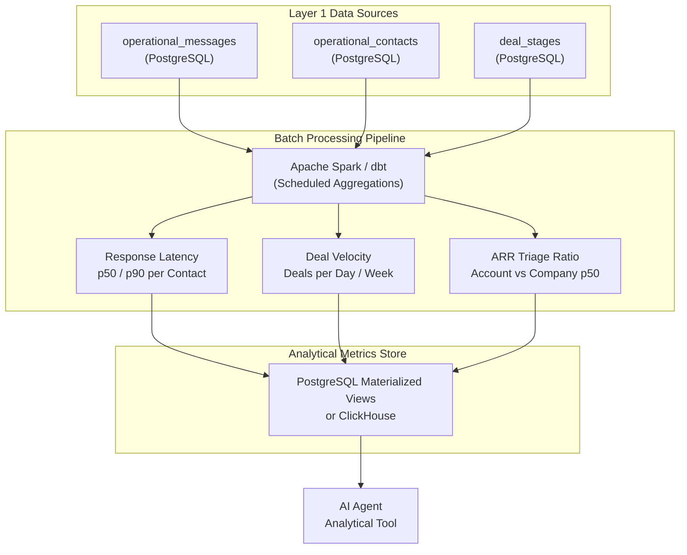

*זהו חלק 5 בסדרה הטכנית בת 7 חלקים על Context Layers עבור AI Agents. לפני קריאת צלילה עמוקה זו, מומלץ לקרוא את [חלק 3: סקירת הארכיטקטורה](/he/tech/building-an-effective-context-layer-part-3) ו-[חלק 4: צלילה עמוקה לשכבה 1](/he/tech/building-an-effective-context-layer-part-4).*

---

## למה אנחנו צריכים את השכבה הזו?

שכבה 1 עונה על *"מה קרה"*: ההודעות הגולמיות, אנשי הקשר, השרשראות. אבל היא לא יכולה לענות על *"מה זה אומר?"*

חשבו על שאלה פשוטה: *"ג'אנט לא ענתה כבר 48 שעות. האם כדאי לשלוח מעקב דחוף?"* שכבה 1 יכולה לספר לכם שההודעה האחרונה של ג'אנט הייתה לפני 48 שעות. אבל האם 48 שעות שתיקה זה חריג אצל ג'אנט? האם החשבון הזה בכלל שווה את הדחיפות? אלה **שאלות כמותיות ואנליטיות** שדורשות Baselines סטטיסטיים המחושבים על פני נתונים היסטוריים.

AI Agent לא יכול לחשב p50 Response Latencies, מהירויות עסקאות או Benchmarks של ARR תוך כדי שיחה על ידי סריקת מחרוזות הודעות גולמיות. המטריקות האלה חייבות להיות **מחושבות מראש** באמצעות צינורות Data Engineering ולהיחשף כ-Context אנליטי מובנה.

ללא שכבה 2, ה-Agent שלכם הוא קורא הודעות. עם שכבה 2, ה-Agent שלכם הוא אנליסט עסקי.

---

## היתרונות של שכבה זו

### Business Intelligence בתוך לולאת ה-Agent

מטריקות אנליטיות מחושבות מראש פותחות מחלקה חדשה לגמרי של יכולות Agent:

* **זיהוי שתיקה (Silence Detection)**: חישוב Baselines של p50 (חציון) ו-p90 Response Latency לכל איש קשר. אם ה-p50 Response Latency של ג'אנט הוא 72 שעות, הפסקה של 48 שעות היא התנהגות רגילה. אם ה-p50 שלה הוא 2 שעות, 48 שעות שתיקה היא אנומליה קריטית שמפעילה התראה.

<figure class="article-screenshot-figure">
  
  <figcaption>תרשים זיהוי שתיקה לפי Response Latency היסטורי: השוואת השתיקה הנוכחית מול מדדי p50 ו-p90 של איש הקשר.</figcaption>
</figure>

* **מהירות ונפח עסקאות (Deal Velocity and Volume Impact)**: הבנת כמה עסקאות העסק שלכם מעבד ביום משנה את חשבון ההחלטות. אם ג'אנט סוגרת עסקה אחת ביום, לכל עסקה יש השפעה עצומה וראוי לתשומת לב אנושית. אם היא סוגרת 100 עסקאות ביום, כללים אוטומטיים צריכים לטפל ברובן.

* **ARR Triage והקצאת מאמץ**: חישוב היחס בין ה-ARR של חשבון ל-ARR החציוני (p50) של החברה. אם החשבון הזה שווה $10,000 ARR בעוד ה-p50 Benchmark של החברה הוא $100,000 ARR, והלקוח שולח 15 בקשות פיצ'רים מורכבות, ה-Agent צריך להמליץ על פיצ'רים סטנדרטיים של המוצר במקום מאמץ הנדסי מותאם אישית.

<figure class="article-screenshot-figure">
  
  <figcaption>מטריצת קבלת החלטות עבור ARR Triage: הערכת ה-ARR של החשבון ביחס למדדי ייחוס כדי לתעדף משאבי טיפול.</figcaption>
</figure>

* **זיהוי מגמות (Trend Detection)**: מעקב אחר מטריקות לאורך זמן חושף מגמות בלתי נראות בנתונים גולמיים. האם זמן התגובה של החשבון הזה מתארך מחודש לחודש? האם מהירות העסקאות מואצת או מאטה?

### מתגובתי לפרואקטיבי

היתרון החזק ביותר של שכבה 2 הוא שהיא מעבירה את ה-Agent מ-**תגובתי** (עונה על שאלות כשנשאל) ל-**פרואקטיבי** (מציף תובנות לפני שהמשתמש בכלל שואל). ה-Agent יכול לסמן *"זמן התגובה של ג'אנט עלה פי 3 בהשוואה ל-Baseline ההיסטורי שלה"* ללא כל Prompt מהמשתמש.

---

## אילו כלים אני צריך?

<figure class="article-screenshot-figure">
  
  <figcaption>צינור עיבוד Data Engineering באצוות: ניצול Apache Spark ו-dbt לחישוב מראש של מטריקות אנליטיות עבור ה-Context Layer.</figcaption>
</figure>

### מנועי עיבוד באצוות (Batch Processing)

הכלים המרכזיים לשכבה 2 הם עיבוד נתונים באצוות:

* **Apache Spark**: לאגרגציות בקנה מידה גדול על פני מיליוני רשומות. Spark מצטיין בחישוב התפלגויות סטטיסטיות (אחוזונים p50, p90, p99) על פני מערכי נתונים שלמים. הטוב ביותר לחברות עם נפחי נתונים משמעותיים.
* **dbt (Data Build Tool)**: לטרנספורמציות מבוססות SQL שקל יותר לתחזק ולנהל בגרסאות. מודלים של dbt מגדירים את המטריקות שלכם כשאילתות SQL שרצות מעת לעת. הטוב ביותר לצוותים שרוצים להישאר באקוסיסטם ה-SQL.



### אחסון: Materialized Views מול Data Warehouse

היכן שומרים מטריקות מחושבות מראש תלוי בסקייל:

* **PostgreSQL Materialized Views**: לצוותים שרוצים לשמור הכל במסד נתונים אחד. צרו Materialized Views שמחשבות מראש את ה-Rollups שלכם ורעננו אותן מעת לעת. פשוט, יעיל ומספיק לרוב הסטארטאפים.
* **ClickHouse / TimescaleDB**: לעומסי Time-Series כבדים שבהם צריך שאילתות אנליטיות בפחות משנייה על פני מיליארדי שורות.
* **BigQuery / Redshift**: לארגונים שכבר יש להם Data Warehouse. חשבו מטריקות שם וסנכרנו תוצאות חזרה למאגר התפעולי.

### תזמון: Orchestration

עבודות Batch צריכות לרוץ על לוח זמנים:

* **Apache Airflow**: סטנדרט תעשייתי לתזמור DAGs מורכבים של צינורות נתונים. מטפל בתלויות, ניסיונות חוזרים וניטור.
* **Cron Jobs פשוטים**: לצוותים קטנים יותר, עבודת Cron מתוזמנת שמריצה מודל dbt כל שעה היא לעתים קרובות מספיקה. אל תעשו Over-Engineering לשכבת ה-Orchestration לפני שאתם צריכים את זה.

### ה-Trade-Off המרכזי: טריות מול עלות חישוב

כמה פעמים צריך לחשב מטריקות מחדש? כל שעה? כל 15 דקות? כל דקה?

רענון Materialized Views בתדירות גבוהה יותר נותן ל-Agent נתונים טריים יותר אבל עולה יותר חישוב. עבור רוב מקרי השימוש של CRM, **חישוב מחדש כל שעה** הוא הנקודה המתוקה: Baselines של Response Latency לא משתנים באופן משמעותי בתוך שעה, ועלות החישוב נשארת ניתנת לניהול.

---

## מלכודות נפוצות

### 1. חישוב מטריקות בזמן השאילתה

הטעות הנפוצה ביותר היא לדלג על חישוב מראש ולחשב אגרגציות בתוך קריאת ה-Tool של ה-Agent. שאילתת SQL שמחשבת p50 Response Latency על פני 2 מיליון הודעות לוקחת 3 עד 8 שניות. ה-Latency הזה בלתי מקובל בתוך לולאת שיחה. **חשבו מראש, אל תחשבו בזמן השאילתה.**

### 2. לא לנהל גרסאות של הגדרות מטריקות

מה נחשב "זמן תגובה"? הזמן מההודעה האחרונה לתגובה הראשונה? או הזמן מכל הודעה לכל תגובה? אם משנים את ההגדרה הזו בלי ניהול גרסאות, השוואות היסטוריות הופכות לחסרות משמעות. **התייחסו להגדרות מטריקות כמו לקוד: נהלו גרסאות, בדקו, עשו Review לשינויים.**

### 3. התעלמות ממקרי קצה סטטיסטיים

חשבון חדש עם 2 הודעות בלבד אין לו Baseline p50 משמעותי. חשבון עם נקודת נתונים בודדת מייצר "חציון" חסר משמעות. הצינור שלכם צריך **סף מדגם מינימלי** לפני יצירת מטריקות אמון. בלי זה, ה-Agent מקבל החלטות על סמך נתונים חסרי משמעות סטטיסטית.

### 4. Over-Engineering של מערך הנתונים

לא כל צוות צריך Apache Spark, Airflow ו-Data Warehouse ייעודי ביום הראשון. אם יש לכם 50,000 הודעות, Materialized View ב-PostgreSQL שמתרענן על ידי Cron Job כל שעה הוא יותר ממספיק. **התחילו עם הכלי הפשוט ביותר שפותר את ה-Access Pattern שלכם, ואז שדרגו כשהנתונים דורשים את זה.**

### 5. לא ליישר חלונות מטריקות עם המציאות העסקית

האם מטריקת Deal Velocity שלכם צריכה להשתמש בחלון מתגלגל של 30 יום או בחודש קלנדרי? האם Baselines של Response Latency צריכים לכסות את 90 הימים האחרונים או את 12 החודשים האחרונים? אלה **החלטות עסקיות**, לא החלטות הנדסיות. יישרו את חלונות המטריקות שלכם עם האופן שבו העסק באמת חושב על זמן.

---

## דוגמה מעשית: ה-CRM של ג'אנט בפעולה

במערכת ה-CRM של ג'אנט, שכבה 2 צורכת נתונים תפעוליים גולמיים משכבה 1 ומייצרת מטריקות אנליטיות מחושבות מראש שה-Agent מתשאל באופן מיידי.

### תרחיש: זיהוי שתיקה עם Baselines של Response Latency

משתמש מבקש מה-AI Agent: *"ג'אנט לא ענתה להצעה שלנו שנשלחה לפני 48 שעות. האם כדאי לשלוח מעקב דחוף?"*

ה-Agent קורא לכלי האנליטי שלו, שמתשאל את מאגר המטריקות המחושבות מראש:

```json
{
  "account_email": "janet@business.com",
  "p50_response_latency_hours": 72.0,
  "p90_response_latency_hours": 96.0,
  "hours_currently_silent": 48.0,
  "is_anomalously_silent": false,
  "account_arr_usd": 340000.0,
  "arr_ratio_to_company_p50": 3.4,
  "deal_velocity_per_week": 2.3,
  "response_trend_30d": "stable"
}
```

**תגובת ה-Agent**: *"ה-Baseline של Response Latency של ג'אנט הוא 3 ימים (p50). אחרי 48 שעות, היא עדיין בתוך חלון התגובה הרגיל שלה. מכיוון שזהו חשבון בעל ערך גבוה ($340k ARR, פי 3.4 מה-Baseline של החברה), אני ממליץ להמתין עוד 24 שעות לפני מעקב כדי להימנע מהרושם של לחץ יתר."*

### תרחיש: ARR Triage והקצאת מאמץ

משתמש אחר שואל: *"הלקוח דייב שלח 15 בקשות פיצ'רים. כמה מאמץ הנדסי מותאם אישית כדאי להשקיע?"*

```json
{
  "account_name": "Dave's Startup",
  "account_arr_usd": 8500.0,
  "arr_ratio_to_company_p50": 0.085,
  "custom_request_count": 15,
  "avg_engineering_hours_per_request": 4.0,
  "total_estimated_hours": 60.0
}
```

**תגובת ה-Agent**: *"ה-ARR של החשבון של דייב ($8,500) הוא 8.5% מהחציון של החברה ($100,000). השקעת 60 שעות הנדסה על פיצ'רים מותאמים אישית לחשבון הזה אינה כדאית מבחינת עלות-תועלת. אני ממליץ להציע פיצ'רים סטנדרטיים של המוצר ולהסלים רק את 2 הבקשות המובילות לבדיקת צוות המוצר."*

---

## סיכום והצעדים הבאים

שכבה 2 הופכת מחרוזות אירועים גולמיות ל-Business Intelligence כמותי. על ידי הרצת Spark או dbt Rollups על לוח זמנים, ה-AI Agent שלכם מעריך Baselines סטטיסטיים באופן מיידי ללא הרצת אגרגציות SQL איטיות בזמן ריצה.

ה-Trade-off המרכזי בשכבה זו הוא **טריות מול עלות חישוב**: חישוב מחדש תכוף יותר נותן מטריקות טריות יותר אבל עולה יותר. עבור רוב מקרי השימוש, רענון כל שעה הוא האיזון הנכון.

המשיכו ל-[חלק 6: צלילה עמוקה לשכבה 3 (אותות מעובדים מראש ו-Multimodal OCR)](/he/tech/building-an-effective-context-layer-part-6) כדי לראות כיצד חילוץ פיצ'רים אסינכרוני מעבד סנטימנט, Intent ונספחי מסמכים לפני הרצת ה-Agent.
