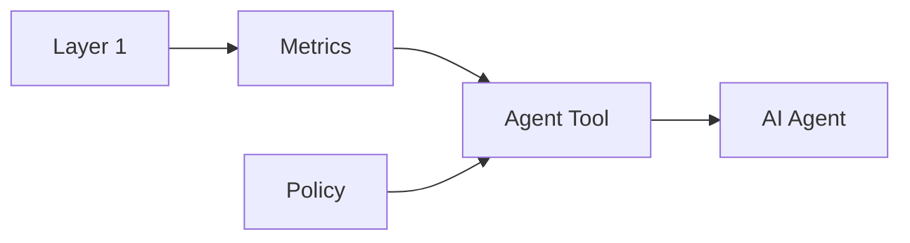

*זהו חלק 5 בסדרה בת 7 חלקים על Context Layers עבור AI Agents. [חלק 4: קליטת דאטה תפעולי](/he/tech/building-an-effective-context-layer-part-4) הראה איך ה-CRM יוצר רשומה אמינה אחת של אנשי קשר, הודעות ושרשורים. החלק הזה הופך את ההיסטוריה ל-Context אנליטי מנוהל.*

**TL;DR**: שכבה 2 היא ממשק אנליטי מנוהל. היא מגדירה מה כל מטריקה אומרת ומחזירה את הערך יחד עם Cohort, גודל מדגם, אי ודאות, טריות, גרסה ו-Lineage. המטריקה מספקת ראיות. Policy עסקי נפרד מחליט אם ה-Agent צריך להמתין, להודיע או להסלים.

## האם השתיקה של ג׳אנט חריגה?

ה-CRM שלח לג׳אנט הצעת חידוש ביום שני בבוקר. ביום רביעי היא עדיין לא ענתה. המשתמש שואל:

*"ג׳אנט שקטה כבר 48 שעות. כדאי לשלוח Follow Up דחוף?"*

שכבה 1 יכולה להחזיר את ההצעה, זמן השליחה, השרשור והזהות של ג׳אנט. היא לא יכולה לקבוע אם השתיקה חריגה.

גם "48 שעות" מסתיר החלטות. האם סופרים לילות, סופי שבוע וחגים? האם ג׳אנט עונה להצעות חידוש לאט יותר מאשר לשאלות Support? כמה שיחות קודמות בכלל קיימות?

לפני בחירת PostgreSQL, ClickHouse או Data Warehouse, הגדירו את השאלות:

1. כמה שעות עבודה עברו מאז ההודעה שדורשת תשובה?
2. כמה שיחות דומות עדיין פתוחות אחרי פרק זמן כזה?
3. אילו שיחות יצרו את ההשוואה וכמה אי ודאות נשארה?
4. עד כמה הדאטה מלא וטרי?
5. איזו פעולה ה-Policy העסקי דורש לפי הראיות?

> **מתחילים משאלת ההחלטה**: מטריקה מועילה רק כאשר ההגדרה והראיות שלה מתאימות להחלטה שצורכת אותה.

## שכבה 2 היא ממשק, לא Batch Pipeline

ה-Contract יכול להישען על שאילתת Warehouse חיה, שאילתת PostgreSQL מאונדקסת, ClickHouse או Serving Table. Rollups מתוזמנים הם דרך מימוש אחת, לא ההגדרה של השכבה.

```mermaid
flowchart LR
    Events["Layer 1"] --> Metrics["Metrics"]
    Metrics --> Tool["Agent Tool"]
    Policy["Policy"] --> Tool
    Tool --> Agent["AI Agent"]
```

ה-Agent לא צריך לדעת איזה מנוע חישב את התוצאה. הוא צריך לדעת מה התוצאה אומרת, מתי חושבה והאם הראיות מספיק חזקות.

## מגדירים את המטריקה לפני שמחשבים אותה

"זמן תגובה" נשמע ברור עד ששני צוותים מממשים אותו אחרת. אחד מתחיל את השעון בהודעה הראשונה ברצף. השני מתחיל באחרונה. אחד סופר תשובה אוטומטית והשני סופר רק אדם.

Contract שימושי צריך להגדיר:

| שדה | הגדרה |
|---|---|
| Metric | `contact_response_survival` |
| Pairing | הרצף של החברה מסתיים בתשובה האנושית הראשונה של הלקוח באותו Thread |
| Start | הודעת החברה האחרונה שדורשת תשובה |
| Clock | שעות עבודה לפי לוח השנה וה-Time Zone של ה-Account |
| Exclusions | תשובות אוטומטיות, Notes פנימיים והודעות שחזרו |
| Event time | `occurredAt` של המקור |
| Window | 180 הימים שקדמו לזמן הבדיקה |
| Cohort | אותו Contact ו-Channel, עם Fallback ל-Segment |
| Sample rule | משתמשים ב-Contact רק אחרי 20 שיחות נצפות |
| Version | `contact_response_survival_v2` |
| Freshness | Source Watermark בן 15 דקות לכל היותר |

סף המדגם אינו חוק סטטיסטי אוניברסלי. הוא מונע משתי תשובות ישנות להיראות כמו דפוס אישי יציב. כאשר אין מספיק היסטוריה, הכלי משתמש ב-Fallback Cohort ומציין זאת.

## שיחה פתוחה עדיין לא קיבלה זמן תגובה סופי

נניח שג׳אנט ענתה בעבר אחרי 3, 6, 8, 20 ו-30 שעות עבודה. השיחה הנוכחית פתוחה כבר 16 שעות.

לשיחה הנוכחית אין משך סופי. ידוע רק שזמן התגובה גדול מ-16 שעות. זה נקרא **Right Censored Data**. במילים פשוטות, השעון עדיין רץ.

Survival Curve משתמש גם בשיחות שהסתיימו וגם בשיחות שעדיין פתוחות. כאן Survival פירושו "עדיין ללא תשובה". הכלי יכול להעריך את ההסתברות ששיחה דומה תישאר פתוחה מעבר ל-16 שעות.

אם ההערכה היא 68%, השתיקה נפוצה ב-Cohort. אם היא 4%, היא חריגה. אף מספר לא מחליט לבדו מה לעשות. צריך גם גודל מדגם ו-Uncertainty Interval.

[NIST מסביר Censored Data](https://itl.nist.gov/div898/handbook/apr/section1/apr131.htm) ומציג [Kaplan Meier Estimation](https://www.itl.nist.gov/div898/handbook/apr/section2/apr215.htm) שמשלב תצפיות שהסתיימו ותצפיות פתוחות.

<figure class="article-screenshot-figure">
  
  <figcaption>השתיקה הנוכחית מוצגת מול שיחות דומות, יחד עם Cohort וגודל מדגם.</figcaption>
</figure>

## ראיות ו-Policy הם Contracts שונים

המטריקה עונה: *"עד כמה השתיקה של ג׳אנט חריגה לפי ההשוואה שהגדרנו?"*

ה-Policy עונה: *"לפי הראיות ומצב החידוש, איזו פעולה ה-CRM צריך לבצע?"*

שתיקה נדירה יכולה להיות חסרת משמעות. שתיקה רגילה עדיין יכולה לדרוש פעולה אם מחר יש Deadline חוזי. Account Value, העדפות לקוח, התחייבויות ועלות טעות שייכים ל-Policy.

> **מטריקות מתארות את הראיות**: ה-Policy מחזיק את הפעולה, הספים והעלות המקובלת של החלטה שגויה.

## בוחרים Serving Path לפי Access Pattern

| Access Pattern | מימוש מתאים |
|---|---|
| שאילתה מוגבלת על היסטוריה קטנה | PostgreSQL מאונדקס |
| אגרגציה יציבה שחוזרת | PostgreSQL Materialized View |
| ניתוח רחב שכבר נמצא ב-Warehouse | BigQuery או Redshift |
| קריאות אנליטיות אינטראקטיביות תכופות | ClickHouse |
| Contract עם Latency קשיח | Serving Table מתוחזק |

התחילו עם PostgreSQL כאשר הוא עומד בדרישה. `REFRESH MATERIALIZED VIEW` מחליף את תוכן ה-View. `CONCURRENTLY` מאפשר קריאות בזמן הרענון אבל דורש Unique Index מתאים. ראו את [PostgreSQL Materialized Views](https://www.postgresql.org/docs/current/rules-materializedviews.html).

dbt אינו מנוע חישוב חלופי ל-Spark. הוא מגדיר, בודק ומתעד Transformations שה-Data Platform מריץ. אין גם מרווח רענון אוניברסלי. לכל שדה צריך Freshness Target משלו.

## Context אנליטי חייב לשרוד שינויים

* אירוע שמגיע באיחור צריך לעדכן את השיחה ואת החלונות שהושפעו
* תיקון או מחיקה במקור צריכים לבטל Projection ישן
* מיזוג Contacts צריך להיות הפיך ולגרור Rebuild
* Metric Version חדש צריך להיבנות לצד הישן לפני Migration
* Refresh שנכשל צריך להחזיר `stale`, לא תשובה שקטה
* המלצה היסטורית צריכה להיות ניתנת לשחזור לפי Watermark, Metric Version ו-Policy Version

## חושפים כלי אנליטי צר

`getContactResponseContext(contactId, threadId, observedAt)` צריך להחזיר משך נוכחי, Survival Probability, Uncertainty, Cohort, גודל מדגם, Freshness ו-Lineage. הוא לא צריך להחזיר SQL פתוח או שדה נסתר בשם `is_anomalous`.

## חוזרים לחידוש של ג׳אנט

ה-CRM פועל בשלושה שלבים:

1. `findContact` פותר את ג׳אנט ל-Contact ID קנוני
2. `getContactResponseContext` מחזיר 16 שעות עבודה, הערכת Survival וטריות
3. `evaluateFollowUpPolicy` מפעיל Policy שדורש אישור אנושי לפני הודעה דחופה

ה-Agent מסביר ש-68% מהשיחות הדומות עדיין פתוחות בשלב הזה, שהדאטה טרי, ושאין Deadline ב-24 השעות הקרובות. הוא ממליץ להמתין עד בוקר העבודה הבא ולא מציג את ההערכה כוודאות.

## מודל ההפעלה של שכבה 2

שכבה 2 אינה Spark, dbt או אוסף Rollups. היא ה-Contract האנליטי המנוהל המשותף למוצר ול-Agent.

> **הכלל של שכבה 2**: הגדירו כל מטריקה כ-Contract מנוהל גרסה, החזירו טריות, גודל מדגם, אי ודאות ו-Lineage יחד עם הערך, ותנו ל-Policy עסקי מפורש לבחור את הפעולה.

המשיכו ל-[חלק 6: בניית אותות מעובדים מראש עם גרסאות](/he/tech/building-an-effective-context-layer-part-6).
