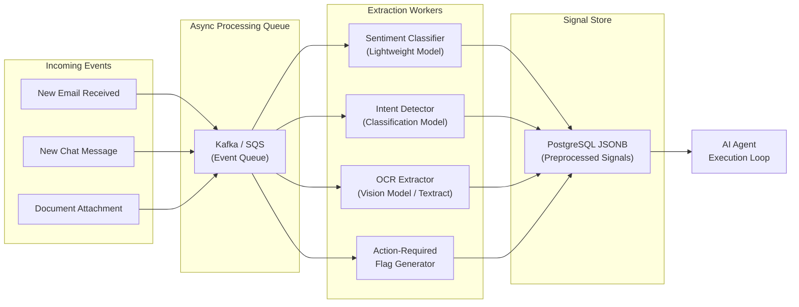

*זהו חלק 6 בסדרה הטכנית בת 7 חלקים על Context Layers עבור AI Agents. לפני קריאת צלילה עמוקה זו, מומלץ לקרוא את [חלק 3: סקירת הארכיטקטורה](/he/tech/building-an-effective-context-layer-part-3), [חלק 4: שכבה 1 נתונים תפעוליים](/he/tech/building-an-effective-context-layer-part-4), ו-[חלק 5: שכבה 2 מטריקות אנליטיות](/he/tech/building-an-effective-context-layer-part-5).*

---

## למה אנחנו צריכים את השכבה הזו?

שכבה 1 נותנת לכם נתונים גולמיים. שכבה 2 נותנת לכם מטריקות סטטיסטיות. אבל יש מחלקה של שאלות שדורשת **חילוץ אינטליגנציה**: הבנת משמעות, סנטימנט ותוכן מובנה מתוך קלטים לא מובנים.

שאלו את עצמכם שאלה פשוטה: **איזה נתונים אני יכול לעבד מראש, לפני שלולאת ה-Agent בכלל מתחילה?**

אם אימייל נכנס מכיל תמונת חשבונית מסורקת או הצעה בת מספר עמודים ב-PDF, לכפות על ה-Agent להריץ OCR ולחלץ פריטים תוך כדי אינטראקציה עם המשתמש זה איטי (5 עד 15 שניות של Model Inference) ויקר (עלויות טוקנים של Frontier Model). אם אתם יודעים שתצטרכו ניתוח סנטימנט על כל אימייל של לקוח, אין סיבה לחשב את זה חי בכל פעם. חשבו את זה פעם אחת כשהאימייל מגיע, שמרו את התוצאה, והגישו אותה באופן מיידי כשה-Agent צריך אותה.

העיקרון המרכזי של שכבה 3 הוא: **כל דבר שאתם בטוחים שתצטרכו, ויכולים לחשב באופן אסינכרוני, צריך להיות מעובד מראש לפני שלולאת ה-Agent רצה.**

---

## היתרונות של שכבה זו

### 1. כלכלת Batch: הפחתת עלויות של 50% עד 90%

כאשר מעבדים נתונים מראש, לא צריך תגובות סינכרוניות בזמן אמת. על ידי שליחת מסמכים נכנסים דרך Batch Inference APIs, נפתח חיסכון דרמטי בעלויות.

הסתכלו על [טבלת התמחור של AWS Bedrock](https://aws.amazon.com/bedrock/pricing/):

<figure class="article-screenshot-figure">
  
  <figcaption>מבנה תמחור של מודלי Anthropic ב-AWS Bedrock: השוואת תמחור Standard מול Batch Inference והנחות Prompt Caching.</figcaption>
</figure>

Batch Inference מציע **הנחה של 50% על תמחור טוקנים** בתמורה לחלון עיבוד (עד 24 שעות). בשילוב עם Prompt Caching על הוראות System חוזרות, עלויות טוקנים של Input יורדות עד 90%. מחליפים מהירות מסירה בזמן אמת בחיסכון תפעולי מסיבי.

### 2. Model-Task Matching

בצינור Batch אופליין, אפשר להתאים **מודלים קלים ומתמחים** למשימות חילוץ ספציפיות, במקום לנתב כל שאילתה דרך Frontier Model יקר. מודל סיווג קטן מטפל ב-Sentiment Tagging בצורה מושלמת. מודל Vision מתמחה מחלץ נתונים טבלאיים מ-PDFs בזול ומהר יותר מ-Claude או GPT-4 כלליים. לא צריכים מודל של $15 למיליון טוקנים כדי לענות "האם האימייל הזה כועס?"

<figure class="article-screenshot-figure">
  
  <figcaption>ניתוב משימות חכם למודלים מתאימים: התאמת מודלים קלים ומתמחים למשימות חילוץ ספציפיות במקום מודלי ענק יקרים.</figcaption>
</figure>

### 3. Composability מובנית

כל פלט של נתונים מעובדים מראש נשמר חזרה למסד הנתונים כ-JSON מובנה. פיצ'רים ברמה גבוהה יותר יכולים **להיבנות על גבי אבני הבניין האלה** ללא הפעלת LLM בכלל.

לדוגמה, אם צינור אסינכרוני מחשב ושומר ציון `deal_health` לכל עסקה פעילה, חישוב `account_health` כולל מאוחר יותר לא דורש קריאת LLM. מאגרגים את ערכי ה-`deal_health` המעובדים מראש באופן דטרמיניסטי באמצעות קוד או SQL. ה-Composability הזו אפשרית רק כאשר אותות מחולצים מראש ונשמרים כנתונים מובנים.

### 4. בדיקת מוצר אופליין ו-Evals

עיבוד נתונים מראש ב-Worker Jobs ברקע מאפשר **לבדוק ולהעריך את פיצ'רי ה-AI שלכם אופליין** לפני שהם מגיעים ללקוחות חיים. כפי שנקבע ב-[חלק 2: הגדרה ומדידה של Context Layer אפקטיבי](/he/tech/building-an-effective-context-layer-part-2), הרצת Evals אוטומטיים וסימולציות מול אותות מעובדים מראש מבטיחה איכות מוצר, בטיחות ומעקב אחר רגרסיות לפני הפעלת המשתמש.

### 5. ה-Trade-Off העיקרי: חישוב ספקולטיבי מראש

העלות העיקרית של שכבה 3 היא **Speculative Pre-Computation**. מוציאים חישוב רקע על פיצ'רים לפני שיודעים בוודאות אם Session חי של משתמש יתשאל אותם. מהמרים שעלות החישוב ברקע שווה את התגובה ללא Latency, מחושבת מראש, כשה-Agent באמת צריך את ה-Context הזה בזמן אמת. ההקלה היא לעבד מראש רק אותות עם **שיעורי שאילתה צפויים גבוהים**: סנטימנט על אימיילים של לקוחות (כמעט תמיד נדרש) מול OCR מלא על כל נספח ניוזלטר (נדרש לעתים רחוקות).

---

## אילו כלים אני צריך?

### תורי הודעות: צינורות Worker אסינכרוניים

עמוד השדרה של שכבה 3 הוא צינור עיבוד אסינכרוני:

* **Kafka / SQS**: לארכיטקטורות Event-Driven שבהן אימיילים ומסמכים נכנסים מפעילים עבודות חילוץ אוטומטית. Kafka מספק יכולות Ordering ו-Replay. SQS פשוט יותר להפעלה לצוותים קטנים יותר.
* **Celery / Bull**: לדפוסי Task-Queue שבהם מכניסים עבודות חילוץ לתור ו-Workers מושכים אותן. Celery (Python) ו-Bull (Node.js) הם בחירות פופולריות לצוותים שכבר באקוסיסטמים האלה.



### מודלים לחילוץ

סוגי אותות שונים דורשים כלי חילוץ שונים:

* **סיווג Sentiment ו-Intent**: מודלי סיווג מכווננים (Fine-Tuned) או LLMs קטנים. DistilBERT מכוונן על נתוני Customer Support מטפל בסיווג Sentiment בחלק מהעלות של Frontier Model.
* **Multimodal OCR**: AWS Textract, Google Document AI או מודלי Vision מתמחים לחילוץ נתונים מובנים (פריטי שורה, סכומים, מספרי חשבונית) מ-PDFs סרוקים ותמונות.
* **דגלי Action-Required**: מסווגים מבוססי כללים בשילוב מודלים קלים לקביעה אם אינטראקציה נכנסת דורשת תגובה אנושית או של Agent, או שהיא אינפורמטיבית (ניוזלטר, התראת מערכת, תגובת Out-of-Office).

### LLM Batch APIs

למשימות חילוץ שכן דורשות הסקת LLM (סיווג Intent מורכב, ניתוח Sentiment דק), השתמשו ב-Batch Inference Endpoints:

* **AWS Bedrock Batch Inference**: הנחת 50% על עלות טוקנים עם חלון עיבוד של עד 24 שעות.
* **OpenAI Batch API**: הפחתת עלות דומה לעיבוד אופליין.
* **Prompt Caching**: כאשר מריצים את אותו System Prompt על אלפי אימיילים, Prompt Caching מפחית עלויות Input Tokens עד 90%.

### אחסון: Signal Store מובנה

אותות מעובדים מראש צריכים להישמר כ-**JSON מובנה** לצד ההודעה המקורית במסד הנתונים התפעולי:

* **עמודות PostgreSQL JSONB**: שמירת אותות מחולצים (סנטימנט, Intent, תוצאות OCR) כשדות JSONB על רשומת ההודעה. ניתן לתשאל, לאנדקס ולהרכיב.
* **Feature Store ייעודי**: לצוותים גדולים יותר, Feature Store ייעודי (Feast, Tecton) מספק ניהול גרסאות, מעקב Lineage ותשתית הגשה.

### ה-Trade-Off המרכזי: כיסוי חישוב מראש מול חישוב מבוזבז

לא הכל צריך להיות מעובד מראש. מסגרת ההחלטה פשוטה: **כמה סביר שה-Agent יתשאל את האות הזה, וכמה יקר לחשב אותו חי?** הסתברות שאילתה גבוהה ועלות חישוב גבוהה אומר לעבד מראש. הסתברות שאילתה נמוכה ועלות חישוב נמוכה אומר לחשב לפי דרישה.

---

## מלכודות נפוצות

### 1. לעבד הכל במקום מה שה-Agent באמת מתשאל

הרצת OCR מלא על כל נספח אימייל, כולל ניוזלטרים שיווקיים וקבלות אוטומטיות, מבזבזת חישוב על אותות שה-Agent לעולם לא ישתמש בהם. **פרופלו את דפוסי קריאות ה-Tool בפועל של ה-Agent שלכם** ועבדו מראש רק אותות עם שיעורי Hit גבוהים.

### 2. לא לנטר דיוק חילוץ לאורך זמן

מסווג Sentiment שאומן על נתוני 2024 עלול לסטות ככל שדפוסי שפת הלקוחות מתפתחים. אם המסווג מתחיל לסווג לקוחות מתוסכלים כ-"Neutral," ה-Agent מקבל החלטות Triage שגויות. **הריצו Evals תקופתיים על דיוק מודל החילוץ** ואמנו מחדש כאשר הדיוק יורד מתחת לסף שלכם.

### 3. צימוד הדוק בין Schema החילוץ ל-Schema של כלי ה-Agent

אם כלי ה-Sentiment של ה-Agent מצפה ל-`{"sentiment": "Frustrated"}` וצינור החילוץ שלכם מפלט `{"tone": "angry"}`, שינוי שם Schema בצינור החילוץ שובר בשקט את ה-Agent. **נהלו גרסאות של Schemas האותות שלכם** ואמתו תאימות בין פלט החילוץ לקלט כלי ה-Agent.

### 4. להריץ חילוץ סינכרוני בתוך לולאת ה-Agent "רק בינתיים"

כל צוות שאומר "נעביר את זה ל-Async אחר כך" לעולם לא עושה את זה. הרצת OCR בתוך לולאת ה-Agent בזמן אמת מוסיפה 5 עד 15 שניות של Latency לכל מסמך. **התחילו Async מיום הראשון.** עלות התשתית של הקמת Kafka Consumer היא טריוויאלית בהשוואה לעלות חוויית המשתמש של תגובת Agent של 15 שניות.

### 5. לא לנצל Prompt Caching בעבודות Batch

כאשר מעבדים 10,000 אימיילים דרך אותו System Prompt, כל אימייל משלם עלות Input Tokens מלאה על הוראות ה-System. Prompt Caching מפחית את זה כמעט לאפס אחרי ההפעלה הראשונה. **תמיד אפשרו Prompt Caching בצינורות Batch Inference.**

---

## דוגמה מעשית: ה-CRM של ג'אנט בפעולה

במערכת ה-CRM של ג'אנט, אימייל נכנס מגיע מהלקוח דייב עם חשבונית PDF סרוקה מצורפת.

### זרימת העיבוד האסינכרוני

כאשר האימייל מגיע, צינור ה-Ingestion (שכבה 1) שומר את ההודעה הגולמית. במקביל, הוא דוחף אירוע חילוץ לתור Kafka. ה-Workers של שכבה 3 קולטים אותו ומריצים שלוש עבודות חילוץ במקביל:

1. **סיווג Sentiment**: מנתח את גוף האימייל ומזהה טון מתוסכל.
2. **זיהוי Intent**: מסווג את האימייל כ-"Billing Dispute."
3. **חילוץ OCR**: מפרסר את חשבונית ה-PDF המצורפת ומחלץ פריטי שורה מובנים.

### Payload של אותות מחושבים מראש

כאשר משתמש פותח את הפנייה דקות מאוחר יותר, ה-Agent מתשאל את Signal Store המעובד מראש ומקבל הכל באופן מיידי:

```json
{
  "sender_email": "dave@client.com",
  "sentiment": "Frustrated",
  "intent_classification": "Billing Dispute",
  "requires_human_escalation": true,
  "extracted_invoice": {
    "invoice_number": "INV-9042",
    "disputed_line_item": "Custom Integration Fee",
    "disputed_amount_usd": 1500.0,
    "invoice_date": "2026-07-15",
    "total_amount_usd": 4200.0
  }
}
```

**תוצאה**: ה-Agent מסמן מיידית את מחלוקת החיוב, מציג את פריט השורה השנוי במחלוקת ($1,500 עמלת אינטגרציה מותאמת), ומכין טיוטת פתרון מותאמת. אפס הפעלות מודל בזמן ריצה. אפס עיכובי פרסור PDF. כל התגובה מחושבת מראש.

---

## סיכום והצעדים הבאים

שכבה 3 מסירה עיבוד מסמכים וחילוץ אינטליגנציה מלולאת ה-Agent בזמן אמת. על ידי ניצול כלכלת Batch, Model-Task Matching, Composability מובנית ו-Evals אופליין, ה-Agent שלכם מקבל Feature Flags מובנים ועשירים ללא כל עיכוב בזמן ריצה.

ה-Trade-off המרכזי בשכבה זו הוא **Speculative Pre-Computation**: משקיעים חישוב רקע על ההימור שה-Agent יצטרך את האותות האלה. הקלו על בזבוז על ידי פרופילינג של דפוסי שאילתות בפועל ועיבוד מראש רק של אותות עם שיעורי Hit גבוהים.

עברו לפרק האחרון, [חלק 7: צלילה עמוקה לשכבה 4 (Semantic Memory ו-Graph RAG)](/he/tech/building-an-effective-context-layer-part-7), כדי ללמוד כיצד זיכרון ארגוני והיסטוריית יחסים משלימים את ה-Context Layer.
