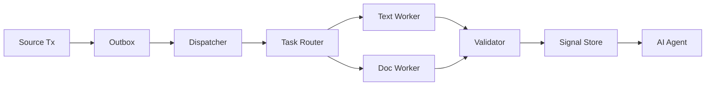

*זהו חלק 6 בסדרה בת 7 חלקים על Context Layers עבור AI Agents. [חלק 4](/he/tech/building-an-effective-context-layer-part-4) בנה את שכבה 1, ו-[חלק 5](/he/tech/building-an-effective-context-layer-part-5) הגדיר Context אנליטי מנוהל.*

**TL;DR**: שכבה 3 מחשבת עבודה נגזרת לפני שה-Agent צריך אותה ושומרת כל תוצאה כאות עם גרסה. האות נשאר מחובר לראיות, ל-Extractor Version, ל-Confidence, לטריות ולמצב Review. Pipeline אמין משתמש ב-Transactional Outbox, ב-Idempotent Workers ובמצבים מפורשים: `ready`, `pending`, `stale`, `failed` או `review_required`.

## ג׳אנט מערערת על חשבונית

ג׳אנט שולחת אימייל עם חשבונית סרוקה:

> חיוב ההקמה בעמוד 2 לא תואם למה שסיכמנו. תוכלו לבדוק אותו לפני שאאשר את החשבונית?

המשתמש שואל: *"על מה ג׳אנט מערערת, ואיזו שורה בחשבונית תומכת בטענה?"*

שכבה 1 שמרה את האימייל ואת הקובץ. עדיין צריך לזהות Billing Dispute, לקרוא את החשבונית, לחלץ Line Items ולחבר את הביטוי "חיוב הקמה" לשורה המתאימה.

התוצאה אינה אמת מוחלטת. היא **Derived Claim עם גרסה וראיות**.

## מגדירים את האות לפני ה-Pipeline

אות יכול להיות Intent, שדה ממסמך, Action Flag או קישור בין שתי ראיות. במקרה של ג׳אנט:

1. Intent האימייל הוא `billing_dispute`
2. מספר החשבונית הוא `INV-9042`
3. בעמוד 2 מופיע `Custom Setup Fee` בסך `$1,500`
4. הביטוי של ג׳אנט כנראה מתייחס לשורה הזאת
5. הקישור דורש Review כי ההתאמה אינה מדויקת

Contract שימושי שומר `sourceVersion`, `extractorVersion`, `schemaVersion`, ראיות, Confidence, זמן יצירה ומצב Review. שינוי במקור או ב-Extractor יוצר גרסה חדשה במקום לדרוס היסטוריה.

```json
{
  "id": "sig_invoice_dispute_4820_v3",
  "kind": "invoice_dispute",
  "status": "review_required",
  "sourceVersion": 4,
  "extractorVersion": "3.2.1",
  "schemaVersion": 2,
  "value": {
    "invoiceNumber": "INV-9042",
    "candidateLineItem": "Custom Setup Fee",
    "candidateAmountUsd": 1500
  },
  "evidenceIds": ["msg_4820", "invoice_page_2_row_3"],
  "confidence": 0.78,
  "producedAt": "2026-08-01T11:06:42Z",
  "reviewReason": "ambiguous_line_item"
}
```

## מחליטים מה לעבד מראש

Query Probability ועלות חישוב חי אינן מספיקות. בדקו גם טריות, תדירות שינוי המקור, עלות Reprocessing, אחסון, פרטיות ועלות טעות.

```text
preprocess when:
expected use × avoided live cost
>
compute + refresh + storage + privacy + error cost
```

Invoice Fields שמתושאלים לעיתים קרובות הם מועמד טוב. OCR מלא על כל Newsletter הוא בדרך כלל בזבוז. שאלה נדירה עם דאטה שמשתנה מהר יכולה להישאר On Demand.

> **מעבדים מראש ערך מדוד**: הקדימו עבודה כאשר היא חוסכת עלות אמיתית ויכולה להישאר טרייה, פרטית ומדויקת מספיק.

## מפרסמים עבודה בלי לאבד אותה

שמירת האימייל ואז פרסום ל-Kafka יוצרים Dual Write. קריסה בין הפעולות יכולה להשאיר הודעה ללא עבודת חילוץ.

השתמשו ב-[Transactional Outbox](https://docs.aws.amazon.com/prescriptive-guidance/latest/cloud-design-patterns/transactional-outbox.html):

1. שומרים את רשומת המקור ואת ה-Outbox Row באותה Transaction
2. Dispatcher מפרסם רק Rows שבוצע להם Commit
3. מסמנים Published רק אחרי אישור מה-Broker
4. מניחים שתהיה מסירה כפולה ובונים Consumers שהם Idempotent

Consumer Group אחד של Kafka או Queue אחד של SQS לא שולחים אוטומטית אירוע לכל Extractor. השתמשו ב-Consumer Groups נפרדים, Task Topics, Router מפורש, או [SNS עם כמה SQS Queues](https://docs.aws.amazon.com/sns/latest/dg/sns-common-scenarios.html).


```mermaid
flowchart LR
    Source["Source Tx"] --> Outbox["Outbox"]
    Outbox --> Dispatch["Dispatcher"]
    Dispatch --> Router["Task Router"]
    Router --> Text["Text Worker"]
    Router --> Doc["Doc Worker"]
    Text --> Check["Validator"]
    Doc --> Check
    Check --> Store["Signal Store"]
    Store --> Agent["AI Agent"]
```

בנו Job Key דטרמיניסטי מ-Tenant, Source Identity, Source Version, Signal Kind, Extractor Version ו-Schema Version. כך Retry לא יוצר Claim פעיל נוסף.

הגדירו Timeout לכל קריאה, מספר Retries מוגבל, Dead Letter Path ו-Replay. שמרו Terminal Failure במקום להחזיר שורה חסרה שה-Agent עלול לפרש כ-"אין אות".

## בוחרים את השיטה הקטנה שעוברת Evaluation

1. Rules לתנאים מדויקים ויציבים
2. Document Parser לשדות ולטבלאות
3. Classifier ל-Label Set צר
4. LLM כאשר צריך Reasoning גמיש או קישור בין מקורות

[Amazon Textract AnalyzeExpense](https://docs.aws.amazon.com/textract/latest/dg/expensedocuments.html) ו-[Google Document AI](https://cloud.google.com/document-ai/docs/processors-list) מחלצים שדות ו-Line Items. זו לא רק פעולת OCR, אלא גם Layout Analysis, Extraction ו-Normalization.

<figure class="article-screenshot-figure">
  
  <figcaption>כל משימה משתמשת בשיטה הקטנה ביותר שעוברת את ה-Evaluation Gate שלה.</figcaption>
</figure>

## מפרידים Batch Pricing מ-Prompt Caching

הטענות הבאות נבדקו מול מסמכי הספקים ב-27 באוגוסט 2026:

* [Amazon Bedrock](https://aws.amazon.com/bedrock/pricing/) מציע Batch בהנחה של 50% למודלים נבחרים. Bedrock Prompt Caching זמין רק ב-On Demand ואינו נתמך ב-Batch
* [Anthropic Message Batches](https://docs.anthropic.com/en/docs/build-with-claude/batch-processing) מאפשר לשלב Batch ו-Caching, אבל Cache Hits הם Best Effort
* [OpenAI Batch](https://developers.openai.com/api/docs/guides/batch) מציע הנחה של 50%. הנחת Prompt Caching חלה רק על Input Tokens מתאימים ולא על כל הבקשה

שמרו במודל העלות את המודל, האזור, תאריך המחיר, Input, Output ו-Cache Hits שנמדדו.

## מקדמים Extractor דרך Evaluation Gates

מדדו Precision, Recall ו-F1 לכל Class חשוב. עבור מסמכים, בדקו Exact Match לכל שדה ו-Line Item. נתחו Slices לפי שפה, איכות סריקה, Template וסוג קובץ.

הגדירו Threshold שבו המערכת עוברת ל-`review_required`. מדדו גם Downstream Outcome: האם ה-Agent בחר את החשבונית הנכונה, ציטט את הראיה הנכונה ונמנע מהסלמה שגויה.

## שומרים כל תוצאה לפי Access Pattern

* Typed Columns לשדות יציבים שמסננים או מצרפים לעיתים קרובות
* JSONB לפרטים שמשתנים ול-Evidence Metadata
* Object Storage ל-PDFs, תמונות ו-Payloads גדולים
* Feature Store רק כאשר אותו Feature חייב להיות עקבי בין Training ו-Serving

Authorization ו-Retention חלים על כל עותק. מחיקת מקור צריכה להתפשט לאותות, לאינדקסים, ל-Eval Sets ול-Artifacts.

## נותנים ל-Agent מצבים אמיתיים

| מצב | התנהגות Agent |
|---|---|
| `ready` | משתמש בערך ומצטט ראיות |
| `pending` | מסביר שהעבודה עדיין רצה |
| `stale` | חושף את הזמן ולא מציג ערך ישן כנוכחי |
| `failed` | מחזיר Failure Category ומציע Fallback בטוח |
| `review_required` | מציג Candidates ומבקש אישור |

## חוזרים לחשבונית של ג׳אנט

Layer 1 שומר את האימייל, הקובץ ו-Outbox Event. Workers מחלצים Intent ו-Line Items. ה-Linker מוצא שתי שורות דומות ומחזיר `review_required`.

ה-Agent עונה: החיוב הסביר ביותר הוא `Custom Setup Fee` בסך `$1,500` בעמוד 2, אבל קיימת שורה דומה נוספת. הוא מצטט את שתי הראיות ומבקש אישור לפני שינוי החשבונית.

שכבה 3 לא העלימה אי ודאות. היא הפכה אותה לגלויה וניתנת לניהול.

## מודל ההפעלה של שכבה 3

> **הכלל של שכבה 3**: חשבו מראש Claims בעלי ערך, שמרו את הראיות והגרסאות שלהם, פרסמו עבודה באופן אמין, ותנו ל-Agent להבדיל בין תוצאה נוכחית, ממתינה, ישנה, כושלת או לא ודאית.

המשיכו ל-[חלק 7: בניית זיכרון מבוסס ראיות](/he/tech/building-an-effective-context-layer-part-7).
