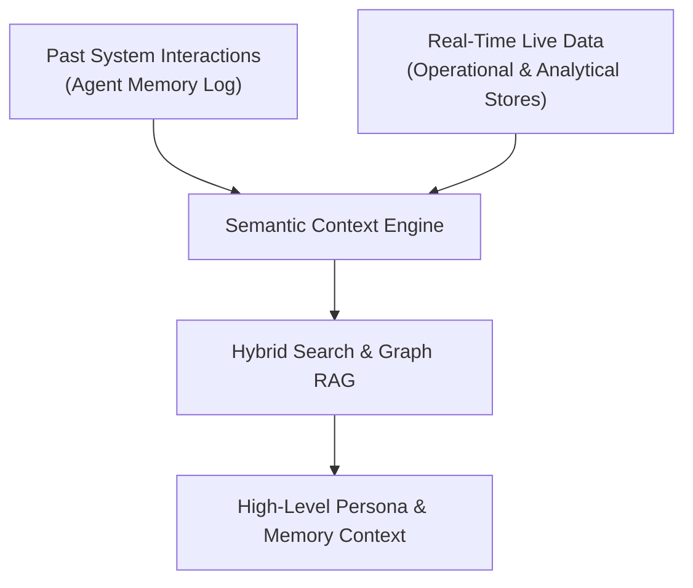

*זהו חלק 7, המאמר המסכם בסדרה הטכנית בת 7 חלקים על Context Layers עבור AI Agents. לפני קריאת צלילה עמוקה זו, מומלץ לעיין ב-[חלק 3: סקירת ארכיטקטורה](/he/tech/building-an-effective-context-layer-part-3), [חלק 4: נתונים תפעוליים](/he/tech/building-an-effective-context-layer-part-4), [חלק 5: מטריקות אנליטיות](/he/tech/building-an-effective-context-layer-part-5), וב-[חלק 6: אותות מעובדים מראש](/he/tech/building-an-effective-context-layer-part-6).*

---

<figure class="article-screenshot-figure">
  
  <figcaption>שכבה 4: זיכרון ארגוני לטווח ארוך, התאמת voice ל-Persona, חיפוש סמנטי היברידי ומיפוי ישויות Graph RAG.</figcaption>
</figure>

## מבוא: המוח והזיכרון ארוך הטווח של ה-Agent

שכבה 4 מייצגת את רמת ההפשטה הגבוהה ביותר: הזיכרון ארוך הטווח של ה-Agent, הידע הארגוני, ה-Persona של המשתמש והיסטוריית היחסים.

כאן שוכנות המורכבויות האנושיות הקשות ביותר. מענה על שאלות כמו *"איך אני עונה בדרך כלל לג'אנט?"*, *"מה היסטוריית היחסים שלנו עם לקוח זה?"*, או *"מהם קווי היסוד למשא ומתן בחברה?"* דורש שכבה סמנטית שנבנית הן מנתונים היסטוריים והן מאינטראקציות עבר של ה-Agent.



---

## רכיבי הליבה של שכבה 4

1. **התאמת Persona וסגנון תקשורת**: לכידת סגנון התקשורת המועדף על המשתמש (טון, תמציתיות, רמת רשמיות, נוסח ברכות) כך שהפלטים שיוצרו יתאמו במדויק לקול האותנטי שלו.
2. **היסטוריית יחסים והעדפות**: החזקת רישום סמנטי של דינמיקת יחסים מול אנשי קשר ספציפיים (תנאי הסכם עבר, העדפות אישיות, הסלמות קודמות).
3. **Vector Search ו-Graph RAG**: שילוב חיפוש דמיון סמנטי ב-Vector Embeddings יחד עם Graph RAG לצורך ניווט ביחסים מורכבים בין ישויות (למשל מיפוי מג'אנט לחברה X, לפרויקט Y, לחוזה Z).
4. **מודל זיכרון כפול**: עדכון רציף של הזיכרון הסמנטי משני מקורות נתונים:
   * **זיכרון מערכת**:למידה בלולאות ביצוע קודמות של ה-Agent, שינויים שהתקבלו על ידי המשתמש וסיגנלים של פידבק.
   * **נתונים תפעוליים ב-Live**: חילוץ עובדות ארוכות טווח לגבי ישויות מתוך תקשורת מציאותית שוטפת.

---

## דוגמה מעשית: שכבה 4 בפעולה

במערכת ה-CRM של ג'אנט, משתמש מבקש מה-AI Agent:

* **בקשת המשתמש**: *"נסח אימייל עדכון תעריפים עבור ג'אנט ח'."*
* **Payload זיכרון סמנטי משכבה 4**:
  ```json
  {
    "user_persona_style": "Direct, concise, dry humor, maximum 3 sentences, no exclamation marks",
    "relationship_memory": "Janet H. prefers short bullet points, previously agreed to 10% annual renewals, sensitive to unexpected setup fees",
    "graph_rag_entities": {
      "contact": "Janet H.",
      "company": "Coca Cola Enterprise",
      "active_contract": "Contract #882",
      "agreed_renewal_term": "10% annual adjustment"
    }
  }
  ```
* **תוצאה**: ה-Agent מייצר אימייל התואם במדויק את סגנון המשתמש והיסטוריית היחסים: *"היי ג'אנט. מצורף עדכון התעריפים לשנת 2026 הכולל את התאמת ה-10% השנתית שהסכמנו עליה. תעדכני אותי אם תרצי לעבור על לוח הזמנים ביום שלישי."*

---

## סיכום: מערכת ה-Context המלאה ב-4 שכבות

עם ארבע השכבות בפעולה:
* **שכבה 1** מאחדת תקשורת גולמית מספקים מרובים לתוך מסד נתונים תפעולי מאונדקס.
* **שכבה 2** מחשבת מראש מדדים סטטיסטיים, קצב עסקאות וקווי בסיס לסינון ARR.
* **שכבה 3** מחלצת אותות Sentiment, Intent ו-OCR באופן אסינכרוני.
* **שכבה 4** מחזיקה זיכרון סמנטי ארוך טווח, Persona של המשתמש ודינמיקת יחסים.

Context Layer ב-Production מקפיץ AI Agent ממעטפת API שבירה לפלטפורמת מודיעין יציבה, מונחית נתונים, המסוגלת לפעול באופן אוטונומי בסקייל גבוה.
