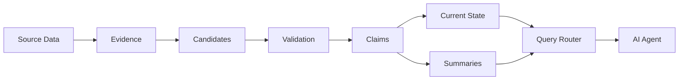
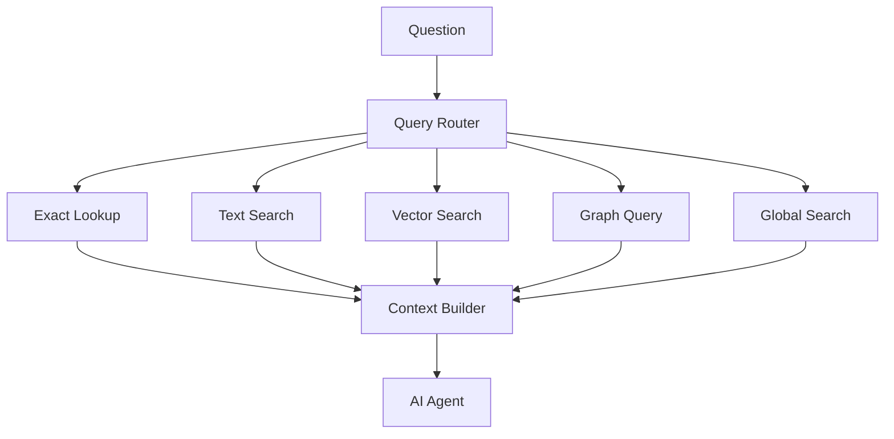

*זהו חלק 7, החלק האחרון בסדרה בת 7 חלקים על Context Layers עבור AI Agents. [חלק 4](/he/tech/building-an-effective-context-layer-part-4) הגדיר את ה-System of Record, [חלק 5](/he/tech/building-an-effective-context-layer-part-5) הפריד מטריקות מ-Policy, ו-[חלק 6](/he/tech/building-an-effective-context-layer-part-6) הפך Claims נגזרים למנוהלי גרסה וניתנים ל-Review.*

**TL;DR**: שכבה 4 היא שכבת זיכרון ו-Retrieval נגזרת שניתנת לעדכון. היא לא מחליפה את ה-System of Record. שמרו ראיות מקור, הפרידו Candidate Claims מ-Validated Claims, עקבו גם אחרי הזמן שבו Claim היה נכון וגם אחרי הזמן שבו המערכת למדה עליו, שמרו סתירות, ונתבו כל שאלה למסלול Retrieval מתאים.

## מנסחים הודעת חידוש לג׳אנט

המשתמש מבקש:

*"נסח הודעת חידוש לג׳אנט. השתמש בתנאים הנוכחיים ופנה אליה בדרך שהיא מעדיפה."*

הבקשה חוצה כמה סוגי Context:

1. **Authoritative State**: מה התנאים וה-Deadline בהצעה הנוכחית?
2. **Source Evidence**: מה ג׳אנט כתבה בפועל?
3. **Relationship Memory**: האם היא מעדיפה Summary כתוב או שיחה?
4. **Current Interpretation**: איזו העדפה עדיין תקפה?
5. **Organizational Policy**: איזו מדיניות מאושרת חלה?

התנאים הנוכחיים שייכים לשכבה 1. שכבה 4 מחברת ראיות ו-Claims שניתנים לעדכון לאורך זמן.

> **שכבה 4 אינה מקור האמת**: עובדות נוכחיות מגיעות מהשכבה המוסמכת. שכבה 4 שומרת ראיות, פרשנויות ויחסים.

## זיכרון הוא Contract נגזר

Contract שימושי מפריד בין חמישה סוגי רשומות:

### Immutable Evidence

הודעה, גרסת חוזה, תמליל, החלטת Review או Policy מאושר. גרסה שמורה אינה משתנה בשקט. תיקון יוצר גרסה חדשה, ומחיקה נדרשת מתפשטת לכל Store נגזר.

### Candidate Claims

פרשנות שעדיין לא עברה Validation, למשל: *"ג׳אנט מעדיפה שיחה לפני Summary כתוב."* מודל שהפיק את המשפט לא הפך אותו לעובדה.

### Validated Claims

Claim שקיבל מספיק ראיות ואישור לשימוש מסוים. רף האישור תלוי במחיר הטעות. העדפת ניסוח יכולה להשתמש ברף נמוך יותר משינוי תנאי חוזה.

### Current State Projections

Projection שמצביע ל-Claims הפעילים כרגע, בלי למחוק Claims שהם החליפו או סתרו. אפשר לבנות אותו מחדש מהראיות.

### Derived Summaries

Summary דוחס כמה Claims עבור מטרה מוגדרת. הוא Context, לא ראיה חדשה. שמרו אילו Claim Versions יצרו אותו ומתי צריך לרענן אותו.


```mermaid
flowchart LR
    Sources["Source Data"] --> Evidence["Evidence"]
    Evidence --> Candidate["Candidates"]
    Candidate --> Validate["Validation"]
    Validate --> Claims["Claims"]
    Claims --> Current["Current State"]
    Claims --> Summary["Summaries"]
    Current --> Router["Query Router"]
    Summary --> Router
    Router --> Agent["AI Agent"]
```

## לזמן יש שתי משמעויות

ב-10 בינואר ג׳אנט כתבה: *"שלחו Summary קצר לפני שנקבע שיחת חידוש."* האינטגרציה הייתה מנותקת וה-CRM קיבל את ההודעה רק ב-2 בפברואר.

**Valid Time** עונה מתי הדבר היה נכון בעולם. **Observation Time** עונה מתי המערכת למדה עליו.

אם שואלים למה ה-Agent פעל בדרך מסוימת ב-20 בינואר, אסור להכניס ראיה שהמערכת ראתה רק בפברואר. אם שואלים היום מה ג׳אנט העדיפה בינואר, ההודעה כן רלוונטית.

ביולי ג׳אנט כתבה: *"בחידוש הזה תתקשרו קודם. ה-Summary יכול להגיע אחר כך."* ה-Claim החדש לא מוחק את הישן. הוא מחליף אותו עבור Scope וזמן מוגדרים.

```json
{
  "claimId": "claim_pref_204",
  "subjectId": "contact_1842",
  "predicate": "renewal_contact_order",
  "value": "call_before_summary",
  "scope": "renewal_2027",
  "validFrom": "2026-07-18T09:12:00Z",
  "validTo": null,
  "observedAt": "2026-07-18T09:13:04Z",
  "status": "validated",
  "evidenceIds": ["msg_7712"],
  "supersedes": ["claim_pref_119"]
}
```

## שומרים סתירות כדאטה

אל תמחקו את ה-Claim שהפסיד. קשרו Claims דרך:

* `supports`: ראיה חדשה מחזקת את אותו Claim
* `refines`: Claim מצמצם Scope או מוסיף פרטים
* `supersedes`: Claim חדש מחליף ישן בזמן וב-Scope מוגדרים
* `conflicts_with`: שני Claims אינם יכולים להיות נכונים באותו זמן ובאותו Scope

פתרו קונפליקט לפי מקור מוסמך, זמן, Scope, חוזק הראיות ומחיר הטעות. אם אי אפשר להגיע לתוצאה בטוחה, החזירו את הסתירה ותנו ל-Agent לבקש אישור.

[W3C PROV](https://www.w3.org/TR/prov-o/) מספק Vocabulary לישויות, פעילויות ו-Derivation. לא חייבים לאמץ את כל המודל כדי לשמור את העיקרון: כל רשומה נגזרת נשארת מחוברת למה שיצר אותה.

## מתכננים Memory Write Path

1. מקבלים שינוי שהגיע מ-Layer 1, Signal מאושר, Policy או Feedback
2. שומרים Source Identity, גרסה, זמן, Authorization והציטוט המדויק
3. מחלצים Claims קטנים עם Type מוגדר
4. מקשרים ל-Contact ול-Account הקנוניים
5. מזהים תמיכה, Refinement, Supersession או Conflict
6. מאמתים לפי השימוש ומחיר הטעות
7. מעדכנים Projection בלי לדרוס היסטוריה
8. מרעננים אינדקסים ו-Summaries

עריכה של משפט אחד אינה מוכיחה העדפת Persona קבועה. שמרו אותה כראיה, צרו Candidate Claim צר, והרחיבו Scope רק אחרי אישור מפורש או דפוס חוזר.

## מנתבים כל שאלה למסלול הנכון

### עובדות נוכחיות

תנאי החידוש הנוכחיים מגיעים משכבה 1 דרך Exact Lookup. Vector Index אינו System of Record.

### מילים ו-IDs מדויקים

השתמשו ב-Lexical Search עם Tenant, Contact וזמן כאשר מחפשים ציטוט, שם או Contract ID.

### ראיות דומות במשמעות

השתמשו ב-Embedding Retrieval כאשר ג׳אנט ניסחה את אותו רעיון במילים שונות. הפעילו Authorization ו-Metadata Filters לפני שה-Context מגיע למודל, ואז החזירו Source Spans.

### יחסים עם Type מוגדר

השתמשו ב-Relational Joins או Graph Traversal כדי למצוא אילו Renewal, Account והודעות מחוברים לג׳אנט. Graph Database מוצדק רק כאשר מסלולי היחסים העמוקים חוזרים ומדידה מראה יתרון.

### שאלות על Corpus שלם

*"אילו נושאים חוזרים בכל התנגדויות החידוש השנה?"* היא שאלת Synthesis רחבה.

[Microsoft GraphRAG](https://microsoft.github.io/graphrag/) הוא גישת Research ספציפית לשאלות כאלה. הוא מחלץ ישויות ויחסים, בונה Communities ומייצר Community Reports. זה לא אותו דבר כמו Traversal של `Janet -> Account -> Renewal`.

ה-[Repository הרשמי](https://github.com/microsoft/graphrag) מגדיר את GraphRAG כפרויקט Research שנמצא ברובו ב-Maintenance Mode ואינו Microsoft Offering נתמך. השתמשו בו רק כאשר שאלה ברמת Corpus מצדיקה את עלות ה-Indexing וה-Query.


```mermaid
flowchart TD
    Question["Question"] --> Router["Query Router"]
    Router --> Exact["Exact Lookup"]
    Router --> Lexical["Text Search"]
    Router --> Semantic["Vector Search"]
    Router --> Graph["Graph Query"]
    Router --> Global["Global Search"]
    Exact --> Context["Context Builder"]
    Lexical --> Context
    Semantic --> Context
    Graph --> Context
    Global --> Context
    Context --> Agent["AI Agent"]
```

## בונים Context Payload שניתן ל-Audit

ה-Payload של טיוטת החידוש צריך להפריד:

* `authoritativeState`: תנאים ו-Deadline משכבה 1
* `evidence`: ציטוטים, Source IDs, Valid Time, Observation Time ו-Authorization
* `claims`: ערך, Scope, Status, Evidence IDs ו-Supersession
* `summary`: טקסט נגזר ורשימת Claim Versions
* `retrieval`: המסלולים שנבחרו והסיבה לכל פריט

ה-Claim הישן יכול להופיע כדי להסביר שינוי, אבל `status: superseded` מונע מה-Agent להתייחס לשתי ההעדפות כנוכחיות.

## מודדים כתיבה, Retrieval ותשובה בנפרד

מדדו:

1. Memory Write Quality
2. Retrieval Recall
3. Context Precision
4. Temporal Update Accuracy
5. Conflict Resolution
6. Source Attribution
7. Abstention
8. Latency ועלות
9. Final Task Quality

[LongMemEval](https://arxiv.org/abs/2410.10813) בודק Knowledge Updates, Temporal Reasoning, Preference Recall ו-Abstention. [RAGAS](https://arxiv.org/abs/2309.15217) מפריד בין איכות ה-Retrieval, רלוונטיות התשובה ו-Faithfulness.

## חוזרים לחידוש של ג׳אנט

1. `getActiveRenewal` מחזיר את התנאים הנוכחיים משכבה 1
2. `getCurrentRelationshipClaims` מחזיר את העדפת החידוש הפעילה
3. `getClaimEvidence` מחזיר ציטוטים מורשים עם שני סוגי הזמן
4. `buildDraftContext` בונה Payload מוגבל ומתעד למה כל פריט נבחר

ה-Agent מנסח הודעה עם התנאים המוסמכים ומציע שיחה לפני ה-Summary, כפי שג׳אנט ביקשה ביולי. אם ההודעה חסרה, לא מורשית או נמצאת בקונפליקט, הוא משתמש רק בתנאים המוסמכים ושואל את המשתמש מה סדר התקשורת הרצוי.

## ה-Frontier הוא Compilation, לא קסם

גישות כמו [MemGPT](https://arxiv.org/abs/2310.08560), [HippoRAG](https://arxiv.org/abs/2405.14831), GraphRAG ו-[LLM Wiki של Karpathy](https://gist.github.com/karpathy/442a6bf555914893e9891c11519de94f) חוקרות חלקים שונים של הבעיה. אף אחת לא מבטלת את הצורך להגדיר סמכות, זמן, Provenance, Authorization ו-Evaluation.

## מודל ההפעלה של שכבה 4

שכבה 4 אינה מוח, Profile יחיד או אוסף Embeddings. היא ה-Contract שהופך ראיות שמורות ל-Context שניתן לעדכן, להרשאה ולבדיקה.

> **הכלל של שכבה 4**: השאירו מצב מוסמך בשכבת המקור, שמרו ראיות מאחורי כל זיכרון, מדלו זמן וסתירות במפורש, ותנו ל-Agent רק Claims מורשים שאפשר לעקוב אחריהם, להעריך אותם ולהשתמש בהם בבטחה.
