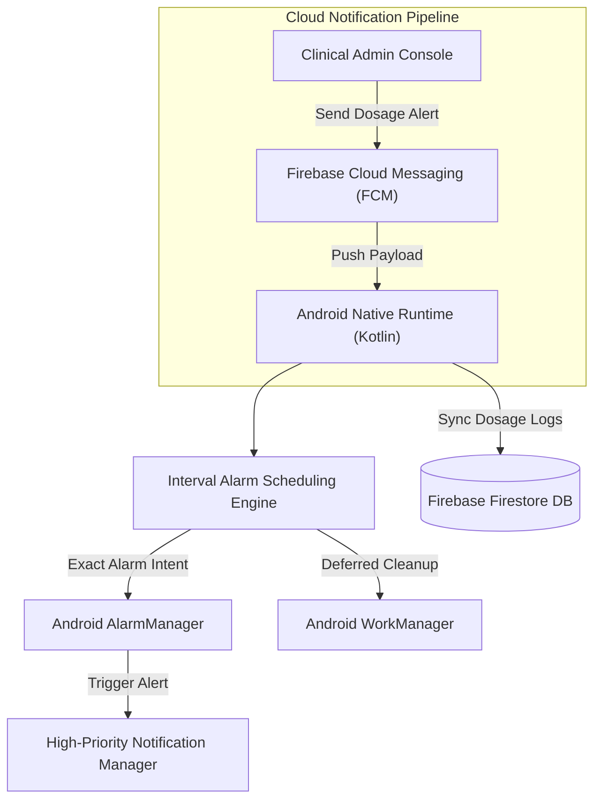
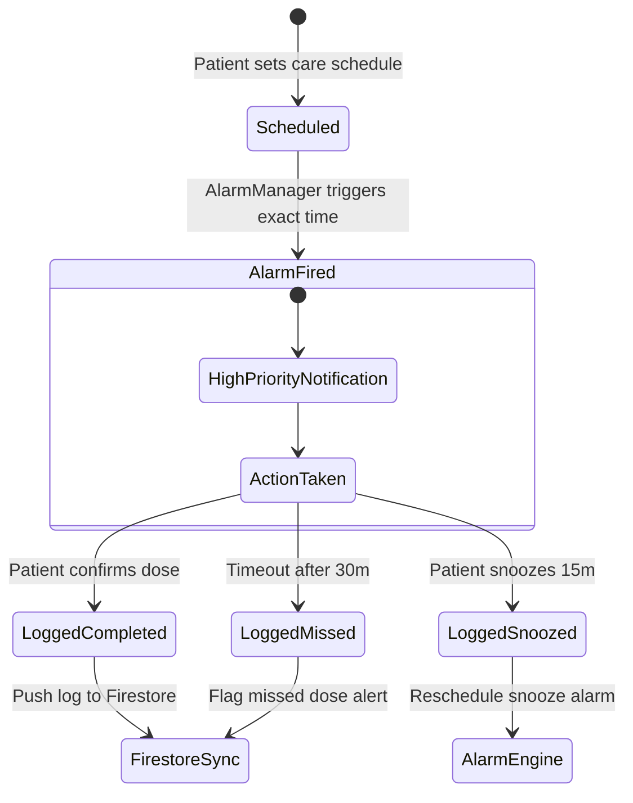

# EyeDrop Alarm Clock — מסמך תכנון ארכיטקטוני (Backend Design Doc)

## סקירה כללית (Overview)

מערכת **EyeDrop Alarm Clock** הינה פלטפורמת מובייל וענן לאנדרואיד שנבנתה במיוחד עבור מטופלי עיניים לאחר ניתוחים וטיפולים קליניים מורכבים. המערכת מבטיחה רצף טיפולי קפדני באמצעות מנוע התראות אמין וסנכרון נתונים מול Firebase.

---

## ארכיטקטורת המערכת (System Architecture)

---

## דיאגרמת מצבים להפעלת התראות (Alarm State Machine)

---

## החלטות ארכיטקטוניות מרכזיות (Key Design Decisions)

1. **תזמון התראות בעדיפות רפואית גבוהה (`setExactAndAllowWhileIdle`)**: מערכות אנדרואיד משתמשות במנגנון Doze Mode להשהיית התראות. כדי להבטיח נטילת טיפות עיניים בזמן, המנוע עושה שימוש בהרשאות Exact Alarm המופעלות גם במצב חיסכון בסוללה.
2. **ארכיטקטורת Local-First למניעת קריסות**: תזמון ההתראות אינו תלוי בחיבור אינטרנט פעיל. הלו"ז נשמר במסד נתונים מקומי ופועל גם במצב טיסה.
3. **תיעוד וסנכרון ענן אסינכרוני**: יומן הטיפולים מסתנכרן מול Firebase Firestore ברקע רק בעת זמינות רשת, ומאפשר לצוות הקליני לצפות בדיווח הטיפולים.
