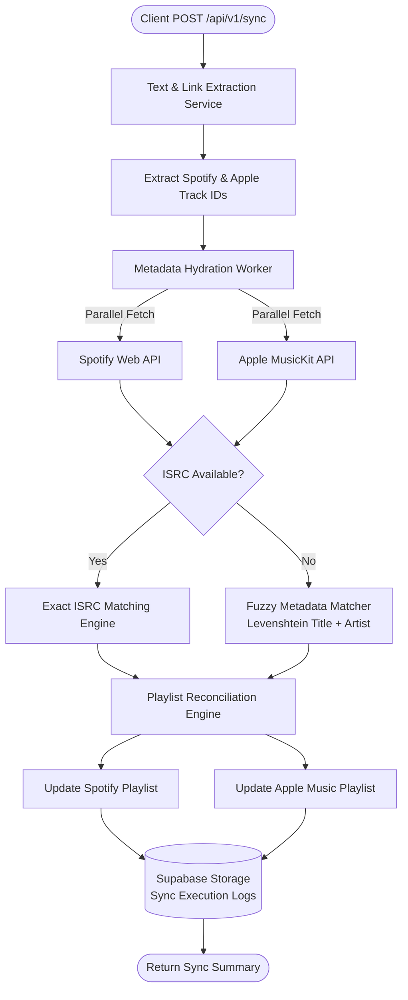
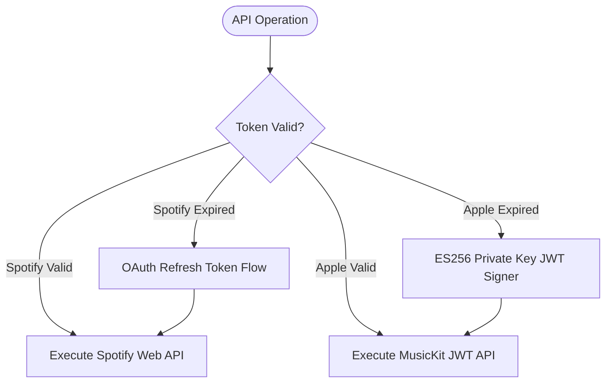

# Music Sync — מסמך תכנון ארכיטקטוני (Backend Design Doc)

## סקירה כללית (Overview)

Music Sync הוא שירות Backend ב-TypeScript המיועד לחלץ קישורים ומידע מוזיקלי מטקסט חופשי ולסנכרן פלייליסטים באופן דו-כיווני בין **Spotify** ל-**Apple Music**. השירות פותר את בעיית הפרגמנטציה של קטלוגי המוזיקה בעזרת זיהוי חד-ערכי ב-ISRC ומנגנוני חיפוש פאזי (Fuzzy Search).

---

## צינור עיבוד הבקשות (High-Level Request Pipeline)

---

## מנגנון חידוש Tokens ואבטחה (Authentication Engine)

---

## החלטות ארכיטקטוניות מרכזיות (Key Design Decisions)

1. **זיהוי ב-ISRC תחילה**: מזהי שירים שונים בין הפלטפורמות. המערכת מחייבת שימוש בקוד ISRC (International Standard Recording Code) כקריטריון ראשי, ומשתמשת ב-Fuzzy Search רק במקרה של חוסר במזהה כדי למנוע התאמות שגויות.
2. **מנוע חילוץ מופרד וסטייטלס**: חילוץ הקישורים מתבצע בשכבה מבודדת לפני פנייה ל-APIs חיצוניים למניעת חריגה מכמות הקריאות המותרת (Rate Limits).
3. **ניהול אסינכרוני של ה-Tokens**: מנגנון ה-OAuth של Spotify וה-JWT של Apple Music נהולים ע"י Singleton Service המחדש אישורים ברקע בצורה שקופה למשתמש.
