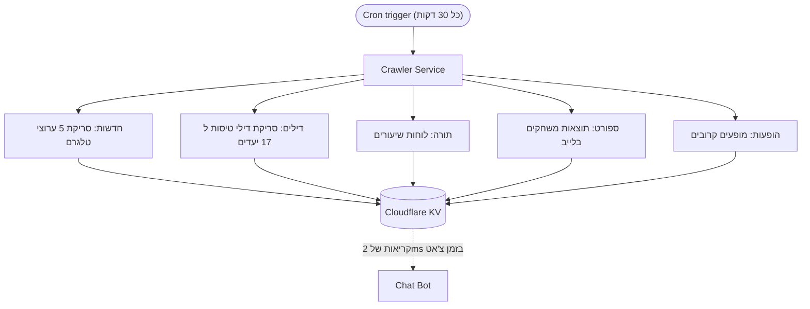
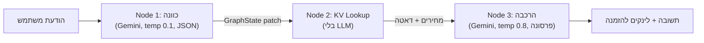
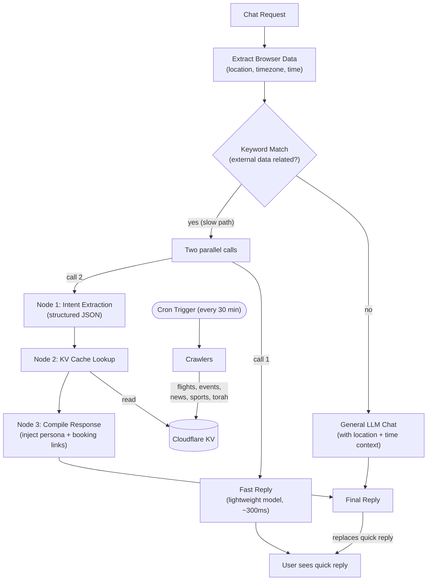

## מה זה NehorAI

NehorAI הוא עוזר AI בשפה העברית שעוזר למשתמשים למצוא דילים לחופשות, כרטיסים להופעות, שיעורי תורה, תוצאות ספורט וחדשות, הכל דרך ממשק צ'אט טבעי. המערכת רצה כבוט טלגרם, כצ'אטבוט מוטמע באתר [nehorai.ai](https://nehorai.ai), וכמוצא דילים לחופשות מבוסס Referral.

הרעיון המרכזי: במקום לגלוש בחמישה אתרים שונים כדי לתכנן סופ"ש, פשוט אומרים לנהורAI "אני רוצה לטוס למקום חם באוגוסט" והוא חוזר עם מחירי טיסות, אפשרויות מלון ולינקים להזמנה, הכל באותו טון שיחה כמו חבר מהשכונה.

<iframe src="https://nehorai.ai" width="100%" height="600" style="border:none;border-radius:12px;" loading="lazy" title="NehorAI הדגמה חיה"></iframe>

---

## שלוש הבעיות שהייתי צריך לפתור

כשהתחלתי לבנות את NehorAI, חשבתי שהחלק הקשה יהיה החיבור ל API של LLM. זה לא היה. האתגרים האמיתיים היו:

### 1. איך משיגים דאטה טרי?

בוט AI שנותן מחירי טיסות של אתמול הוא חסר ערך. אבל לקרוא ל API של מחירים בזמן אמת במהלך שיחת צ'אט אומר 3 עד 5 שניות זמן תגובה: אף אחד לא מחכה כל כך הרבה זמן בצ'אט.

### 2. איך גורמים לו באמת לדבר כמו בן אדם אמיתי?

סלנג בעברית זה לא משהו שפותרים עם system prompt אחד. לבוט יש פרסונה ספציפית: דמות ערסית חכמה מבת ים שנודר במזוזה שהדיל שמצא לך הוא הכי טוב. לגרום לקול הזה לעבוד תוך כדי שהבוט גם מחזיר דאטה מובנה (מחירים, לינקים, תאריכים) היה מתח מתמיד.

### 3. איך שומרים על מהירות ועלות נמוכה?

כל קריאת LLM עולה כסף. כל קריאת LLM מוסיפה latency. כשמשתמש שואל "מה ההופעות השבוע?" לא צריך קריאת Gemini ב-$0.01 כדי לזהות את הכוונה: string match על המילה "הופעות" עושה את העבודה.

---

## איך פתרתי אותן: הארכיטקטורה האמיתית

### הדפוס של Crawl First, Chat Later

ההחלטה הארכיטקטונית הכי חשובה: **אף פעם לא לקרוא ל API של מחירים בזמן אמת במהלך צ'אט**. במקום זאת, סורקים מתוזמנים רצים על [Cloudflare Workers Cron Triggers](https://developers.cloudflare.com/workers/configuration/cron-triggers/) כל 30 דקות, סורקים דילי טיסות ל 17 יעדים פופולריים, לוחות שיעורי תורה, רשימות הופעות, תוצאות ספורט, וחדשות מחמישה ערוצי טלגרם.

כל הדאטה נשמר ב [Cloudflare KV](https://developers.cloudflare.com/kv/) תחת מפתחות צפויים כמו `deals:latest`, `torah:places`, `concerts:latest`. כשמשתמש שואל על טיסות ללרנקה באוגוסט, הבוט קורא מ KV: לוקאפ של 2ms במקום קריאת API של 4 שניות.

הסורק כולל מנגנון Self Healing: אם מפתח `deals:latest` חסר ב KV בכל ריצת cron (בין אם מ cold start, eviction או תקלת deployment), נכפית סריקה יומית מלאה ללא תלות בשעה. בלי התערבות ידנית.

---

## מנוע הגרף בשלושה שלבים

כשמשתמש שולח הודעה על דילי חופשות, הבוט לא מפעיל קריאת LLM בודדת. הוא מריץ pipeline בשלושה שלבים כאשר לכל שלב יש תפקיד ספציפי וקונפיגורציית מודל ספציפית:

**Node 1: חילוץ כוונה.** קריאת Gemini בטמפרטורה נמוכה (temp 0.1, מצב JSON) שמחלצת פרמטרים מובנים: לאן המשתמש רוצה לטוס, מתי, כמה אנשים, איזה סגנון חופשה? בלי אישיות, בלי סלנג, חילוץ דאטה טהור. אם המשתמש אמר "אני רוצה לטוס למקום חם" אבל לא ציין חודש, הנוד מסמן `needsMoreData: true` עם `missingFields: ['month']`.

**Node 2: לוקאפ מ KV Cache.** אפס קריאות LLM. לוקח את הפלט המובנה מ Node 1 (קוד IATA של היעד, תאריכים) ומושך את הדאטה המתאים מ KV. עבור כוונת חופשה, הוא מחפש `deal:v2:{IATA}:{outbound}:{return}`. עבור כוונות אחרות (חדשות, תורה, הופעות, ספורט), הוא מושך מהמפתח latest המתאים.

**Node 3: הרכבת תשובה.** קריאת Gemini בטמפרטורה גבוהה (temp 0.8) שלוקחת את הדאטה הגולמי מ Node 2 ועוטפת אותו בפרסונה של נהורAI. פה הבוט אומר "שמע אח בדם מצאתי לך דיל ללרנקה: טיסות ב 380 שקל ישיר עם וויז אייר מלון 4 כוכבים ב 220 ללילה סך הכל נזק 1,600 שקל לשניים. נודר במזוזה זה המחיר הכי טוב החודש."

כל נוד מחזיר `Partial<GraphState>` שממוזג לאובייקט state משותף. זה הופך כל שלב לניתן לבדיקה באופן עצמאי. אפשר לכתוב unit test לחילוץ הכוונה של Node 1 בלי להתעסק עם הפלט של הפרסונה ב Node 3.

### ניתוב מילות מפתח לפני LLM

לא כל הודעה צריכה את הגרף המלא. הנתב של הצ'אט מריץ קודם סינון מילות מפתח: אם ההודעה מכילה מילים שקשורות לנסיעות, היא עוברת דרך הגרף. אם לא, היא נופלת לקריאת Gemini סטנדרטית עם הקשר של מיקום וזמן.

זה מונע קריאת מודל רק כדי לסווג כוונה בכל הודעה בודדת. כשמישהו כותב "מה המצב אחי", string match מהיר וזול יותר מ round trip ל Gemini.

### הטריק של Quick Mode בשני שלבים

גם עם הגרף, ה pipeline המלא לוקח 2 עד 4 שניות. זה נצח ב UI של צ'אט. אז הקליינט שולח שתי בקשות במקביל:

1. בקשת `quickMode: true` שפוגעת במודל קטן ומהיר (`gemini-2.0-flash-lite`) ומייצרת אישור מיידי בפרסונה: "רגע אח בדם בודק לך את הדילים עכשיו..."
2. בקשת `quickMode: false` שמריצה את pipeline הגרף המלא.

המשתמש רואה את התשובה המהירה תוך ~300ms, ואז התשובה המלאה מחליפה אותה 2 עד 3 שניות אחר כך. זה מרגיש מיידי.

### הפרסונה מוזרקת מאוחר

זו הייתה החלטה מכוונת. הפרסונה הערסית של נהורAI מוזרקת רק ב Node 3 (שלב ההרכבה) ובשיחה הכללית. Nodes 1 ו 2 משתמשים בפרומפטים ניטרליים ומובנים.

למה? כי כשמבקשים מ Gemini לחלץ פרמטרים ב JSON ובמקביל לשמור על פרסונה, איכות הפלט המובנה יורדת. המודל מתחיל לשים סלנג בתוך ערכי ה JSON. הפרדה בין "הבן את הכוונה" לבין "דבר כמו בן אדם" הפכה את שני השלבים להרבה יותר אמינים.

---

## תוכן אישי בלי למלא שאלון

לא כל פרסונליזציה צריכה להתחיל ב"איפה אתה גר?". הדפדפן והבקשה כבר נותנים כמה רמזים שימושיים: שפה, אזור כללי, אזור זמן והשעה המקומית. אלה לא נתוני GPS ולא כתובת מדויקת, אבל לרוב זה מספיק כדי לתת תשובה הרבה יותר רלוונטית בלי לעצור את השיחה.

אני מכניס את הרמזים האלה ל context של הבוט. אם מישהו כותב "תמצא לי שיעור תורה", נהורAI יכול להציג קודם שיעורים בחולון ובערים קרובות במקום לשלוח רשימה מכל הארץ. אם המיקום לא מספיק ברור, רק אז הבוט שואל שאלה נוספת.

<figure class="article-screenshot-figure">
  
  <figcaption>בקשה קצרה הופכת להצעות באזור הרלוונטי, בלי שאלון מקדים.</figcaption>
</figure>

אותו עיקרון עובד גם לאורך השיחה. הגרף שומר את היעד, התאריכים, מספר הנוסעים וסגנון החופשה, ואז משתמש בהם בבקשה הבאה. המשתמש לא צריך לחזור בכל הודעה על כל מה שכבר אמר.

<figure class="article-screenshot-figure">
  
  <figcaption>הקשר מהשיחה נשמר עד להצגת דיל שאפשר להזמין.</figcaption>
</figure>

---

## צינור החדשות של טלגרם

NehorAI גם מנהל ערוץ טלגרם ([@nehorainews](https://t.me/nehorainews)) שמשדר סיכומי חדשות דרך ה [Telegram Bot API](https://core.telegram.org/bots/api). כל 30 דקות (בשעות פעילות, 8:00 עד 20:00 שעון ישראל, בשעות זוגיות), הסורק גורד חמישה ערוצי חדשות ישראליים בטלגרם, מסנן פריטים מהשעה האחרונה, ומעביר אותם דרך Gemini עם הפרסונה של נהורAI כדי לייצר סיכום חדשות בסלנג שמתפרסם בערוץ הטלגרם של הבוט.

ב 20:00 כל יום הוא מייצר "סיכום יומי" של 10 הסיפורים המובילים מ 12 השעות האחרונות.

המערכת עוקבת אחרי מה שכבר נשלח דרך מפתח KV של `news:recently_sent_posts` כדי למנוע שידורים כפולים, ושומרת timestamps לכל ערוץ כדי לעבד רק פריטים חדשים באמת.

---

## ניתוח כלים: למה בחרתי בכל טכנולוגיה?

לא חיפשתי את הכלים הכי נוצצים, אלא את אלה שישאירו את הבוט מהיר, זול וקל לתחזוקה.

### Cloudflare KV מול Redis או Postgres

בהתחלה שקלתי Redis או Postgres, אבל הם היו יותר מדי בשביל מה שהבוט צריך. הסורק כותב דאטה פעם בחצי שעה, והבוט בעיקר קורא אותו שוב ושוב. [Cloudflare KV](https://developers.cloudflare.com/kv/) יושב בול על הדפוס הזה: הקריאה מגיעה מה Edge הקרוב ולוקחת בערך 2ms, בלי שרת ובלי connection pools. מתוך Worker זאת בסך הכל קריאה ל `env.DEAL_CACHE.get()`. אפשר לקרוא עוד ב [תיעוד של KV](https://developers.cloudflare.com/kv/) וב [הסבר על הדרך שבה הוא עובד](https://developers.cloudflare.com/kv/concepts/how-kv-works/).

### Cloudflare Workers מול AWS Lambda או Vercel Serverless

בחרתי ב [Cloudflare Workers](https://developers.cloudflare.com/workers/) כי לא רציתי שהודעת צ'אט תחכה ל cold start. Workers עולים בדרך כלל בפחות מ 5ms, לעומת מאות מילישניות ולפעמים יותר בפונקציות מבוססות קונטיינר. גם הסורקים רצים שם עם Cron Triggers, אז לא צריך להחזיק עוד שירות רק בשביל התזמון. יש עוד פרטים ב [תיעוד של Workers](https://developers.cloudflare.com/workers/) ובהשוואה בין [V8 Isolates לקונטיינרים](https://developers.cloudflare.com/workers/reference/how-workers-works/).

### Google Gemini 2.0 מול OpenAI או Claude

כאן ההחלטה הייתה די פרקטית: Gemini היה מהיר וזול יותר למשימות של הבוט. `gemini-2.0-flash-lite` נותן את התגובה הראשונית בכ 300ms, ו `gemini-2.0-flash` מטפל בחילוץ הכוונה ובניית התשובה. מצב JSON שלו יציב מספיק בשביל להחזיר פרמטרים מסודרים, ו Google Search Grounding עוזר כשצריך לבדוק מידע עדכני. אפשר להשוות בין המודלים ב [תיעוד של Gemini](https://ai.google.dev/docs) וב [סקירת המודלים](https://ai.google.dev/gemini-api/docs/models/gemini).

### Hono מול Express או Fastify

אותו היגיון הוביל אותי ל [Hono](https://hono.dev/). Express ו Fastify מעולים ב Node.js, אבל ב Edge הם מביאים איתם דברים שאני לא צריך. Hono קטן, עובד עם Web Standards ומתחבר ל Workers בלי התאמות מיוחדות. למי שרוצה לנסות, יש [תיעוד קצר וברור](https://hono.dev/) וגם [מדריך ל Cloudflare Workers](https://hono.dev/docs/getting-started/cloudflare-workers).

---

## Key Takeaways

**תשלפו מראש את כל מה שאפשר.** הדפוס של crawl first הוא הניצחון הכי גדול. הוא הופך קריאת API של 4 שניות לקריאת KV של 2ms ומנתק את רעננות הדאטה מ latency בצ'אט.

**הפרידו בין הבנה לדיבור.** שימוש בקונפיגורציות מודל שונות לחילוץ כוונה (temp נמוך, מצב JSON) לעומת ייצור תשובה (temp גבוה, prompt של פרסונה) הפך את שניהם להרבה יותר אמינים.

**String matching הוא underated.** לפני שמושיטים יד ל LLM כדי לסווג כוונה, תבדקו אם regex או סט מילות מפתח יכולים לעשות את העבודה. זה בחינם, זה מהיר, וזה מכסה 80% מהמקרים.

**Self healing מנצח monitoring.** הסורק בודק מפתחות KV חסרים ומתאושש אוטומטית. מעולם לא הייתי צריך להפעיל ידנית סריקה מחדש.

---

## מה הלאה

בניית בוט טוויטר/X שמשתמש באותה תשתית backend (אותם סורקים, אותו דאטה ב KV, אותו מנוע גרף), אבל מפרסם threads של דילים וסיכומי חדשות במקום לענות להודעות צ'אט. הפרסונה נשארת; ערוץ ההפצה משתנה.

---

## ה-Flow המלא של המערכת

התרשים הזה עוקב אחרי הנתיב הלוגי של כל chat request, מהרגע שהוא מגיע ועד ה-reply הסופי. הוא גם מראה איך ה-crawlers ברקע שומרים את הדאטה טרי באופן עצמאי.

ה-flow מתחלק לשני cycles עצמאיים:

**Request cycle.** הודעת chat נכנסת. המערכת מחלצת browser data (מיקום משוער, timezone, שעה מקומית) ומריצה regex check על מילות מפתח. אם ההודעה לא צריכה דאטה חיצוני, היא עוברת ישר ל-LLM עם context של מיקום וזמן ומחזירה תשובה ישירה. אם היא כן צריכה דאטה חיצוני (ה-slow path), הקליינט שולח שתי קריאות במקביל: קריאה אחת ל-fast model קל שמחזיר acknowledgment מיידי למשתמש, והקריאה השנייה מריצה את ה-graph בשלושה nodes (extract intent, lookup דאטה מהקאש ב-KV, ו-compile תשובה עם persona ולינקים להזמנה). כשה-graph מסיים, ה-reply הסופי מחליף את ה-quick acknowledgment.

**Data cycle.** כל 30 דקות, crawlers מתוזמנים סורקים דילי טיסות, אירועים, תוצאות ספורט, שיעורי תורה וחדשות. הכל נכתב ל-Cloudflare KV כדי שה-request cycle יקרא דאטה טרי ב-milliseconds בלי לקרוא ל-live pricing API במהלך צ'אט.

---

## זה עדיין לא מוצר גמור

NehorAI עדיין לא מוצר מלוטש, וזה גם לא היה היעד הראשי שלי. בניתי אותו כדי ללמוד מה קורה כשבוט AI יוצא מהדמו ופוגש משתמשים אמיתיים, דאטה שמשתנה, זמני תגובה, עלויות ותקלות.

יש עוד קצוות לשייף, אבל כבר עכשיו זה בוט שעובד בעולם האמיתי ולא רק חלון צ'אט שמחובר למודל. מבחינתי זה כל העניין: להבין דרך מוצר חי איך בונים מערכת AI שאנשים באמת יכולים להשתמש בה.
